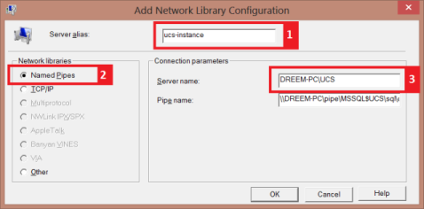

# **Как да използваме Dreem POS в локална мрежа**

```{warning}
ВАЖНО! Unicontsoft не поддържа подобна настройка на системата! Описанието и стъпките по-долу са FYI (само за информация)!
```

Приемаме че имате Windows локална мрежа с компютри **POS-PC** и **DREEM-PC** и искате Dreem POS на първата машина (**POS-PC**) да използва базата данни на Dreem Personal на другата машина (**DREEM-PC**).

 1. Уверете се, че на **POS-PC** можете да отваряте и копирате файлове от машина **DREEM-PC**
    - ако машините са в domain, използвайте потребител от domain-а
    - ако машините са в workgroup, настройка Sharing and security model for local accounts трябва да е Classic – local users authenticate as themselves и паролата на текущия потребител на **POS-PC** трябва да съвпада с паролата на същия потрелител на **DREEM-PC**
    - във **firewall.cpl** в раздел *Exceptions* трябва да е разрешен **File and Print Sharing**
 2. След това се уверете, че на двете машини има инсталирана еднаква [**последна реализация на Dreem Personal**](https://www.unicontsoft.com/bg/download.html)

На **POS-PC** трябва да настроите пренасочващ псевдоним с име **ucs-instance**, който ще се използва от Dreem Pos за да достъпва базата данни на Dreem Personal

 1. На **POS-PC** от **Start->Run** стартирайте **cliconfg.exe** (На 64-битови OS стартирайте **C:\\Windows\\SysWOW64\\cliconfg.exe**) 
 2. В раздел *Alias* на **Client Network Utility** създавайте нов псевдоним **ucs-instance** (виж т.1 на графиката) по **Named Pipes** (виж т.2) и го насочете към инстанция **DREEM-PC\\UCS** (виж т.3)

   { class=align-center }

 3. На **POS-PC** стартирайте Dreem Pos и проверете дали имате достъп до данните на Dreem Personal на **DREEM-PC**
Имайте предвид, че при обновяване на реализацията на Dreem Personal трябва на **POS-PC** и на **DREEM-PC** това да се случва едновременно, така че да се използва една и съща реализация на двете машини.

***Още веднъж предупреждаваме: Използвайте това решение на свой риск само ако знаете какво правите! Unicontsoft не носи отговорност за възможна загуба на данни!***

***Напълно възможно e системата да не работи оптимално или въобще в някои гранични случаи, защото горната настройка не е тествана и не се поддържа официално от Unicontsoft!***
