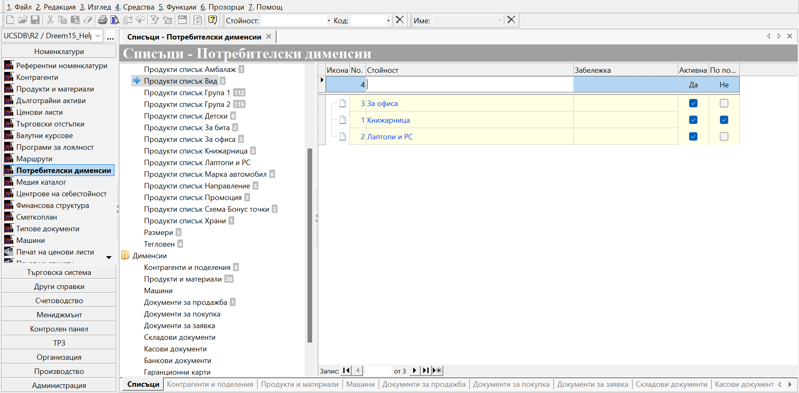

# **Потребителски дименсии**

***Потребителски дименсии*** е ключова настройка за системата. Чрез нея класифицирате номенклатурите в категории по определен критерий. Освен тази ѝ основна роля, тя дава възможност да отработите и частни случаи в параметрите на продукти, контрагенти и други. При добро конфигуриране на дименсиите изключително улеснявате работата си с основни номенклатури, особено при работа с обемни по съдържание списъци с продукти и контрагенти. Така, колкото по-прецизни настройки направите, толкова по-богата и детайлна информация ще получите като резултат от справките в системата.
Списъци с категории може да оформяте като линейни или като йерархични( дървовидни) структури. Ето един опростен дървовиден списък за пример:

{ class=align-center w=15cm }

При него в един общ списък се показват категории и подкатегории на различни нива, което в определени случаи може да има предимства. Но преди да направите подобна настройка, обърнете внимание и на явните ѝ недостатъци: дървовидните списъци могат да достигнат голям брой редове, затрудняващи работата, могат излишно да се дублират подкатегории и пр. Твърде вероятно, дори сигурно, ще се появят и затруднения в тълкуването на резултатите в справките. Това ни отнема възможността да ги анализираме вярно. А това са все неща, далеч от добрите практики. Затова съветваме да използвате вариант с множество отделни списъци. При тях всяка категория ще е описана отделно.

{ class=align-center w=15cm }

Цялостното планиране и изграждането на списъците с категории е процес - по всяко време може да ги актуализирате, развивате и оптимизирате за целите на Вашите справки.
За повече детайли разгледайте в [Настройка на списъци](https://docs.unicontsoft.com/blog/20240318-cms.html#id2).

Съществен момент при настройването на дименсии е да се определи техният тип. Най-общо може да разглеждаме типовете като списъчни и несписъчни. Към първите се отнасят дименсии от тип *Списък* и *Множество* и справките работят именно с тях по отношение на *Продукти и материали* и *Контрагенти и обекти*. Дименсиите, настроени за продукти, различни от *Списък* и *Множество*, се визуализират единствено в списъците с продукти. Аналогично, същото важи за контрагентите. Разгледайте повече в [Настройка на дименсии](https://docs.unicontsoft.com/blog/20240318-cms.html#id3).
В момента, освен номенклатури, в настройка на дименсии участват и някои типове документи - *Договори*, *Продажби*, *Покупки*, *Заявки*, *Складови документи*, *Касови* и *Банкови документи*, *Гаранционни карти*, а също и *Планиране на производство*.
За някои от тях, например, може да се окаже удобно създаването на паралелен списък, показващ някакво обстоятелство, различаващо се по съдържание от *Статуси*. Тези настройки на дименсии, отнасящи се за документи, се прилагат единствено върху документи в състояние на редакция - един или множество.  тези дименсиите се визуализират единствено в съответния списък по тип документ.

Друг важен момент, при използването на дименсии, е осигуряване на връзка с външни системи - мобилно приложение, електронен магазин и други.
Чрез дименсии може да посочите, например, как отделните продукти да се позициионират в уебсайта Ви. Така, с лесна настройка в системата, бързо актуализирате данните в свързаните електронни магазини.
Дименсиите от типовете *Текст* и *Число* позволяват въвеждане съответно на произволно текстово и цифрово съдържание, при типове *Дата* и *Час* се прави избор на дата или задаване на час, а за тип *Да/не* трябва да изберем дали номенклатурата отговаря или не на определен критерий. Тези настройки може да се приложат към един или едновременно към няколко продукта или контрагента.

За да проследите в каква последователност се създават настройките от началото, може да разгледате статията [Как да настроим Потребителски дименсии](https://docs.unicontsoft.com/blog/20240318-cms.html).
