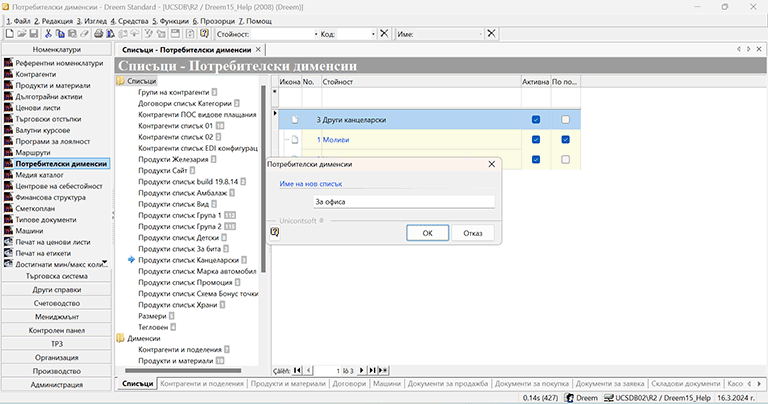
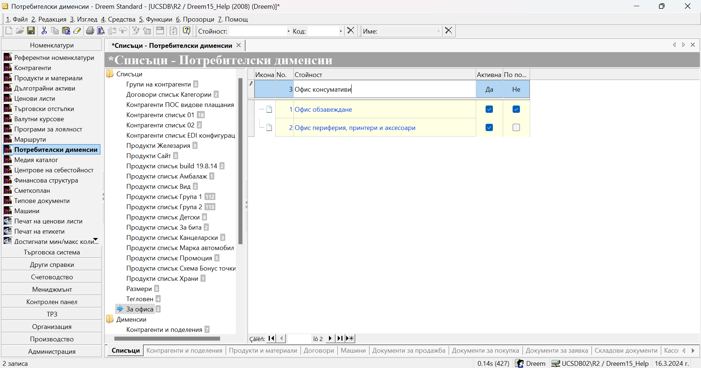
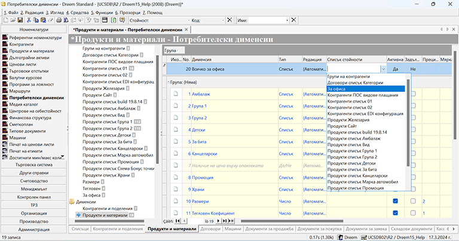
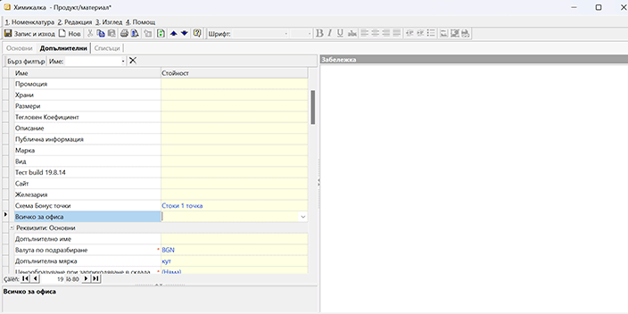
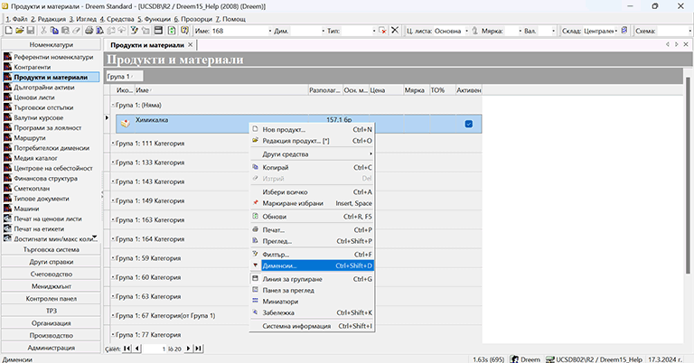
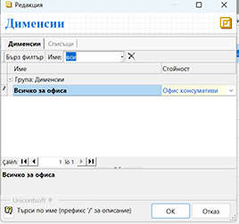

# Как да настроим Потребителски дименсии

> CMS

Настройките на *Потребителски дименсии* се изграждат в две стъпки - съставяне на описи в *Списъци* и създаване на *Дименсии*.
Списъците може да разглеждаме като каталог, съдържащ всички групи продукти, контрагенти, договори и пр.. И за всяка една от тези групировки трябва да укажем как системата да я третира, което ни води до настройка на Дименсии.
Нека разгледаме пример, в който искаме да създадем нова категория с продукти. Подкатегориите ще базираме спрямо предназначението на продуктите в офиса.

# Настройка на Списъци

1.За да създадем нов списък с дименсии, избираме група функции **Номенклатури || Потребителски дименсии**. 
В лявата част на *Списъци - Потребителски дименсии* се визуализират на две нива папки *Списъци* и *Дименсии* с тяхното съдържание. Позиционирайки се с десен бутон на мишката върху *Списъци*, избираме *Нов списък...*, при което системата отваря прозорец с празно поле. Тук въвеждаме в свободен текст наименование, в нашия случай "За офиса", и с бутон *Ok* го добавяме като нова категория в *Списъци*. 

{ class=align-center }

В резултат, вляво ще се появи ред с новодобавената категория.
За да запишем промените до момента, може да изберем бутон Запис от лентата с инструменти.

2.Системата автоматично ни позиционира в новата категория, така че продължаваме с добавяне на съдържание в нейния списък. За целта вдясно се появява ред за добавяне на нов запис. В колона *Стойност* изписваме наименованието на първата подкатегория и с бутон *Enter* "сваляме" реда надолу в списъка. По този начин се освобождава редът за добавяне на нов запис и може да продължим с въвеждането на подкатегории.

{ class=align-center }

За да запишем промените, избираме бутон *Запис* от лентата с инструменти, с което съдържанието на списъците е въведено. 
Във всеки един момент може да редактираме и добавяме нови записи, но не и да изтриваме, когато вече сме използвали настройките в системата. 
 
# Настройка на Дименсии

Настройката е задължителна, т.к. тук обвързваме всеки предварително въведен списък или с конкретен вид номенклатура, или с типове документи. По този начин определяме дали дименсията ще бъде достъпна във формата за редакция на *Продукти* или на *Контрагенти*, както и в съдържащите ги филтри, или ще касае тип документи.
> Ако даден списък не се разпредели към Продукти и материали, Контрагенти и поделения или тип документ в *Дименсии*, реквизитът няма да е видим в системата.

1.**Дименсия** — за да завършим настройките на категории, навигираме се до папка *Дименсии*, където посочваме *Контрагенти и поделения*, *Продукти и материали* или избран тип документ (*Договори*, *Документи за продажба* и т.н.).
В нашия случай настройката касае продуктите, затова маркираме *Продукти и материали* и на появилия се вдясно ред за добавяне на нов запис, в колона *Дименсия*, изписваме името на категорията - "Всичко за офиса". Това наименование ще се появява при избор на дименсия в списъци с продукти и във филтри.
2.**Тип** — в тази колона, от системно въведеното меню, избираме вида на дименсията, като е възможно да избираме от следните типове:
    -  тип **Списък** - този тип дименсия ограничено категоризирането само към една от стойностите на списъка.
    -  тип **Текст** - този тип дименсия дава възможност за категоризиране по свободно въведен текст, който може да се настрои в отделни шаблони.
    -  тип **Число** - този тип дименсия дава възможност за категоризиране с числови стойности.
    -  тип **Дата** - този тип дименсия дава възможност за категоризиране по дата.
    -  тип **Час** - този тип дименсия дава възможност за категоризиране по час.
    -  тип **Да/Не** - този тип дименсия дава възможност за категоризиране като отговарящи или неотговарящи на определен критерий.
    -  тип **Множество** - този тип дименсия допуска категоризирането към повече от една стойност на списъка.
    -  тип **RTF** - този тип дименсия дава възможност за категоризиране по свободно въведен текст - Rich Text Format.
    -  тип **HTML** - този тип дименсия дава възможност към продуктите да се настрои HTML код.
	-  тип **Медия** 
За целите на нашия пример, типът трябва да бъде *Списък*.
3.**Списък стойности** — той се настройва задължително единствено за дименсии от тип *Списък* и *Множество*. Тук ,от опционалното меню, трябва да изберем категория от предварително въведените в *Списъци*.
Нашият пример изисква в новата дименсия "Всичко за офиса" да укажем, че се прилага списъка "За офиса".

{ class=align-center }

4.**Задължителна** — чрез поставяне на отметка в тази колона на реда с избраната дименсия, може да настроим тя да бъде задължителна настройка. При това положение системата няма да позволява записване на нов продукт или редакция на съществуващ такъв, без да се избере стойност за задължителната дименсия.
5.**Прецизност** — настройката се използва единствено за числов тип дименсии, като указва до кой знак след десетичната запетая да се закръгли числото.
6.**Описание** — тук за всяка дименсия може да се даде кратко описание, което да служи като помощен текст или друго.

# Използване на дименсиите в Продукти и материали

След като сме добавили новата категория "Всичко за офиса", вече може да я използваме в настройките на продуктите. 
Ако добавяме нов продукт, във форма за редакция се навигираме до панел *Допълнителни || Реквизити: Дименсии*. От падащо меню виждаме списъка с подкатегории, избираме желаната и със *Запис и изход* едновременно запаметяваме промените и излизаме от формата.

{ class=align-center }

Имаме и друг вариант за настройка на дименсия - от списъка с *Продукти и материали*, без да отваряме формата за редакция на продукта. При този начин за добавяне/редакция на дименсия системата позволява да се маркират множество продукти и едновременно да се избере една обща за тях категория.
Нека покажем как да настроим продукт "Химикалка", който предварително сме въвели в системата, в категория "Всичко за офиса". Това става, след като го маркираме с десния бутон на мишката и от менюто изберем *Дименсии*.

{ class=align-center }

Отваря се форма, съдържаща всички записани в системата категории продукти. За да открием по-бързо желаната категория, може да използваме бързия филтър, където търсим по име или част от него.
Настройваме продукта "Химикалка" в подкатегория "Офис консумативи" от категория "Всичко за офиса".

{ class=align-center }

Записваме промените с бутон *Ok* и от този момент продуктът ще участва в справките, филтрирани по горните категории.

>> В системата, както за *Продукти и материали*, така и за *Контрагенти*, трябва да се настрои по една дименсия, която да изпълнява ролята на основна група. Това става в **Администрация || Настройки**. Настроената за основна група на Продукти и материали не трябва да е тип *Множество*.