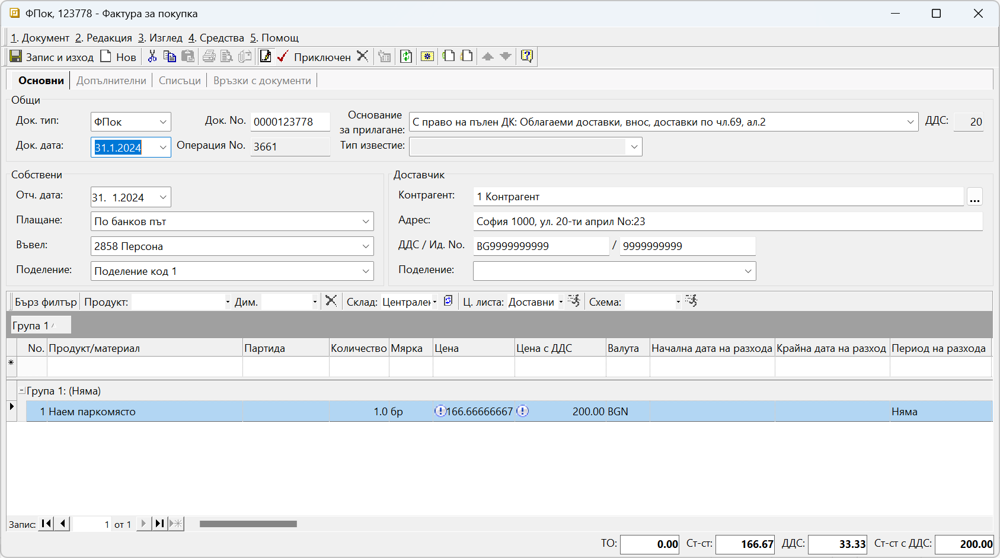
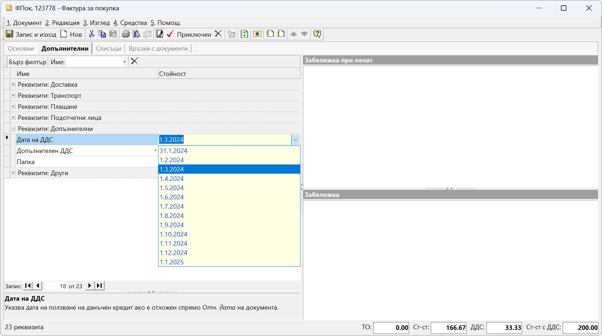
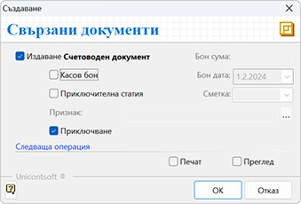
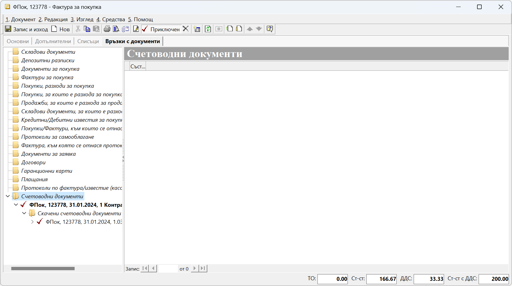
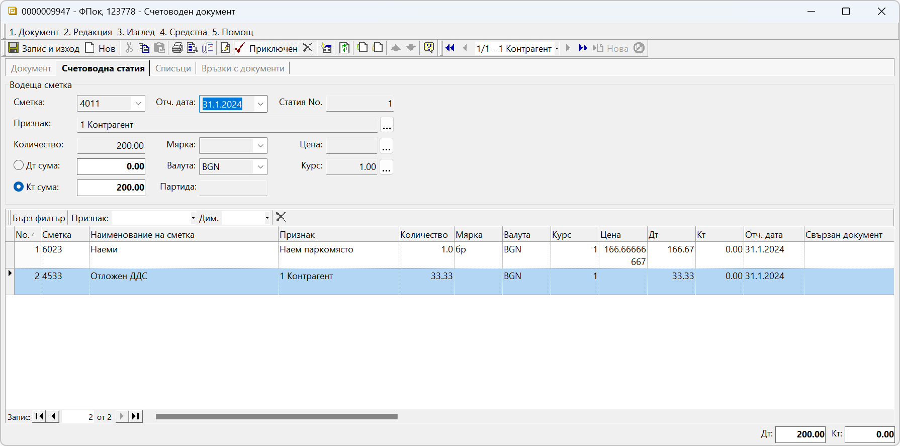
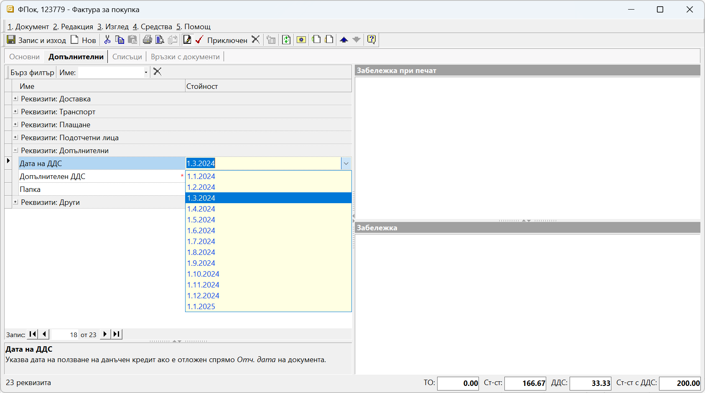

```{only} html
[Нагоре](000-index)
```
 
# Отложено начисляване на ДДС за покупки


[Законът за ДДС](https://dv.parliament.bg/DVWeb/showMaterialDV.jsp?idMat=201969) дава право на регистрираните по него лица да използват данъчния кредит при покупките в рамките на следващите 12 месеца. Системата предлага автоматизация на процеса по отложено начисляване на ДДС. За целта се изисква предварително да настроим транзитна сметка за отложен ДДС.

Настройката е еднократна и се намира в **Администрация || Настройки || Група: Счетоводни настройки**. След като се навигираме до реда със **Сметка разсрочен ДДС за покупки**, в колона *Стойност* избираме сметка за отложен ДДС, която предварително сме настроили в **Сметкоплан**. Направените промени трябва да бъдат записани.

{ class=align-center }

```{tip}
При работа с документи, засягащи минали или бъдещи данъчни периоди, е задължително настройките в **Администрация || Работни периоди** да бъдат съобразени. При липсващ разрешителен период системата не позволява приключване на документи или редактиране на дати.
```

След като сте изпълнили горните изисквания, документът с покупката може да бъде въведен и осчетоводен коректно.  
Така, в крайна сметка, ще имате следните две счетоводни статии:

> **31.01.2024г.**  
> Д<sup>т</sup> 6023 -166,67лв.  
> Д<sup>т</sup> 4533 - 33,33лв.  
> К<sup>т</sup> 4011 -200лв.

> **01.03.2024г.**  
> Д<sup>т</sup> 4531 -33,33лв.  
> К<sup>т</sup> 4533 -33,33лв.  

В следващия пример показваме как за фактура от 31.01.2024г., получена в срок през февруари, ще отложим данъчния кредит за месец март.
За дата на документа посочваме датата на издаване - 31.01.2024г. и обзавеждаме останалите реквизити без особености. 

{ class=align-center }

Важното при схемата за отлагане на ДДС е в панел **Допълнителни**, поле **Дата на ДДС** да изберем месец март. Именно това ще определи отчетната дата, на която ДДС ще се отрази по дебита на сметка 4531.  

{ class=align-center }

```{tip}
Системата ограничава избора на дата в рамките на 12 месеца от датата на фактурата.
```  
Приключваме фактурата за покупка и генерираме счетоводно записване.
  
{ class=align-center }
  
С това системата генерира едновременно два счетоводни документа:  

{ class=align-center }

1. Основен счетоводен документ с датата на фактурата (31.01.2024г.), където сумата на ДДС се отразява в Дт на настроената за транзитна сметка:
  
{ class=align-center }
  
2. Свързан, наречен *Скачен счетоводен документ*, който е с отчетна дата през месец март. В него сумата на ДДС се прехвърля от транзитната с/ка 4533 като ДДС за внасяне в дебита на с/ка 4531:
  
{ class=align-center }
	
 > Предлагаме да използвате тази схема за автоматично осчетоводяване, когато въвеждате също и получени със закъснение фактури за покупка.

Да речем, че в месец март получавате фактура за наето паркомясто, която е била издадена на 01.01.2024. Разбира се, фактурата се въвежда с датата на издаване, т.е. *Док.дата* е 01.01.2024.
И, както вече казахме, за да се отрази правилно ДДС на документа през месец март, трябва от панел **Допълнителни** да посочим това в реквизит **Дата на ДДС**. 

{ class=align-center }
  
Приключваме фактурата за покупка стандартно и генерираме счетоводно записване, при което системата създава едновременно две счетоводни записвания: основен и скачен документ.
В основния счетоводен документ, с отчетна дата 01.01.2024г., сумата на ДДС се отразява в Дт на настроената за транзитна сметка, а в скачения счетоводен документ, същата сума се закрива в транзитната с/ка 4533 през месец март.

> За да начислим ДДС отложено, е нужно:  
> - Настройка на **Сметка разсрочен ДДС за покупки** в **Администрация || Настройки || Група: > Счетоводни настройки**  
> - Избор на **Дата на ДДС**  в панел **Допълнителни** на документа (фактурата) за покупка  
> - Генериране на счетоводни документи към фактурата за покупка