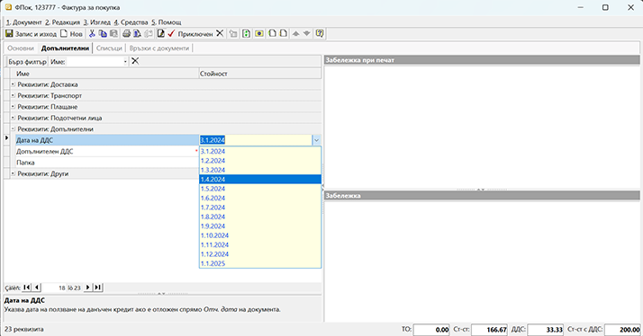

```{only} html
[Нагоре](000-index)
```
 
# Отложен ДДС за покупки и разходи за минали/бъдещи периоди

## Как отлагаме ДДС

Законът за ДДС дава право на регистрираните по него лица да използват данъчния кредит при покупките в рамките на следващите 12 месеца. Системата предлага автоматизация на процеса по отлагане на ДДС. За целта се изисква във фактурата за покупка да посочим *Дата на ДДС* и предварително да сме настроили транзитна сметка за отложен ДДС. Въпросната настройка, която трябва да се направи, е еднократна и се намира в **Администрация || Настройки || Група: Счетоводни настройки**. След като се навигираме до реда със **Сметка разсрочен ДДС за покупки**, в колона *Стойност* избираме сметка за отложен ДДС, която предварително сме настроили в **Сметкоплан**. Направените промени трябва да бъдат записани.

{ class=align-center }

След като сте изпълнили това изискване, документът с покупката може да бъде въведен и осчетоводен коректно.
В следващия пример показваме как за фактура от 31.01.2024г., получена в срок през февруари, ще отложим данъчния кредит за месец март.
За дата на документа посочваме датата на издаване - 31.01.2024г. и обзавеждаме останалите реквизити без особености. 

{ class=align-center }

Важното при схемата за отлагане на ДДС е в панел **Допълнителни**, поле **Дата на ДДС** да изберем месец март. Именно това ще определи отчетната дата, на която ДДС ще се отрази по дебита на сметка 4531.

{ class=align-center }

Приключваме фактурата за покупка и генерираме счетоводно записване.
  
{ class=align-center }
  
С това системата генерира едновременно два счетоводни документа.
1. Основен счетоводен документ с датата на фактурата (31.01.2024г.), където сумата на ДДС се отразява в Дт на настроената за транзитна сметка:
  
{ class=align-center }
  
2. Свързан, наречен *Скачен счетоводен документ*, с отчетна дата през месец март, в който транзитната с/ка 4533 се закрива със съответната сума на ДДС:
  
{ class=align-center }
	
---

Предлагаме да използвате тази схема за автоматично осчетоводяване, когато въвеждате също и получени със закъснение фактури за покупка.

---

Да речем, че в месец март получавате фактура за наето паркомясто, която е била издадена на 01.01.2024. Разбира се, фактурата се въвежда с датата на издаване, т.е. *Док.дата* е 01.01.2024.
И, както вече казахме, за да се отрази правилно ДДС на документа през месец март, трябва от панел **Допълнителни** да посочим това в реквизит **Дата на ДДС**. 

{ class=align-center }
  
Приключваме фактурата за покупка стандартно и генерираме счетоводно записване, при което системата създава едновременно две счетоводни записвания: основен и скачен документ.
В основния счетоводен документ, с отчетна дата 01.01.2024г., сумата на ДДС се отразява в Дт на настроената за транзитна сметка, а в скачения счетоводен документ, същата сума се закрива в транзитната с/ка 4533 през месец март.
	
## Разходи за минали и бъдещи периоди

В редица случаи се налага въвеждане на документ, издаден в текущия данъчен период, но отнасящ се за минал такъв. Това са, например, кредитните известия за цена или обща отстъпка като бонус оборот, фактури  от януари, отнасящи се за покупки в декември и пр. Подобни случаи отработваме в системата, използвайки схема за отразяване на разхода за избран период още с въвеждането на документа. Този метод може да се прилага както при работа с разходи за минали периоди, така и за тези, отнасящи се за бъдещи периоди.
Имате избор как да се раздели разхода - *Месечен*, *Месечен с равни суми*, *Годишен* и *Годишен с равни суми*.
При месечното разделяне системата ще създаде по един документ за всеки от участващите месеци, като сумата в него ще е съобразена или с броя календарни дни(*Месечен*), или ще е еднаква за всеки от месеците (*Месечен с развни суми*). При отнасянето на разхода на годишна база, ще имаме по един документ за всяка от участващите години. И тук сумите могат да бъдат съобразени с броя участващи дни (*Годишен*) или да се използва еднаква сума за всяка година (*Годишен с равни суми*). 

> При работа с документи за минали или бъдещи периоди е задължително настройките на **Работни периоди** в **Администрация** да бъдат съобразени. При липсващ разрешителен период, системата не позволява приключване на документи или редактиране на дати. 

Ще разгледаме с пример, за да онагледим как би изглеждало въвеждането на един подобен документ, като комбинираме с въвеждане на отложено ДДС.

В месец февруари 2024г. получавате фактура за наето през декември 2023г. паркомясто, която е била издадена на 03.01.2024г. Разходът се отнася за месец декември и е коректно да бъде отразен в минал период. Също така,  решавате да отложите ДДС за април.
За да отработите тази ситуация, предварително в **Администрация || Настройки** трябва да имате посочени и сметка, и тип документ за разходи в минал период.
Правим следното: фактурата се въвежда с датата на издаване, т.е. *Док.дата* е 03.01.2024. В колони **Начална дата на разхода** и **Крайна дата на разхода** записваме съответните дати, които обхващат месеца, за който се отнася разхода, т.е. 01. и 31.12.2023г. Разходът в този случай е за един месец, затова в **Период на разхода** избираме типът да бъде *Месечен*.
Ако колоните не са видими, могат да бъдат изведени от *Изглед на списък*, който се достъпва с десен бутон на мишката върху реда с имена на колоните.

{ class=align-center }

За да се отрази правилно и ДДС на документа през месец април, трябва от панел **Допълнителни** да посочим това в реквизит **Дата на ДДС**. 

{ class=align-center }
  
Приключваме фактурата за покупка стандартно и генерираме счетоводно записване, при което системата създава едновременно следните три счетоводни записвания:

{ class=align-center }

1. Основният счетоводен документ е с отчетна дата 03.01.2024г. Разходите в него са отразени по с/ка 499 предварително настроена за целта, а сумата на ДДС се начислява в Дт на транзитна с/ка 4533:
  
{ class=align-center }

2. Първият скачен документ *МО* касае отнасянето на разхода по дебита в гр. 60 с отчетна дата 31.12.2023г. Салдото, което остава по кредита на с/ка 499, ще се закрие в 2024г. с горепоказания основен счетоводен документ на фактурата.

{ class=align-center }

3. В другия скачен счетоводен документ *ФПок* сумата на ДДС се закрива в транзитната с/ка 4533 през месец април:

{ class=align-center }