```{only} html
[Нагоре](000-index)
```
 
# Разпределение на разходи за продажби

 - Методи на разпределение  
 - Справки за разпределение на разходите по продажби


## Методи на разпределение 

Системата разполага с инструмент, чрез който лесно да разпределите допълнителни разходи, свързани с една или няколко продажби. Такива разходи могат да бъдат транспорт, опаковане, застраховка, монтаж и други.
<ins>Тези разходи не са включени в себестойността на продуктите</ins>, както се случва при разпределнието на разходи по придобиване.  

> Правилно разпределените разходи по продажби намаляват постъпленията от една или няколко избрани продажби.

Препоръчително е за различните разходи, които ще разпределяте (напр. транспорт), да въведете отделни продукти при продажба, при придобиване и като общи разходи. Тоест трябва да имате като отделни продукти *Транспорт (по придобиване)*, *Транспорт (при продажба)* и *Транспорт (общи разходи)*.  
Всички те трябва да бъдат от тип на продукта, настроен като услуга, със съответното осчетоводяване.

```{tip}
Предварително трябва да са въведени и валидирани в системата вътрешнофирмените документи за продажбата на продукт/и. 
```

Нека направим разпределяне на транспортни разходи, при следната ситуация - продали сте стока, за чиято доставка сте поели ангажимент. Наели сте външна фирма за транспорта и разходът е за Ваша сметка.   

> При въвеждане на *Документ за покупка* с транспортната услуга е важно да изберете настроения за целта продукт.   

В нашия пример това ще бъде *Транспорт (по продажби)*, от тип на продукта *Разходи за външни услуги*, който може да се осчетоводява автоматично по с/ка 602.  
Следва да въведете в системата *Документа за покупка* с транспорта. Попълвате нужните реквизити и се навигирате до меню **Средства || Разпределение на разходи за продажба**.   

```{tip}
Опцията *Разпределение на разходи за продажби* е активна в *Документ за покупка* единствено, когато той е в състояние на редакция.  
```

{ class=align-center }

В така отворената форма *Разпределение*, заставайки на реда за нов запис, отваряте списък с продажби в колона *Ред от сързан документ*. Трябва да маркирате документа, върху която ще разпределите разходи.  
Да намерите бързо и лесно точния документ зависи от зададените филтри в съответния списък. 

> Може да маркирате едновременно няколко продажби, когато разходът за разпределяне е общ за тях. 

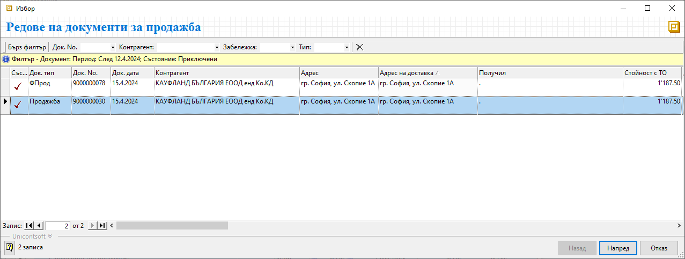{ class=align-center }

На следващата стъпка трябва да изберете за кои продукти ще разпределите транспортните разходи.  
Системата ще добави на отделен ред всеки един от тях, предлагайки сума за разпределяне на база **Продажна стойност**.

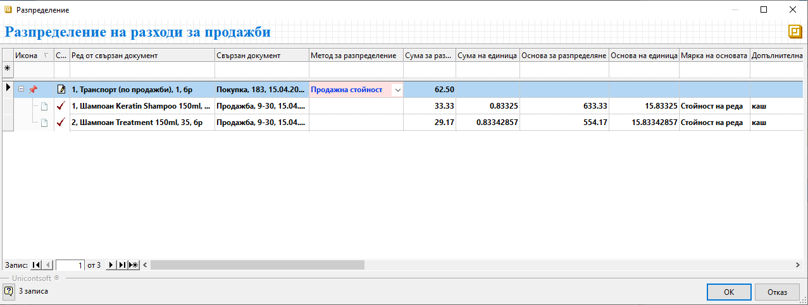{ class=align-center }

```{tip}
Общата сума на разходите за разпределяне е винаги без ДДС. 
```

След като потвърдите избора, системата разпределя разхода на избраната за това база.

Освен предложения по подразбиране метод, системата дава възможност за избор между още няколко:  

- **Ръчно**  - При него системата "отключва" колона *Сума за разпределяне* и имате пълната свобода да разделите общата сума на разхода по продукти.

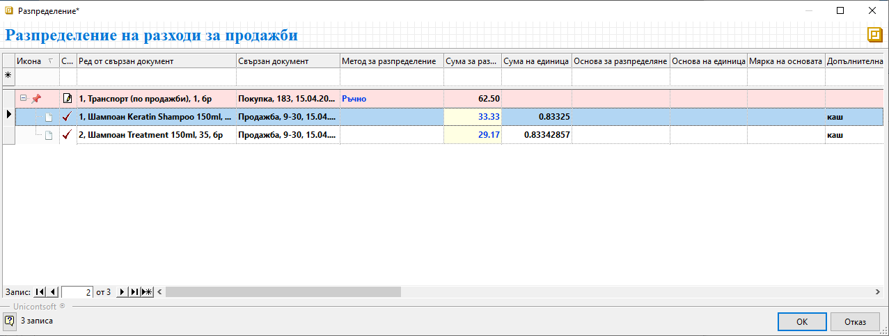{ class=align-center }

- **Количество по основна мярка** - При този метод системата автоматично разпределя общата сума на разхода спрямо количествата в основна мерна единица.  
Което е нашия пример би изглеждало по следния начин:

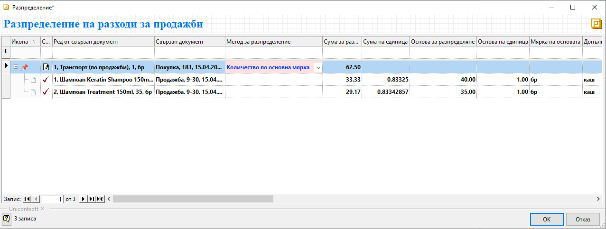{ class=align-center }

- **Количество по допълнителна мярка** - За да използвате този метод, трябва предварително да настроите допълнителни мерки на продуктите.  
В примера за всички продукти има добавена допълнителна мярка *Кашон*, съдържащ 10 броя шампоан. Ето как би изглеждало примерното разпределение на разходите:

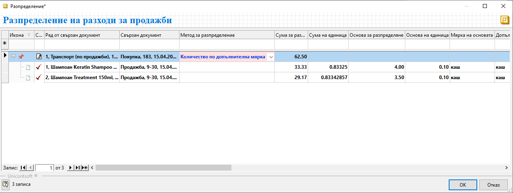{ class=align-center }

- **Нето тегло** - При този метод също е нужна предварителна настройка в панел *Допълнителни* във форма за редакция на продукта.  
При разпределението на транспорта системата дава информация с тези настройки в колона *Основа за разпределение на единица* и *Мярка на основата*.

{ class=align-center }

- **Нето обем** - Методът отново изисква предварителна настройка с нето обем за всеки продукт. Разпределението на разхода ще се извърши на база настроените обеми. Системата визуализира тези настройки в колони *Основа за разпределение на единица* и *Мярка на основата*.

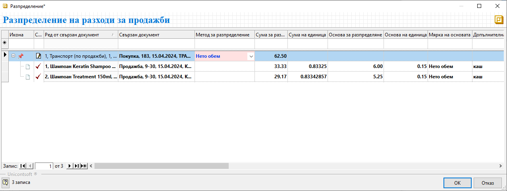{ class=align-center }

- **Продажна цена** - С този метод системата автоматично разпределя общата сума на разхода спрямо единичната цена на продуктите.

{ class=align-center }


## Справки за разпределение на разходите по продажби

В системата имате възможност да проверите дали има разпределени разходи по продажба в няколко справки.  
Първата от тях може да намерите в **Други справки || Разходи по продажби**. След като заредите справката, в списъка ще видите единствено продажби, върху които са разпределени разходи. Справката дава информация за количеството и цената на всички разходи.

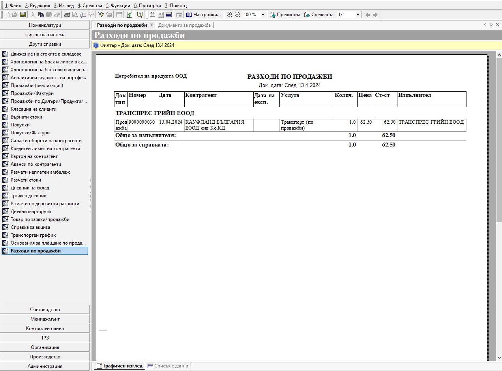{ class=align-center }

**Мениджмънт || Марж и рентабилност**

За да заредите справката с информация за разпределените допълнителни разходи, във филтъра избирате специално предназначения за това *Шаблон* - **По документи с информация за допълнителни разходи**. 

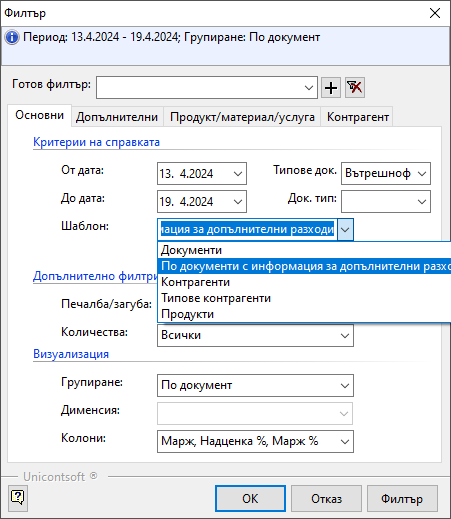{ class=align-center }

В справката ще получите цялостна информация за продажбите с цена на придобиване, продажна цена( вкл. коригиращи документи), допълнителни разходи и съответните марж и надценка.

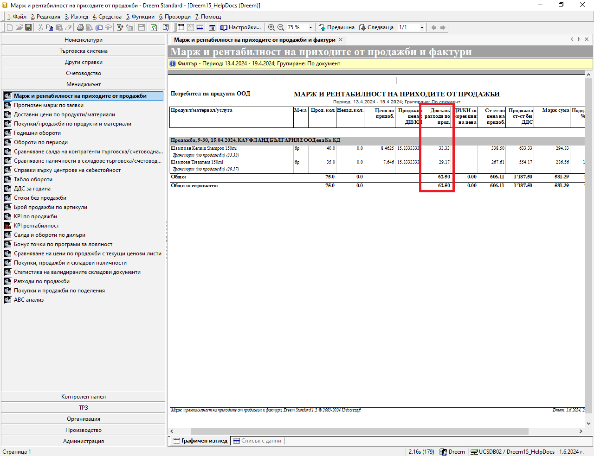{ class=align-center }

Освен в посочените справки, информация за разпределени разходи може да видите и в панел **Свързани документи**:  
- В документа за продажба, към която има допълнителни разходи:

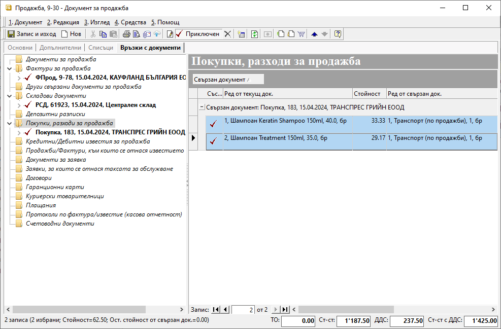{ class=align-center }

- В документа за покупка, съдържащ разпределени разходи по продажба/и:

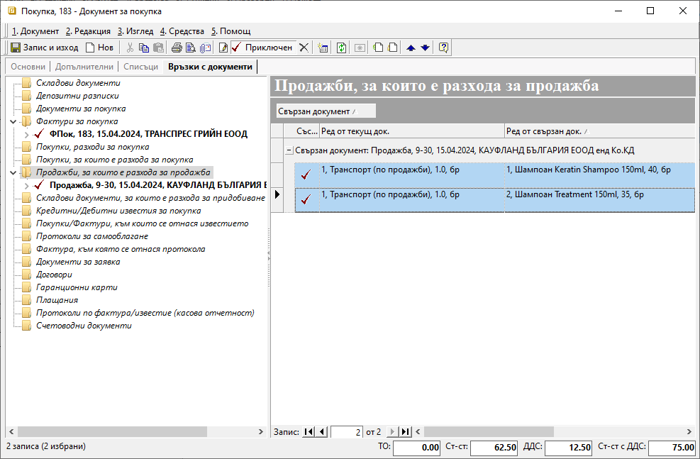{ class=align-center }

За сте сигурни, че желаните покупки са разпределени като разходи по продажби, може да следите колона **Разпределено към продажби %**. Тя се намира в списък **Документи за покупка** и ако не е видима, се извежда с десен бутон върху реда с имена на колони - *Изглед на списък*.

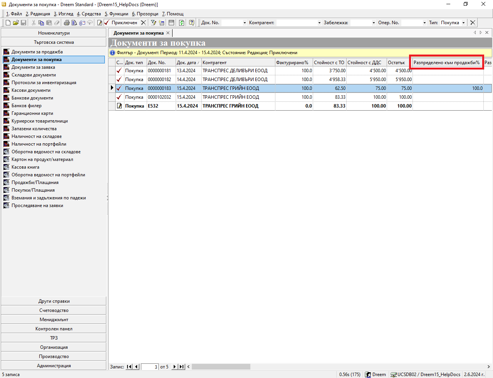{ class=align-center }


> За да разпределим разходи по продажба, трябва документът с продажба на стоките да е приключен.    
> Документът за покупка, съдържащ разходите за разпределяне, трябва да е в състояние на редакция, докато разпределим разходите.  
> Върху един *Документ за продажба* може да разпределим един или няколко разхода.  
> Може да разпределим един разход както върху една, така и върху няколко *Документа за продажба*. 