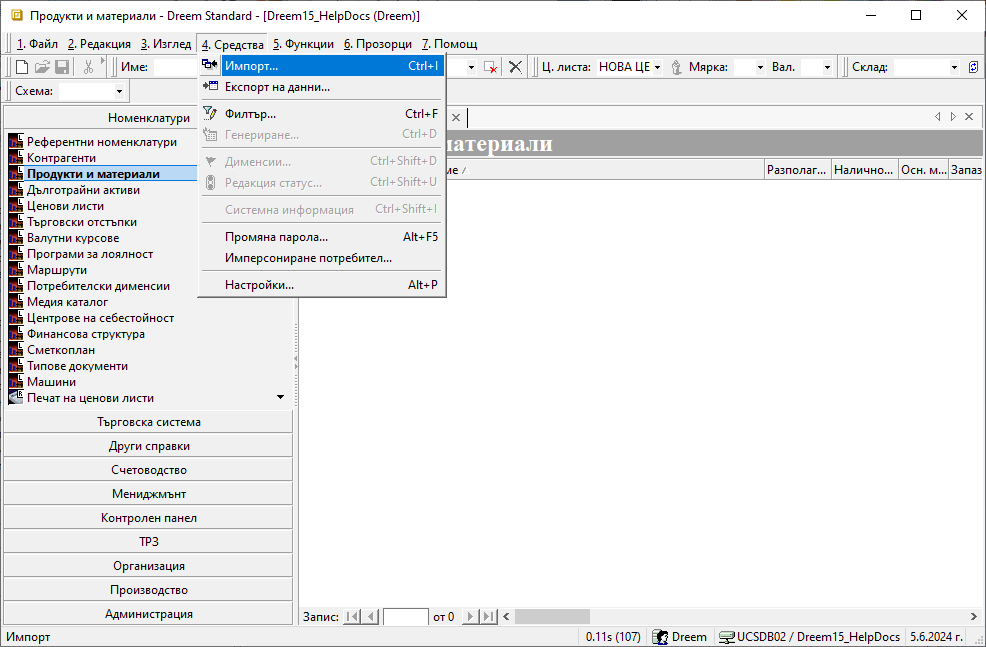
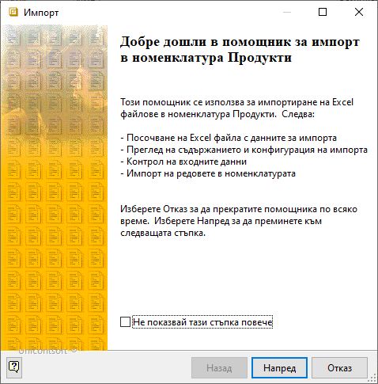
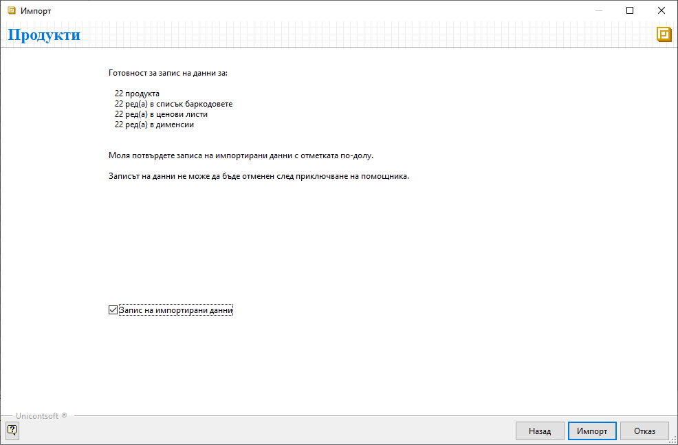
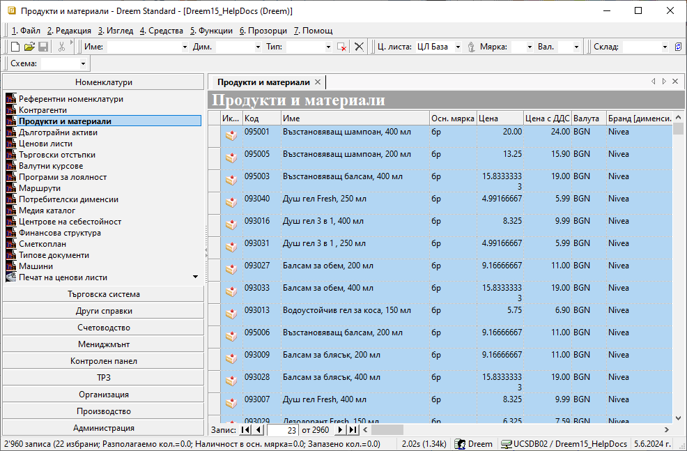

```{only} html
[Нагоре](000-index)
```

# Импорт на продукти

Системата разполага със средство за добавяне на множество нови продукти наведнъж, което ще откриете в **Номенклатури || Продукти и материали**.  

{ class=align-center }

Чрез **Импорт** става възможно едновременното създаване на продукти с малко усилия. Като могат да бъдат направени множество настройки в основни реквизти, вендор кодове, фасети на мерки, баркодове, прикачени файлове, дименсии, ценови листи.  
За да използвате тези предимства, предварително трябва да форматирате данните в Excel файл. Колоните във файла трябва да имат заглавия. Именно по тях след това ще указвате на кой продуктов реквизит отговаря всяка една колона.  
Използвайки помощника за импортиране, ще преминете през следните стъпки:  

- Избор на файл, съдържащ данните с нови продукти  
- Преглед на съдържанието на файла и конфигурация на импорта  
- Контрол на входните данни  
- Импорт на редовете в номенклатурата  

{ class=align-center }

Преминавайки напред, трябва да посочите източник на данни - изберете файла с данни за нови продукти.  

{ class=align-center }

Системата ще покаже съдържанието на файла с продукти, което може да видите като списък вляво. Вашата задача е да конфигурирате импорта чрез списъка вдясно.  
Целта е да приравните съдържанието на двата списъка. По този начин структурирате настройките, посочвайки на кой реквизит ще отговаря всяка колона от файла.  

{ class=align-center }

Подобен вид би имала една завършена конфигурация, съдържаща примерни основни настройки за продукти. 

{ class=align-center }

С преминаване напред системата прави нужните проверки. Ако изведе съобщение за грешка, трябва да отстраните нередностите и да направите повторен опит за импорт.  
При успешно преминаване, системата извежда опис на записите, които е в готовност да създаде. Ако сте съгласни, поставете отметка при *Запис на импортирани данни* и потвърдете импорта.  

> Веднъж потвърдени и записани, новите настройки не могат да бъдат върнати стъпка назад или изцяло отменени. 

{ class=align-center }

С приключване на процеса по импортиране системата затваря помощника. Новодобавените продукти са видими в списъка след неговото опресняване.  

{ class=align-center }

<ins>Пълен списък с реквизити на продукти, достъпни за настройка при импорт:</ins>

