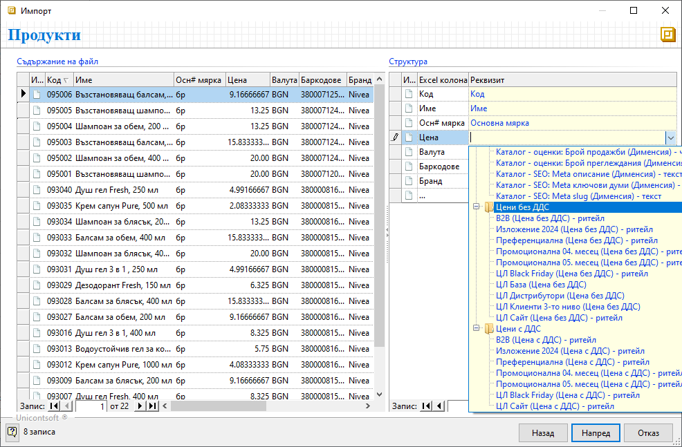
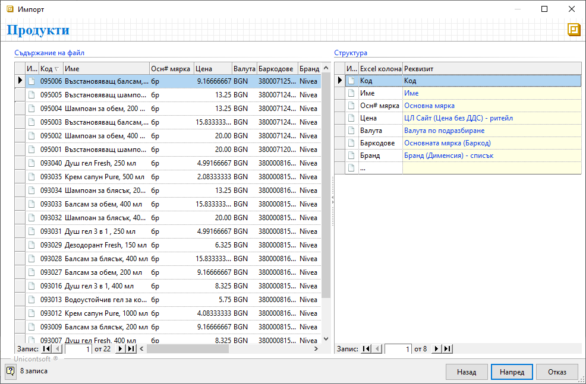

```{only} html
[Нагоре](000-index)
```

# Импорт на продукти

Системата разполага със средство за добавяне на множество нови продукти наведнъж, което ще откриете в **Номенклатури || Продукти и материали**.  

{ class=align-center }

Чрез **Импорт** става възможно едновременното създаване на продукти с малко усилия. Като могат да бъдат направени множество настройки в основни реквизти, вендор кодове, фасети на мерки, баркодове, прикачени файлове, дименсии, ценови листи.  
За да използвате тези предимства, предварително трябва да форматирате данните в Excel файл. Колоните във файла трябва да имат заглавия. Именно по тях след това ще указвате на кой продуктов реквизит отговаря всяка една колона.  
Използвайки помощника за импортиране, ще преминете през следните стъпки:  

- Избор на файл, съдържащ данните с нови продукти  
- Преглед на съдържанието на файла и конфигурация на импорта  
- Контрол на входните данни  
- Импорт на редовете в номенклатурата  

{ class=align-center }

Преминавайки напред, трябва да посочите източник на данни - изберете файла с данни за нови продукти.  

{ class=align-center }

Системата ще покаже съдържанието на файла с продукти, което може да видите като списък вляво. Вашата задача е да конфигурирате импорта чрез списъка вдясно.  
Целта е да приравните съдържанието на двата списъка. По този начин структурирате настройките, посочвайки на кой реквизит ще отговаря всяка колона от файла.  

{ class=align-center }

Подобен вид би имала една завършена конфигурация, съдържаща примерни основни настройки за продукти. 

{ class=align-center }

С преминаване напред системата прави нужните проверки. Ако изведе съобщение за грешка, трябва да отстраните нередностите и да направите повторен опит за импорт.  
При успешно преминаване, системата извежда опис на записите, които е в готовност да създаде. Ако сте съгласни, поставете отметка при *Запис на импортирани данни* и потвърдете импорта.  

> Веднъж потвърдени и записани, новите настройки не могат да бъдат върнати стъпка назад или изцяло отменени. 

{ class=align-center }

С приключване на процеса по импортиране системата затваря помощника. Новодобавените продукти са видими в списъка след неговото опресняване.  

{ class=align-center }

<ins>Пълен списък с реквизити на продукти, достъпни за настройка при импорт:</ins>

- Основни реквизити
    Име
    Код
    Основна мярка
    Тип - код
    Тип - име
    Склад
    Счет. отчитане по признаци - да/не
    Счет. отчитане по количество - да/не
    Забележка
    Допълнително име
    Валута по подразбиране
    Допълнителна мярка
    Нето тегло - число
    Бруто тегло - число
    Нето обем - число
    Бруто обем - число
    Прецизност в осн. мярка - число
    Прецизност крайна цена с ДДС - число
    Продукт трансформиране при фактуриране - код
    Продукт трансформиране при фактуриране - име
    Счетоводен продукт - код
    Счетоводен продукт - име
    Гаранционен срок - число
    Мярка на гаранционния срок - число
    Срок на годност - число
    Мярка на срок на годност - число
    Производител
    Вносител
    ДДС% - число
    Разрешено включване ДДС в цената - да/не
    Интрастат допълнителна мярка
    Интрастат - код по КН
    Партида по подразбиране
    Клас по подразбиране
    Експлоатационна информация
    Данъчна група за касова бележка
    Текст на етикет
    Задължителна партида - да/не
    Амбалаж - да/не
    Публична информация
    Описание
    Сорт
    Калибър
    Произход
    Опаковка
    Вендор кодове
- Динамични реквизити
    *Фасети на мерки
    *Баркодове
    *Прикачени файлове
    *Дименсии
    *Цени без ДДС
    *Цени с ДДС  

Съдържанието на динамичните реквизити се променя спрямо съществуващите в системата настройки.  
Например, списъкът към **Цени без ДДС** ще включва единствено ценовите листи без настройката *Ритейл*. Докато ЦЛ, настроени като *Ритейл*, се визуализират в списъците на **Цени без ДДС** и в **Цени с ДДС**.  