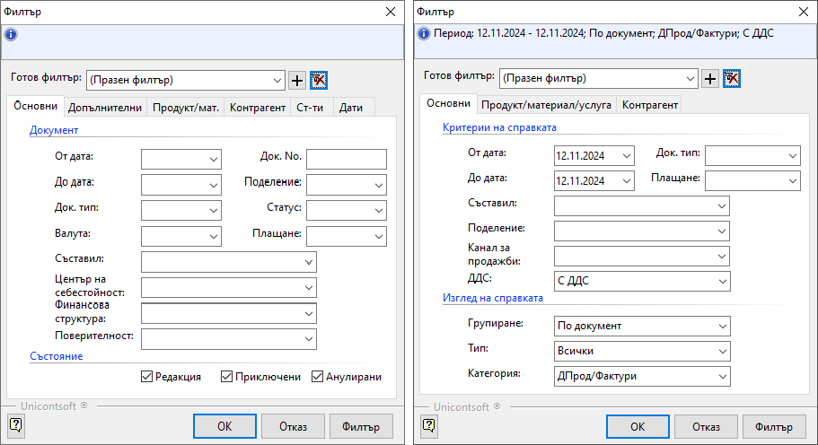

```{only} html
[Нагоре](000-index)
```

# Работа със списъци

- [Структура и функционалности на контейнера](https://docs.unicontsoft.com/blog/20241112-lists-configuration.html#id2)
- [Използване на основни и бързи филтри](https://docs.unicontsoft.com/blog/20241112-lists-configuration.html#id7)
- [Работа с редактируеми списъци](https://docs.unicontsoft.com/blog/20241112-lists-configuration.html#id10)
- [Работа с нередактируеми списъци](https://docs.unicontsoft.com/blog/20241112-lists-configuration.html#id11)
- [Използване на Списък с данни в справките](https://docs.unicontsoft.com/blog/20241112-lists-configuration.html#id12)

Списъците в системата представляват набор от редове в множество колони, които могат да бъдат конфигурирани различно според нуждите на потребителите. Системата дава възможност за добавяне, скриване, разместване, оразмеряване, сортиране и групиране на колони.  

Ще разделим списъците условно на два вида, за да разгледаме особеностите при работа с всеки от тях: 
- редактируеми - такива, които позволяват обработка на данни   
- нередактируеми - такива, които са резултативни и не допускат промяна на данни   

Общото за всички тях е използването на филтри - има съществено значение при работа с обемни по съдържание списъци.  

## Структура и функционалности на контейнера

При стартиране на Dreem ERP, като част от структурата на системата, се отваря т.нар. *контейнер*. Той съдържа лента с основно меню, лента с инструменти, лента с бутони по групи функции, динамичен списък за визуализация на документи и статус лента.

### Mеню на контейнера

В лявата част на контейнера е разположена лента с бутони по групи, даващи достъп до функционалностите в системата. 
С десен бутон на мишката върху тази лента ще отворите менюто на контейнера. По този начин имате достъп до активиране / деактивиране на различни функции, променящи облика на контейнера.  

Всяка от опциите за настройка в менюто е описана в статия [Описание и функционалности на контейнера](https://www.unicontsoft.com/cms/node/253).   

{ class=align-center }

> Използвайте *Активиране в нов прозорец*, за да активирате едновременно няколко функционалности в отделни прозорци. Удобна възможност е, когато трябва да работите в две или повече справки и документи в системата. Активираните функции, както и навигацията между тях, се осъществява през навигационната лента.  

### Основно меню

Лента с основно меню се използва за въвеждане на функционалности на форми, списъци и документи. Лентата с основно меню се намира най-горе на контейнера, като съдържа следните менюта: Файл, Редакция, Изглед, Средства, Функции, Прозорци и Помощ.  

{ class=align-center }

### Лента с инструменти

Лентата с инструменти се намира непосредствено под основното меню.  
В нея са изнесени от основното меню някои инструменти за въвеждане на функционалности на форми, списъци и документи.  

{ class=align-center }

От тук може да създадете нов запис (документ, номенклатура) и да редактирате запис. Достъпни са бутони с основни действия като запис, изрязване, копиране, поставяне и изтриване. 

За да посочите на системата за кой запис ще се отнасят действията, трябва преди това да се позиционирате на реда с номенклатура или да маркирате желания ред с документ. Ще забележите, че стават активни единствено бутоните, чиито действия системата позволява.  

### Контекстно меню  

Контекстното меню е съчетание на функции от *Основно меню* и *Лента с инструменти*. Отваря се с десен бутон на мишката върху списъците с документи.   

{ class=align-center }

*Други средства*

### Меню на списък

За всеки списък е достъпно меню с функционалности на колоните като сортиране, групиране, скриване, извеждане на колони и други.  
*Меню на списък* се отваря чрез десен бутон на мишката върху реда със заглавия на колони. В статията [Работа с колони на списъци](https://www.unicontsoft.com/cms/node/254) подробно са разгледани всички възможности, които системата дава при работа с колони.  


## Използване на основни и бързи филтри

Съдържанието на всички списъци може да се променя чрез прилагане на филтри.  

> Правилното филтриране е първата и най-важна стъпка, за да се обзаведе списъкът с верните данни. Едва тогава е оправдано да се продължи с настройването на списъка.  

### Основен филтър
  
Основен *Филтър* ще откриете в някои номенклатури, като *Контрагенти*, *Продукти и материали* и др., във всички списъци с документи и в справките.  

*Филтър* за текущо отворен списък е достъпен чрез:  

- меню 4. Средства  
- жълтото поле в началото на списъка  
- десен бутон върху списъка      
- клавишна комбинация Ctrl + F   

{ class=align-center }

Спрямо заложените в основния филтър критерии, системата ще обзаведе списъка с данните, отговарящи на тях. Избраните критерии се визуализират в жълтото поле.  

> Системата запазва последно настроения филтър и при следващо отваряне на списъка го прилага автоматично.  

Филтър формата за основно търсене съдържа променливи реквизити, различни за отделните списъци . Така например, ще забележите и различен брой панели във филтрите на *Документи за продажба* и на справка *Продажби (реализация)* 

{ class=align-center }


> Във форма *Филтър* има опция *Изчистване текущ филтър*, която автоматично почиства всички полета.  
Това е полезно при ново търсене, защото гарантира, че настройвате филтъра "на чисто".   

{ class=align-center }

### Бърз филтър

Ще откриете *Бърз филтър* над почти всеки списък в системата. Съдържанието му в различните форми и списъци варира. Може да съдържа полета за свободно търсене по текст (част от текст) и полета с падащи прозорци. От статията [Бърз филтър и настройки на начина на търсене](https://www.unicontsoft.com/cms/node/129) може да разберете как да използвате бързия филтър още по-ефективно.   

> Чрез *Бърз филтър* редуцирате <ins>единствено съществуващите данни</ins> в списъка.   

За голяма част от функционалностите в системата бързият филтър е достъпен от лентата с инструменти в контейнера.

{ class=align-center }

Освен това, ще може да използвате бързи филтри също в панел *Списък данни* на справки, форма за редакция на документи, номенклатури и др.  

## Работа с редактируеми списъци


## Работа с нередактируеми списъци

> Оптимизирайте времето си за работа, като в *Основен филтър* прилагате добре подбрани критерии.  
За да работят максимално бързо списъците с документи, по възможност избирайте кратък времеви период.

## Използване на Списък с данни в справките

По подразбиране справките в системата се визуализират в *Графичен изглед* с вид на преглед при печат. Филтрираните данни се подреждат в системно заложен шаблон. При този изглед конфигурацията на справката не може да се променя.     

Съществува и алтернативен изглед - *Списък с данни*.  
<ins>При този изглед конфигурацията на справката може да се променя.</ins>  
При него данните са оформени в табличен вид и може да прилагате правилата за работа с нередактируеми списъци.  

> Размествайте, скривайте и показвайте от наличните допълнителни колони, за да създадете собствен удобен дизайн.  
Активирането на *Тотали* за избрана групировка може да добави нова и полезна иформация.  

<ins>В тази си форма справките могат да бъдат копирани във външен файл, където списъкът подлежи на пълна редакция и преформатиране.</ins>  

