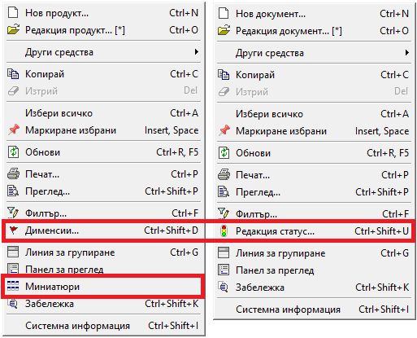

```{only} html
[Нагоре](000-index)
```

# Работа със списъци

- [Използване на основни и бързи филтри](https://docs.unicontsoft.com/blog/20241112-lists-configuration.html#id2)
- [Лента с бутони по групи функции](https://docs.unicontsoft.com/blog/20241112-lists-configuration.html#id5)
- [Работа с редактируеми списъци](https://docs.unicontsoft.com/blog/20241112-lists-configuration.html#id11)
- [Работа с нередактируеми списъци](https://docs.unicontsoft.com/blog/20241112-lists-configuration.html#id12)
- [Използване на Списък с данни в справките](https://docs.unicontsoft.com/blog/20241112-lists-configuration.html#id13)

Списъците в системата представляват набор от редове в множество колони, които могат да бъдат конфигурирани различно според нуждите на потребителите. Системата дава възможност за добавяне, скриване, разместване, оразмеряване, сортиране и групиране на колони.  

Ще разделим списъците условно на два вида, за да разгледаме особеностите при работа с всеки от тях: 
- редактируеми - такива, които позволяват обработка на данни   
- нередактируеми - такива, които са резултативни и не допускат промяна на данни   

Общото за всички тях е използването на филтри - има съществено значение при работа с обемни по съдържание списъци.  

## Използване на основни и бързи филтри

Съдържанието на всички списъци може да се променя чрез прилагане на филтри.  

> Правилното филтриране е първата и най-важна стъпка, за да се обзаведе списъкът с верните данни. Едва тогава е оправдано да се продължи с настройването на списъка.  

### Основен филтър
  
Основен *Филтър* ще откриете в някои номенклатури, като *Контрагенти*, *Продукти и материали* и др., във всички списъци с документи и в справките.  

*Филтър* за текущо отворен списък е достъпен чрез:  

- меню 4. Средства  
- жълтото поле в началото на списъка  
- десен бутон върху списъка      
- клавишна комбинация Ctrl + F   

{ class=align-center }

Спрямо заложените в основния филтър критерии, системата ще обзаведе списъка с данните, отговарящи на тях. Избраните критерии се визуализират в жълтото поле.  

> Системата запазва последно настроения филтър и при следващо отваряне на списъка го прилага автоматично.  

Филтър формата за основно търсене съдържа променливи реквизити, различни за отделните списъци . Така например, ще забележите и различен брой панели във филтрите на *Документи за продажба* и на справка *Продажби (реализация)* 

{ class=align-center }


> Във форма *Филтър* има опция *Изчистване текущ филтър*, която автоматично почиства всички полета.  
Това е полезно при ново търсене, защото гарантира, че настройвате филтъра "на чисто".   

{ class=align-center }

### Бърз филтър

Ще откриете *Бърз филтър* над почти всеки списък в системата. Съдържанието му в различните форми и списъци варира. Може да съдържа полета за свободно търсене по текст (част от текст) и полета с падащи прозорци. От статията [Бърз филтър и настройки на начина на търсене](https://www.unicontsoft.com/cms/node/129) може да разберете как да използвате бързия филтър още по-ефективно.   

> Чрез *Бърз филтър* редуцирате <ins>единствено съществуващите данни</ins> в списъка.   

За голяма част от функционалностите в системата бързият филтър е достъпен от лентата с инструменти в контейнера.

{ class=align-center }

Освен това, ще може да използвате бързи филтри също в панел *Списък данни* на справки, форма за редакция на документи, номенклатури и др.  

## Структура и функционалности на контейнера

При стартиране на Dreem ERP, като част от структурата на системата, се отваря т.нар. *контейнер*. Той съдържа лента с основно меню, лента с инструменти, лента с бутони по групи функции, динамичен списък за визуализация на документи и статус лента.

### Лента с бутони по групи функции

В лявата му част е разположена лента с бутони по групи, даващи достъп до функционалностите в системата. С десен бутон на мишката върху тази лента ще отворите менюто на контейнера.

{ class=align-center }

Всяка от опциите за настройка в менюто е описана в статия [Описание и функционалности на контейнера](https://www.unicontsoft.com/cms/node/253).   

### Основно меню

Лента с основно меню се използва за въвеждане на функционалности на форми, списъци и документи. Лентата с основно меню се намира най-горе на контейнера, като съдържа следните менюта: Файл, Редакция, Изглед, Средства, Функции, Прозорци и Помощ.  

{ class=align-center }

### Лента с инструменти

Лентата с инструменти се намира непосредствено под основното меню.  
В нея са изнесени от основното меню някои инструменти за въвеждане на функционалности на форми, списъци и документи.  

{ class=align-center }

### Контекстно меню  

Контекстното меню е съчетание на функции от *Основно меню* и *Лента с инструменти*. Отваря се с десен бутон на мишката върху списъците с документи.   

{ class=align-center }

*Други средства*

### Меню на списък

Менюто на списък се отваря чрез десен бутон на мишката върху заглавието на която и да е колона.  
Съдържа основните функционалности на списъка за:
- сортиране в нарастващ/намаляващ ред
- групиране с/без тотали     
- скриване и извеждане на колони и други

- Нарастващ ред — сортировка в нарастващ ред. Ползва се от текущата колона, от която е избрано менюто. В скоби се визуализира коя по ред сортировка от общо колко е съответната. 
- Намаляващ ред — сортировка в намаляващ ред. Ползва се от текущата колона, от която е избрано менюто. В скоби се визуализира коя по ред сортировка от общо колко е съответната. 
- Групиране по колона — групира по избраната колона. Ползва се от текущата колона, като системата автоматично отваря линията за групиране и групира по избраната колона. 
- Групиране по колона и тотали — групира по избраната колона и включва тотали. Ползва се от текущата колона, като системата автоматично отваря линията за групиране, групира по избраната колона и включва тоталите. 
- Линия за групиране — линия за групиране. Използва се за скриване/ показване на линията за групиране. Списък се групира по всяка една колона от него. Групира се с помощта на мишката чрез натискане и задържане върху колона от списък, като последната се премества в линията. 
- Тотали — тотал на списък. Съдържа се в контекстно меню на списъци. Използва се за извеждане на тотали по документи, като задължително трябва да съществува групировка по списъка. 
- Автоматичен размер на колони — автоматично оразмерява колоните от списъка. Ползва се за всички колони независимо от къде е избрана опцията. 
- Скриване на колона — скрива колона. Ползва се от текущата колона, от която е избрано менюто. 
- Колони на списък — показва/скрива колоните на списъка. Визуализира всички колони на списъка, както и индикатор за показва/скрива. Чрез него могат да се менажират, кои колони да са показани и кои да са скрити. 

## Работа с редактируеми списъци


## Работа с нередактируеми списъци

> Оптимизирайте времето си за работа, като в *Основен филтър* прилагате добре подбрани критерии и времеви периоди

## Използване на Списък с данни в справките

По подразбиране справките в системата се визуализират в *Графичен изглед* с вид на преглед при печат. Филтрираните данни се подреждат в системно заложен шаблон.  
<ins>При този изглед конфигурацията на справката не може да се променя.</ins>     

Съществува и алтернативен изглед - *Списък с данни*.  
При него данните са оформени в табличен вид, където може да прилагате правилата за работа с нередактируеми списъци.  

