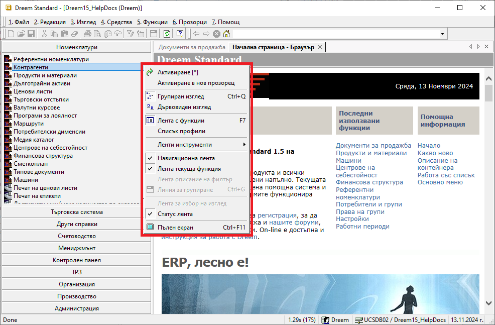
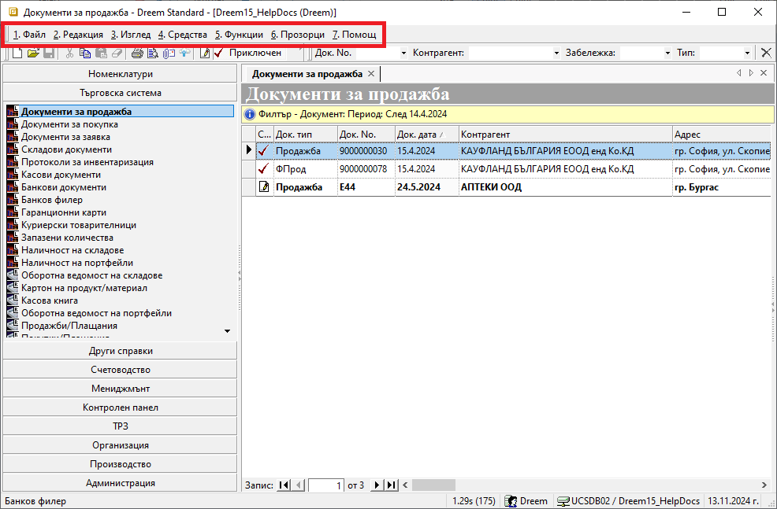

```{only} html
[Нагоре](000-index)
```

# Работа със списъци

- [Използване на основни и бързи филтри](https://docs.unicontsoft.com/blog/20241112-lists-configuration.html#id2)
- [Общи правила при работа със списъци](https://docs.unicontsoft.com/blog/20241112-lists-configuration.html#id5)
- [Работа с редактируеми списъци](https://docs.unicontsoft.com/blog/20241112-lists-configuration.html#id6)
- [Работа с нередактируеми списъци]()
- [Използване на Списък с данни в справките]()

Списъците в системата представляват набор от редове в множество колони, които могат да бъдат конфигурирани различно според нуждите на потребителите. Системата дава възможност за добавяне, скриване, разместване, оразмеряване, сортиране и групиране на колони.  
Има два вида списъци: такива, които позволяват редакция, и такива, които са резултативни и не допускат редактиране.  

Съдържанието на всички списъци може да се променя чрез прилагане на филтри.  

> Правилното филтриране е първата и най-важна стъпка, за да се обзаведе списъкът с верните данни. Едва тогава има смисъл по-нататъшното конфигуриране на даден списък.   

## Използване на основни и бързи филтри

### Основен филтър

Основният филтър за текущо отворен списък е достъпен чрез:  

- меню 4. Средства  
- жълтото поле в началото на списъка  
- десен бутон върху списъка      
- клавишна комбинация Ctrl + F   

{ class=align-center }

Спрямо заложените в основния филтър критерии, системата ще обзаведе списъка с данните, отговарящи на тях. Избраните критерии се визуализират в жълтото поле. 

> Системата запазва последно настроения филтър и при следващо отваряне на списъка го прилага автоматично.   

Филтър формата за основно търсене съдържа променливи реквизити, различни за отделните списъци . Така например, ще забележите и различен брой панели във филтрите на *Документи за продажба* и на справка *Продажби (реализация)* 

{ class=align-center }


> Във форма *Филтър* има опция *Изчистване текущ филтър*, която почиства едновременно всички филтър полета.  
Това е полезно при ново търсене, т.к. гарантира, че настройвате филтъра "на чисто".   


{ class=align-center }


### Бърз филтър

В системата обозначение *Бърз филтър* ще откриете при почти всеки списък, като винаги е разположен в горната част. Съдържанието му в различните форми и списъци варира. Може да съдържа полета за свободно търсене по текст (част от текст), както и полета с падащи прозорци. 

> Чрез *Бърз филтър* редуцирате <ins>вече съществуващите данни</ins> в списъка.  

Бързият филтър е достъпен от лентата с инструменти  

{ class=align-center }

## Общи правила при работа със списъци

### Функционалности на контейнера

Менюто на контейнера се отваря чрез десен щрак с мишката върху лентата с бутони по групи функции.  
1. Активиране — активиране на нова функционалност. Опция по подразбиране, при щрак с мишката (Настройки). Активира новата функционалност, като затваря старата. 
2. Активиране в нов прозорец — активиране на нова функционалност в нов прозорец. Активира новата функционалност, като отваря нов прозорец за функцията. Така на практика има две или повече отворени функции на системата. Визуализацията на тези функции, както и навигацията между тях се осъществява през навигационната лента. За целта тя трябва да бъде активна (виж точка 9). 
3. Групиран изглед — изглед на лентата с бутони. Активна опция по подразбиране. Визуализира лентата с бутони по групи функции. Клавишна комбинация: Ctrl+Shift+Q 
4. Дървовиден изглед — изглед на лентата с бутони. Визуализира лентата с бутони в дървовидна структура. Клавишна комбинация: Ctrl+Shift+W 
6. Лента с функции — показва/скрива лентата с бутони. Клавишна комбинация:F7 
7. Списък с профили — показва/скрива списъка с профили. Системата позволява настройка на различни профили за работа (най-вече при използване на повече от една база данни). Чрез активиране на опцията списък профили, системата визуализира падащ прозорец с различни профили за смяна. 
8. Лента инструменти — показва/скрива различните ленти с инструменти. При различни функционалности съществуват различни ленти с инструменти. Чрез опцията те се визуализират в допълнително меню, откъдето могат да бъдат показвани и скривани. 
9. Навигационна лента — показва/скрива лентата за навигация. Лентата за навигация се използва при отваряне на функционалности в системата в нови прозорци (виж точка 2). Чрез нея можете да се навигирате бързо и удобно във всяка отворена функция. 
10. Лента текуща функция — показва/скрива наименованието на текущата функция. 
11. Лента описание на филтър — показва/скрива жълтата лента на активния филтър. Визуализира съдържанието на активния филтър. 
12. Линия за групиране — показва/скрива линията за групиране на списък. Клавишна комбинация: Ctrl+G 
13. Лента за избор на изглед — показва/скрива лентата за избор на изглед в справките. 
14. Статус лента — показва/скрива статус лентата.  
15. Пълен екран — показва/скрива бутон за визуализация на пълен екран. Клавишна комбинация: Ctrl+F11   

### Основно меню

Лента с основно меню се използва за въвеждане на функционалности на форми, списъци и документи. Лентата с основно меню се намира най-горе на контейнера, като съдържа следните менюта: Файл, Редакция, Изглед, Средства, Функции, Прозорци и Помощ.

### Лента с инструменти

Лентата с инструменти се използва за въвеждане на функционалности на форми, списъци и документи. Лентата с инструменти се намира непосредствено под нея и представлява изнесени инструменти на основното меню.

### Контекстно меню  

Контекстното меню е съчетание между основното и лентата с инструменти. Отваря се с десен бутон на мишката върху списъците с документи 

### Меню на списък

Менюто на списъци се отваря чрез десен щрак с мишката върху антетката на която и да е колона и съдържа основните функционалности на списъка.  
1. Нарастващ ред — сортировка в нарастващ ред. Ползва се от текущата колона, от която е избрано менюто. В скоби се визуализира коя по ред сортировка от общо колко е съответната. 
2. Намаляващ ред — сортировка в намаляващ ред. Ползва се от текущата колона, от която е избрано менюто. В скоби се визуализира коя по ред сортировка от общо колко е съответната. 
3. Групиране по колона — групира по избраната колона. Ползва се от текущата колона, като системата автоматично отваря линията за групиране и групира по избраната колона. 
4. Групиране по колона и тотали — групира по избраната колона и включва тотали. Ползва се от текущата колона, като системата автоматично отваря линията за групиране, групира по избраната колона и включва тоталите. 
5. Линия за групиране — линия за групиране. Използва се за скриване/ показване на линията за групиране. Списък се групира по всяка една колона от него. Групира се с помощта на мишката чрез натискане и задържане върху колона от списък, като последната се премества в линията. 
6. Тотали — тотал на списък. Съдържа се в контекстно меню на списъци. Използва се за извеждане на тотали по документи, като задължително трябва да съществува групировка по списъка. 
7. Автоматичен размер на колони — автоматично оразмерява колоните от списъка. Ползва се за всички колони независимо от къде е избрана опцията. 
8. Скриване на колона — скрива колона. Ползва се от текущата колона, от която е избрано менюто. 
9. Колони на списък — показва/скрива колоните на списъка. Визуализира всички колони на списъка, както и индикатор за показва/скрива. Чрез него могат да се менажират, кои колони да са показани и кои да са скрити. 


## Работа с редактируеми списъци

Списъците, които позволяват редакция, ...

## Работа с нередактируеми списъци


## Използване на Списък с данни в справките


