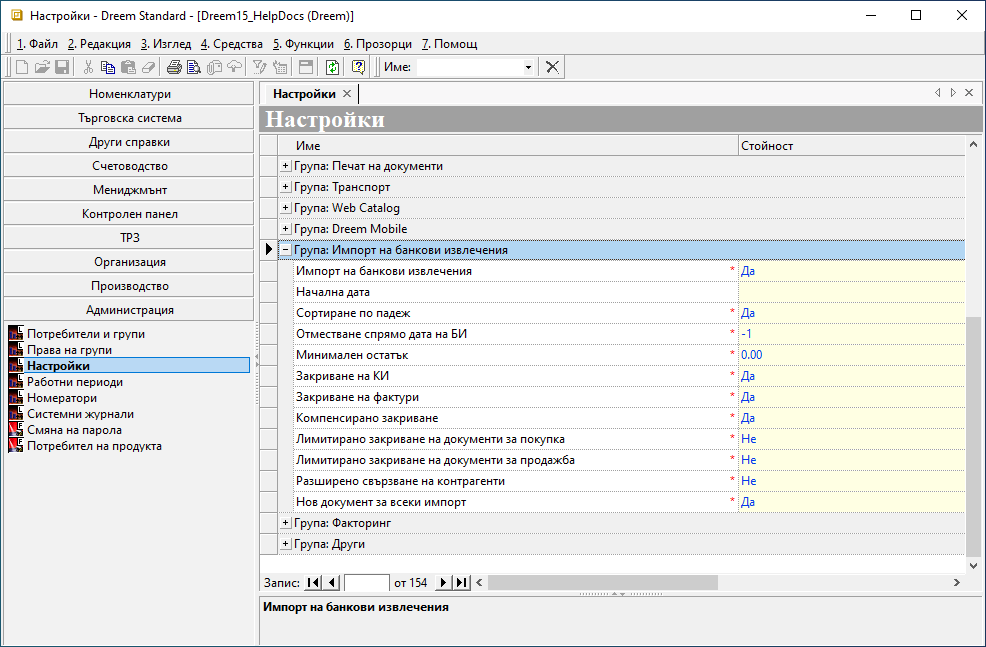
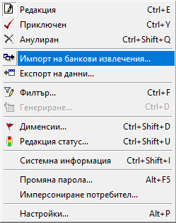
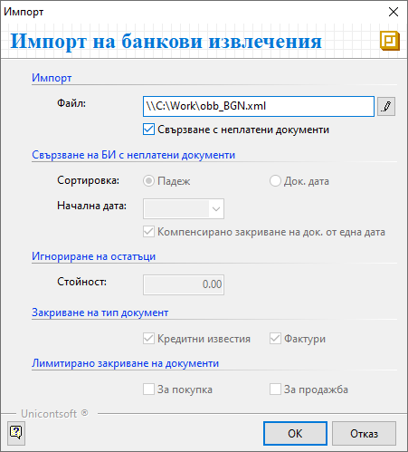
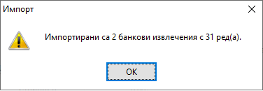
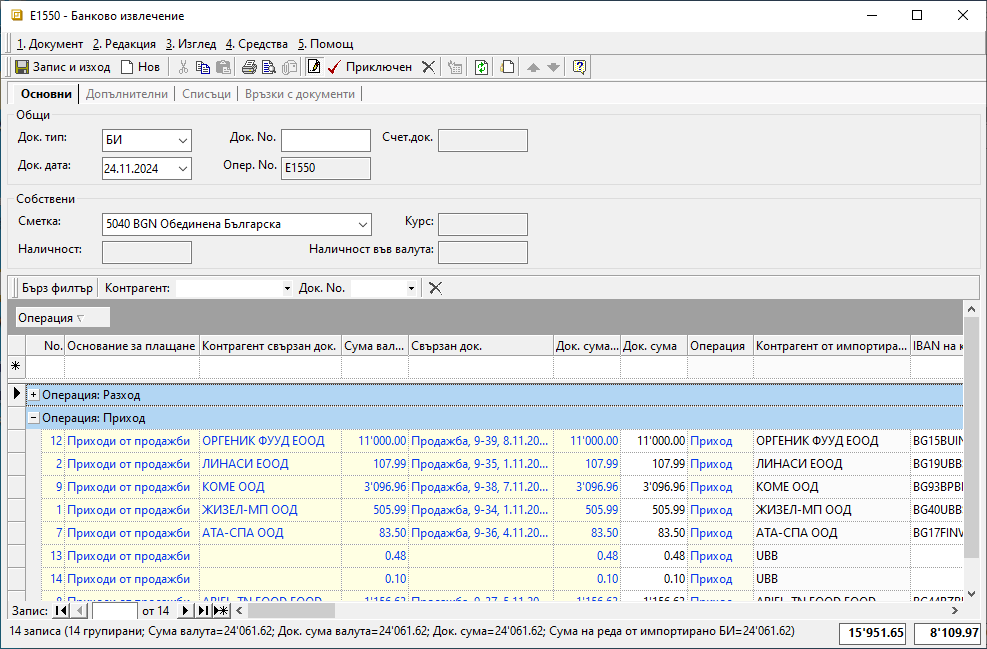
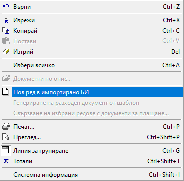

```{only} html
[Нагоре](000-index)
```

# Импорт на банкови извлечения

Чрез импорта на информация от банкови извлечения се подобрява точността на финансовите данни. Системата разполага със средство за автоматизирано прехвърляне на трансакции от банкови сметки и упражнява прецизен контрол по данъчни документи, товарителници, ППП.  

Системата обработва файлове в различни формати за интеграция с непрекъснато разширяващ се списъка от банки: ОББ, Уникредит, Алианц, Интернешънъл Асет Банк, Банка ДСК, Пощенска банка и други. 

За да използвате функцията за импорт, е необходимо в **Администрация || Настройки || Импорт на банкови извлечения** да определите параметрите, при които системата ще оперира.   

{ class=align-center }

- *Импорт на банкови извлечения* - Указва позволение за импорт на банкови извлечения.  
- *Начална дата* - Указва от коя дата се гледат вземания и задължения.  
- *Сортиране по падеж* - Указва начин на сортиране по 'падеж' (ако не е избрано по 'дата на издаване').  
- *Отместване спрямо дата на БИ* - Указва свързване на документи с дати преди/след датата на банковото извлечение.  
- *Минимален остатък* - Указва минимален остатък за плащане, т.е. стойност, под която документите се прескачат.  
- *Закриване на КИ* - Указва дали да се закриват кредитни известия.  
- *Закриване на фактури* - Указва дали да се закриват документи от тип *данъчни*.  
- *Компенсирано закриване* - Указва компенсирано закриване на фактури с кредитни известия, които са издадени или с падеж на плащане (според избраната опция за сортиране) на една дата. Компенсиращият документ може да не е посочен в банковото извлечение.  
- *Лимитирано закриване на документи за покупка* - Указва по-консервативно закриване при плащания, инициирани от потребителя. В този случай се закриват само изброените в извлечението документи. Системата не ескалира закриване на повече документи, дори и да има остатъчна сума.  
- *Лимитирано закриване на документи за продажба* - Указва по-консервативно закриване при плащания, инициирани от потребителя. В този случай се закриват само изброените в извлечението документи. Системата не ескалира закриване на повече документи, дори и да има остатъчна сума.  
- *Разширено свързване на контрагенти* - Указва общо свързване на документи за контрагенти с еднакви идентификационни и данъчни номера.  
- *Нов документ за всеки импорт* - Указва дали при всеки импорт се създава ново банково извлечение или се допълва текущото.  

За да работи системата спрямо желаната конфигурация, след избиране на настройките, промените трябва да бъдат записани.  

Инструмента за импорт на БИ ще откриете в **Търговска система || Банкови документи**, навигирайки се до меню **4. Средства**.  

{ class=align-center }

От тук отваряте форма с предварително настроените реквизити за условията на импорт.  

Същинският импорт се извършва с избора на файл, получен от банката, и потвърждаване на процедурата с *OK*.  

{ class=align-center }

Когато процесът е преминал успешно, системата извежда информативно съобщение за брой импортирани редове и документи.  

{ class=align-center }

Всички импортирани банкови извлечения са в състояние *Редакция*, докато не бъдат валидирани в системата с *Приключен*.  
 
{ class=align-center }

С прочитането на файла системата търси съвпадение по IBAN, така че да свърже всяка трансакция с точния контрагент в базата и неплатените му документи. Когато не е открито съвпадение, записите за тези суми ще останат в редове без свързани документи и контрагенти. 

> В банковия документ системата автоматично свързва данъчни документи по номера, отговарящи на тези, цитирани като основание за превод.    
> Ако сумата на превода от контрагент надвишава неплатените остатъци по документи, системата добавя разликата като отделен ред в банковия документ. 

За улеснение, по подразбиране колона *Основание за плащане* се обзавежда с *Разходи за покупки* за операции тип *Разход* и с *Приходи от продажби* за тези от тип *Приход*. Основанията могат да бъдат редактирани. Спрямо тях системата ще приложи настройките от **Автоматичен осчетоводител**.   


{ class=align-center }

Системата предлага функция за въвеждане на допълнителни редове в банковия документ след импорта на данни. Това става с десен бутон на мишката върху ред от документа и опция *Нов ред в импортирано БИ*. Новият ред е копие на посочения с десен бутон ред, но с нулеви стойности в полетата със суми.  

> В импортирано БИ не трябва се добавят ръчно нови редове, т.к. за тях ще липсва връзка с импортирания файл.  

{ class=align-center }

```{Tip}
За да имате видимост към изходните данни, извлечени от файла, може да изведете следните колони чрез Изглед на списък:  

- Контрагент от импортирано БИ;  
- IBAN на контрагент от импортирано БИ;  
- Сума на реда от импортирано БИ;  
- Забележка от импортирано БИ (основание на превода);  
- Банкова референция от импортирано БИ;  
- Операция от импортирано БИ (приход/разход);  
```
По нататъшната обработка на документа може да продължи с редактиране и/или валидиране (*Приключен*).  
  
