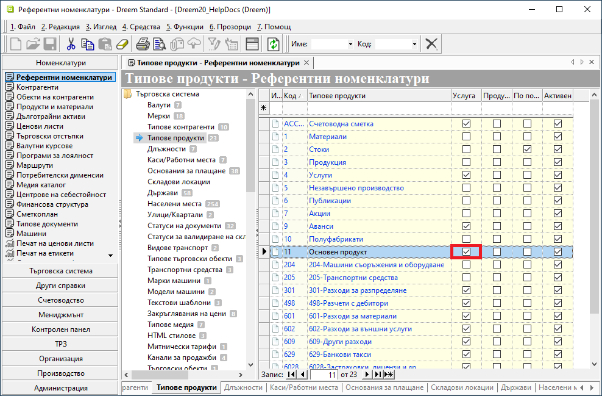
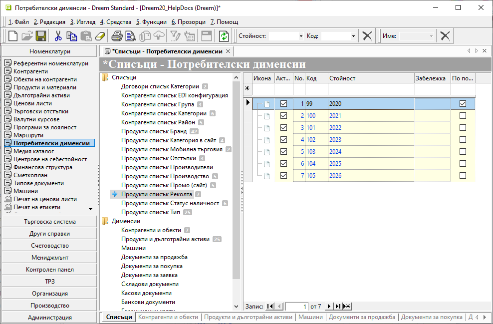
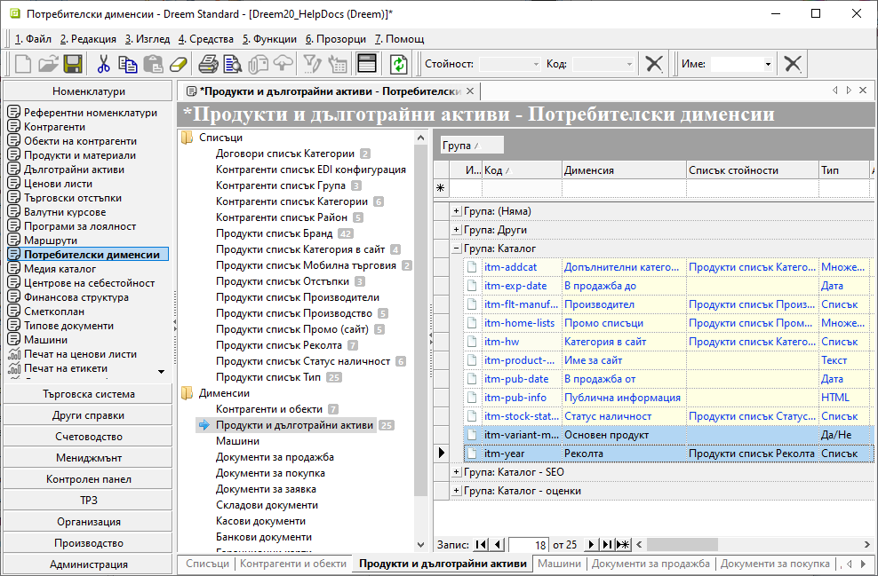
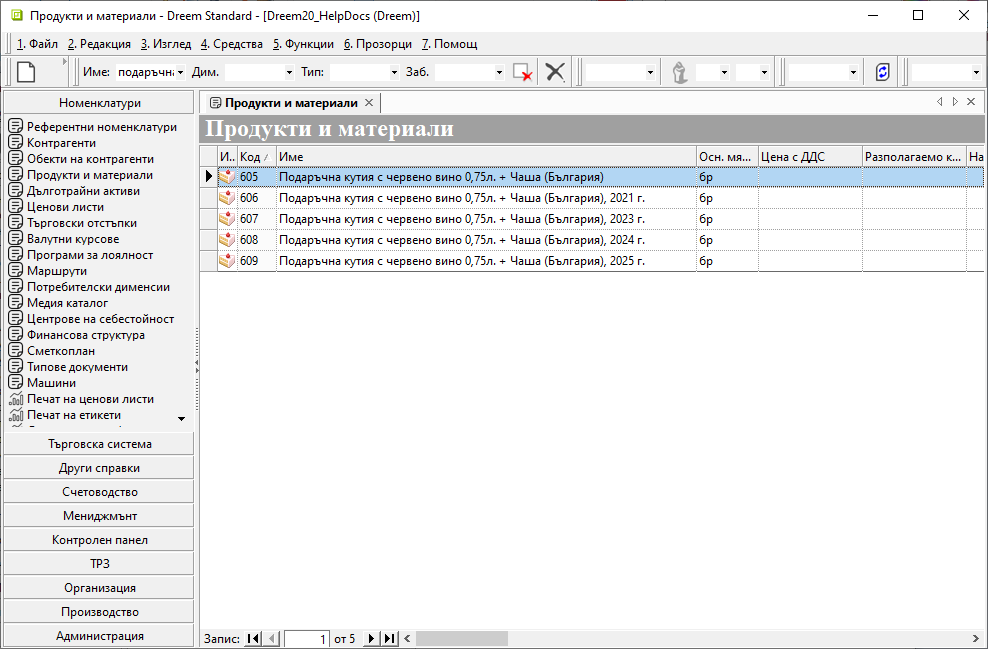
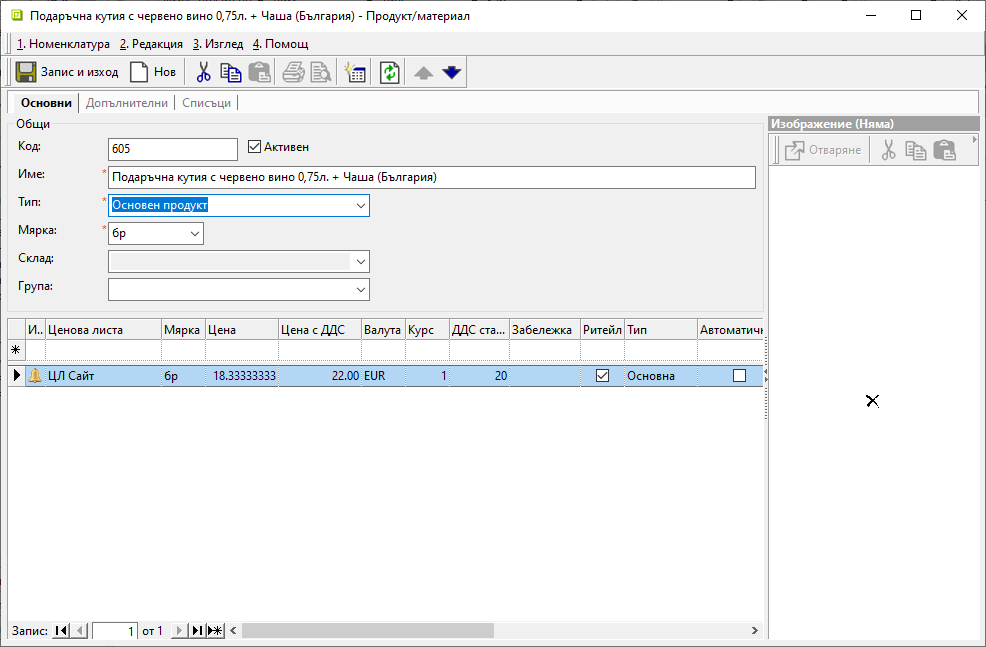
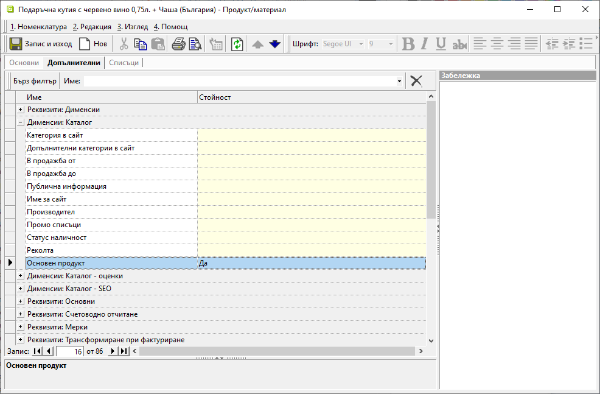
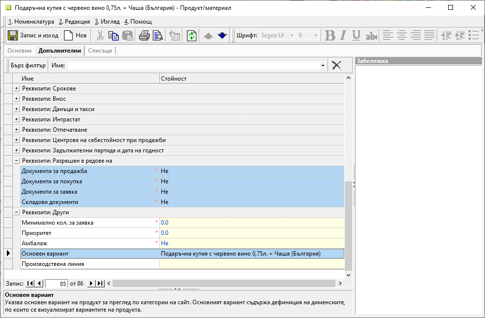
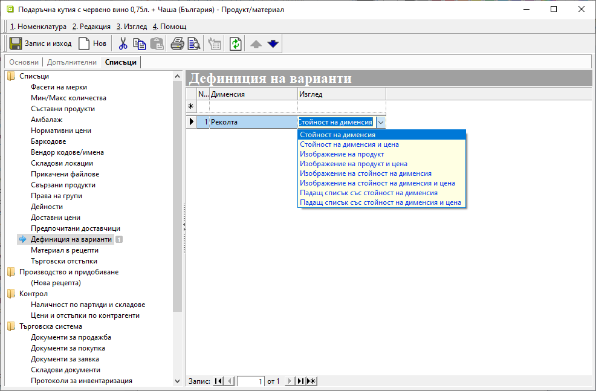
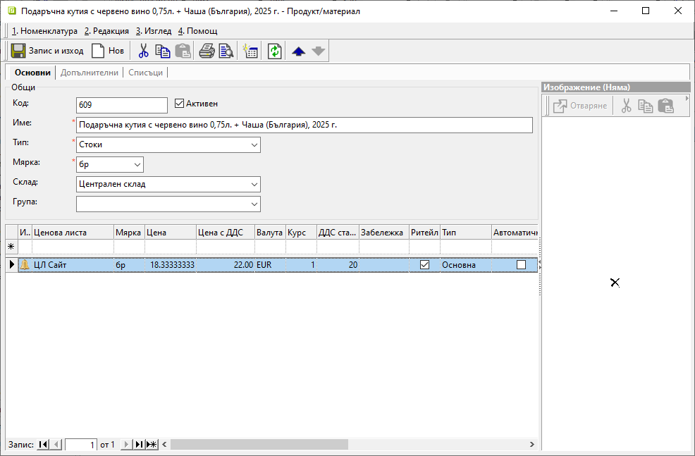
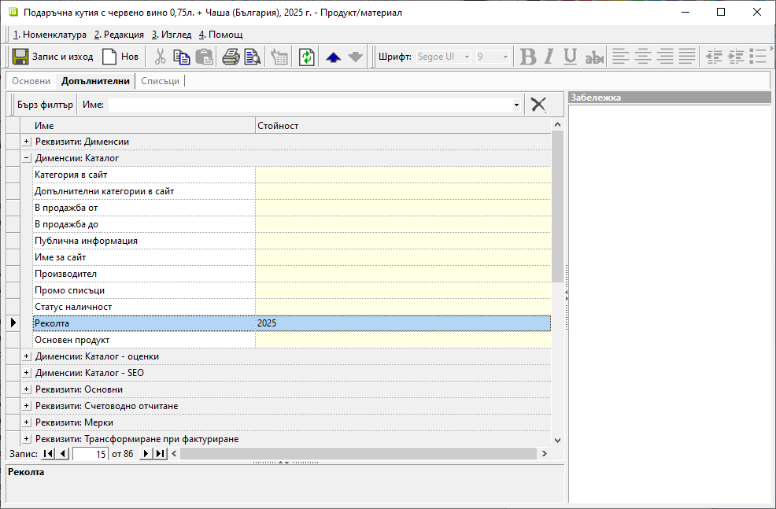

# **Визуализация на продукти в онлайн магазин**  

Системата **Dreem ERP** може да бъде конфигурирана да публикува каталог с продукти в онлайн магазин. Така продуктите се представят и групират по избрани критерии.  
При визуализация на номенклатурата може да се добавят също и различни варианти на продуктите по модел, версия, издание, година и други.   

Настройките се базират на [**Номенклатури » Потребителски дименсии**](../guide/erp/001-ref/001-nomenclatures/010-custom-dimensions.md) и дефиниране на избрани реквизити в [**Номенклатури » Продукти и материали**](../guide/erp/001-ref/001-nomenclatures/003-items.md).   

## **Конфигуриране на варианти**

1. **Типове продукти**

От **Номенклатури » Референтни номенклатури** в секция **Типове продукти** се добавя настройка с тип *Основен продукт*. Той трябва да бъде маркиран като *Услуга*.  

{ class=align-center w=15cm }

2. **Дименсии**  

Необходимите настройки за дефиниране на разновидности за продукти се добавят от **Номенклатури » Потребителски дименсии** в раздел *Списъци*.  
Създава се нов списък с отделен запис за всеки от съществуващите варианти. 

{ class=align-center w=15cm }

В последствие се дефинират допълнителни настройки от раздел *Дименсии: Продукти и дълготрайни активи*.  
За всеки новодобавен списък продукти се добавя ред с име на дименсия от тип *Списък*. Създава се също дименсия *Основен продукт* от тип *Да/Не*.  

{ class=align-center w=15cm }

3. **Продукти** 

Създават се отделни номенклатури за един основен продукт и всички негови разновидности.  

{ class=align-center w=15cm }

В настройките при създаването на продукт-основен се изпълняват следните условия:  
   - Изтрива се реквизит *Склад*.  
   - За *Тип* се избира специално добавеният нов тип продукт.  
   - Добавя се ценова листа, по която продуктът се визуализира на сайта.  

{ class=align-center w=15cm }

От раздел **Допълнителни » Дименсии: Каталог** за продукта се избира опция *Основен продукт: Да*.  

{ class=align-center w=15cm }

Задължително в *Реквизити: Разрешен в редовете на* се маркира опция *Не* за всички типове документи. С това системата не допуска основният продукт да участва при генерацията им.  

От *Реквизити: Други* се указва кой продукт се показва като основен вариант в менюто на електронния магазин.  

{ class=align-center w=15cm }

В последния раздел **Списъци » Дефиниция на варианти** се посочва дименсията, която се отнася към възможните варианти за продукт-основен. Чрез реквизит *Изглед* се дефинира начина, по който вариантите са представени на саайта.    

{ class=align-center w=15cm }

За продуктите-варианти се създават отделни номенклатури. Те се настройват като стандартен тип *Стоки*.  

> Обикновено в наименованието им е включено изписване на конкретната разновидност.  

{ class=align-center w=15cm }

За всеки продукт-вариант се дефинира различна разновидност. За целта в раздел **Допълнителни » Дименсии: Каталог** се определя опция от дименсията, отнасяща се до възможните варианти.  

{ class=align-center w=15cm }

Задължително в *Реквизити: Разрешен в редовете на* се маркира опция *Да* за всички типове документи. С това системата позволява продуктите-варианти да участват в генерацията.  

От *Реквизити: Други* отново се указва кой продукт се показва като основен вариант в менюто на сайта.  

{ class=align-center w=15cm }

> При генериране на фактура за клиента има варианти да фигурира на избраната разновидност (вариант) или наименование на основния продукт. За тази цел може да послужи настройката на *Продукт за фактуриране*.   