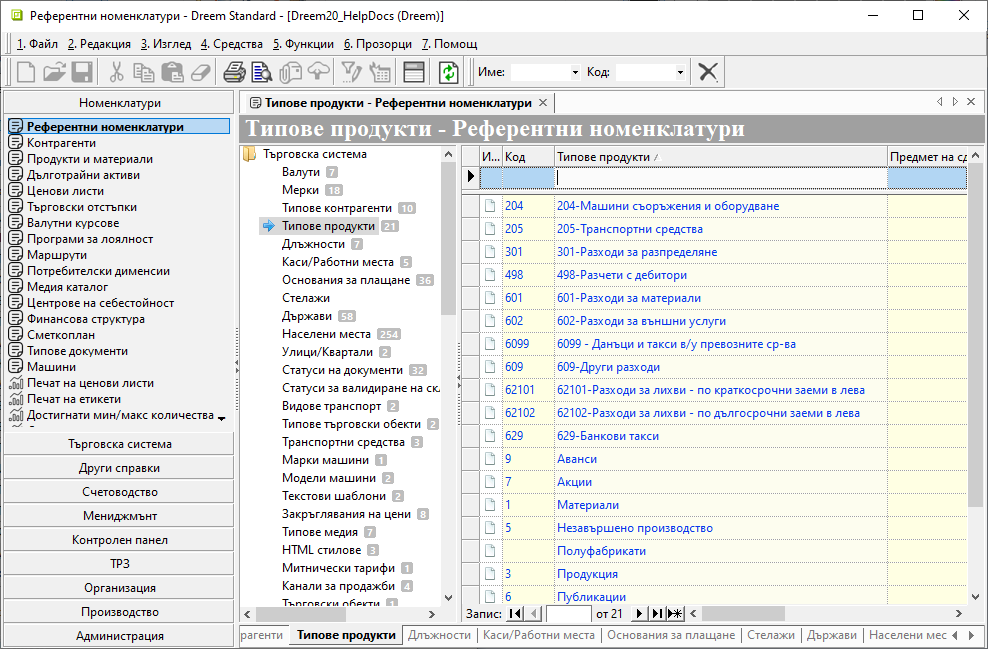

```{only} html
[Нагоре](000-index)
```

# **Референтни номенклатури**

- [Въведение](#въведение)  
- [Нова референтна номенклатура](#нова-референтна-номенклатура)  
- [Реквизити](#реквизити)  

## **Въведение**

**Референтни номенклатури** обединяват всички базови настройки в системата. В последствие те се прилагат при създаването на номенклатури и документи.    

> Голяма част от **Референтни номенклатури** са въведени системно предварително с необходимия минимум за работа на програмата.  

Референтните номенклатури са организирани в секции според функционалността, към която се отнасят:

- [Търговска система](#нова-референтна-номенклатура)  
- [Счетоводство](../002-accounting/001-acc-ref-nom.md)  
- [Интрастат](../002-accounting/001-acc-ref-nom.md)    
- [Дълготрайни активи](../002-accounting/001-acc-ref-nom.md)    
- [ТРЗ](../003-payroll/001-payroll-ref-nom.md)  
- [Организация](#нова-референтна-номенклатура)  

Въпреки наличието на системно конфигурирани номенклатури, някои настройки трябва да се адаптират спрямо дейността на организацията. Това най-често се отнася до: **Мерки**, **Типове контрагенти**, **Типове продукти**, **Длъжности**, **Каси/Работни места**, **Основания за плащане**.  

```{tip}
Нови референтни номенклатури могат да бъдат добавяни по всяко време в съответните списъци.  
Изтриване на номенклатури се позволява единствено, когато те не са били използвани никъде в системата.  
```

## **Нова референтна номенклатура**

Процесът по добавяне на нова референтна номенклатура е следният:  

1) Избира се група функции **Номенклатури » Референтни номенклатури**. Нова референтна номенклатура се добавя от реда за нов запис, стоящ в началото на всеки списък.  

{ class=align-center w=15cm }

2) **Валути** - Въвежда се списък с най-често използваните валути.  
Задължително се попълват международно признатият код (поле **Код**) и съответното наименование (поле **Валути**).  

3) **Мерки** - Въвеждат се видове мерки, свързани с продуктите.  
Задължителни за обзавеждане са съкращенията на мерните единици (поле **Код**) и наименованията им (поле **Мерки**).  

4) **Типове контрагенти** - Оформя се списък с настройки за класифициране на контрагенти. Използва се при настройка на автоматични осчетоводявания и филтри на справки.   
В поле **Типове контрагенти** се попълва наименование. Най-често използваният тип се маркира с **По подразбиране**.    

5) **Типове продукти** - Оформя се списък с настройки за класификация на продукти по тип. Настройката се използва при автоматични осчетоводявания и филтри на справки.  
Желаното наименование се попълва в поле **Типове продукти**. Чрез отметка в поле **Услуга** се указва дали системата да третира продуктите от този тип като услуги.      

6) **Длъжности** - Въвежда се списък с длъжности.  
В последствие те могат да се обвържат с персони в **Kонтрагенти** и **Служители**.  

7) **Каси/Работни места** - Опция за въвеждане на множество каси по типове - *В брой*, *Безналична*, *Регистър*.  

8) **Основания за плащания** - Чрез настройката се дефинират видове основания за плащане. Използва се при създаване на касови ордери, банкови извлечения и автоматични осчетоводявания.  
Наименованията се въвеждат в поле **Основания за плащания**.   

9) **Складови локации** - Дефинира се списък с всички складови локации.  
За нова настройка се попълват наименование (поле **Складови локации**) и склад, към който пренадлежи локацията (поле **Склад**).  

10) **Държави** - Списък с държави може да се попълни чрез въвеждане на съответните наименования в полетата от колона **Държави**.  
В **Код** се въвеждат кратките двубуквени кодове, често използвани в банки, интернет домейни, регистрационни номера и пр. (BG).   
В **Код по ISO** се въвеждат кратките трибуквени кодове, които се ползват в административните системи (BGR).  

11) **Населени места** - Списък с населени места се създава с попълване на съответната информация в полета: **Населени места**, **Пощ. код**, **Община**, **Област** и **Държава**. Задължително от списъка в поле **Тип** се избира вид на населеното място - град, село или друго.     

12) **Улици/Квартали** - Списък с улици и квартали се въвежда с попълване на съответната информация в полета **Улици/Квартали** и **Град/Населено място**.  
Задължително в поле **Тип** от списъка се избира вид на настройката на реда - жилищен комплекс, квартал, улица, булевард или друго.   

13) **Статуси на документи** - Нова статус се добавя в списъка с попълване на наименование в поле **Статуси на документи**.  
В **Група** се посочва към кой вид документи се отнася номенклатурата на реда.  

14) **Статуси за валидиране на складови документи** - Списъкът със статуси за валидиране на складови документи е системно въведен. Модифицирането на номенклатурата не е разрешено.     

15) **Видове транспорт** - Нова настройка се добавя с попълване на наименование в поле **Видове транспорт**. От поле **Транспортна фирма** може да бъде обвързан контрагент, който по подразбиране извършва текущия вид транспорт.  

16) **Типове търговски обекти** - Списък с различни видове търговски обекти.  
Нова номенклатура се добавя с попълване на наименование в поле **Типове търговски обекти**.   

17) **Транспортни средства** - Списък с транспортните средства на организацията.  
За добавяне на ново се попълват пореден номер (поле **Код**) и наименование (**Транспортни средства**).  

18) **Марки машини** - Списък на машините, с които организацията оперира.  
Нова номенклатура се добавя с попълване на полета **Код** и **Марки машини**.     

19) **Модели машини** - Списък с марки/модели, отнасящи се до машините в организацията.  
Нова номенклатура се добавя с попълване на полета **Код** и **Модели машини**.    

20) **Текстови шаблони** - За нов шаблон се попълват желаният код (**Код**), наименованието (**Текстови шаблони**) и вид на шаблона (**Тип**).  
Шаблонният текст се въвежда от формата, която се отваря в поле **Съдържание**.  

21) **Закръгляване на цени** - За номенклатурата има системно въведен списък с настройки за закръгляване. Модифицирането на номенклатурата е разрешено.  
Поле **Код** включва пореден или друг номер. В поле **Закръгляване на цени** се въвежда наименование, кратко описващо метода на закръгляване. В **Посока** се указва дали стойността да бъде закръглена нагоре, надолу или по стандартно правило.  

22) **Типове медия** - Списъкът с типове медия е системно настроен. Номенклатурата се използва при създаване/редактиране на записи в **Медия каталог**.   

23) **HTML стилове** - Настройката за HTML стилове се извършва системно.  

24) **Митнически тарифи** - За добавяне на нова тарифа се попълват поле **Код**, поле **Митнически тарифи** с избрано наименование и поле **Мито ставка**.  

25) **Канали за продажби** - Различни канали на продажба се добавят в списъка с попълване на поле **Код** и наименование в поле **Канали за продажби**.   

26) **Търговски обекти** - Нов обект се добавя в списъка с попълване на **Код** и наименование в **Търговски обекти**.  
За всеки обект може да бъде дефиниран адрес.  

27) **Дейности заявка** - Нов запис се добавя с попълване на поле **Код** и наименование в поле **Дейности заявка**.  
Тази номенклатура се използва за указване на допълнителна информация за извършените дейности по машини.  

28) **Типове превозни средства** - Нов тип се създава с попълване на поле **Код** и наименование в поле **Типове превозни средства**.  

29) **Производствени линии** - Въвежда се списък със съществуващите производствени линии.  
Настройват се пореден номер по ред на въвеждане или др. (поле **Код**) и наименование (поле **Производствени линии**).  

30) **Транспортни единици в производството** - Нова номенклатура се добавя с попълване на поле **Код** и наименование в поле **Транспортни единици в производството**.  
Чрез настройки в **Тегло/тара** и **Палет** за всяка единица се указва тегло и дали е от тип палет.  

31) **Часове на доставка** - Номенклатурата включва списък с възможни часове или интервали на доставка. Прилага се в документите за заявка и продажба.   
Нов час/интервал се настройва с въвеждане на кратко име в поле **Часове на доставка**.     

32) **Дейности** - Нова номенклатура се добавя в списъка с дейности чрез попълване на наименование в поле **Дейности**. Те могат да бъдат разпределени по групи и да получат настройка с разценка в съответните полета.  
Номенклатурата се прилага в **Работни карти**.  
От поле **Продукт за фактуриране** се отваря форма за избор на продукт, който да бъде фактуриран при реализиране на текущата дейност.  

33) **Видове договори** - Номенклатура се използва в **Работни карти**.  
Нова настройка се добавя в списъка с попълване на поле **Код** и наименование в поле **Видове договори**.  

34) **Типове записи** - Номенклатурата се прилага за реквизит **Тип** в **Работни карти**.  
Нова настройка се създава с попълване на поле **Код** и наименование в поле **Типове записи**.  

35) **Запис** - Направените промени трябва да бъдат записани. Това става чрез клавишна комбинация [**Ctrl+S**] или от бутон [**Запис**] в лентата с инструменти.  

## **Реквизити**

- **Икона** - полето съдържа изображение със символ, който варира според състоянието на реда/настройката;  
- **Код** - в полето се попълва код в цифри, букви и/или други знаци;  
- **Допълнителен код** - полето може да се обзаведе с допълнителен код (превод) чрез десен клик на реда и *Преведи*;   
- **Валути** - изписва се наименование на валута;   
- **Допълнително име** - полето може да се обзаведе с допълнително наименование (превод на различни езици) чрез десен клик на реда и *Преведи*;   
- **Фиксиран курс** - в полето може да бъде попълнен фиксиран курс за валутата на текущия ред;  
- **Род** - указва род за валутата от текущия ред - *Мъжки*, *Женски* или *Среден*;  
- **Разделение** - наименование на монетите на валутата, изписано в ед. и мн. число по следния начин: *цент|центове*; 
- **Мерки** - поле с наименование на мерна единица;  
- **Код по EDI** - указва код по EDI за номенклатурата на реда;  
- **Типове контрагенти** - в полето се попълват наименованията на различните типове контрагенти;  
- **Типове продукти** - в полето се попълват наименованията на различните типове продукти;  
- **Предмет на сделката** - предмет на сделката за типа продукти на реда, който се попълва по подразбиране;  
- **Услуга** - указва дали продуктите от избрания тип са услуги;   
- **Продукти като признак във водеща сметка при осчетоводяване** - указва продукт, който се прилага в реквизит **Признак** за водещата сметка;  
- **Длъжности** - поле с наименование за длъжност;  
- **Каси/Работни места** - поле с наименование на касата от текущия ред;  
- **Потребител на продукта** - отваря форма **Контрагенти** за избор на потребителя на продукта;   
- **Подотчетно лице (Служител)** - отваря падащ списък със служители, настроени като активни за избрания потребител на продукта;  
- **Описание** - въвежда се описание, отнасящо се за текущия ред;  
- **Валута** - падащ списък за избор от предварително настроените валути;  
- **Обект потребител** - отваря падащ списък за избор на обект от настроените в **Потребител на продукта**;  
- **Тип каса** - указва тип на касата на реда - *В брой*, *Безналична*, *Регистър*;  
- **Търговски обект** - отваря падащ списък за избор от предварително настроените търговски обекти;  
- **Фискално утсройство** - отваря списък с разпознатите от системата фискални устройства;  
- **Вид плащане на ФУ** - указва вид плащане, което съответства на текущата каса;  
- **Департамент на ФУ** - указва департамент за фискалното устройство на каса;  
- **Номератор за УНП** - указва начален номер на номератора за УНП за касата на реда;  
- **Разрешен печат на ФУ** - настройката разрешава/забранява печат на фискалното устройство;  
- **Печат свързан отчет продажби** - указва печат на свързан отчет за продажби;  
- **Печат на служебно въвеждане/извеждане** - указва дали при служебно въвеждане/извеждане ФУ да отпечата бележка;  
- **Съкратен печат на продажби** - указва съкратен печат за продажби;  
- **Осчетоводяване на КО** - указва начин за осчетоводяване на касовите ордери - *Фискална сума*, *Сума*, *Не се осчетоводява*;    
- **Допълнителна група** - въвеждане се превод за наименование на група чрез десен клик на реда и *Преведи*; 
- **Основания за плащане** - попълва се наименование на основанието за извършване на плащане;  
- **Шаблон за генериране на покупка** - отваря форма за избор на документ за покупка, който да послужи за шаблон при генерация на свързани документи;  
- **Код за връзка с банково извлечение** - системно настроен код, по който банката идентифицира основание за плащане;  
Използва се при импорт на БИ.  
- **Задължителна връзка с покупка** - указва дали системата да изисква връзка с документ за покупка;  
- **Складови локации** - попълва се наименование на складова локация;  
- **Склад** - отваря падащ списък за избор склад;   
- **Код по ISO** - поле с трибуквен код на държава, който се използва в административни системи;  
- **Държави** - поле с наименование на държава;  
- **Държава-членка на ЕС** - указва дали държавата на реда е член на ЕС;  
- **Тип** - отваря падащ списък за избор на тип на номенклатурата на реда;  
- **Населени места** - наименование на населеното място;  
- **Пощ. код** - поле с пощенски код на населеното място на реда;  
- **Община** - попълва се наименование на общината, в която попада населеното място;  
- **Област** - в полето се попълва име на областта, в която попада населеното  място;  
- **Пощенска станция** - указва код на пощенска станция;  
- **Държава** - отваря падащ списък за избор на държава;  
- **В пределите на** - отваря списък за избор на населено място, в пределите на което попада текущото;  
- **Улици/Квартали** - попълва се наименование на улица и/или квартал;  
- **Град/Населено място** - отваря списък за избор на населено място, за което се отнася текущата улица/квартал;  
- **Статуси на документи** - поле с наименование за статус на документ;  
- **Група** - наименование на група, към която се отнася настройката на реда;  
- **Статуси за валидиране на складови документи** - наименование на статус на складов документ;  
Настройката е системна и не е достъпна за редактиране.  
- **Статус** - указва код за статуса на складов документ;  
Настройката е системна и не е достъпна за редактиране.  
- **Видове транспорт** - наименование за вид на транспорта;  
- **Приоритет при генериране на РСД от продажба** - отваря падащ списък с опции за избор на приоритет - *Нисък*, *Нормален*, *Висок*;  
- **Транспортна фирма** - отваря форма за избор на контрагент, който ще е транспортната фирма за вида транспорт на реда;  
- **Транспортни средства** - попълва се наименование на транспортно средство;  
- **Забележка** - поле за въвеждане на свободен текст с допълнение;  
- **Удостоверение за регистрация** - поле с номер/код за удостоверение за регистрация;  
- **Регистрационен номер** - попълва се регистрационен номер за транспортното средтсво на реда;  
- **Марки машини** - поле с наименование на марка на машина;  
- **Модели машини** - поле с наименование на модел на машина;  
- **Текстови шаблони** - поле с наименование на шаблон;  
- **Съдържание** - отваря форма за добавяне на шаблони и попълване на тяхното съдържание;  
- **Закръглявания на цени** - кратко име с описание за настройката на реда;  
- **Посока** - указва посока на закръгляването за настройките на реда;  
- **Кратно** - указва прецизност на закръгляването (напр. до 1, 10, 100 стотинки);  
- **Остатък** - сума на остатък за добавяне/намаляване на цената след прилагане на настройката за закръгляване на реда;  
- **С ДДС** - указва върху кои цени да се прилагат настройките за реда - с или без ДДС;  
- **Митнически тарифи** - поле с наименование на митническата тарифа;  
- **Мито ставка** - поле със ставка за мито на реда;  
- **Канали за продажби** - въвежда се наименование за канал на продажба;  
- **Търговски обекти** - попълва се наименование на търговски обект;  
- **Адрес** - въвежда се адрес на търговския обект на реда;  
- **Дейности заявка** - поле с наименование на дейност, свързана с документи за заявка;  
- **Типове превозни средства** - поле с наименование на тип превозно средство;  
- **Производствени линии** - попълва се наименование на производствена линия;  
- **Транспортни единици в производството** - наименование на транспортна единица;  
- **Тегло/тара** - поле с тегло на транспортната единица (тара);  
- **Палет** - указва дали транспортната единица на реда е палет;  
- **Часове на доставка** - поле с час/интервал за доставка;  
- **Дейности** - поле с наименование на дейност за работни карти;  
- **Разценка** - указва цена - сума при ценообразуване на дейности;  
- **Продукт за фактуриране** - отваря форма за избор на продукт, който отговаря на дейността на реда и участва в документи при фактуриране;  
- **Видове договори** - поле с наименование на вид договори;  
- **Типове записи** - наименование на тип запис за работни карти;  
- **По подразбиране** - указва дали номенклатурата на реда се прилага по подразбиране;   
- **Активен** - чрез поставяне/махане на отметка редът се настройва като активна/неактивна номенклатура;  
- **Идентификатор** - полето се обзавежда с автоматичен идентификационен код и е заключено за редакция;    
- **Потребител създаване** - информация за потребител, добавил текущия ред;  
- **Дата създаване** - дата и час на добавяне на текущия ред;  
- **Потребител последна модификация** - потребителско име на направилия последните корекции в данните на реда;  
- **Дата последна модификация** - информация за дата и час, когато са направени последните изменения в данните на текущия ред;  

