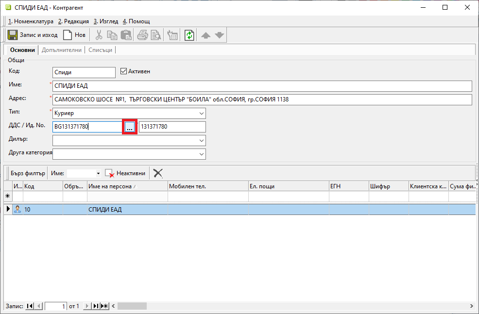

```{only} html
[Нагоре](000-index)
```

# **Контрагенти**

- [Въведение](#въведение)   
- [Създаване на нов контрагент](#създаване-на-нов-контрагент)  
- [Реквизити](#реквизити)  
- [Свързани статии](#свързани-статии)  

## **Въведение**  

За системата **Контрагенти** са всички складове, с които потребителят на продукта работи, всички физически и юридически лица - доставчици, клиенти, консигнатори, куриери, банки, държавни институции и служители.  

> Номенклатурата за доставчици и клиенти е обща. За тяхното разграничаване може да се използват категории в **Потребителски дименсии**.  

## **Създаване на нов контрагент**  

 1) От модул **Номенклатури || Контрагенти**, с десен бутон на мишката върху списъка, се избира **Нов контрагент**. Отваря се празна форма **Контрагент** за въвеждане на данни.  
 Всички задължителни реквизити са маркирани с червен символ.  

  { class=align-center w=15cm }
    
 2) **Импорт по ДДС номер** - Регистрирани по ДДС контрагенти могат да бъдат въведени чрез импорт на данни от сайт на ЕК.  
 Попълва се **ДДС номер** и чрез бутона [**...**] - намиращ се непосредствено до полето, се извършва проверка за валидност.  
 Ако ДДС номерът е валиден, се зарежда форма с данни за организацията. След потвърждение данните ще бъдат автоматично попълнени в необходимите полета.    
 
 3) **Въвеждане ръчно** - Като минимум за създаване на нов контрагент, системата изисква попълване на няколко задължителни полета с валидни данни. Това включва въвеждане на име, адрес, тип на контрагента и ДДС номер/Булстат.  
 Допълнително през реда за нов запис трябва да се добави име или списък с имена на персони, длъжности, данни за контакт и други.  
 Системата изисква поне един от тях да бъде настроен като материално отговорно лице. 

> При настройки на контрагент от тип *Склад* в раздел **Допълнителни** задължително се избира метод за изписване на стоки от склад.  

 4) **Запис и изход** - Записва направените промени и затваря формата за редакция.  
 
## **Реквизити**

1) В раздел **Основни**:  
   - **Код** - в полето се попълва код в цифри, букви и/или други знаци;  
   Системата автоматично обзавежда полето с пореден номер, ако бъде оставено празно.  
   - **Активен** - чрез поставяне/махане на отметка контрагентът се настройва като активна/неактивна номенклатура;  
   - **Име** – наименованието на контрагента е задължително поле;  
   - **Адрес** – попълва се адресa на контрагента (задължително поле);  
   - **Тип** – тип на контрагента е задължително поле.  
   Типовете контрагенти се  въвеждат предварително в системата от **Номенклатури || Референтни номенклатури || Търговска система: Типове контрагенти**.  
   - **ДДС/ Ид. No** – записва се ДДС или идентификационния номер (булстат) номер на контрагента.  
   Реквизитът е задължителен само в случаите, когато контрагентът е данъчно регистриран;  
   - **Дилър** – в полето може да се настрои служител, отговарящ за отношенията с контрагента;  
   - **Група** - избира се към коя предварително въведена категория принадлежи контрагентът;  

   От реда за добавяне на нов запис се въвежда списък с *Персони*.  
   - **Икона** - полето съдържа изображение със символ, варира според състоянието на реда/настройката;  
   - **Код** - в полето се попълва код в цифри, букви и/или други знаци;  
   - **Обръщение** - в полето се въвежда желаното обръщение, което системата да използва за персоната на реда;  
   - **Име на персона** – полето се попълва с имена на персона, която е служител за текущия контрагент;    
   - **Длъжност** - в полето може да се попълни заеманата от лицето длъжност при текущия контрагент;  
   - **Адрес** - адрес за контакт с персоната на реда;  
   - **Мобилен тел.** - мобилен телефонен номер за контакт с персоната на реда;  
   - **Служебен тел.** - служебен телефонен номер за контакт с персоната на реда;  
   - **Домашен тел.** - домашен телефонен номер за контакт с персоната на реда;  
   - **Ел. пощи** - имейл за контакт с персоната на реда;  
    и други;  
   - **Тип получател** - указва вида на имейла, кото получава персоната на реда;  
    Падащият списък дава възможност за избор между: основен получател (To), копие до допълнителен получател (Cc) или скрито копие (Bcc).  
   - **ЕГН** - в полето може да се попълни ЕГН за персоната на реда;  
   - **Шифър** - указва код (букви и/или цифри) на персоната, който заменя подписа при изпращане на данъчни документи по електронен път;  
   - **Клиентска карта** - указва номер на клиентска карта за персоната на реда;  
   - **Сума финансиране** - указва размер на съфинансиране за персоната на реда на дневна база;  
   Реквизитът се използвва при продажби чрез Dreem POS за намаляване сума за плащане с размера на финансирането. Необходими са настройки на клиентска карта.  
   - **Месечна сума финансиране** - указва желания размер на съфинансиране за персоната на реда на месечна база;    
   - **Основание за финансиране** - падащ списък за избор на основание за плащане (напр. *Плащане с електронни талони*);  
   Основанията трябва да бъдат въведени предварително от **Номенклатури || Референтни номенклатури**.  
   - **Остатък финансиране** - показва остатък за усвояване до размера на стойността от реквизит **Сума финансиране**;  
   - **Месечен остатък финансиране** - показва остатък за усвояване до размера на стойността от реквизит **Месечна сума финансиране**;  
   - **Ценова листа** - отваря списък за избор на индивидуална ценова листа за персоната на реда;  
   Списъкът се настройва предварително в **Номенклатури || Ценови листи**.  
   - **Схема ТО** - отваря списък за избор на индивидуална схема с ТО% за персоната на реда;  
   Списъкът се настройва предварително в **Номенклатури || Ценови листи**.  
   - **Забележка** - поле за попълване на свободен текст с уточняваща информация;    
   - **ЦС Структурен** - указва структурен център на себестойност (звено, отдел и пр.), към който се отнася персоната на реда;  
   Списъкът със структурни центрове трябва да бъде въведен предварително от **Номенклатури || Центрове на себестойност**.  
   - **ЦС Обект/Проект** - указва обект или проект, към който се отнася персоната на реда;    
   Списъкът с обекти трябва да бъде въведен предварително от **Номенклатури || Центрове на себестойност**.  
   - **ЦС Други** - отваря падащ списък за избор на друг център на себестойност, към който се отнася персоната на реда;    
   Списъкът трябва да бъде въведен предварително от **Номенклатури || Центрове на себестойност**.  
   - **Свързан служител** - чрез поставяне/махане на отметка персоната на реда се маркира като ;  
   - **Контакт** - указва дали персоната на реда е основното (или по подразбиране) лице за контакт с текущия контрагент;  
   Само една персона може да бъде настроена като *Контакт*.  
   - **МОЛ** - чрез поставяне/махане на отметка персоната на реда се маркира като *МОЛ*;  
   - **Дилър** - чрез поставяне/махане на отметка персоната на реда се маркира като *Дилър*;  
   - **МОЛ по подразбиране** - указва дали персоната на реда е МОЛ, който системата да предлага по подразбиране за контрагента;  
   Само една персона може да бъде настроена като *МОЛ по подразбиране*.     
   - **Дилър по подразбиране** - указва дали персоната на реда е основен дилър, който системата да предлага по подразбиране за контрагента;  
   Само една персона може да бъде настроена като *Дилър по подразбиране*.   
   - **Активен** - чрез поставяне/махане на отметка персоната на реда се маркира като активна или неактивна номенклатура;    
   - **Допълнителен код** - полето може да се обзаведе с допълнителен код чрез десен бутон на реда и *Преведи*;  
   - **Допълнително име** - полето може да се обзаведе с допълнително наименование чрез десен бутон на реда и *Преведи*;  
   - **Потребител създаване** - информация за потребител, добавил текущия ред;  
   - **Дата създаване** - дата и час на добавяне на текущия ред;  
   - **Потребител последна модификация** - потребителско име на направилия последните корекции в данните на реда;  
   - **Дата последна модификация** - информация за дата и час, когато са направени последните изменения в данните на текущия ред;  

2) В раздел **Допълнителни**:  
   **Реквизити: Дименсии**  
    - **Група** - В тази секция се визуализират отделни полета за всички предварително дефинирани дименсии за контрагенти. Настройват се по желание. Използват се за групиране на списък с контрагенти.  

   **Реквизити: Основни**  
    - **Ценова листа** - настройва се индивидуална ценова листа за контрагента, която системата прилага автоматично в продажби;  
    Системата дава възможност за настройка на отделна ценова листа за всяко поделение.  
    - **Схема ТО** - може да се избере схема с търговска отстъпка, която да се прилага винаги за този контрагент;  
    Системата дава възможност за настройка на индивидуални схеми с ТО% по поделения.  
    - **Схема ТО за бонус период** - поле за избор от списък със схеми с ТО%;  
    Използва се за генериране на кредитни известия за цена при начисляване на бонус.  
    - **Телефони** - поле за добавяне на телефонни номера, отнасящи се за текущия контрагент;  
    Използват се при печат на документи за продажби в **Търговска система**.  
    - **Кредитен лимит** - посочва се сума, над която системата прилага различни правила за нотификация или блокиране на нова продажба при надвишен лимит за неплатени документи;  
    - **Просрочени задължения (дни)** -  в полето се указва максималният брой дни в просрочие, за които се допуска издаване на нови продажби и заявки;  
    Използва се при приключване на продажба/заявка, като забранява операцията, ако контрагентът има просрочени задължения над определените дни. При стойност нула не се следи за просрочие.  
    - **Номер на локация (GLN)** - в полето се попълва GLN (Global Location Number) на централен офис на контрагента;  
    Използва се при обмен на документи по система EDI.  
    - **Ветеринарен рег. No.** - реквизит, отнасящ се до *Потребител на продукта* - бивш *ДВСК номер*;  
    Използва се при печат на документи за продажби в **Търговска система**.  

   **Реквизити: Други адреси**  
    - **За кореспонденция** - поле за въвеждане на адрес за кореспонденция;  
    Използва се при печат на гаранционни карти ако не е избрано поделение.  
    - **Факс** - поле за въвеждане на факс номер;  
    - **Ел. пощи** - в полето се попълва имейл за кореспонденция;  
    Въвеждат се фирмени (не персонални) ел. пощи. При изброяване на няколко имейла се разделят с точка и запетая (;).  
    Използва се при изпращане на документи в PDF формат от търговската подсистема.
    Използва се при експорт на отчетни регистри в **Счетоводство**.  
    - **В интернет (URL)** - поле с уеб адрес на текущ контрагент;  
    Използва се при печат на гаранционни карти.  

   **Реквизити: Отложено плащане**  
    - **При продажба (дни)** - брой дни за отложено плащане, с които системата изчислява автоматично дата на падеж в документ за продажба;  
    - **При покупка (дни)** - брой дни за отложено плащане, с които системата изчислява автоматично дата на падеж в документ за покупка;  

   **Реквизити: Склад**  
    - **Метод на изписване от склад** - поле с падащ списък за избор на метод за изписване;  
    Използва се в контрагенти от тип *Склад* и *Консигнатор* се използва при генериране на партиди за разходни складови документи.  
    - **Задължително равнение на количества на продажба със свързаните РСД** - в полето с *Да/Не* се потвърждава/отхвърля проверката при приключване на продажба за задължително равнение между количествата от продажбата и свързаните РСД за съответния склад;  
    - **Задължително валидиране на РСД** -  с настройка *Да/Не* се потвърждава/отхвърля проверката при приключване на РСД за съответния склад документът да е валидиран;  
    - **Задължително равнение на количества на покупка със свързаните ПСД** - с *Да/Не* се потвърждава/отхвърля проверката при приключване на покупка за задължително равнение между количествата от покупката и свързаните ПСД за съответния склад;  
    - **МОЛ по подразбиране** - поле за избор на материално отговорно лице от списък с настроените служители;  
    Настройва се в контрагенти от тип *Склад*. Използва се при създаване на складови документи.  
    - **Счетоводен склад** - настройка, позволяваща създаване на счетоводни документи в текущия склад, която с *Да/Не* се включва/изключва;  
    Настройва се в контрагенти от тип *Склад*. Използва се при генериране на счетоводни складови документи.  

   **Реквизити: Продажби**  
    - **Начин на плащане** - настройва се вид на плащането, което автоматично да се прилага в продажби за този контрагент;  
    - **Данъчен документ** - настройва се данъчен документ (Фактура, Отчет за продажби или др.), който да се генерира при продажби на този контрагент;  
    - **Издател на документи** - 
    При избор на титуляр на продажба/заявка автоматично избира издател на документа, различен от *Потребител на продукта*.  
    - **Контрагент за фактуриране** - в полето може да се настрои различен контрагент, който автоматично заменя текущия при генериране на фактура или кредитно известие от продажби;  
    - **Задължително поделение** - в полето с *Да/Не* се потвърждава/отхвърля проверката за задължително избрано поделение на текущия контрагент при приключване на заявка/продажба;  
    - **Издаване на акцизни фактури** - с *Да/Не* се включва/изключва визуализация на размера на акциза при печат на продажба;  
    - **Валута по подразбиране** - избор на валута, различна от основната за системата, с която автоматично се попълва реквизит *Валута* в продажба или покупка на текущия контрагент;  
    - **Банкова сметка по подразбиране** - избор на банкова сметка от списък с предварително настроените за текущия контрагент, която се попълва автоматично при продажба;  
    - **Основание при продажба по подразбиране** - настройка на индивидуално основание за прилагане при продажба към текущия контрагент;  
    В нов документ за продажба попълва автоматично реквизит *Основание за прилагане*.  
    - **Основание при покупка по подразбиране** - настройка на индивидуално основание за прилагане при покупка от текущия контрагент;  
    В нов документ за покупка попълва автоматично реквизит *Основание за прилагане*.  
    - **Лиценз No.** - поле със свободен текст за въвеждане на лицензен номер;  
    Използва се при печат на документи за продажби в **Търговска система**.  
    - **Лиценз МИ No.** - поле със свободен текст за въвеждане на лицензен номер;  
    Използва се при печат на документи за продажби в **Търговска система**.  

   **Реквизити: Центрове на себестойност при продажби**  
    - **Структурен център на себестойност** - поле за избор на структурен център от предварително настроените в **Номенклатури || Центрове на себестойност**;  
    Използва се за автоматично попълване на центрове на себестойност при продажби.  
    - **Обект/проект** - поле за избор на обект, поект или др. от предварително настроените в **Номенклатури || Центрове на себестойност**;  
    Използва се за автоматично попълване на центрове на себестойност при продажби.  
    - **Друг център на себестойност** - поле за избор на допълнителен структурен център от предварително настроените в **Номенклатури || Центрове на себестойност**;  
    Използва се за автоматично попълване на центрове на себестойност при продажби.  

   **Реквизити: Импорт на банкови извлечения**  
    - **Начална дата** - поле за въвеждане на дата;  
    Указва от коя дата се вземат предвид натрупани вземания и задължения.  
    - **Сортиране по падеж** - избор на критерий за сортиране;  
    При настройка *Да* документите се сортират по дата на падеж.  
    При настройка *Не* сортирането е по дата на издаване.  
    - **Минимален остатък** - въвежда се праг на неплатения остатък;  
    Това е стойността на остатък за плащане, под която системата автоматично пропуска съответните документи.  
    - **Закриване на КИ** - настройка с *Да/Не* за включване/изключване на кредитни известия при закриване на неплатени остатъци.  
    - **Закриване на фактури** - настройка с *Да/Не* за включване/изключване на данъчни документи при закриване на неплатени остатъци.  
    - **Компенсирано закриване** - с *Да/Не* потвърждава/отказва компенсирано закриване на фактури с кредитни известия, които са издадени или с падеж на плащане (според избраната опция за сортиране) на една дата.  
    Компенсиращият документ може да не е посочен в банковото извлечение.  
    - **Лимитирано закриване на документи за покупка** - с *Да/Не* потвърждава/отказва по-консервативно закриване при плащания, инициирани от потребителя. В този случай се закриват само изброените в извлечението покупки. Системата не ескалира закриване на повече документи, дори при остатъчна сума.  
    - **Лимитирано закриване на документи за продажба** - с *Да/Не* потвърждава/отказва по-консервативно закриване при плащания, инициирани от потребителя. В този случай се закриват само изброените в извлечението продажби. Системата не ескалира закриване на повече документи, дори при остатъчна сума.  

   **Реквизити: Транспорт**  
    - **Вид транспорт** - поле с падащ списък за избор на вид на транспорта по подразбиране;  
    Използва се при създаване на нов документ за заявка.  
    - **Транспортна фирма** - поле за избор на транспортна фирма по подразбиране от списък с контрагенти;  
    Използва се за обзавеждане на транспортна фирма при създаване на нов документ за заявка.  

   **Реквизити: Други**  
    - **Отделни настройки печат на док.** - с *Да/Не* потвърждава/отказва индивидуални настройки на шаблони и др. при печат на документи на този контрагент;  
    Може да се активира се при вериги магазини с изисквания за изглед на фактури от доставчиците им - Метро, Билла и др.  
    - **Програма за бонус точки** - избор от предварително настроен списък с програми за лоялност, в която участва този контрагент;  
    Използва се от Dreem POS за натрупване на бонус точки при продажби.  
    Автоматично ескалира схема с търговски отстъпки, която при избрана програма за бонус точки става неактивен реквизит.  
    - **Задължителна проверка на потребител в WebDox** -  с *Да/Не* потвърждава/отказва проверка на потребителя при отваряне на хипервръзка (линк) към документ в WebDox;  

    **Забележка** – поле за свободно въвеждане на текст - коментар, допълнителни особености и пр.;  

3) В раздел **Списъци**:  
    - **Адреси на доставка** - въвеждат се адреси на доставка, които след това може да се обвържат с поделения;  
    - **Банкови сметки** - списък с банкови сметки, предоставени от контрагента;  
    - **Поделения** - списък с всички поделения на контрагента, с които ще се работи;  
    За всяко поделение могат да бъдат настроени индивидуална ценова листа и/или схема с търговска отстъпка.  
    - **Доставни цени** - настройката се отнася до контрагенти, които се явяват доставчици за *Потребител на продукта*;  
    Включва списък с информация за всички доставяни от текущия контрагент продукти - код, баркод, ценова листа, наименование, мярка, цена, валута и др. 
    Системата актуализира списъка автоматично след всяка валидирана покупка. Възможно е и ръчно коригиране на данните. 
    - **Вендор кодове на продукти** - използва се, когато този контрагент изисква видимост на собствени кодове при печат на документи;  
    - **Вендор кодове на контрагенти** - използва се в *Потребител на продукта*;  
    Добавя се списък с контрагенти и техните кодове, с които идентифицират *Потребител на продукта*.
    - **Бонус точки** - списък с натрупани бонус точки по дати и програми за лоялност;  
    Системата актуализира списъка автоматично. Възможно е и ръчно коригиране на данните.  
    - **Мин/Макс количества** - настройката е активна за контрагенти от тип *Склад*;  
    Настройват се минимално и максимално допустимите количества за текущия склад. Използва се при генерация на заявки за дозареждане на склад.  
    - **Дилъри и поделения** - списък със служителите на *Потребител на продукта*, които могат да бъдат настроени като дилъри към конкретно поделение на текущия контрагент;  
    - **Прикачени файлове** - възможност за добавяне на множество прикачени файлове, предварително настроени в **Номенклатури || Медия каталог**;  
    
В групи **Търговска система**, **Счетоводна система** и **Организация** са достъпни всички документи, генерирани в системата, с избрания контрагент.  

## **Свързани статии**

[Как да създадем Контрагент?](https://www.unicontsoft.com/cms/node/12)  
[Как да свържем Ценова листа и Схема с ТО% с контрагент?](https://www.unicontsoft.com/cms/node/67)  
[Как да въведем Падежи на плащания за контрагент?](https://www.unicontsoft.com/cms/node/68)  
[Как да въведем Поделения на контрагент?](https://www.unicontsoft.com/cms/node/69)  
[Как да въведем Кредитен лимит на контрагент?](https://www.unicontsoft.com/cms/node/70)  
[Как да настроим начин на плащане на контрагент?](https://www.unicontsoft.com/cms/node/217)  
[Как да въведем дилър на контрагент?](https://www.unicontsoft.com/cms/node/71)  
[Как да създадем Склад?](https://www.unicontsoft.com/cms/node/96)  
[Как да въведем минимални и максимални количества за склад?](https://www.unicontsoft.com/cms/node/98)  
[Как да въведем банкови сметки на контрагент?](https://www.unicontsoft.com/cms/node/143)  