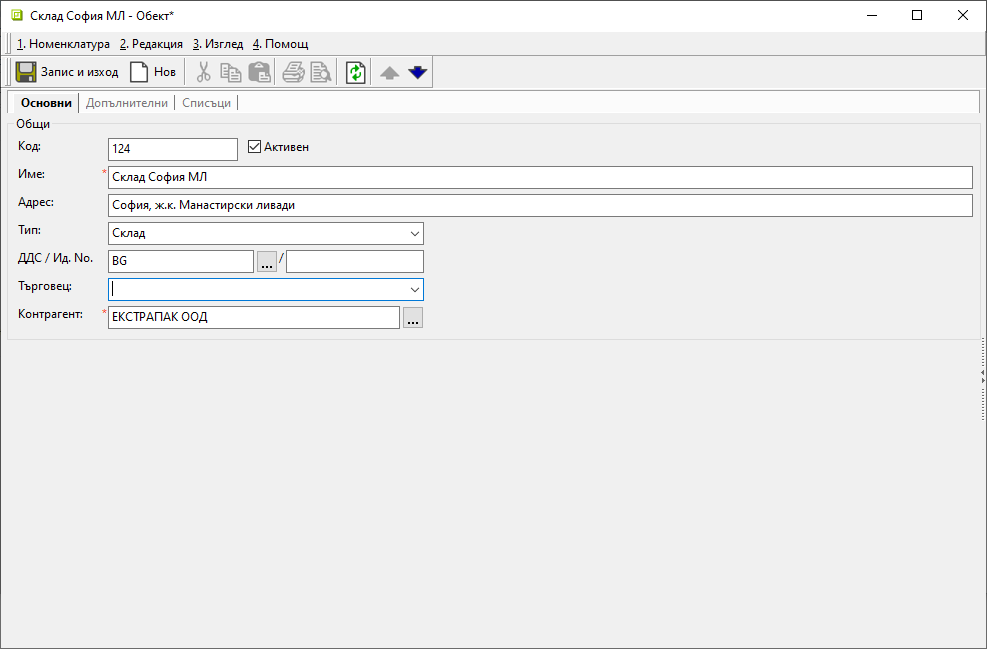

```{only} html
[Нагоре](000-index)
```

# **Обекти на контрагенти**

- [Въведение](#въведение)   
- [Създаване на нов обект](#създаване-на-нов-обект)  
- [Реквизити](#реквизити)  

## **Въведение**  

Всяко подразделение на контрагент може да бъде въведено като негов обект. Това позволява дефиниране на индивидуални ценови листи, отстъпки, отговорен търговец и други характеристики за всяко от тях.  
Системата използва тези параметри при генериране на справки за контрагента.   
  
> Списъците с обекти и адреси на доставка са достъпни също от форма за редакция на контрагент, раздел **Списъци**.  

## **Създаване на нов обект**  

1) Обекти се добавят от меню **Номенклатури » Обекти на контрагенти**. 
Празна форма за въвеждане на данни се отваря с десен бутон на мишката върху списъка и **Нов обект**, с клавишна комбинация [**Ctrl + N**] или от бутона за **Нов** в лентата с инструменти.  

{ class=align-center w=15cm }
    
2) В раздел **Основни** се попълват задължителните полета с  **Име** и **Контрагент**, към който принадлежи обектът. Могат да бъдат добавени и данни за код, адрес и отговорен търговец за обекта.  
Препоръчително е да се посочи **Тип** на обекта - напр. магазин, склад, ресторант, временен обект и други. Опциите за избор се настройват педварително от **Референтни номенклатури**.   

3) В раздели **Допълнителни** и **Списъци** има множество настройки като ценова листа, схема с отстъпки, адрес на доставка, кост центрове, вендор кодове, списъци с издадени за обекта документи и други.    

4) **Запис и изход** - С бутона се записват всички направени промени и се затваря формата за редакция.  
 
## **Реквизити**

1) В раздел **Основни**:  
   - **Код** - в полето може да се попълва код с цифри, букви и/или други знаци;  
   Системата автоматично обзавежда полето с пореден номер, ако бъде оставено празно.  
   - **Активен** - чрез поставяне/махане на отметка обектът се настройва като активна/неактивна номенклатура;  
   - **Име** – поле с наименование на обекта;  
   Реквизиът е задължителен.    
   - **Адрес** – поле с адрес на обект;  
   - **Тип** – отваря списък за избор на тип обект;  
   Типовете се въвеждат предварително в **Номенклатури » Референтни номенклатури » Търговска система: Типове търговски обекти**.    
   - **ДДС/ Ид. No** – записва се ДДС или идентификационния номер (булстат) номер на контрагента.  
   - **Търговец** – отваря списък за избор на служител, отговарящ за отношенията с обекта;  
   - **Контрагент** - отваря форма за избор на контрагент, към който принадлежи обектът;  

2) В раздел **Допълнителни**:  

   **Реквизити: Дименсии**  
    - **Група** - В тази секция се визуализират с отделни редове всички предварително дефинирани дименсии в **Контрагенти и обекти**. Настройват се по желание. Използват се при групиране на списък.  

   **Реквизити: Каталог**  
    - **Клиентски номер за продажба** - номер на контрагент при регистриране на поръчки от каталога;  
    - **Клиентски номер за фактура** - номер на контрагент при регистриране на фактура по поръчка;  

   **Реквизити: Основни**  
    - **Ценова листа** - настройка на индивидуална ценова листа за обекта, която системата прилага автоматично в продажби;  
    - **Схема ТО** - избор на схема с отстъпка, която се прилага винаги за този обект;  
    - **Номер на локация (GLN)** - в полето се попълва GLN (Global Location Number) на обекта;  
    Използва се при обмен на документи по система EDI.  

   **Реквизити: Допълнителни**  
    - **Адрес на доставка** - указва адрес на доставка на обект;  
    - **Подизпълнител** - указва подизпълнител на обекта;  
    - **Телефони** - показва телефонен номер при печат на документи за продажба;  
    - **Факс** - документация на обект - не се използва никъде от системата;  
    - **Ел. пощи** - имейл за изпращане на документи в PDF формат;  
    Съдържа фирмени ел. пощи, разделени с [;].  

   **Реквизити: Продажби**  
    - **Банкова сметка по подразбиране** - указва банкова сметка по подразбиране на обекта;  
    - **МОЛ по подразбиране** - указва МОЛ по подразбиране на обекта;  
    - **Склад** - указва временен склад на обекта;  

   **Реквизити: Транспорт**  
    - **Вид транспорт** - поле с падащ списък за избор на вид на транспорта по подразбиране;  
    Използва се при създаване на нов документ за заявка.  
    - **Транспортна фирма** - поле за избор на транспортна фирма по подразбиране от списък с контрагенти;  
    Използва се за обзавеждане на транспортна фирма при създаване на нов документ за заявка.  
    - **Час на доставка** - указва час на доставка за обекта  

   **Реквизити: Центрове на себестойност при продажби**  
    - **Структурен център на себестойност** - поле за избор на структурен център от предварително настроените в **Номенклатури » Центрове на себестойност**;  
    Използва се за автоматично попълване на центрове на себестойност при продажби.  
    - **Обект/проект** - поле за избор на обект, проект или др. от предварително настроените в **Номенклатури » Центрове на себестойност**;  
    Използва се за автоматично попълване на центрове на себестойност при продажби.  
    - **Друг център на себестойност** - поле за избор на допълнителен структурен център от предварително настроените в **Номенклатури » Центрове на себестойност**;  
    Използва се за автоматично попълване на центрове на себестойност при продажби.  

    **Забележка** – поле за свободно въвеждане на текст - коментар, допълнителни особености и пр.;  

3) В раздел **Списъци**:  

    - **Вендор кодове** - използва се в *Потребител на продукта*;  
    Добавя се списък с контрагенти и техните кодове, с които идентифицират *Потребител на продукта*.  
    - **Прикачени файлове** - възможност за добавяне на множество прикачени файлове, предварително настроени в **Номенклатури » Медия каталог**;  
    
В секции **Търговска система** и **Организация** са достъпни всички документи, генерирани в системата, с избрания обект.  
 