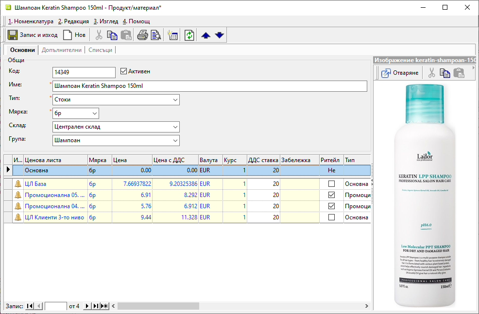

```{only} html
[Нагоре](000-index)
```

# **Продукти и материали**

- [Въведение](https://docs.unicontsoft.com/guide/erp/001-ref/001-nomenclatures/003-items.html#id2)
- [Създаване на нов продукт](https://docs.unicontsoft.com/guide/erp/001-ref/001-nomenclatures/003-items.html#id3)  
- [Реквизити](https://docs.unicontsoft.com/guide/erp/001-ref/001-nomenclatures/003-items.html#id4)  
- [Свързани статии](https://docs.unicontsoft.com/guide/erp/001-ref/001-nomenclatures/003-items.html#id5)  

## **Въведение** 

В номенклатура **Продукти** се включват всички стоки, продукти, материали, услуги и други артикули, с които работите.  
За цялостното функциониране на **Продукти** е необходимо предварително да бъдат настроени свързаните с тях референтни номенклатури - като **Тип**, **Мярка**, **Фасети на мерки**, **Потребителски дименсии** и други.  

## **Създаване на нов продукт**  

1) В меню **Номенклатури || Продукти и материали** с десен бутон на мишката върху списъка с продукти се избира **Нов продукт**.  
Отваря се форма *Продукт/материал* за въвеждане на данни. Задължителните реквизити са маркирани с червен символ.  
 
    { class=align-center w=15cm }

2) Като минимум за създаване на нов продукт, системата изисква попълване на определени полета с валидни данни. Това включва задължително въвеждане на наименование, тип и мерна единица на продукта.  
**Тип на продукта** е референтна номенклатура, свързана пряко с настройките на **Автоматичен осчетоводител**. Спрямо него системата генерира счетоводните записвания по продукт. Чрез типа на продукта се определя дали артикулът е стока, услуга, ДМА или др.  
Мерната единица се настройва, като в общия случай това е най-малката мярка, в която се отчита и се оперира с продукта.  

   > Ако основната мярка на продукт се промени, след като той вече участва във валидирани складови документи, в склада ще има наличности в различни мерни единици.  

   Допълнително през реда за нов запис може да се добави списък с клиентски ценови листи, в които продуктът участва. В списъка могат да се коригират, изтриват и добавят данни с ценови условия.  

3) **Запис и изход** - Записва направените промени и затваря формата за редакция.  

## **Реквизити**  

1) В раздел **Основни**:  
   - **Код** – в полето се попълва код в цифри, букви и/или други знаци;  
   Системата автоматично обзавежда полето с пореден номер, ако бъде оставено празно.  
   - **Активен** - чрез поставяне/махане на отметка продуктът се маркира като активна или неактивна номенклатура;  
   - **Име** – попълва се желаното наименование (задължителен реквизит);  
   - **Тип** – от падащия списък в полето се избира какъв е типът на продукта (задължителна настройка);  
   Списъкът трябва да е предварително настроен в **Номенклатури || Референтни номенклатури**.  
   - **Мярка** – от списък се избира основна мярка на продукта (задължителна настройка), в която системата ще обработва количествата на продукта в складови документи;  
   - **Склад** – избира се склад, който системата третира като склад по подразбиране.  
   - **Група** - от падащ списък с дименсии може да се избере група продукти;  
   Списъкът трябва да е предварително настроен в **Номенклатури || Потребителски дименсии**.  
   - **Ценова листа** - ;
   Нови ценови листи, в които продуктът ще участва, се включват чрез реда за добавяне на нов запис. 
   - **Изображение** - визуализация на изображение от прикачен файл (раздел **Списъци**);

2) В раздел **Допълнителни**:  
   **Реквизити: Дименсии**  
   - **Група** - В тази секция се визуализират отделни полета за всички предварително дефинирани дименсии за продукти. Настройват се по желание, като се избират всички дименсии (категории), към които принадлежи продуктът.  
   Използват се за групиране на списък с продукти.  
   Реквизитите с дименсии са променливи, като зависят от индивидуалните настройки в базата. Достъпни за настройка са предварително настроените списъци с дименсии за продукти, създадени от **Номенклатури || Потребителски дименсии**.  

   **Реквизити: Основни**  
   - **Валута по подразбиране** – поле за избор на валута от предварително въведен списък;  
   Използва се при въвеждани на ценови листи или при избор на продукт/материал в редовете на документ, за който няма цена по ценова листа.  
   - **Продажна мярка** - поле за избор на мерна единица от предварително въведен списък;  
   Използва се при избор на продукт/материал в редовете на документи за продажба и документи за заявка.  
   - **Допълнителна мярка** - поле за настройка на допълнителна мярка, в която се визуализират количества и цени;  
   Използва се при печат на складови документи, на ценови листи и на етикети на продукт/материал.  
   - **Ценообразуване при заприходяване в склада** - поле за избор на метод на ценообразуване на съставните продукти, от които е съставен текущият (комплексният) продукт.  
   Използва се при разпадане на комплексен продукт при генериране на складов документ от покупка/продажба.  

   **Реквизити: Счетоводно отчитане**
   - **По признаци** – при настройка *Да* този продукт автоматично се прехвърля в списъка със счетоводни признаци;
   - **По количество** – при настройка *Да* счетоводното отчитане на продукта е по количество;  

   **Реквизити: Мерки**  
   - **Нето тегло - кг** - попълва се стойност на нето тегло за продукта в килограми;  
   Използва се при ценообразуване при генериране на складов документ от покупка/продажба и при Интрастат.  
   Свързан е с реквизит *Ценообразуване при заприходяване в склада*.  
   - **Бруто тегло - кг** - попълва се стойност на бруто тегло за продукта в килограми;  
   Използва се при калкулиране на колона *Бруто тегло* в редове на документи от **Търговска система** и при печат на документи за заявка.  
   - **Нето обем - л** - попълва се стойност на нето обем за продукта в литри;  
   Използва се при ценообразуване при генериране на складов документ от покупка/продажба.   
   Свързан е с реквизит *Ценообразуване при заприходяване в склада*.  
   - **Бруто обем - л** - попълва се стойност на бруто обем за продукта в литри;  
   Използва се при калкулиране на колона *Бруто обем* в редове на документи от **Търговска система** и при печат на документи за заявка.  
   - **Прецизност в осн. мярка** - настройка на автоматично закръгляване на колона *Количество* в осн. мярка до указания брой знаци след десетична запетая;  
   Използва се в редовете на документи за продажба и за заявка.  
   - **Прецизност крайна цена с ДДС** - настройка за автоматично закръгляване на колона *Крайна цена с ТО и ДДС* до указания брой знаци след десетична запетая;  
   Използва се в редовете на документ за продажба и документ за заявка.  
   - **Прецизност крайна цена с TO%** - настройка на автоматично закръгляване на колона *Крайна цена с ТО* до указания брой знаци след десетична запетая;  
   Използва се в редовете на документ за продажба.  

   **Реквизити: Трансформиране при фактуриране**  
   - **Продукт** - избор на събирателен продукт за трансформация при фактуриране на продажби;  
   Настройката е за счетоводни цели. Използва се при генериране на фактура от продажба за подмяна на няколко продукта в редовете към един събирателен продукт във фактурата.  
   - **Мярка** - избор на мерна единица за събирателен продукт за трансформация;  
   Използва се при генериране на фактура от продажба при подмяна на продукт за да укаже мярката на реда на фактурата.  
   - **Счетоводен продукт** - избор на събирателен продукт за трансформация при осчетоводяване на фактури;   
   Използва се при генерация на счетоводен запис на фактура, като подменя няколко продукта от редовете към един събирателен продукт в счетоводния документ.  

   **Реквизити: Нормативна цена**  
   - **Използва за заприходяване в склад** - с *Да/Не* се включва/изключва използването на нормативната цена на продукта;  
   Използва се при избор на продукт/материал в редовете на складов документ и при генерация на ПСД от покупка.  
   - **Цена по подразбиране** - избор на цена по подразбиране, която служи за определяне на цена на придобиване на продукт/материал;  
   Използва се при избор на продукт/материал в редовете на складов документ и при генерация на ПСД от покупка.  

   **Реквизити: Срокове**  
   - **Гаранционен срок** - поле с размер на гаранционния срок според настроената *Мярка на гаранционен срок*;  
   Използва се за атрибут *Гаранционен срок* при печат на етикет за крайни клиенти от меню **Номенклатури || Печат етикети**.  
   - **Мярка на гаранционен срок** - избор на мерна единица на реквизит *Гаранционен срок*;  
   Използва се при печат на етикет за крайни клиенти от меню **Номенклатури || Печат етикети**.  
   - **Срок на годност** - обзавежда атрибут *Срок на годност* при печат на етикет за крайни клиенти от меню **Номенклатури || Печат етикети**.  
   - **Мярка на срок на годност** - избор на мярка на атрибут *Срок на годност* при печат на етикет за крайни клиенти от меню **Номенклатури || Печат етикети**.  

   **Реквизити: Внос**  
   - **Производител** - избор на производител за текущия продукт от списък **Контрагенти**;  
   Използва се в редовете на документ за продажба и за атрибут *Производител* при печат на етикет за крайни клиенти от меню **Номенклатури || Печат етикети**.  
   - **Вносител** - избор на вносител за текущия продукт от списък **Контрагенти**;  
   Използва се за информация за вносител при печат на етикет за крайни клиенти от меню **Номенклатури || Печат етикети**.  

   **Реквизити: Данъци и такси**  
   - **Данъчна група** - избор на данъчна група от предварително настроен списък - А, Б, В или Г;  
   Използва се при отпечатване на касова бележка на фискален принтер за атрибут *ДДС група* в редовете.  
   - **ДДС ставка** - полето се обзавежда автоматично с настроената ставка след избор на реквизит *Данъчна група*;  
   Използва се при въвеждане на ценови листи за калкулация на колона *Цена с ДДС*.  
   - **Акциз за осн. мярка** - в полето се попълва стойност на акциз за текущ продукт;  
   Използва се за стойност по подразбиране на колона *Акциз за осн. мярка* при въвеждане на акциз на партиди в покупки и приход в склада.  
   - **Еко такса** - попълва се при наличие на еко такса;  
   Използва се само за документация на продукт/материал. Не се използва никъде от системата.  
   - **Митническа тарифа** - поле за избор от предварително настроен списък с митнически тарифи;  
   Използва се при ценообразуване с включени транспортни разходи.  
   - **Разрешено включване ДДС в цената** - с *Да/Не* се позволява/отказва включване на ДДС в цената за текущия продукт;  
   Използва се в редове на продажба, за да определи дали е разрешено включване на колона *ДДС вкл. в цената*.  
   При настройка *Да* продуктът не участва при генериране на фактура. При настройка *Не* продуктът задължително се фактурира.   

   **Реквизити: Интрастат**  
   - **Интрастат код** - въвежда се код, който се използва при Дневници и декларации за Интрастат.  
   - **Интрастат допълнителна мярка** - избор на допълнителна мярка за Интрастат;  
   Използва се при създаване и печат на Дневници и декларации за Интрастат. Не всички продукти имат допълнителна мярка.  

   **Реквизити: Отпечатване**  
   - **Отпечатване само на обща стойност** - с *Да/Не* указва дали при печат на документи за продажба се визуализира само общата стойност за продукта;  
   Обикновено се използва за отпечатване на търговски отстъпки.  
   - **Партида по подразбиране** - въвеждане на постоянна партида за текущия продукт;  
   Използва се при печат на продажба/фактура за колона *Партида*, ако на реда в документа не е указана партида.   
   - **Клас по подразбиране** - поле за въвеждане в свободен текст на клас по подразбиране за текущия продукт;  
   Използва се при печат на ценови оферти и при печат на продажби за колона *Клас*, ако на реда на документа не е указан.  
   - **Експлоатационна информация** - избор на шаблон с въведен текст, касаещ експлоатацията на текущия продукт;  
   Използва се при печат на етикет за крайни клиенти от меню **Номенклатури || Печат етикети**.  
   - **Текст на етикет** - избор на шаблон с въведена информация за текущия продукт, която се печата на етикет;  
   Използва се при печат на етикети за стелажи от функционалност Печат на етикети в меню **Номенклатури || Печат етикети**.  
   - **Описание** - поле за попълване на текст с особености и изисквания към продукта/материала;  
   - **Сорт** - информация за сорт на текущия продукт, която се използва при печат на ценови оферти.  
   - **Калибър** - информация за калибър на текущия продукт, която се използва при печат на ценови оферти.  
   - **Произход** - информация за произход на текущия продукт, която се използва при печат на ценови оферти.  
   - **Опаковка** - информация за опаковка на текущия продукт, която се използва при печат на ценови оферти.  
   - **Разрешително** - поле за въвеждане на номер на Разрешително;  
   Използва се при печат на продажба/фактура.  
   - **Концентрация** - поле за въвеждане на концентрация за текущ продукт;  
   Използва се при печат на продажба/фактура. 
   - **Пределна цена с ДДС** - стойност на пределна цена, която се визуализира за текущия продукт при печат на продажба/фактура.  
   - **Ценова група** - въвеждане на ценовата група, която се визуализира за текущия продукт при печат на продажба/фактура.  

   **Реквизити: Центрове на себестойност при продажби**  
   - **Структурен център на себестойност** - отваря форма за избор на структурен център, към който се отнася този продукт;  
   Използва се за автоматично попълване на центрове на себестойност при продажби.  
   - **Обект/проект** - отваря форма за избор на обект/проект, към който се отнася този продукт;  
   Използва се за автоматично попълване на центрове на себестойност при продажби.  
   - **Друг център на себестойност** - отваря форма за избор на допълнителен структурен център, към който се отнася този продукт;  
   Използва се за автоматично попълване на центрове на себестойност при продажби.  
   - **Направление** - отваря предварително настроен списък за избор на направление, към който се отнася този продукт;  
   Използва се за автоматично попълване на центрове на себестойност при продажби.  

   **Реквизити: Задължителни партида и дата на годност**  
   - **Документи за продажба** - настройка на проверка за въведена стойност в колони *Партида* и *Дата на годност* при приключване на документи за продажба в **Търговска система**.   
   - **Документи за покупка** - настройка на проверка за въведена стойност в колони *Партида* и *Дата на годност* при приключване на документи за покупка в **Търговска система**.   
   - **Складови документи** - настройка на проверка за въведена стойност в колони *Партида* и *Дата на годност* при приключване на складови документи в **Търговска система**.  

   **Реквизити: Разрешен в редове на**  
   - **Документи за продажба** - с *Да/Не* се включва/изключва проверка дали продуктът може да участва в основните видове документи;   
   Прилага се при приключване на документи за продажба в **Търговска система**.  
   - **Документи за покупка** - с *Да/Не* се включва/изключва проверка дали продуктът може да участва в основните видове документи;   
   Прилага се при приключване на документи за покупка в **Търговска система**.  
   - **Документи за заявка** - с *Да/Не* се включва/изключва проверка дали продуктът може да участва в основните видове документи;   
   Прилага се при приключване на документи за заявка в **Търговска система**.  
   - **Складови документи** - с *Да/Не* се включва/изключва проверка дали продуктът може да участва в основните видове документи;   
   Прилага се при приключване на складови документи за инвентаризация в **Търговска система**.  

   **Реквизити: Други**  
   - **Минимално кол. за заявка** - минимален праг на заявените количества към доставчик;  
   Използва се в редове на документ за заявка към доставчик и справка **Номенклатури || Достигнати мин/макс количества по складове** за стойности на колона *Минимално кол. за заявка*.  
   - **Приоритет** - обзавежда атрибут *Приоритет* при **Печат на етикети** в **Номенклатури**;  
   - **Амбалаж** - с *Да/Не* потвърждава/ отказва дали системата трябва да третира текущия продукт като амбалаж;   
   Указва дали продуктът да участва в редовете при генериране на **Депозитни разписки**.  
   - **Основен вариант** - отваря форма за избор на продукт, който е основен вариант на текущия при преглед по категории на сайт;  
   Основният вариант съдържа дефиниция на дименсиите, по които се визуализират вариантите на продукта.  

   **Забележка** – поле за свободно въвеждане на текст - коментар, допълнителни характеристики и пр.;  

3) В раздел **Списъци**:  

   **Списъци**
   - **Фасети на мерки** - настройват се съотношения между основната мерна единица на продукта и всички останали мерни единици, които ще се прилагат за него в системата;
   - **Мин/Макс количества** - настройват се минимално и/или максимално допустими количества за продукта в един или няколко склада;
   - **Съставни продукти** - опция за създаване на списък с продукти и количества, от които текущият продукт е съставен;  
   - **Амбалаж** - дефиниране на продукти с количества, настроени като *Амбалаж* за текущия продукт;  
   - **Нормативни цени** - настройка за базови цени по доставчици;  
   - **Баркодове** - въвеждат се наличните баркодове отделно за всяка мерна единица;  
   - **Вендор кодове/имена** - настройка с код и/или име на продукта, с които продуктът се идентифицира при клиент/доставчик;  
   - **Местонахождение по стелажи** - указва разположение по стелажи за текущ продукт;  
   - **Прикачени файлове** - добавяне на файлове с различен формат, съдържащи например изображения, инструкции, гаранционни условия и др.;  
   - **Свързани продукти** - дефиниране на подобни продукти и на продукти, които се продават заедно;  
   - **Права на групи** - дефиниране на права по групи за достъп до доставни цени за текущ продукт;  
   - **Дейности** - дефиниране на процеси и дейности, към които може да се отнася текущият продукт;  
   - **Доставни цени** - списък с цени от последно реализираните покупки по доставчици;  
   - **Предпочитани доставчици** - списък с основните/предпочитаните доставчици, стойности на минимално количество и стъпка за заявка;  
   - **Дефиниция на варианти** - ;  
   - **Материал в рецепти** - списък с рецепти, в които текущият продукт участва като материал;  
   - **Търговски отстъпки** - конфигуриране на списък с настройки за схеми с търговски отстъпки;    
   
   **Производство и придобиване**
   - **(Нова рецепта)** - функция за създаване на една или множество рецепти за продукта;  
   

В групи **Контрол**, **Търговска система**, **Счетоводна система**, **Организация** и **Производство** са достъпни всички генерирани в системата документи, включващи избрания продукт.

## **Свързани статии**

- [Как да създадем Продукт?](https://www.unicontsoft.com/cms/node/13)  
- [Как да настроим Тип на продукт?](https://www.unicontsoft.com/cms/node/104)  
- [Как да настроим Склад по подразбиране?](https://www.unicontsoft.com/cms/node/103)  
- [Как да създадем продукт тип Услуга?](https://www.unicontsoft.com/cms/node/99)  
- [Как да въведем различни Мерки и отношения между тях?](https://www.unicontsoft.com/cms/node/101)  
- [Как да въведем Минимални и максимални количества за продукт по складове?](https://www.unicontsoft.com/cms/node/218)  
- [Как да въведем Баркодове?](https://www.unicontsoft.com/cms/node/102)  
- [Как да въведем Гаранционен срок?](https://www.unicontsoft.com/cms/node/113)  
- [Как да въведем настройка за Трансформация на продукт при фактуриране?](https://www.unicontsoft.com/cms/node/105)  
- [Как да въведем настройка за Амбалаж?](https://www.unicontsoft.com/cms/node/187)  