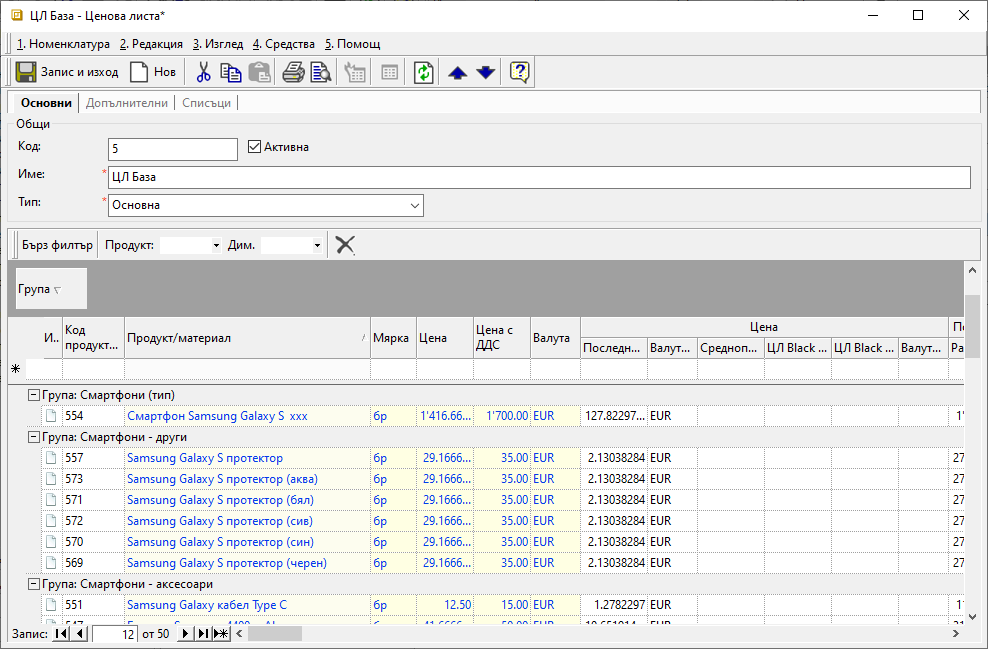
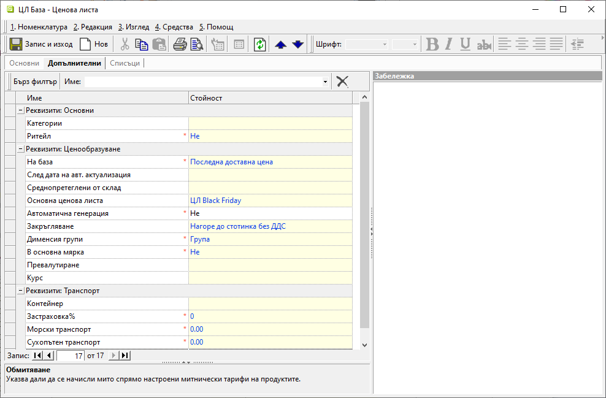
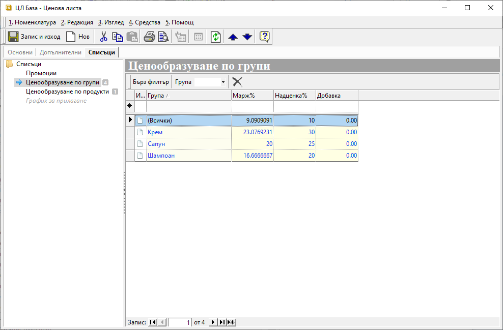

```{only} html
[Нагоре](000-index)
```

# **Ценови листи**

- [Въведение](#въведение)   
- [Създаване на нова ценова листа](#създаване-на-нова-ценова-листа)  
- [Реквизити](#реквизити)  
- [Свързани статии](#свързани-статии)

## **Въведение**  

Ценовите листи представляват шаблони с цени за избрани продукти, които се прилагат в документи за покупка и продажба. Системата автоматично въвежда цената и изчислява задължението по съответния документ. Такъв шаблон (Ценова листа) може да бъде настроен към всеки контрагент, така че при продажба системата автоматично да прилага цени.

Системата позволява настройка и прилагане и на валутни ценови листи. Стъпките в процеса на създаване на такава ЦЛ са същите, като единствената особеност е различните валута и курс.

Ценовите листи са разделени на:

**Доставни ценови листи** се водят автоматично от системата - тя запазва последната доставна цена след всяка валидирана покупка по контрагент.

**Клиентски ценови листи** трябва да бъдат настроени, за да може системата автоматично да предлага цени в продажбата при избор на контрагент. 

## **Създаване на нова ценова листа**

1) За създаване на нова **Ценова листа** се избира група функции **Номенклатури || Ценови листи**. 
Чрез десен бутон на мишката върху списъка вдясно се избира **Нова ценова листа**. Отваря се форма **Ценова листа** за въвеждане на данни.  

2) В раздел **Основни** се настройват задължителните реквизити с име и тип на ценовата листа.  
От реда за нов запис се въвежда списък с продукти, които да участват в текущата ценова листа. Жълто оцветените полета се попълват със задължителният минимум от информация за настройка на ЦЛ:  
    - **Продукт/Материал** - В полетата от тази колона може ръчно да се въведат продукти и материали. 
    - **Мярка** - За всеки продукт се определя за каква мерна единица се отнася цената на реда.  

    > В една ценова листа избран продукт може да участва повече от веднъж, но с различни мерни единици.  

    - **Цена**/**Цена с ДДС** - В полетата се попълват съответно единични цени без и с ДДС. След въвеждане на една от двете цени системата автоматично калкулира другата.  

    { class=align-center w=15cm }

3) В раздел **Допълнителни** са включени реквизити, свързани с автоматичното ценообразуване, както и специфични настройки при транспорт - обмитяване, застарховка и др.  
Задължителните настройки са маркирани с червен символ. Системата е обзавела тези полета със стойности по подразбиране.    
    - **Ритейл** - указва кои цени - с или без ДДС, да са водещи при формиране на тотали в документите за продажба (задължителна настройка);
    - **На база** – в полето се избира метод на ценообразуване и спрямо него в последствие се изисква настройка на различни реквизити;
    - **След дата на авт. актуализация** - полето се настройва при база *Последни доставни цени*, като задава начална дата за филтър на покупки, от които се актуализира последна доставна цена.  
    - **Среднопретеглени от склад** - настройка при база *Среднопретеглени цени*, с която се указва склад, от който се взимат среднопретеглените цени.
    - **Основна ценова листа** - полето се попълва при база *Основна ценова листа*, като се избира родителска ценова листа, от която се взимат базовите цени.  
    - **Автоматична генерация** - опция, която се активира, когато в списъка в раздел Основни няма записи; 
    Разрешава или забранява автоматичната генерация на цени при модификация на родителска ценовата листа, при приключване на складови документи или покупка.  
    - **Закръгляване** - поле за избор на начин на закръгляване на цени от Референтни номенклатури | Закръглявания на цени, което се използва при ръчно или автоматично ценообразуване.  
    - **Дименсия групи** - поле за избор на дименсия, по която да се настройва *Ценообразуване по групи* в раздел **Списъци**.
    - **Превалутиране в лв.** - разрешава или забранява конвертиране на валутни цени (от покупки) в национална валута при ценообразуване.  

    { class=align-center w=15cm }

4) В раздел **Списъци** могат да се настройват **Промоции**. Това са отделни ценови листи, които се прилагат с ограничена валидност.   
Промоционалните ЦЛ трябва предварително да са въведени като самостоятелни ценови листи. 

    От **Списъци** са достъпни също настройки за ценообразуване по групи и по продукти, които се прилагат при генериране на нови цени. Те включват дефиниране на различни *Марж %*, *Надценка* и/или *Добавка*.  
    - **Ценообразуване по групи** - Дефинира се списък с групи, за които могат да се настроят различни марж, надценка и/или добавка.   
    - **Ценообразуване по продукти** - Може да се въведе списък с продукти, за които ще има различни марж, надценка и/или добавка от настроените за групите, в които попадат.  

    { class=align-center w=15cm }  

> Ако за един продукт са дефинирани **Марж**, **Надценка** и/или **Добавка**, различни за него и групата, към която принадлежи, с по–голяма тежест винаги е настройката по продукт.

5) **Запис и Изход** — бутон в лентата с инструменти. Съхранява въведените настройки и излиза от формата.  

## **Реквизити**

1) В раздел **Основни**:  
   - **Код** – в полето може да се попълни код в цифри, букви и/или други знаци;  
   Системата автоматично обзавежда полето с пореден номер, ако бъде оставено празно.  
   - **Активен** - чрез поставяне/махане на отметка ценовата листа се маркира като активна или неактивна номенклатура;  
   - **Име** – в свободен текст се изписва наименование на ценовата листа;  
   - **Тип** - падащ списък за избор на тип на ценовата листа;  
   Списъкът е системно настроен и не подлежи на корекция от потребителите.  
   - **Продукт/материал** - поле за избор от списък с продукти и материали;    
   - **Мярка** - поле за избор на мерна единица;  
   - **Цена** - поле за единична цена без ДДС в избраната валута по ЦЛ;  
   - **Цена с ДДС** - поле за единична цена с ДДС в избраната валута по ЦЛ;    

2) В раздел **Допълнителни**  
   **Реквизити: Основни**  
   - **Категории** - използва се за ограничаване на достъп до ценови листи по категории;  
   - **Ритейл** - в полето с *Да/Не* се указва дали цени с ДДС са водещи при формиране на тотали в документите за продажба;  

   **Реквизити: Ценообразуване**  
   - **На база** – избор на метод за ценообразуване;  
   Указва начин на ръчно или автоматично ценообразуване.  
   - **След дата на авт. актуализация** - полето се настройва при база *Последни доставни цени* с начална дата за филтър на покупки, от които да се актуализира последна доставна цена;  
   Ако не е указана дата, се взимат всички доставни цени.  
   - **Среднопретеглени от склад** - избор на склад, от който се взимат среднопретеглени цени;  
   Настройката се прилага при избрана база *Среднопретеглени цени*.  
   - **Основна ценова листа** - полето за избор на родителска ценова листа, от която се взимат базовите цени;  
   Попълва се при избрана база *Основна ценова листа*.   
   - **Автоматична генерация** - с *Да/Не* се разрешава/забранява автоматична генерация на цени при модификация на родителската ценова листа, приключване на покупки или складови документи;
   Опцията се активира, когато в списъка от раздел *Основни* няма записи.   
   - **Закръгляване** - падащ списък за избор на начин за закръгляване на цени при ръчно или автоматично ценообразуване;  
   Списъкът се дефинира предварително от **Референтни номенклатури || Закръглявания на цени**.  
   - **Дименсия групи** - поле за избор от списък с дименсии;  
   Указва дименсия, по която се настройва *Ценообразуване по групи* в раздел *Списъци*.   
   - **В основна мярка** - с *Да/Не* се указва дали при ценообразуване да се генерират цени в основна мярка;  
   - **Превалутиране в лв.** - с *Да/Не* се указва дали да се генерират цени в избраната валута при ценообразуване.  
   - **Курс** - попълва се курс при генериране на цени във валута;  

   **Реквизити: Транспорт**  
   - **Контейнер** - падащ списък за избор на мярка на контейнер;  
   За избраната мярка трябва да има настроени фасети на продуктите, за които ще се разпределят транспортни разходи.  
   - **Застраховка%** - в полето се попълва процент застраховка спрямо FOB цена;  
   - **Морски транспорт** - поле с цена на морски транспорт (ocean freight) за контейнер;  
   - **Сухопътен транспорт** - поле с цена на сухопътен транспорт (land transport) за контейнер;  
   - **Обмитяване** - с *Да/Не* указва дали да се начисли мито спрямо настроени митнически тарифи на продуктите;  

3) В раздел **Списъци**:  
   **Списъци**  
   - **Промоции** - Добавяне на готови ценови листи с намаления и ограничена валидност;    
   - **Ценообразуване по групи** - От списъка вдясно се избират групи с отстъпка, като се обзавеждат колони:   
        - *Група* - избор на дименсия;  
        Отстъпката може да се настрои общо за всички или за отделни групи продукти.  
        - *Марж %* - попълва се стойност на желания процент марж;  
        - *Надценка* - попълва се стойност на желаната надценка;  
        - *Добавка* - опция с точна сума, която да се добави в цената;  
   - **Ценообразуване по продукти** - От списъка се посочват продукти, за които ще има различни надценка и/или добавка, като се обзавеждат колони:   
        - *Продукт/материал* - поле за избор на продукт;  
        Отстъпката може да се настрои общо за всички или за отделни продукти.  
        - *Мярка* - посочва се мерната единица, която се отнася за реда;  
        Когато се правят настройки за повече от една мерна единица, трябва всяка една да е на отделен ред.   
        - *Марж %* - поле с марж в проценти;  
        Може да се изчисли автоматично от системата след настройка на полето с надценка;  
        - *Надценка* - попълва се стойност на желаната надценка в проценти;  
        - *Добавка* - опция с точна сума, която да се добави в цената;  

## **Свързани статии**
 
- [Ценови листи и схеми с търговски отстъпки](../../../../start/006-price-lists-and-discount-schemes.md)