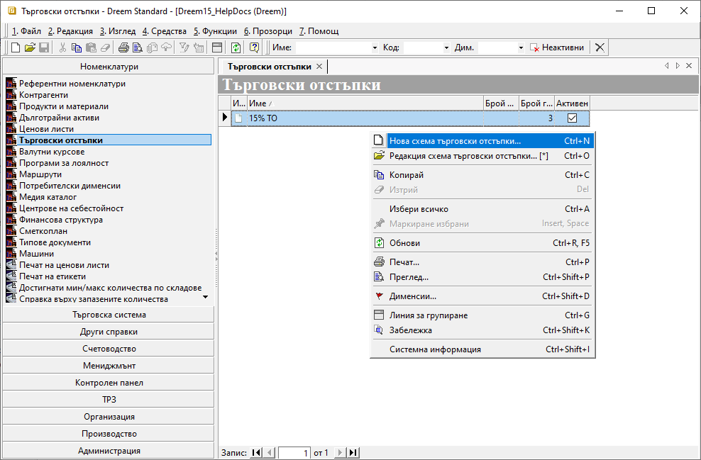
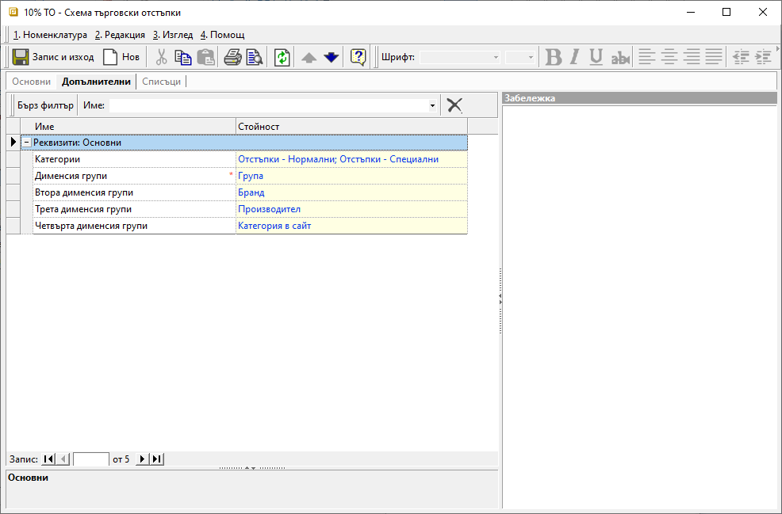

```{only} html
[Нагоре](000-index)
```

# **Търговски отстъпки**

- [Въведение](#въведение)  
- [Създаване на схема с ТО%](#създаване-на-схема-с-то)  
- [Реквизити](#реквизити)  
- [Свързани статии](#свързани-статии)  

## **Въведение**

Схемата с търговски отстъпки представлява шаблон с настроени намаления от цената, който може да се прилага в документи за заявки, покупка и продажба.  
Отстъпките се настройват в проценти общо за цяла група/и, както и индивидуално за продукт.  

Може да създадете множество схеми с ТО в системата, които да прилагате ръчно, или да обвържете с настройките на избрани контрагенти.  

## **Създаване на схема с ТО%**

1) За създаване на нова схема с отстъпки се отваря група функции **Номенклатури || Търговски отстъпки**. Чрез десен бутон на мишката върху списъка вдясно се избира **Нова схема търговски отстъпки**. Отваря се форма за въвеждане на данни **Ценова листа**, в която се попълват няколко реквизита:  

{ class=align-center w=15cm }

2) В раздел **Основни** се настройват реквизити **Код**, **Активен** и **Име**.  
По желание поле **Код** може да се попълни ръчно или системата да даде пореден номер при запис на номенклатурата. Чрез поставяне или премахване на отметка за реквизит **Активен** схемата с ТО се активира или деактивира. **Име** е задължително поле, в което се изписва наименование на схемата с ТО.  

3) В раздел **Допълнителни** може да се дефинират **Категории**, които се използват при настройки за сигурност и ограничаване на достъпа до ценови листи.  

От този раздел могат да бъдат избрани дименсии на продукти, по които да се настроят отстъпките по групи. Това става чрез определянето им в реквизити **Дименсия групи**, **Втора дименсия групи**, **Трета дименсия групи** и **Четвърта дименсия групи**. За всяка дефинирана дименсия системата ще визуализира колона в раздел **Списъци**.  

{ class=align-center w=15cm }

4) От раздел **Списъци** се настройват процентите с търговски отстъпки по групи и/или по продукти.  

В секция **Отстъпки по групи** е достъпен списък, който съдържа променлив брой колони с дименсии според настройките в **Допълнителни**. С отделни редове могат да бъдат конфигурирани различни комбинации между групи. Ако в дадено поле не бъде посочена дименсия, системата прилага отстъпката за всички продукти в тази група.  
В колона **Отстъпка %** се въвежда стойност на желаните проценти намаление.  

**Отстъпки по продукти** се настройват, като се дефинира списък с продукти, за които ще има специфична отстъпка. Те се явяват изключения от настройките за групи.  

В колоната **Продукт/материал** се избира конкретен продукт, за който ще има индивидуална отстъпка. Стойността на търговската отстъпка се попълва в проценти в колона **Отстъпка %**.  

{ class=align-center w=15cm }

> При използване на схема с ТО в документ системата прилага с приоритет отстъпките по продукти. Ако не открие такива, прилага настроените отстъпки по групи.  

5) С бутон [**Запис и Изход**] от лентата с инструменти въведените настройки се записват и формата се затваря.  

## **Реквизити**

1) В раздел **Основни**:  
   - **Код** – в полето се попълва код в цифри, букви и/или други знаци;  
   Ако бъде оставено празно, системата автоматично обзавежда полето с пореден номер.  
   - **Активен** - чрез поставяне/махане на отметка схемата с ТО се маркира като активна или неактивна номенклатура;  
   - **Име** – попълва се наименование за схемата с ТО;  

2) Раздел **Допълнителни**:  
   **Реквизити: Основни**  
   - **Категории** - използва се за ограничаване на достъп до ценови листи по категории;    
   - **Дименсия групи** - поле за избор на дименсия, по която се настройва *Отстъпки по групи* в раздел *Списъци*;  
   - **Втора дименсия групи** - избор на втора дименсия, по която се настройва *Отстъпки по групи* в раздел *Списъци*;  
   - **Трета дименсия групи** - указва трета дименсия, по която се настройва *Отстъпки по групи* в раздел *Списъци*;  
   - **Четвърта дименсия групи** - указва четвърта дименсия, по която се настройва *Отстъпки по групи* в раздел *Списъци*;  

3) Раздел **Списъци**:  
   **Списъци**  
   - **Отстъпки по групи** - Тази секция включва списък за настройка на отстъпки с всички дименсии,  дефинирани в раздел **Допълнителни**. Всяка дименсия се визуализира в отделна колона, носеща  нейното име.  
        - *Дименсия* - поле за избор на група;  
        Отстъпката може да се настрои общо за всички или за отделни групи.  
        - *Отстъпка %* - попълва се стойност на желаната отстъпка в проценти;  
   - **Отстъпки по продукти** - От списъка се посочват продукти, за които ще има различна търговска отстъпка, като се обзавеждат колони:     
        - *Продукт/материал* - поле за избор на продукт;  
        Отстъпката може да се настрои общо за всички или за отделни продукти.  
        - *Отстъпка %* - попълва се стойност на желаната отстъпка в проценти;  

## **Свързани статии**

[Как да създадем схема с ТО%?](https://www.unicontsoft.com/cms/node/15)  
[Как да свържем Схема с ТО% с контрагент?](https://www.unicontsoft.com/cms/node/67)