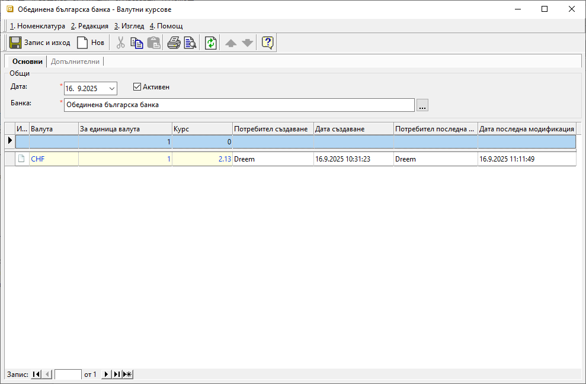

```{only} html
[Нагоре](000-index)
```

# **Валутни курсове**

- [Въведение]()  
- [Добавяне на нов валутен курс]()  
- [Реквизити]()  
- [Свързани статии]()  

## **Въведение**

Номенклатура **Валутни курсове** се използва при въвеждането на документи в системата. На база въведени валутни курсове системата автоматично пресмята стойности в местна валута за валутните документи.  

За да се използват валутните курсове, е необходимо да се дефинира следните настройки:  
- Търговска банка за **Потребителя на продукта**;  
- Ежедневно въвеждане на валутните курсове;  

## **Добавяне на нов валутен курс**

1) За добавяне на нов запис се отваря група функции **Номенклатури || Валутни курсове**. Чрез десен бутон на мишката върху списъка се избира **Нов валутен курс**. Отваря се празна форма за въвеждане на данни, в която се попълват няколко реквизита:  

{ class=align-center w=15cm }

2) В раздел **Основни** се настройват реквизити **Код**, **Активен** и **Име**.  
По желание поле **Код** може да се попълни ръчно или системата да даде пореден номер при запис на номенклатурата. Чрез поставяне или премахване на отметка за реквизит **Активен** схемата с ТО се активира или деактивира. **Име** е задължително поле, в което се изписва наименование на схемата с ТО.  

3) В раздел **Допълнителни** може да се дефинират **Категории**, които се използват при настройки за сигурност и ограничаване на достъпа до ценови листи.  

5) С бутон [**Запис и Изход**] от лентата с инструменти въведените настройки се записват и формата се затваря.  

## **Реквизити**

1) В раздел **Основни**:  
   - **Дата** - в полето се избира дата, за която се отнасят валутните курсове в текущия запис;   
   - **Активен** - чрез поставяне/махане на отметка валутният курс се маркира като активна или неактивна номенклатура;  
   - **Банка** – отваря форма за избор на банка от списък **Счетоводни признаци**;  
   Избира се банката, дефинирана в **Администрация || Настройки** като *Контрагент Търговска банка* за **Потребителя на продукта**.  

   От реда за нов запис се обзавежда списък с валути. Колоните, които съдържа, са:  
   - **No.** - пореден номер на запис по реда на въвеждане;  
   - **Валута** - падащ списък за избор на валута;  
   Списъкът трябва да бъде настроен предварително от **Номенклатури || Референтни номенклатури**.  
   - **За единица валута** - попълва се количество местна валута, за която се отнася валутният курс на реда;  
   - **Курс** - валутен курс по фиксинг на избраната банка;  
   - **Потребител създаване** - информация за потребител, добавил текущия ред;  
   - **Дата създаване** - дата и час на добавяне на текущия ред;  
   - **Потребител последна модификация** - потребителско име на направилия последните корекции в данните на реда;  
   - **Дата последна модификация** - информация за дата и час, когато са направени последните изменения в данните на текущия ред;  

2) В раздел **Допълнителни**:  
- **Забележка** - полето дава възможност за въвеждане на свободен текст с уточнения;   

## **Свързани статии**

[Референтни номенклатури](https://docs.unicontsoft.com/guide/erp/001-ref/001-nomenclatures/001-ref-nomenclatures.html)  