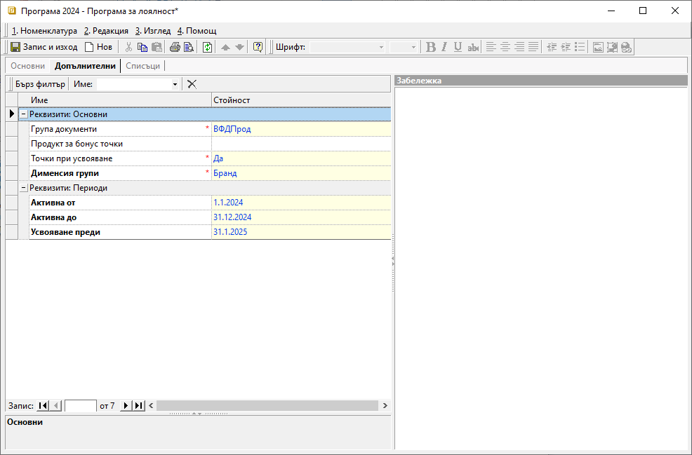

```{only} html
[Нагоре](000-index)
```

# Програми за лоялност

Програмите за лоялност в системата представляват схеми, чрез които по зададени критерии клиентите натрупват бонус точки. Натрупаните по този начин точки носят търговска отстъпка или позволяват размяна срещу продукт по каталог.  

**Бонус точки за търговска отстъпка**: Участници в този вид програма за лоялност са всички клиенти, закупили стоки от определени категории продукти, носещи бонус точки. След достигане до някое от определените с Интервали нива, клиентът получава съответната отстъпка спрямо зададената схема.  
**Бонус точки за продукти по каталог**: 


Процесът по създаване на *Програма за лоялност* е следният:

 1) За създаване на програма се отваря група функции **Номенклатури || Програми за лоялност**. Чрез десен бутон на мишката върху списъка вдясно се избира **Нова програма за лоялност**. Отваря се празна форма за въвеждане на данни, в която се попълват няколко реквизита:

2) В раздел **Основни** се настройват:
    - **Код** — кодът може да се попълни ръчно или системата да даде пореден номер при запис на номенклатурата;
    - **Активна** - чрез поставяне/премахване на отметка програмата за лоялност се активира/деактивира;  
    - **Име** – в свободен текст се изписва наименование на програмата (задължителна настройка);  
    - **Тип** - от падащ списък се избира тип на програмата.  
    Възможностите за избор са:
        - Бонус точки за търговска отстъпка  
        - Бонус точки за продукти по каталог  
        - Ваучери за търговска отстъпка  
        - Ваучери за промо продукт  
        - Допълнителна схема ТО спрямо съдържанието на текущ документ


    { class=align-center w=15cm }

> Спрямо избрания за програмата **Тип** се активират различни реквизити за настройка в разделите **Допълнителни** и **Списъци**. 

3) В раздел **Допълнителни** се настройват:
    - **Група документи** - в полето се посочва при приключването на коя група документи или тип документ да се натрупват бонус точки по програмата (задължителен реквизит);
    - **Продукт за бонус точки** - избира се продукт, с който се усвояват натрупаните по програмата бонус точки в продажба (важи при настройка с тип *Бонус точки за продукти по каталог*);
    - **Точки при усвояване** - поле с настройка за потвърждение/отказ дали при усвояване на натрупани точки по програмата, тази продажба да отчита бонус точки;
    - **Дименсия групи** - избор на дименсия, по която  в раздел Списъци ще се настройват *Коефициенти*;
    - **Активна от** - избор на начална дата (включително), от която стартира програмата за лоялност;  
    Ако полето е празно, програмата се счита за вече стартирана.  
    - **Активна до** - избор на крайна дата (включително), на която приключва програмата за лоялност;  
    Ако полето е празно, програмата се счита за безсрочна - продължава без да приключва автоматично.  
    - **Усвояване преди** - избор на крайна дата (включително), преди която могат да се усвояват натрупани по програмата бонус точки;  
    Ако полето е празно, няма ограничение в периода на използване на натрупаните точки.

    { class=align-center w=15cm }

4) В раздел **Списъци** системата активира единствено реквизитите, които трябва да се настроят за избрания *Тип* на програмата ( в раздел **Основни**).  

    Пълният списък с настройки включва:  
    - **Коефициенти**:   
        - **Дименсия** - поле за избор на категория продукти, на база която ще се натрупват бонус точки;
        - **Коефициент** - поле за настройка на коефициент, определящ количеството бонус точки, които носи покупката на избраните категории продукти;
    - **Интервали** - настройка, определяща условията за прилагане на отстъпка, т.е. каква схема с търговска отстъпка да се активира за отделните интервали с достигнати бонус точки.
        - **От** - избор на минимален брой бонус точки за съответната схема с търговска отстъпка;  
        - **До** - избор на максимален брой бонус точки за съответната схема с ТО;
        - **Схема ТО** - избор на предварително въведена схема с отстъпка;  

    { class=align-center w=15cm }

    - **Контрагенти**:  
        - **Контрагент** - избор на клиент, участващ в програмата за лоялност;  
        - **От дата** - поле за избор на начална дата за валидност на програмата за дадения контрагент;    
        - **До дата** - поле за избор на крайна дата за валидност на програмата за дадения контрагент;  
    - **Ваучери** - секция с настройки на предварително издадени ваучери на клиенти;
        - **Ваучер** - в редовете на тази колона може да се въведе списък с идентификационни номера (кодове) на ваучери;
        - **Контрагент** - в редовете на колоната се посочва име на контрагента, за когото е издаден съответният ваучер;  
        - **Многократен** - в тази колона се настройва начин на прилагане на съответния ваучер - еднократно или многократно;

5) **Запис и изход** 

___
## Свързани статии

- [Как да създадем Програма за лоялност?](https://www.unicontsoft.com/cms/node/138)