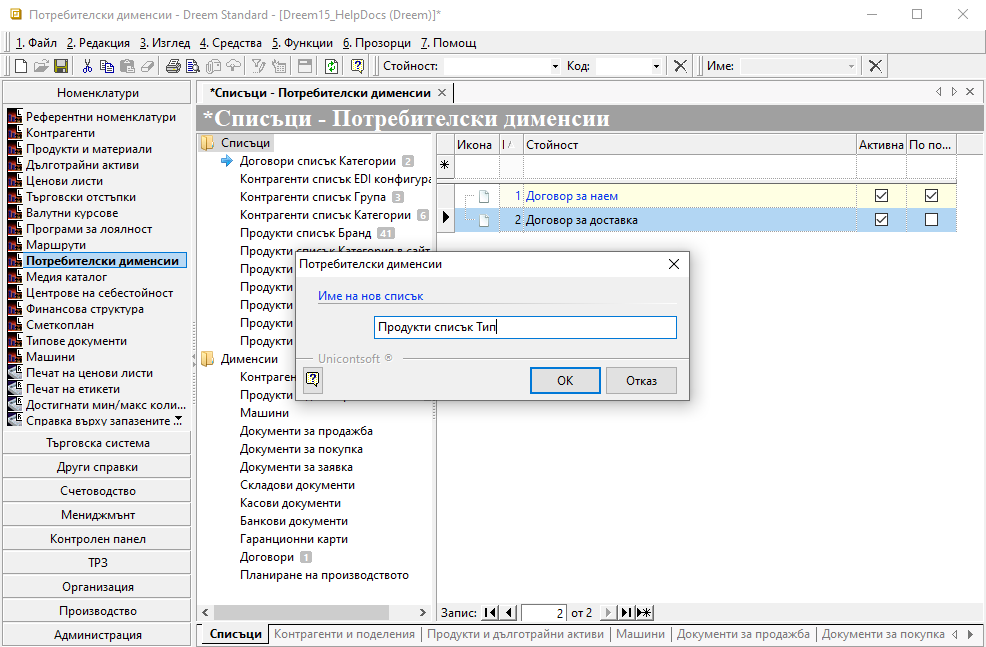
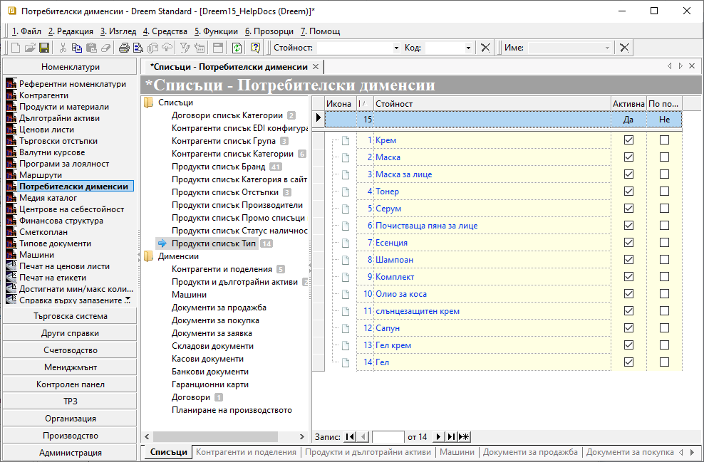
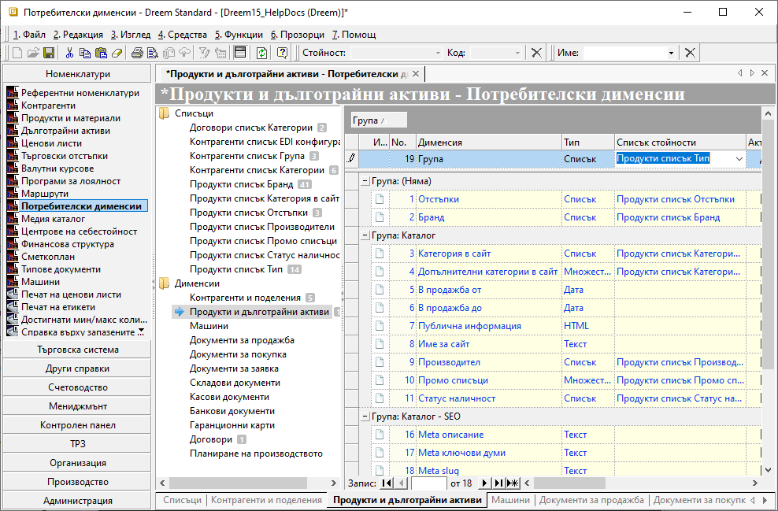

```{only} html
[Нагоре](000-index)
```

# Потребителски дименсии

- [Въведение](https://docs.unicontsoft.com/guide/erp/001-ref/001-nomenclatures/008-custom-dimensions.html#id2)
- [Настройка на Списъци](https://docs.unicontsoft.com/guide/erp/001-ref/001-nomenclatures/008-custom-dimensions.html#id3)  
- [Настройка на Дименсии](https://docs.unicontsoft.com/guide/erp/001-ref/001-nomenclatures/008-custom-dimensions.html#id4)  
- [Реквизити](https://docs.unicontsoft.com/guide/erp/001-ref/001-nomenclatures/008-custom-dimensions.html#id5)
- [Свързани статии](https://docs.unicontsoft.com/guide/erp/001-ref/001-nomenclatures/008-custom-dimensions.html#id6)  

## **Въведение**

Дименсиите в системата служат за категоризиране на данни. Потребителите изграждат персонализирани категории, чрез които данните се групират и анализират детайлно. Системата дава възможност за дефиниране на димеснии по продукти, контрагенти и различни документи - продажби, покупки, складови и други документи.   

Настройките на *Потребителски дименсии* се изграждат в две стъпки - съставяне на описи в *Списъци* и създаване на *Дименсии*.  

Списъците представляват каталог, съдържащ всички групи продукти, контрагенти, договори и пр. За всяка една от тези групировки трябва да укажете как системата да я третира. Това става чрез настройка на *Дименсии*.

```{tip}
Препоръчително е при избор на име на списъците да се добави за коя номенклатура или тип документ се отнася. Това ще помогне за по-лесно и бързо ориентиране в целия набор от списъци.  
```

## **Настройка на Списъци**  

Нов списък се създава по следния начин:

1) От модул **Номенклатури || Потребителски дименсии** с десен бутон на мишката върху група *Списъци* се избира *Нов списък*, при което системата отваря прозорец с празно поле. Въвежда се наименование в свободен текст и с бутон [**OK**] се добавя като нова категория в *Списъци*. 

{ class=align-center w=15cm }

2) В колона *Стойност* на списъка се попълват наименования за всяка подкатегория. 

{ class=align-center w=15cm }

3) Промените се съхраняват с бутон *Запис* от лентата с инструменти, с което съдържанието на списъците е настроено. 

```{tip}
Във всеки един момент може да се редактират и добавят нови записи.  
Изтриването е възможно единствено, когато настройките все още не са използвани в системата. 
```

## **Настройка на Дименсии**

Настройката е задължителна. Чрез нея всеки предварително въведен списък се обвързва или с конкретен вид номенклатура, или с типове документи. Това определя дали дименсията ще бъде достъпна във формата за редакция на *Продукти* или на *Контрагенти*, както и в съдържащите ги филтри, или ще касае тип документи.  

> Ако даден списък не се разпредели към Продукти и материали, Контрагенти и поделения или Тип документ в *Дименсии*, реквизитът няма да е видим в системата.

Нова дименсия се конфигурира по следния начин:

1) За да бъдат завършени настройките на категории, от група *Дименсии* се маркира *Контрагенти и поделения*, *Продукти и дълготрайни активи*, *Машини* или избран тип документ (*Договори*, *Документи за продажба* и т.н.).  
В списъка вдясно, чрез реда за добавяне на нов запис, се попълва колони:

- **Дименсия** —  изписва се името на категорията. 
С това наименование дименсията се визуализира във филтрите и в списъците с продукти.  

{ class=align-center w=15cm }

- **Тип** — в тази колона се избира вида на дименсията от падащия списък.

Системата дава възможност за избор от следните типове:

    -  тип **Списък**: този тип ограничава категоризирането само към една от стойностите на списъка.  
    -  тип **Текст**: дава възможност за категоризиране по свободно въведен текст, който може а се настрои в отделни шаблони.  
    -  тип **Число**: дава възможност за категоризиране с числови стойности.  
    -  тип **Дата**: дава възможност за категоризиране по дата.  
    -  тип **Час**: дава възможност за категоризиране по час.  
    -  тип **Да/Не**: възможност за категоризиране като отговарящи или неотговарящи на определен критерий.  
    -  тип **Множество**: допуска категоризирането към повече от една стойност на списъка.  
    -  тип **RTF**: дава възможност за категоризиране по свободно въведен текст - Rich Text rmat.  
    -  тип **HTML**: дава възможност към продуктите да се настрои HTML код.  
    -  тип **Медия**: възможност да се настрои връзка към уебсайт.  

- **Списък стойности** — той се настройва задължително единствено за дименсии от тип *Списък* и *Множество*. От падащия списък тук трябва да изберем категория от предварително въведените в *Списъци*.
- **Задължителна** — чрез поставяне на отметка в тази колона, може да се настрои тя да бъде задължителна настройка. При това положение системата няма да позволява записване на нов или редакция на съществуващ продукт, без да се избере стойност за задължителната дименсия.
- **Прецизност** — настройката се използва единствено за числов тип дименсии, като указва до кой знак след десетичната запетая да се закръгли числото.
- **Описание** — в полето може да се даде кратко описание, което да служи като помощен текст или друго.

## **Реквизити**

Списъците за настройка на дименсии включват следните колони с реквизити:  

   **Списъци**:  
   - **No** - пореден номер на реда в текущия списък;  
   - **Код** - пореден номер на запис спрямо всички в *Списъци*; 
   - **Стойност** - в полето се въвежда наименование на текущ списък;    
   - **Допълнителна стойност** - полето може да се обзаведе с допълнително наименование чрез десен бутон на реда и *Преведи*; 
   - **Медия съдържание** - отваря форма за избор на прикачен файл от настроените папки в *Медия каталог*;  
   - **Изображение** - отваря форма за избор на изображение от настроените папки в *Медия каталог*;  
   - **Адрес на изображение** - полето се обзавежда с пътя до избраното изображение;  
   - **Забележка** - поле за попълване на свободен текст с уточняваща информация;  
   - **Активна** - чрез поставяне/махане на отметка записът се маркира като активна/неактивна номенклатура в списъци;  
   - **Допълнителен код** - полето може да се обзаведе с допълнителен код чрез десен бутон на реда и *Преведи*; ;  
   - **По подразбиране** - чрез поставяне на отметка текущият ред се маркира като опция, която системата да предлага по подразбиране;  
   Само един запис може да бъде настроен с *По подразбиране*.   

   **Дименсии**:  
   - **No** - пореден номер на реда със запис в текущия списък;      
   - **Код** - пореден номер на запис спрямо всички в *Дименсии*;  
   В полето могат да бъдат настройвани специфични системни кодове.  
   - **Дименсия** - в полето се въвежда наименование на текуща дименсия;  
   - **Тип** - падащ списък за избор на тип за текуща дименсия;  
   - **Списък стойности** - поле за избор на регистър със записи, отнасящ се към текущата дименсия;  
   Това са настроените от *Списъци* каталози.  
   - **Задължителна** - чрез поставяне/махане на отметка текущата дименсия се определя като задължителна/незадължителна настройка;  
   - **Прецизност** - в полето може да се попълни цифра, определяща до кой знак след десетичната запетая системата да закръглява стойностите за дименсии от тип *Число*;  
   - **Описание** - поле за попълване на свободен текст с уточняваща информация;   
   - **Редакция** - указва типа на редакция на дименсия;  
   Тип *Автоматично* - системата отваря падащ списък със стойности при прилагане на текущата дименсия.  
   Тип *Форма за избор* - системата отваря форма за избор със стойности при прилагане на текущата дименсия.    
   - **Активна** - чрез поставяне/махане на отметка записът се маркира като активна/неактивна номенклатура в списъци;  
   - **Мярка** - поле за избор на мерна единица;  
   - **Стойност по подразбиране** - в полето може да се попълни стойност, която системата да прилага автоматично за текуща дименсия;  
   - **Допълнителен код** - полето може да се обзаведе с допълнителен код чрез десен бутон на реда и *Преведи*;    
   - **Допълнително име** - полето може да се обзаведе с допълнително наименование чрез десен бутон на реда и *Преведи*;  


## **Свързани статии**  

[Използване на дименсиите в Продукти и материали](https://docs.unicontsoft.com/guide/erp/005-how-to/015-custom-dimensions.html#id1)