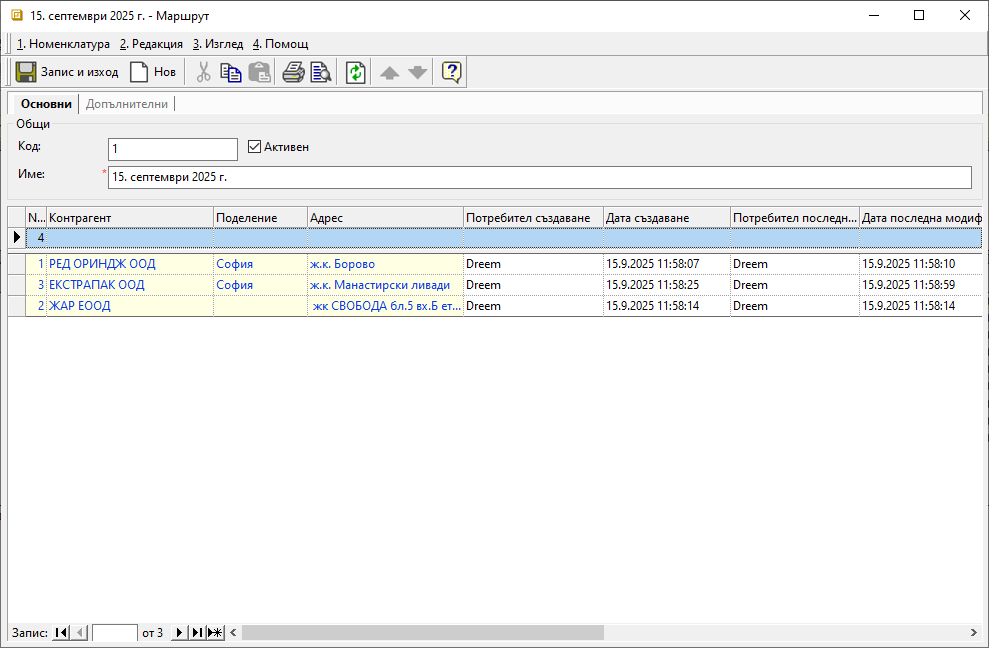

```{only} html
[Нагоре](000-index)
```

# **Маршрути**

- [Въведение]()
- [Създаване на нов маршрут]()   
- [Реквизити]()
- [Свързани статии]()  

## **Въведение**

Маршрутите са номенклатура за групиране на няколко контрагента в маршрутен лист по определени критерии - дата на доставка, общ маршрут при доставка и т.н.  
При печат на маршрутния лист са видими старите и настоящите задължения от текущата доставка. Данните са групирани по *Контрагент* и *Поделение*. Изпълняващият маршрута служител може да попълни данни за внесените суми и евентуални забележки.

## **Създаване на нов маршрут**  

1) За създаване на нов маршрут се отваря група функции **Номенклатури || Маршрути**. С десен бутон на мишката върху списъка със записи се избира **Нов маршрут**. Системата отваря празна форма за въвеждане на данни.  

{ class=align-center w=15cm }

2) Поле **Код** се попълва по желание. Задължително за попълване е полето **Име** с избрано наименование за маршрута.  
Системата автоматично е маркирала текущия маршрут с **Активен**.  

От реда за добавяне на нов запис се попълва списъка с всички контрагенти, включени в маршрута. За целта се обзавеждат колона **Контрагент**.  
Когато доставките се извършват по обекти, те се избират в полета с **Поделение**.  

> Системата прилага настроените адреси за избраните обекти, Ако липсват, предлага настройката за **Адреси на доставка** от раздел **Списъци** на форма **Контрагент**.  

3) С бутон [**Запис и изход**] от лентата с инструменти промените се съхраняват и формата **Маршрут** се затваря. 

## **Реквизити**

1) В раздел **Основни**:  
   - **Код** – в полето се попълва код в цифри, букви и/или други знаци;  
   Ако бъде оставено празно, системата автоматично обзавежда полето с пореден номер.  
   - **Активен** - чрез поставяне/махане на отметка маршрутът се маркира като активна или неактивна номенклатура;  
   - **Име** – попълва се наименование за маршрутния лист;  

   От реда за нов запис се обзавежда списък с контрагентите, участващи в маршрута. Колоните, които съдържа, са:  
   - **No.** - пореден номер на запис по реда на въвеждане;  
   - **Контрагент** – в полето се отваря форма за избор **Контрагенти**;  
   - **Поделение** - поле за избор от списък с настроените за контрагента обекти;  
   - **Адрес** - полето се обзавежда с настроения адрес за обекта;  
   Ако за обекта липсва такава, системата прилага настройката по подразбиране от **Списъци || Адреси на доставка** на контрагент.    
   - **Потребител създаване** - информация за потребител, добавил текущия ред в документа;  
   - **Дата създаване** - дата и час на добавяне на текущия ред;  
   - **Потребител последна модификация** - потребителско име на направилия последните корекции в данните на реда;  
   - **Дата последна модификация** - информация за дата и час, когато са направени последните изменения в данните на текущия ред;  

2) Раздел **Допълнителни**:  
   **Реквизити: Основни**  
   - **Шаблон за печат** - отваря падащ списък за избор на шаблон при отпечатване на маршрутния лист;  
   Текстовете на шаблони трябва да бъдат въведени предварително от **Номенклатури || Референтни номенклатури || Текстови шаблони**.  

## **Свързани статии**  

