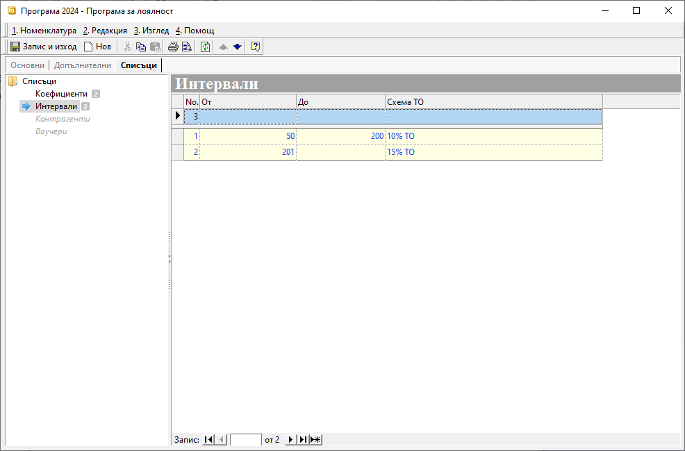

```{only} html
[Нагоре](000-index)
```

# **Програми за лоялност**

- [Въведение](https://docs.unicontsoft.com/guide/erp/001-ref/001-nomenclatures/008-loyalty-programs.html#id2)  
- [Създаване на нова програма за лоялност](https://docs.unicontsoft.com/guide/erp/001-ref/001-nomenclatures/008-loyalty-programs.html#id3)  
- [Реквизити](https://docs.unicontsoft.com/guide/erp/001-ref/001-nomenclatures/008-loyalty-programs.html#id4)  
- [Свързани статии](https://docs.unicontsoft.com/guide/erp/001-ref/001-nomenclatures/008-loyalty-programs.html#id5)  

## **Въведение**

Програмите за лоялност представляват схеми за натрупване на бонус точки. Това става след определяне на критериите, които да бъдат изпълнени на определени нива. Натрупаните точки носят търговска отстъпка или позволяват размяна срещу продукт по каталог.  
В зависимост от типа на програмата, участници в нея могат да бъдат всички или само избрани клиенти, закупили стоки от определени категории.  

## **Създаване на нова програма за лоялност**

1) За създаване на нова програма се отваря група функции **Номенклатури || Програми за лоялност**. Чрез десен бутон на мишката върху списъка вдясно се избира **Нова програма за лоялност**. Отваря се празна форма за въвеждане на данни.  

2) В раздел **Основни** се настройват реквизити **Код**, **Активен** **Име** и **Тип** на програмата за лоялност.  
По желание поле **Код** може да се попълни ръчно или системата да даде пореден номер при запис на номенклатурата. Чрез поставяне или премахване на отметка за реквизит **Активен** програмата за лоялност се активира или деактивира. **Име** е задължително поле, в което се изписва наименование на програмата.   

> Реквизит **Тип** е определящият вида на програмата.  
> Спрямо избрания за програмата **Тип** се активират различни реквизити за настройка в разделите **Допълнителни** и **Списъци**.  

{ class=align-center w=15cm }

3) В раздел **Допълнителни** се настройват период на валидност за програмата, срок за усвояване на натрупани точки и други реквизити.  

Чрез избор на **Група документи** се указва при приключването на коя група документи или тип документ ще се натрупват бонус точки за текущата програма.  

Полето **Продукт за бонус точки** се активира за програма от тип *Бонус точки за продукти по каталог*. В него се избира продуктът, с който  в продажба ще се усвояват натрупаните бонус точки.  

От **Точки при усвояване** се разрешава или забранява при продажба, в която се усвояват налични точки, да се натрупват нови точки.   

С избраната настройка в поле **Дименсия групи** ще се обзаведат групите, за които в раздел **Списъци** се настройват *Коефициенти*.  

{ class=align-center w=15cm }

Периодът на валидност за текущата програма се дефинира от полета **Активна от** (начална дата, вкл.) и **Активна до** (крайна дата, вкл.). Ако тези полета останат празни, програмата се счита за безсрочна.   

Крайната дата, до която могат да се усвояват натрупани по програмата бонус точки, се попълва в **Усвояване преди**. Ако полето е празно, няма ограничение в периода на използване на точките.  

4) В раздел **Списъци** системата активира единствено реквизитите, които трябва да се настроят за избрания в раздел **Основни** *Тип* на програмата.  

От секция **Коефициенти** се настройват коефициенти, при които се натрупват бонус точки. Това може да стане за отедлни групи или за всички групи от избрана дименсия.   

**Интервали** е настройката, определяща условията за прилагане на отстъпка. Тоест каква схема с ТО% да се активира на отделните нива при достигнато количество бонус точки. Границите на нивата се настройват с попълване на полета от колони **От** и **До**. Отстъпката, която ще се прилага за всяко ниво, се дефинира от падащия списък в **Схема ТО**.  

{ class=align-center w=15cm }

Секция **Контрагенти** е достъпна за настройка единствено при тип на програмата *Бонус точки за продукти по каталог*. Позволява да се изберат конкретни клиенти, за които се прилагат условията на програмата за лоялност.  

Секция **Ваучери** е активна за програми с типове *Ваучери за търговска отстъпка* и *Ваучери за търговска отстъпка*. Използва се, когато организацията работи с предварително издадени ваучери.  

5) Направените модификации се записват с бутон [**Запис и изход**] в лентата с инструменти.   

## **Реквизити**

1) В раздел **Основни**:  
   - **Код** – в полето се попълва код в цифри, букви и/или други знаци;  
   Ако бъде оставено празно, системата автоматично обзавежда полето с пореден номер.  
   - **Активен** - чрез поставяне/махане на отметка програмата за лоялност се маркира като активна или неактивна номенклатура;  
   - **Име** – попълва се наименование за програмата за лоялност;  
   - **Тип** - падащ списък за избор на тип на програмата;  
   Списъкът с типове е системно настроен.  

2) В раздел **Допълнителни**:  
   **Реквизити: Основни**  
   - **Група документи** - избор на група документи или тип документ, при приключването на които се натрупват бонус точки по програмата;  
   - **Продукт за бонус точки** - избира се продукт, с който в продажба се усвояват бонус точки, натрупани по програма от тип *Бонус точки за продукти по каталог*;  
   - **Точки при усвояване** - с *Да/Не* се разрешава/забранява при усвояване на натрупани точки по програмата, същата продажба да отчита бонус точки;  
   - **Дименсия групи** - избор на дименсия, по която в раздел **Списъци** ще се настройват *Коефициенти*;  

   **Реквизити: Периоди**  
   - **Активна от** - избор на начална дата (включително), от която стартира програмата за лоялност;  
   Ако полето е празно, програмата се счита за вече стартирана.  
   - **Активна до** - избор на крайна дата (включително), на която приключва програмата за лоялност;  
   Ако полето е празно, програмата се счита за безсрочна - продължава без да приключва автоматично.  
   - **Усвояване преди** - избор на крайна дата (включително), преди която могат да се усвояват натрупани по програмата бонус точки;  
   Ако полето е празно, няма ограничение в периода на използване на натрупаните точки.  

3) Раздел **Списъци**:  
   **Списъци**  
   - **Коефициенти**:   
        - **Дименсия** - падащ списък за избор на категории с продукти, за които ще се натрупват бонус точки;  
        Дименсията трябва да е предварително указана в раздел **Допълнителни**.  
        - **Коефициент** - поле за настройка на коефициент, определящ количеството бонус точки, които носи покупката на избраните категории продукти;  
   - **Интервали** - настройка, определяща условията за прилагане на отстъпка, т.е. каква схема с търговска отстъпка да се активира за отделните интервали с достигнати бонус точки.
        - **От** - избор на минимален брой натрупани точки, за да се прилага избраната схема с ТО;  
        - **До** - избор на максимален брой натрупвани точки, за да се прилага избраната схема с ТО;  
        - **Схема ТО** - избор на схема с ТО%, която се прилага за настроения на реда интервал;  
        Схемите с отстъпки трябва да са предварително въведена в системата.  
   - **Контрагенти**:  
        - **Контрагент** - избор на клиент, участващ в програмата за лоялност;  
        - **От дата** - избор на начална дата за валидност на програмата за дадения контрагент;  
        - **До дата** - избор на крайна дата за валидност на програмата за дадения контрагент;  
   - **Ваучери** - В секцията се настройват предварително издадени ваучери на клиенти.  
        - **Ваучер** - в редовете на тази колона може да се въведе списък с идентификационни номера (кодове) на ваучери;
        - **Контрагент** - в редовете на колоната се посочва име на контрагента, за когото е издаден съответният ваучер;  
        - **Многократен** - настройка на начин на прилагане за избрания ваучер;  
        С настройка *Да* се позволява многократно използване на ваучера.  
        При настройка *Не* ваучерът е еднократен.  

## **Свързани статии**

- [Как да създадем Програма за лоялност?](https://www.unicontsoft.com/cms/node/138)