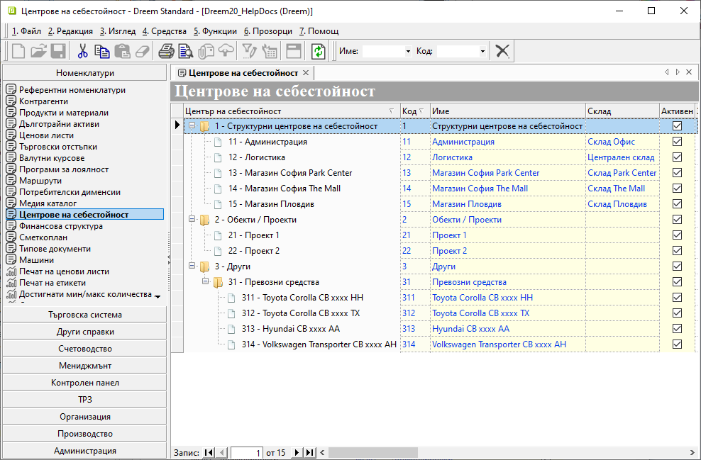

```{only} html
[Нагоре](000-index)
```

# **Центрове на себестойност**

- [Въведение](#въведение)
- [Дефиниране на Центрове на себестойност](#дефиниране-на-центрове-на-себестойност)   
- [Реквизити](#реквизити)
- [Свързани статии](#свързани-статии)  

## **Въведение**

С **Центрове на себестойност** се проследяват аналитично източниците на разходи и приходи. С използването им се анализират реалните спрямо планираните разходи и приходи.  

Чрез тази номенклатура се създават центрове за себестойност в йерархична структура. Това са отделно обособени единици в рамките на организацията - звено, филиал, магазин, обект, проект, дейност и други.   

## **Дефиниране на Центрове на себестойност**  

1) За добавяне на нов център се маркира папка, към която системата създава новата номенклатура.  
С десен бутон на мишката върху реда се избира **Нов център**. Това добавя нов празен ред за попълване на данни.  

{ class=align-center w=15cm }

2) На новодобавения ред се въвежда информация за новата номенклатура. Системата позволява попълване на всички оцветени в жълто полета.  

Поле **Код** се обзавежда автоматично с поредния свободен код за избраното ниво. Може да се променя по желание спрямо конкретните препочитания.  
Задължително за попълване е полето **Име** с наименование за номенклатурата на реда.  

Има възможност за дефиниране на **Склад** към всеки от центровете на себестойност.  

Системата автоматично маркира текущия ред с **Активен**. Ако използването на номенклатурата отпадне в последствие, отметката в полето се маха.  
   
3) С бутон [**Запис**] от лентата с инструменти направените промени се записват. 

## **Реквизити**
 
   - **Център на себестойност** - показва настроеното наименование на реда за реквизит **Име**;  
   - **Код** – в полето се попълва код в цифри, букви и/или други знаци;  
   Системата автоматично обзавежда полето с пореден номер, който може да се редактира.  
   - **Име** – попълва се наименование за избрания център на себестойност;  
   - **Склад** - отваря падащ списък за избор на склад към центъра на себестойност;  
   Складовете трябва да са настроени предварително от **Номенклатури || Контрагенти**.  
   - **Забележка** - поле за попълване на свободен текст с уточняваща информация;  
   - **Активен** - чрез поставяне/махане на отметка центърът на себестойност се маркира като активна или неактивна номенклатура;  
   - **Допълнителен код** - полето може да се обзаведе с допълнителен код чрез десен бутон на реда и *Преведи*;  
   - **Допълнително име** - полето може да се обзаведе с допълнително наименование чрез десен бутон на реда и *Преведи*;  
   - **Потребител създаване** - информация за потребител, добавил текущия ред;  
   - **Дата създаване** - дата и час на добавяне на текущия ред;  
   - **Потребител последна модификация** - потребителско име на направилия последните корекции в данните на реда;  
   - **Дата последна модификация** - информация за дата и час, когато са направени последните изменения в данните на текущия ред;  

## **Свързани статии**  

[Контрагенти](002-contragents.md)