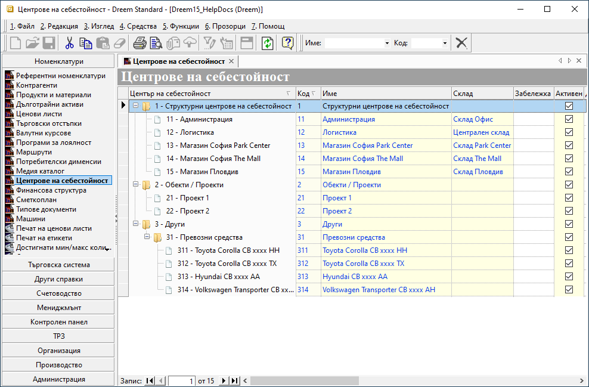

```{only} html
[Нагоре](000-index)
```

# **Центрове на себестойност**

- [Въведение]()
- [Дефиниране на Центрове на себестойност]()   
- [Реквизити]()
- [Свързани статии]()  

## **Въведение**


## **Дефиниране на Центрове на себестойност**  

1)  

{ class=align-center w=15cm }

2) Поле **Код** се попълва по желание. Задължително за попълване е полето **Име** с избрано наименование за маршрута.  
Системата автоматично е маркирала текущия маршрут с **Активен**.  

   От реда за добавяне на нов запис се въвежда списък с всички контрагенти, включени в маршрута. За целта се използва поле **Контрагент**.  
   Когато доставките се извършват по обекти, се обзавежда и поле **Поделение**.  

> Системата прилага настроените адреси на избраните обекти. Ако липсват, предлага настройката за **Адреси на доставка** от раздел **Списъци** на форма **Контрагент**.  

3) Въведените данни трябва да бъдат записани без излизане от формата. Това може да бъде постигнато чрез клавишна комбинация [**Ctrl+S**] или от меню **1.Номенклатура || Запис**.  

4) **Преглед и печат** на маршрутния лист се прави от бутона в лентата с инструменти. Той показва справка за вземанията от клиенти.  документи и поделения с адреси на доставка. Различен период на справката може да зададем от филтър формата, която се извежда най-лесно чрез щрак с мишката в жълтото поле.

{ class=align-center w=15cm }

5) С бутон [**Запис и изход**] от лентата с инструменти формата **Маршрут** се затваря, като промените са предварително записани. 

## **Реквизити**

1) В раздел **Основни**:  
   - **Център на себестойност** - ;  
   - **Код** – в полето се попълва код в цифри, букви и/или други знаци;  
   Ако бъде оставено празно, системата автоматично обзавежда полето с пореден номер.  
   - **Име** – попълва се наименование за маршрутния лист;  
   - **Склад** - отваря падащ списък за избор на склад;  
   Складовете трябва да са настроени предварително от **Номенклатури || Контрагенти**.  
   - **Забележка** - поле за попълване на свободен текст с уточняваща информация;  
   - **Активен** - чрез поставяне/махане на отметка маршрутът се маркира като активна или неактивна номенклатура;  
   - **Допълнителен код** - полето може да се обзаведе с допълнителен код чрез десен бутон на реда и *Преведи*;  
   - **Допълнително име** - полето може да се обзаведе с допълнително наименование чрез десен бутон на реда и *Преведи*;  
   - **Потребител създаване** - информация за потребител, добавил текущия ред;  
   - **Дата създаване** - дата и час на добавяне на текущия ред;  
   - **Потребител последна модификация** - потребителско име на направилия последните корекции в данните на реда;  
   - **Дата последна модификация** - информация за дата и час, когато са направени последните изменения в данните на текущия ред;  

## **Свързани статии**  

[Контрагенти](./002-contragents.html)