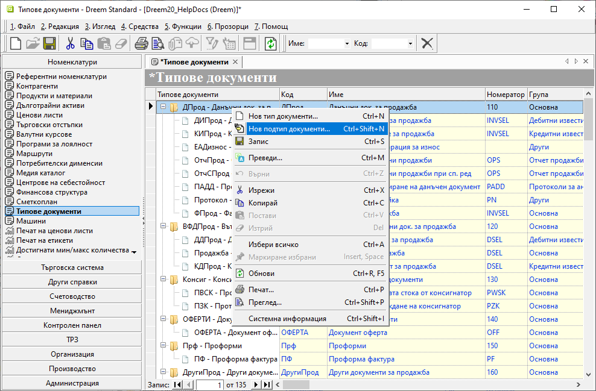

```{only} html
[Нагоре](000-index)
```

# **Типове документи**

- [Въведение](#въведение)  
- [Настройка на типове документи](#настройка-на-типове-документи)   
- [Реквизити](#реквизити)  

## **Въведение**

С номенклатура **Типове документи** се дефинират отделни видове документи за целите на **Търговска система** и **Счетоводство**.  
Те се визуализират в различни модули и са групирани според предназначението си.  

Според ролята им документите в **Търговска система** имат различни вътрешнофирмени или данъчни функции. 

## **Настройка на типове документи**  

1) За добавяне на нов тип се маркира папката с групата документи, към която системата добавя новата номенклатура.  
С десен бутон на мишката върху реда се избира **Нов тип документи** или **Нов подтип документи**. Това добавя нов празен ред за попълване на данни.  

{ class=align-center w=15cm }

2) На текущия ред се въвежда информация за новата номенклатура в оцветените в жълто полета.  
Попълват се **Код** и **Име** съответно със съкратено и с пълно наименование за типа документи. По този начин се визуализират в списъците за избор на типове документи. В **Номератор** се попълва подходящо съкращение/абревиатура на наименованието на латиница.  

Избира се към коя група документи участва новият тип. За целта се обзавежда **Група** от падащия списък в полето.  
Настройката в поле **Модул** ще определи в кой списък с документи се визуализира новият тип - Документи за покупка, за продажба, касови, складови и т.н.

От поле **Изисква контрагент Потребител на продукта** се указва дали **Потребител на продукта** е задължителен като титуляр за този тип документи.

> Важна настройка за типовете документи, които ще участват в дневниците по ДДС, е **Вид док. по ЗДДС**.  
Задължително се посочва на кой код от ППЗДДС отговаря типът документи.  
В **Дн. за покупки колона** или **Дн. за продажби колона** се избира в коя колона се включват документите от текущия тип.  

Чрез отметка в поле **Счетоводен** документът се включва и в списъка с видове документи в **Счетоводство**.  
Всички документи в модул **Счетоводство**, независимо от типа, използват общ шаблон. Той включва една или няколко счетоводни статии.  
От настройките на полета **Посока** и **Начисление** се определя как да е оформена статията. 
Дефинициите в **Тип счет. статия** и **Ред за ДДС** се вземат предвид при автоматичната генерация на счетоводен документ.  

3) С бутон [**Запис**] от лентата с инструменти направените промени се записват. 

## **Реквизити**
 
- **Типове документи** - наименование за избрания тип документи;  
Обзавежда се автоматично при попълване на поле с **Име**.  
- **Код** – в полето се попълва буквен код - съкращение или абревиатура на името на типа документи;  
- **Име** – попълва се наименование за избраното направление/поднаправление;  
- **Име при печат** - наименование за типа документи, което се показва при печат;  
- **Допълнително име при печат** - допълнително наименование - превод на различни езици, което се показва при печат;  
Обзавежда се чрез десен бутон на реда и *Преведи*.    
- **Номератор** - буквен код - съкращение или абревиатура на името на типа документи на латиница;  
- **Само активни номера** - ;  
- **Група** - отваря списък за избор на група, към която да се причисли текущият тип документи;   
- **Изисква контрагент Потребител на продукта** - указва прилагане на **Потребител на продукта** като титуляр в типа документи от реда;  
- **Вид док. по ЗДДС** - попълва се код за типа документ от описаните в ППЗДДС;  
Спрямо тази настройка документите се включват в дневниците по ДДС.  
- **Счетоводен** - указва дали текущият тип се включва и в списъка с видове документи в **Счетоводство**;  
- **Посока** - указва посока на начислението при генериране на счетоводна статия за текущия тип документ;  
- **Начисление** - указва тип на начислението - по Дт, по Кт или смесен;  
- **Тип счет. статия** - указва вида на счетоводната статия - една обща статия/отделни статии за всеки ред от документа;  
- **Дн. за покупки колона** - отваря списък за избор на колона от *Дневник за покупки*;  
- **Дн. за продажби колона** - отваря списък за избор на колона от *Дневник за продажби*;  
- **Ред за ДДС** - указва дали при осчетоводяване на текущия тип документ в счетоводната статия да фигурира ред със сметка за ДДС;  
- **Модул** - отваря списък за избор на модул с групата документи, към които да се отнесе текущият тип документ;  
- **Касова отчетност** - указва дали тип на документа се изполва при режим на касова отчетност;  
- **ISO No.** - ;  
- **Тип интернет заявка** - отваря списък за избор на тип интернет заявка;  
- **Име на колона** - указва системен код за типа документ на реда;  
- **Допълнителен код** - полето може да се обзаведе с допълнителен код чрез десен бутон на реда и *Преведи*;  
- **Допълнително име** - полето може да се обзаведе с допълнително наименование чрез десен бутон на реда и *Преведи*;  
- **Активен** - чрез поставяне/махане на отметка типът документ се маркира като активна или неактивна номенклатура;  
- **Потребител създаване** - информация за потребител, добавил текущия ред;  
- **Дата създаване** - дата и час на добавяне на текущия ред;  
- **Потребител последна модификация** - потребителско име на направилия последните корекции в данните на реда;  
- **Дата последна модификация** - информация за дата и час, когато са направени последните изменения в данните на текущия ред;  
