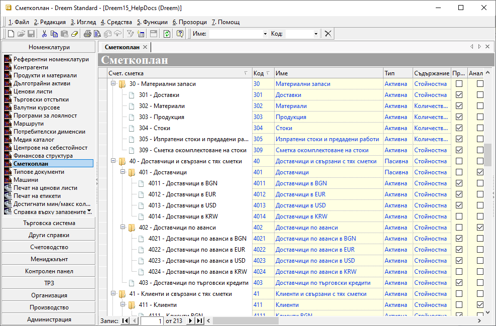

```{only} html
[Нагоре](000-index)
```

# **Сметкоплан**

- [Въведение](https://docs.unicontsoft.com/guide/erp/001-ref/002-accounting/001-chart-of-acc.html#id2)  
- [Добавяне на нова счетоводна сметка](https://docs.unicontsoft.com/guide/erp/001-ref/002-accounting/001-chart-of-acc.html#id3)  
- [Реквизити](https://docs.unicontsoft.com/guide/erp/001-ref/002-accounting/001-chart-of-acc.html#id4)  
- [Свързани статии](https://docs.unicontsoft.com/guide/erp/001-ref/002-accounting/001-chart-of-acc.html#id5)

## **Въведение**

Чрез функционалност **Сметкоплан** може да управлявате настройките на счетоводните сметки спрямо спецификата на дейността в организацията. Може да въвеждате, редактирате и деактивирате сметки. Изтриване се допуска единствено, когато дадена сметка не е била използвана никъде в системата.  

## **Добавяне на нова счетоводна сметка**

1) Избира се група функции **Номенклатури || Сметкоплан**. Чрез десен щрак с мишката върху списъка със сметки се избира **Нова сметка** (или **Нова подсметка**). Системата добавя нов ред и автоматично предлага първия незает шифър за групата сметки, която е избрана.  

{ class=align-center w=15cm }

2) Код  — полето може да бъде редактирано, като се избере друг желан код или да се запази предложеният от системата шифър на сметка.

3) Име — в полето се попълва наименование на сметката.

4) Тип  —  в това поле се определя тип на счетоводната сметка: **Активна**, **Пасивна** или **Активно-пасивна**.

5) Съдържание - в полето се настройва вид на сметката: **Стойностна**, **Количествена** или **Валутна**.

6) Възможни са допълнителни настройки на сметката чрез поставяне/премахване на отметка в следните колони на списъка:
    - **Признак задължителен**;  
    - **Аналитичност задължителна**;  
    - **Партида задължителна**;  
    - **Документ задължителен**;  
    - **Автоматично приключване**;  
    - **Задбалансова**;  
    - **Активна**;  

7) **Генериране тип продукт, основание за плащане** е инструмент за генерация на някои номенклатури и техните осчетоводявания, достъпен чрез десен бутон на мишката върху избрана сметка.  

{ class=align-center }

От формата **Генериране тип продукт, основание за плащане**, според същността на маркираната счетоводна сметка, се избира коя номенклатура да създаде системата:  

- **Генериране на тип продукт** и настройка на автоматично осчетоводяване за него - системата създава нова референтна номенклатура в **Типове продукти** и добавя настройка в **Автоматичен осчетоводител** за автоматични контировки при продажби и/или покупки;    
- **Генериране на основание за плащане** и съответното му осчетоводяване - системата създава нова референтна номенклатура с избраната сметка в **Основания за плащане**, както и настройки за касови и/или банкови документи в **Автоматичен осчетоводител**;  
- **Генериране на продукт и признак** - системата създава нови номенклатури с името на сметката в списъци **Продукти и материали** и **Счетоводни признаци**.  
- **Ок** - Бутон за потвърждаване на избраните опции.  

8) **Запис** - Бутон в лентата с инструменти, записващ промените в **Сметкоплан**.

## **Реквизити**

- **Счет. сметка** - списък с йерархична структура, включващ всички въведени счетоводни сметки;  
- **Код** - шифър на група сметки, сметка или подсметка;  
- **Име** - наименование на група сметки, сметка или подсметка на реда;  
- **Тип** - избор на тип за текуща сметка - активна, пасивна или активно-пасивна;  
- **Съдържание** - падащо меню за избор на вид сметка - стойностна, количествена или валутна;  
- **Валута** - избор на валута за текущата сметка от предварително настроените;  
- **Приключителна сметка** - отваря списък за избор на счетоводна сметка, която системата предлага в приключителни статии;  
- **Аналитичност задължителна** - чрез отметка в полето се указва дали в счетоводни документи е задължително използване на подсметки;  
- **Партида задължителна** - указва дали реквизит *Партида* е задължителен в счетоводни документи;  
- **Признак задължителен** - указва дали реквизит *Признак* е задължителен в счетоводни документи;  
- **Документ задължителен** - указва дали реквизит *Свързан документ* е задължителен в счетоводни документи;  
- **Автоматично приключване** - указва автоматично приключване за счетоводна сметка на реда;  
- **Задбалансова** - чрез отметка в полето се указва дали счетоводната сметка е задбалансова;  
- **Активна** - чрез отметка в полето се указва дали счетоводната сметка е активна номенклатура;  
- **Допълнителен код** - полето се попълва по желание с допълнителен код;  
Опцията е достъпна чрез десен бутон на реда със счетоводна сметка и *Преведи*.   
- **Допълнително име** - полето може да се попълни по желание с превод или допълнително име;  
Опцията е достъпна чрез десен бутон на реда със счетоводна сметка и *Преведи*.   

## **Свързани статии**

- [Как да настроим Сметкоплан](https://www.unicontsoft.com/cms/node/36)