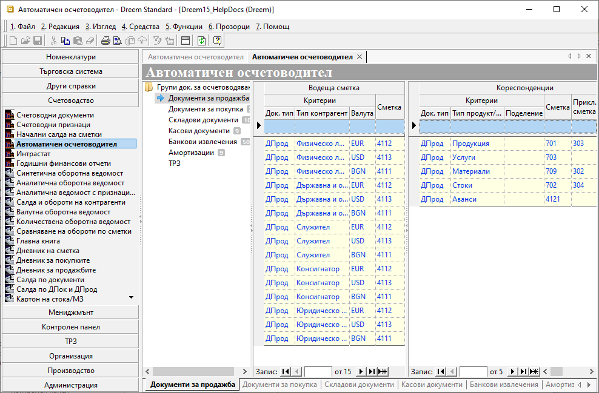

```{only} html
[Нагоре](000-index)
```

# **Автоматичен осчетоводител**

- [Въведение](#въведение)  
- [Настройка на автоматични контировки](#настройка-на-автоматични-контировки)  
- [Реквизити](#реквизити)  
- [Свързани статии](#свързани-статии)  

## **Въведение**

Системата разполага с функционалност **Автоматичен осчетоводител**, чрез която рутинните счетоводни операции могат да се извършват автоматично. Така, заедно с валидирането на документите в **Търговска система**, може да се генерира и счетоводен запис/и.  

Системата трябва да се конфигурира според счетоводната политика и индивидуалния сметкоплан на всяка фирма. Първият етап в настройките е правилното дефиниране на следните референтни номенклатури:    
- **Типове контрагенти**  
- **Типове продукти и материали**   
- **Основания за плащане**  

На следващ етап се настройва **Автоматичен осчетоводител**, където посочвате как да се осчетоводява всеки един документ от **Търговска система**, на който ще правите счетоводен запис. Настройките на документи са обособени в отделни групи, както следва:  
- **Документи за продажба**   
- **Документи за покупка**  
- **Складови документи**  
- **Касови документи**  
- **Банкови извлечения**  
- **Амортизации**  
- **ТРЗ**   

## **Настройка на автоматични контировки**

1) Избира се група функции **Счетоводство || Автоматичен осчетоводител**. След като се маркира съответната група документи за осчетоводяване, вдясно се отваря списък с настройки.  
За всяка една от тези групи документи задължително се правят настройки във **Водеща сметка** и в **Кореспонденции**.  

{ class=align-center w=15cm }

**Документи за продажба**:

2) За **Водеща сметка** трябва да се настроят полета:   

- **Док. тип** - поле, в което се избира тип на документа от възможните за избраната група документи;  
В случая на **Документи за продажба** това са всички настроени в системата данъчни документи при продажба: фактури, дебитни и кредитни известия, отчети за извършени продажби, митнически декларации за износ, квитанции и др.  

- **Тип Контрагент** - в това поле се посочва за кой от предварително въведените типове контрагенти се настройва текущият ред;  

- **Валута** - поле с възможност за избор на различна валута за всеки ред с настройки;  

- **Сметка** - в това поле се избира водещата сметка за избрания на реда тип документ;  
Системата предлага под формата на падащ списък настроеният **Сметкоплан**.    

3) В **Кореспонденции** се настройват следните полета:  

- **Док. тип** - поле за избор на типа документ, за който ще се отнася текущият ред с настройки;   

- **Тип Продукт/Материал** - в полето от падащия списък се избира тип на продукта, за който се настройва текущият ред;  

- **Поделение** - в полето може да се избере поделение на потребителя на продукта от списъка с текущо активните;   

- **Сметка**   - в това поле се настройва кореспондираща сметка за избрания **Тип продукт/материал**;  

- **Прикл. сметка** - възможност да се избере приключителна сметка на всеки ред за група **Документи за продажба**;  
Тази настройка работи при генериране на приключителна статия от самия счетоводен документ.

> Настройките за всички **Групи док. за осчетоводяване** са аналогични, като единствено колоните в списъците варират според избраната група.  

4) Запис - Бутон в лентата с инструменти, записващ промените в **Автоматичен осчетоводител**.  

## **Реквизити**
   - **Водеща сметка** - Списъците за *Водеща сметка* съдържат различни колони според групата документи за осчетоводяване, която се настройва.  
     - **Док. тип** - падащ списък за избор на тип документ;  
     Системата обзавежда списъка единствено с типове документи, отнасящи се до групата документи за осчетоводяване, която се настройва.   
     - **Тип контрагент** - падащ списък за избор на тип контрагент от предварително настроените;  
     - **Валута** - избор на валута на осчетоводяването;  
     - **Сметка** - избор от списък счетоводни сметки;  
     - **Дт/Кт** - указва посока на осчетоводяването - по дебита или по кредита на счетоводната сметка;  
     - **Направление** - указва направление на осчетоводяването за избран вид документи;  
     - **Тип продукт/материал** - падащ списък за избор от предварително настроени типове продукти;  
     - **Поделение** - избор на обект, за чиито документи се отнася текущото осчетоводяване;  
     - **Прикл. сметка** - избор на приключителна сметка за складови документи;  
     - **Каса** - избор на каса, за която се отнасят настройките на реда;  
     - **Банкова сметка** - избор на банкова сметка, за която се отнасят настройките на реда;  
     - **Вид статия** - избор от предварително дефинирани видове;  
     - **Тип РПВ** - указва за кой от съществуващите тупове РПР се отнасят настройките на реда;  
     - **Удръжки/Надбавки** - падащ списък за избор, който се обзавежда при настроен **Вид статия** с *Удръжки* или *Надбавки*;  

   - **Кореспонденции** - Списъците с кореспонденции съдържат различни колони според типа документи, които се настройват.  
     - **Док. тип** - падащ списък за избор на тип документ;  
     Системата обзавежда списъка единствено с типове документи, отнасящи се до групата документи за осчетоводяване, която се настройва.   
     - **Тип продукт/материал** - падащ списък за избор от предварително настроени типове продукти;  
     - **Поделение** - избор на обект, за чиито документи се отнася текущото осчетоводяване;    
     - **Сметка** - избор от списък счетоводни сметки;  
     - **Дт/Кт** - указва посока на осчетоводяването - по дебита или по кредита на счетоводната сметка;  
     - **Прикл. сметка** - избор на приключителна сметка;  
     - **Синтетично (без признаци)** - указва дали при генерация на счетоводен документ реквизит *Признак* да се обзавежда;  
     - **Склад** - избор на склад, за който се отнасят настройките на реда;  
     - **Основание за плащане** - избор на основание за плащане, за което се отнасят настройките на реда;  
     - **Валута** - избор на валута на осчетоводяването;  
     - **Група ДА** - избор на група дълготрайни активи от предварително настроените в **Референтни номенклатури**;  
     - **Вид статия** - избор от предварително дефинирани видове;  
     - **Код за вид плащане** - избор на код за вид плащане от предварително настроените в **Референтни номенклатури**;  


## **Свързани статии**

- [Как да настроим Автоматичен осчетоводител за различни групи документи?](https://www.unicontsoft.com/cms/node/257)