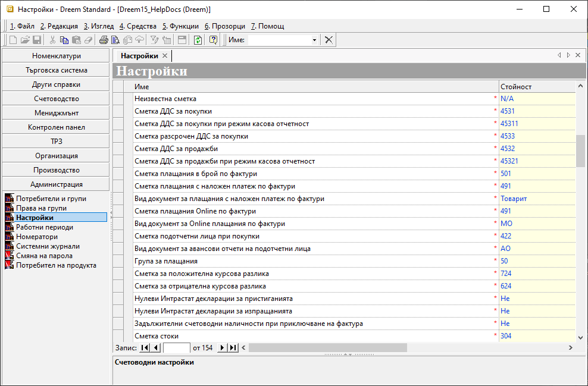

```{only} html
[Нагоре](000-index)
```

# **Счетоводни настройки**

За системата са необходими глобални счетоводни настройки, на чиято база по подразбиране се прилагат счетоводни документи и сметки, извършват се различни проверки и генерации. 

Процесът по конфигуриране на счетоводните настройки е следният:

1) Избира се група функции **Администрация || Настройки**, където в секция **Група: Счетоводни настройки** е списъкът с реквизитите, достъпни за настройка.  
На всяка от посочените опции в колона **Име** съответства жълто поле за настройка в колона **Стойност**.  

{ class=align-center w=15cm }

- **Неизвестна сметка** - настройката се прилага, когато липсва настроена счетоводна сметка за операцията в Автоматичен осчетоводител;  
- **Сметка ДДС за покупки** - избраната сметка се прилага при осчетоводяването на фактура за покупка на реда с ДДС;  
- **Сметка ДДС за покупки при режим касова отчетност** - избраната сметка се прилага на реда с ДДС в счетоводната статия при осчетоводяване на фактура за покупка (касова отчетност);  
- **Сметка разсрочен ДДС за покупки** - настроената счетоводна сметка се прилага при осчетоводяване на фактура за покупка с разсрочен ДДС;  
- **Сметка ДДС за продажби** - избраната счетоводна сметка се прилага при осчетоводяване на фактура за продажба на реда с ДДС в счетоводния документ;  
- **Сметка ДДС за продажби при режим касова отчетност** - настроената сметка се прилага за ред с ДДС в счетоводната статия при осчетоводяване на фактура за продажба (касова отчетност);  
- **Сметка плащания в брой по фактури** - поле за избор на счетоводна сметка, която да се прилага при генериране на плащане в брой по фактура за продажба в счетоводството;  
- **Сметка плащания с наложен платеж по фактури** - поле за избор на счетоводна сметка, която да се прилага при генериране на плащане с наложен платеж по фактура за продажба в счетоводството;  
- **Вид документ за плащания с наложен платеж по фактури** - поле за избор на вид документ, който се създава автоматично при генериране на плащане с наложен платеж по фактура за продажба в счетоводството;  
- **Сметка плащания Online по фактури** - избира се счетоводна сметка,която се прилага при генериране на Online плащане по фактура за продажба в счетоводството;  
- **Вид документ за Online плащания по фактури** - избира се вид документ, който се създава автоматично при генериране на Online плащане по фактура за продажба в счетоводството;  
- **Сметка подотчетни лица при покупки** - избира се сметка, която се прилага при генериране на запис в счетоводството при покупки на подотчетни лица;  
- **Вид документ за авансови отчети на подотчетни лица** - настройка за вид документ, който се създава автоматично при генериране на авансов отчет в счетоводството при покупки на подотчетни лица;  
- **Група за плащания** - поле за избор на счетоводна група сметки, която да се прилага при изчисляване на сума на плащания по счетоводни документи в справки;  
- **Сметка за положителна курсова разлика** - в полето се избира счетоводната сметка, по която се отразяват положителните курсови разлики при осчетоводяване на банкови и касови документи във валута;  
- **Сметка за отрицателна курсова разлика** - в полето се избира счетоводната сметка, по която се отразяват отрицателните курсови разлики при осчетоводяване на банкови и касови документи във валута;  
- **Нулеви Интрастат декларации за пристиганията** - поле с настройка, позволяваща/забраняваща при приключване на Интрастат декларации да се генерират нулеви документи;  
- **Нулеви Интрастат декларации за изпращанията** - поле с настройка, позволяваща/забраняваща при приключване на Интрастат декларации да се генерират нулеви документи;  
- **Задължителни счетоводни наличности при приключване на фактура** - поле с настройка, указваща дали системата да проверява счетоводните наличности към датата на документа при приключване на фактура;  
- **Сметка стоки** - поле за избор на сметка, която се използва при проверка на наличността на счетоводния склад при приключване на фактура;  
- **Синхронизиране цени складови документи търговска/счетоводна система** - поле с настройка за синхронизиране на цени от търговската към счетоводната система;  
Ако опцията не е включена, цените на генерирания счетоводен складов документ се вземат от складовия документ в търговската система;  
- **Списък сметки за преизчисляване на склада** - настройката се използва при преизчисляване на склада: системата прави проверка дали избраната сметка съществува в този списък;  
Ако списъкът е празен, проверката се игнорира.  
- **Равнение на счетоводен и данъчен амортизационен план** - поле с настройка, указваща дали да се поддържат еднакви стойности в счетоводен и данъчен амортизационен план, при което се поддържат еднакви дати и суми за равнозначност на плановете;  
- **Закръгляване до годишната квота на счетоводен и данъчен амортизационен план** - поле с настройка за изравняване на сумата на месечните амортизации до сумата на годишната амортизация;   Опцията се отнася за годините след 2019 година (включително).  
- **Сметка разходи за бъдещи периоди** - поле за избор на счетоводна сметка, която системата прилага при генериране на счетоводни документи за отложени разходи;  
- **Документ за разходи за бъдещи периоди** - избира се вид документ, който системата създава при генериране на счетоводни документи за отложени разходи;  
- **Сметка разходи в минал период** - поле за избор на счетоводна сметка, която системата прилага при генериране на счетоводни документи за разходи в минал период;  
- **Документ за разходи в минал период** - избира се вид документ, който системата създава автоматично при генериране на счетоводни документи за разходи в минал период;  
- **Сметка приходи за бъдещи периоди** - избира се сметка, която системата да прилага при генериране на счетоводни документи за отложени приходи;  
- **Документ за приходи за бъдещи периоди** - избира се вид документ, който системата създава при генериране на счетоводни документи за отложени приходи;  
- **Сметка приходи в минал период** - поле за избор на счетоводна сметка, която системата прилага при генериране на счетоводни документи за приходи в минал период;  
- **Документ за приходи в минал период** - избира се вид документ, който системата създава  при генериране на счетоводни документи за приходи в минал период;  

2) **Запис** - Бутон в лентата с инструменти, записващ направените промени.

## **Свързани статии**

[Счетоводни номенклатури](001-acc-ref-nom.md)