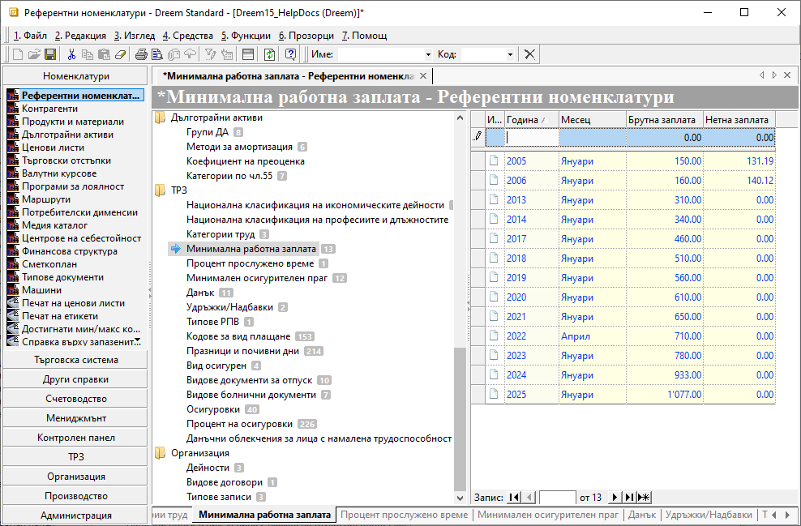

```{only} html
[Нагоре](000-index)
```

# **Референтни номенклатури**

- [Въведение](#въведение)  
- [Нова референтна номенклатура](#нова-референтна-номенклатура)  
- [Реквизити](#реквизити)  

## **Въведение**

За коректната работа на модул **ТРЗ** е необходимо конфигуриране на някои задължителни параметри.  
Тези настройки се правят предварително в **Референтни номенклатури**. Голяма част от тях са системно въведени и се актуализират автоматично.    

## **Нова референтна номенклатура**

Процесът по добавяне на нова референтна номенклатура е следният:  

1) Избира се група функции **Номенклатури || Референтни номенклатури || ТРЗ**.  
Нова референтна номенклатура се добавя чрез реда за нов запис, стоящ в началото на всеки списък.   

{ class=align-center w=15cm }

2) **Национална класификация на икономическите дейности** – Поле **Код** се попълва, като може да се използва абревиатура на наименованието на дейността. В колона **Национална класификация на икономическите дейности** се посочва основната дейност на предприятието. Попълват се задължително и полета с **Процент трудова злополука** и **От дата**.  
Ако има самоосигуряващи се лица, **Процент трудова злополука** на реда трябва да е **0**. 

3) **Национална класификация на професиите и длъжностите** – В отделни записи се въвеждат всички длъжности и професии, за които има назначени служителите във фирмата. Това включва и самоосигуряващите се лица.  

4) **Категории труд** - За улеснение номенклатурата е системно въведена.  
Основно изискване е да има настроена категорията по подразбиране - според категория труд, отнасяща се до по–голямата част от служителите.  

5) **Минимална работна заплата** - В съответните колони се попълват брутна и нетна минимална РЗ, година и месец, от които са валидни.  

6) **Процент прослужено време** – Чрез тази настройка се посочва процент, с който се увеличава РЗ според годините трудов стаж на служителя.  
Попълват се задължително колони **Минимален бр. години стаж** и **Процент**. По желание се попълва колона **Максимален бр. години стаж**.  

7) **Минимален осигурителен праг** - Настройката изисква за всяка година да се попълва минимален и максимален осигурителен праг. Това се отнася за всяка една от длъжностите във фирмата.  
Полета **Национална класификация на икономическите дейности** и **Национална класификация на професиите и длъжностите** се обзавеждат от падащи списъци, които трябва да са предварително въведени (т.2 и т. 3).  
В номенклатурата се добавя и ред за самоосигуряващи се лица, където **Пореден номер на основната икономическа дейност на осигурителя** е **9999**.  

8) **Данък** - Настройката за ДОД изисква въвеждане на отделен ред за всяка година. В полета **От** и **До** се посочва интервал с долна и горна граница на дохода, за който се прилагат настройките за данък на реда. В поле **Процент** се въвежда % ДОД, който се начислява. В поле **Плюс** може да се попълни сума, която се добавя към крайната стойност на данъка.  
За да се активира ежемесечно начисляване на данък, се постави отметка в поле **Месечен**.  

9) **Удръжки/Надбавки** - Настройката позволява да се въведе списък с различни удръжки и/или надбавки, които да се отнесат по колони от Декларация 1.  
За всяка удръжка/надбавка се поставя отметка в необходимите колони: **Дължат се осигуровки**, **Социален разход**, **Начислява се ДОД**, **% просл. време**, **Следи се в картона на служителя** и **Не е база за изчисление на отпуск**. 

10) **Типове РПВ** - За добавяне на нова номенклатура системата изисква попълване на поле **Код** и поле **Типове РПВ** с наименование.  

11) **Кодове за вид плащане** - Настройката е системно въведена.  
За добавяне на нов запис се попълват поле **Код** и наименованието му в поле **Кодове за вид плащане**.

12) **Празници и почивни дни** - Настройката е системно въведена и включва всички дни за годината, официално приети за неработни.  
Системата дава възможност да се добавят нови записи. Попълват се дата, наименование и в колона **Тип** денят се посочва като *Официален празник* или *Почивен*.  

13) **Вид осигурен** - В тази номенклатура се настройва списък с кодове и вид осигурен според указанията за попълване на Декларация 1.  

14) **Видове документи за отпуск** - Номенклатурата включва системно въведени настройки с необходимите видове документи за отпуск.  

15) **Видове болнични документи** - Номенклатурата включва системно въведени настройки с необходимите видове болнични документи.   

16) **Осигуровки** - Номенклатурата включва системно въведени настройки с необходимите осигуровки.    

17) **Процент на осигуровки** – Настройката включва въвеждане на списък с данни за проценти от заплатата, които се начисляват за осигуровки.    
В полета **% за сметка на служителя** и **% за сметка на работодателя** се посочва каква част от съответните осигуровки се разпределят за служител и работодател.  
Настройките се попълват с отделен ред за всяка година.  

18) **Данъчни облекчения за лица с намалена трудоспособност** - Настройката включва списък по години с месечната сума на данъчното облекчение за лица с намалена трудоспособност.    

19) **Запис** - Направените промени трябва да бъдат записани. Това става чрез клавишна комбинация [**Ctrl+S**] или от бутон [**Запис**] в лентата с инструменти.  

## **Реквизити**

- **Икона** - полето съдържа изображение със символ, който варира според състоянието на реда/настройката;  
- **Код** - в полето се попълва код в цифри, букви и/или други знаци;  
- **Национална класификация на икономическите дейности** - въвежда се наименование на икономическата дейност;  
- **От дата** - поле за избор на начална дата;  
- **Процент трудова злополука** - указва % трудова злополука за икономическата дейност на реда;  
- **Пореден номер на квалификационна група професии на осигурения (кл12.1 от Д1)** - указва код по НКПД за избраната професия/длъжност на реда;  
- **Национална класификация на професиите и длъжностите** - наименование на професия/длъжност по официално публикуваната НКПД от МТСП и НСИ;  
- **Категории труд** - наименование на категория труд;  
- **Година** - поле за въвеждане на година;  
- **Месец** - поле с падащ списък за избор на месец;  
- **Брутна заплата** - въвежда се минималната брутна РЗ за годината на реда;  
- **Нетна заплата** - въвежда се минималната нетна РЗ за годината на реда;  
- **Минимален бр. години стаж** - указва минималния брой години необходим стаж;  
- **Максимален бр. години стаж** - указва максималния брой години необходим стаж;  
- **Процент** - поле за въвеждане на проценти;  
- **Пореден номер на основната икономическа дейност на осигурителя (кл12.3 от Д1)** - указва номер на икономическа дейност по КИД;  
- **Минимален осигурителен праг** - указва сума на минималния осигурителен праг за избраната професия/длъжност на реда;  
- **Максимален осигурителен праг** - указва сума на максималния осигурителен праг за избраната професия/длъжност на реда;  
- **Самоосигуряващ се** - указва дали настройката на реда се отнася до самоосигуряващи се лица;  
- **Месечен** - указва дали настройката на реда е месечна;  
- **От** - указва долната граница, над която се прилага данъкът на реда;  
- **До** - указва горната граница, до която се прилага данъкът на реда;   
- **Плюс** - указва сума, която се добавя при изчисляване на ДОД;  
- **Удръжки/Надбавки** - наименование на вида удръжка/надбавка;  
- **Тип** - отваря списък за избор на вид на настройката на реда;  
- **Дължат се осигуровки** - указва дали за удръжката/надбавката се дължат осигуровки;  
- **Социален разход** - указва дали удръжката/надбавката е социален разход;  
- **Начислява се ДОД** - указва дали за удръжката/надбавката се начислява ДОД;  
- **% просл. време** - указва дали за удръжката/надбавката се включва при изчисляване на % прослужено време;  
- **Колона от Декл. 1** - отваря падащ списък за избор с номера на колоните в *Декларация 1*;  
- **Следи се в картона на служителя** - указва дали удръжката/надбавката се следи в картона ан служителя;  
- **Не е база за изчисление на отпуск** - указва дали удръжката/надбавката участва като база за изчисление на отпуск;  
- **Нощен труд** - указва дали удръжката/надбавката е свързана с нощен труд;  
- **Код на вида доход** - отваря падащ списък за избор на код на вида доход;  
- **Типове РПВ** - в полето се попълва наименование на РПВ;  
- **Потребител на продукта** - отваря форма **Контрагенти** за избор на потребителя на продукта;   
- **Кодове за вид плащане** - наименование на вида плащане, отнасящо се към настроения код на реда;  
- **Празници и почивни дни** - въвежда се наименованието на празника/деня;  
- **Вид осигурен** - поле с наименование за вид на осигурения;  
- **Видове документи за отпуск** - наименование на вида документ за отпуск;  
- **Видове болнични документи** - наименование на вида болничен документ;  
- **Осигуровки** - наименование за вид на осигуровките;  
- **Категория труд** - указва за коя категория труд се отнасят осигуровките на реда;  
- **За родените след 1960** - указва дали осигуровките на реда се отнасят за родените след 1960 год.;  
- **Вид плащане** - указва кода, отговарящ на вида плащане;  
- **% за сметка на служителя** - указва какъв % от осигуровката на реда е за сметка на служителя;  
- **% за сметка на работодателя** - указва какъв % от осигуровката на реда е за сметка на работодателя;  
- **Осигуровка** - отваря списък за избор на вид осигуровка;  
- **Сума** - поле за въвеждане на сума в местна валута;  
- **По подразбиране** - указва номенклатура на реда като основна настройка по подразбиране;   
- **Активен** - чрез поставяне/махане на отметка редът се настройва като активна/неактивна номенклатура;  
- **Допълнителен код** - полето може да се обзаведе с допълнителен код (превод) чрез десен бутон на реда и *Преведи*;   
- **Допълнително име** - полето може да се обзаведе с допълнително наименование (превод на различни езици) чрез десен бутон на реда и *Преведи*;    
- **Потребител създаване** - информация за потребител, добавил текущия ред;  
- **Дата създаване** - дата и час на добавяне на текущия ред;  
- **Потребител последна модификация** - потребителско име на направилия последните корекции в данните на реда;  
- **Дата последна модификация** - информация за дата и час, когато са направени последните изменения в данните на текущия ред;  