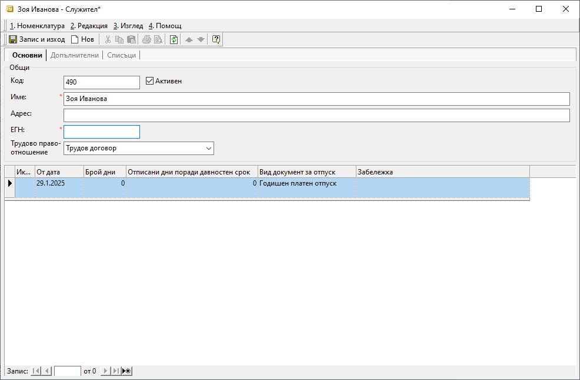

```{only} html
[Нагоре](000-index)
```

# **Номенклатура Служители**

- [Въведение](#въведение)  
- [Добавяне на нов служител](#добавяне-на-нов-служител)  
- [Реквизити](#реквизити)  

## **Въведение**

Настройката на служители е задължителна за обработката на документи в модул ТРЗ. Служителите трябва бъдат създадени предварително, след което да се обработват разчетно-платежни ведомости, сметки за изплатени суми, документи за отпуск и болнични.  

## **Добавяне на нов служител**

Процесът по добавяне на нов служител е следният:  

1) Избира се група функции **Номенклатури » Контрагенти**. Отваря се форма за редакция на контрагента от тип **Потребител на продукта** и служителите се въвеждат на отделни редове в списъка с персони.  

2) Чрез десен бутон на мишката върху избрана персона и **Редакция служител** се отваря форма за редакция **Служител**. Тук се въвеждат задължителните данни, необходими при обработка на документи в модул **ТРЗ**.   
Настройката се прави отделно за всяка персона.  

{ class=align-center w=15cm }

Задължителни за попълване реквизити в раздел **Основни** са имена, адрес, ЕГН и вид на трудовото правоотношение за служителя.    

{ class=align-center w=15cm }

В раздел **Допълнителни**:

Попълват се необходимите реквизити в секции **Лична информация**, **Дати**, **Трудов стаж по специалността при постъпване**, **Общ трудов стаж при постъпване**, **Местоположение**, **Лична карта**, **Телефони**, **Банкова сметка**. 
В група настройки **Възнаграждение** задължително се посочват:  
- **Аванс** - попълва се сума на аванс, ако служителят получава такъв;  
- **Основна заплата** - поле с брутно трудово възнаграждение;  
- **НПЗ** - данните се използват в раздел *Разходен център* на РПВ;  
В група настройки **Други** са включени множество задължителни реквизити:  
- **Категория труд** - в полето се избира категория от предварително въведен списък;  
Системата предлага настроенята по подразбиране категория. Настройката се използва в редовете на РПВ.   
- **Вид осигурен** - поле за избор на вид осигурен от предварително въведен списък;  
Настройката се използва при подаване на Декларация 1. 
- **Работодател по основно трудово правоотношение** - посочва се дали **Потребител на продукта** е работодател по основно трудово правоотношение за служителя;  
Настройката се използва при справки по чл. 45.   
- **Тип работно време** - от падащия списък в полето се избира тип на работното време - 5 дневна работна седмица, работа на смени;  
- **Брой работни часове** - в това поле се посочват работните часове на дневна база;   
- **Тип РПВ** - поле за избор на тип РПВ от предварително въведените през **Референтни номенклатури**;  
- **ГВРС**, **Самоосигуряващ се**, **Пенсионер**, **Намалена работоспособност**, **Начислява се % прослужено време**, **Чужденец** и **Лични удръжки за сметка на служителя** - настройката за тези реквизити трябва да бъде зададена като утвърдителна с *Да*, или като отрицателна - с *Не*;  

{ class=align-center w=15cm }

В раздел **Списъци**:

- **Удръжки/Надбавки** – трябва да се посочат, ако се начисляват на някои от служителите (например запор или при уволнение), за да се вземе предвид от системата при изчисляване на месечната заплата на служителя.  
 Списъкът с удръжки и надбавки трябва е предварително двъведен от **Номенклатури » Референтни номенклатури » ТРЗ**.  
- **Предишен доход** - списък с данни за предишен доход по години;  
- **Възнаграждения, осигуровки и данъци при други работодатели** - списък с данни по години за облагаем доход, ДОО, ДЗПО, ЗО и др. при други работодатели;  
- **Данъчни облекчения и необлагаеми доходи** - настройка със суми на намаленията на годишната данъчна основа;  
Данните се въвеждат отделно за всяка година.  
- **Минимален осигурителен праг** – от предварително настроен списък се избира длъжност за текущия служител;  
- **Процент прослужено време** - от предварително настроен списък се избира процент прослужено време;  
- **Вноски** – в тази група се избират всички ДОО, ДЗПО и ЗО, които се изплащат за съответното лице.

{ class=align-center w=15cm }

 4)  **Запис и изход** - Бутон, който записва промените и затваря формата за редакция на служител.  
 С това системата едновременно създава нови записи за служителя в **Номенклатури » Контрагенти** и в **ТРЗ » Служители**.  

## **Реквизити**

   В раздел **Основни**:  
   - **Код** - в полето се попълва код в цифри, букви и/или други знаци;  
   Системата автоматично обзавежда полето с пореден номер, ако бъде оставено празно.   
   - **Активен** - чрез поставяне/махане на отметка служителят се настройва като активна/неактивна номенклатура;  
   - **Име** – в това поле се попълват три имена на служителя;  
   - **Адрес** - поле с адрес по лична карта на служителя;  
   - **ЕГН** - задължителен реквизит с ЕГН на служителя;  
   - **Трудово правоотношение** - от падащия списък в полето се избира вид на трудовите правоотношения;  

   В раздел **Допълнителни**:  
   **Реквизити: Дименсии**  
   - **Група** - В тази секция се визуализират отделни полета за всички предварително дефинирани дименсии за служители. Настройват се по желание, като се избират всички дименсии (категории), към които принадлежи служителят.  
   Реквизитите с дименсии са променливи, като зависят от индивидуалните настройки в базата. Достъпни за настройка са предварително настроените списъци с дименсии, създадени от **Номенклатури » Потребителски дименсии**.  

   **Реквизити: Лична информация**  
   - **Фамилия** - поле с фамилно име на служителя;  
   Използва се при подаване на **Декларация 1** за колона *6 Фамилия*.  
   - **Инициали** - поле с инициали на служителя;  
   Използва се при подаване на **Декларация 1** за колона *7 Инициали*.  
   - **Пол** - избор на пол;  
   Използва се при подаване на **Декларация 1** за колона *77 Пол на осигурен с ЛНЧ*.  
   - **Наследен от** - избира се нова номенклатура със служител, наследяващ текущия;    
   Използва се при дублиране на информация за служител при смяна на длъжност, основна заплата през месеца.  
   
   **Реквизити: Дати**  
   - **Дата на постъпване** - избор на дата, на която е постъпил текущият служител;  
   Използва се при генерация на **АРПВ** и **РПВ**.  
   - **Изпитателен срок** - указва размер на изпитателния срок в месеци;  
   Използва се в **Обща справка за ФРЗ, СИС и изпитателен срок** за ТД с изтекъл изпитателен срок.  
   - **Дата на прекратяване** - избор на дата за прекратяване на договорните отношения с текущия служител;  
   Използва се при подаване на **Декларация 1** за определяне последния ден в осигуряване.  
   - **Код на прекратяване на осигуряването** - падащ списък за избор на основание на прекратяването;  
   Използва се при подаване на **Декларация 1** от 2017 г. за клетка 5.1.  
   - **Дата на раждане** - попълва се дата на раждане за текущия служител;  
   Използва се при подаване на **Декларация 1** за колони 74, 75 и 76 *Дата на раждане (ден, месец, година)*.  

   **Реквизити: Трудов стаж по специалността при постъпване**  
   - **Години** - брой години натрупан стаж по специалността към момента на постъпване на служителя;  
   Използва се за изчисляване на трудовия стаж по специалността при печат на фишове.  
   - **Месеци** - допълнителни месеци натрупан стаж по специалността към момента на постъпване на служителя, извън настроените години стаж;  
   Използва се за изчисляване на трудовия стаж по специалността при печат на фишове.  
   - **Дни** - брой дни с натрупан стаж по специалността за служителя, извън посочените години и месеци;  
   Използва се за изчисляване на трудовия стаж по специалността при печат на фишове.  

   **Реквизити: Общ трудов стаж при постъпване**  
   - **Години** - брой години натрупан общ трудов към момента на постъпване на служителя;  
   Използва се за изчисляване на общия трудов стаж при печат на фишове.  
   - **Месеци** - допълнителни месеци натрупан общ трудов стаж към момента на постъпване на служителя, извън настроените години стаж;  
   Използва се за изчисляване на общия трудов стаж при печат на фишове.  
   - **Дни** - брой дни с натрупан обю трудов стаж за служителя, извън посочените години и месеци;  
   Използва се за изчисляване на общия трудов стаж при печат на фишове.  

   **Реквизити: Трудов стаж в предприятието**  
   - **Години** - Използва се само за документация на служителите. Не се използва никъде от системата.   
   - **Месеци** - Използва се само за документация на служителите. Не се използва никъде от системата.  
   - **Дни** - Използва се само за документация на служителите. Не се използва никъде от системата.  

   **Реквизити: Възнаграждение**  
   - **Аванс** - попълва се сума на аванс, ако служителят получава такъв;  
   Участва в редовете на **АРПВ** и **РПВ**.  
   - **Основна заплата** - попълва се брутна работна заплата;  
   Участва в редовете на **АРПВ** и **РПВ**.  
   - **НПЗ** - Използва се в **РПВ**, раздел *Разходен център*.  
   
   **Реквизити: Местоположение**  
   - **Пощенски код** - попълва се пощенски код за адреса на текущия служител;  
   Използва се при подаване на **Декларация 1** за колона *8 Пощенски код* и при заявка за масово откриване на картови сметки.  
   - **Област** - попълва се област, в която попада адресът на текущия служител;  
   Използва се при подаване на **Декларация 1** за колона *9 Област*.  
   - **Населено място** - поле с населено място от адреса на служителя;  
   Използва се при подаване на **Декларация 1** за колона *10 Населено място* и при заявка за масово откриване на картови сметки.  

   **Реквизити: Лична карта**  
   - **Номер** - попълва се номер на лична карта на служител;  
   Използва се при заявка за масово откриване на картови сметки.  
   - **Дата на издаване** - поле за дата на издаване на ЛК на служителя;  
   Използва се при заявка за масово откриване на картови сметки.  
   - **Адрес** - адрес на служителя по лична карта;  
   Използва се само за документация на служителите. Не се използва никъде от системата.  
   - **Издадена от** - информация от личната карта на служителя;  
   Използва се при масови банкови плащания на трудови възнаграждения.  

   **Реквизити: Телефони**  
   - **Мобилен** - телефон за контакт на служителя;  
   Използва се само за документация на служителите. Не се използва никъде от системата.  
   - **Служебен** - служебен телефонен номер на служител;  
   Използва се само за документация на служителите. Не се използва никъде от системата.  
   - **Домашен** - домашен телефонен номер на служител;  
   Използва се само за документация на служителите. Не се използва никъде от системата.  

   **Реквизити: Банкова сметка**  
   - **IBAN** - попълва се IBAN, предоставен от служителя;  
   Използва се за изплащане на трудово възнаграждение по банков път.  
   - **BIC** - падащ списък за избор на BIC на банката, в която е сметката на служителя;  
   Използва се за изплащане на трудово възнаграждение по банков път.  
   - **Име на банка** - поле с име на банката, в която е сметката на служителя;  
   Използва се за изплащане на трудово възнаграждение по банков път.  
   - **Име на служителя за банката** - имена на служителя;  
   Използва се при заявка за масово откриване на картови сметки.  
   - **Име върху картата** - имена на служителя от банковата карта;  
   Използва се при заявка за масово откриване на картови сметки.  

   **Реквизити: Други**  
   - **Категория труд** - падащ списък за избор на категория труд, в която попада длъжността на служителя;  
   Участва в редовете на **РПВ**.  
   - **Вид осигурен** - избор на вид осигурен от предварително настроен списък в **Референтни номенклатури**;  
   Използва се при подаване на **Декларация 1** за колона *12 Вид осигурен*.  
   - **Работодател по основно трудово правоотношение** - използва при справки по чл.45;  
   - **Тип работно време** - избор на тип на работното време на служителя;  
   Участва в редовете на **РПВ**.  
   - **Брой работни часове** - попълва се брой на работните часове за един работен ден;  
   Участва в редовете на **РПВ**.  
   - **Ел. поща** - имейл на служителя;  
   Използва се само за документация на служителите. Не се използва никъде от системата.  
   - **Тип РПВ** - поле със списък за избор на тип РПВ, в която участва текущият служител;  
   Използва се при генерация на **АРПВ**/**РПВ**.  
   - **ГВРС** - настройка за гарантирани вземания при несъстоятелност на работодателя;  
   Използва се при генерация на **РПВ** и при подаване на **Декларация 1** за колона *80 ГВРС*.  
   - **Самоосигуряващ се** - указва дали служителят е самоосигуряващ се;  
   Използва се при генерация на **РПВ**.  
   - **Пенсионер** - указва дали служителят е пенсиониран;  
   Участва в редове на **РПВ**.  
   - **Намалена работоспособност** - указва дали служителят е с намалена работоспособност;  
   Участва в редовете на **РПВ**. Използва се при подаване на **Декларация 1** за колона *79 Намалена трудоспособност*.  
   - **Начислява се % прослужено време** - указва дали за служителя се начислява процент прослужено време;  
   Използва се при генерация на **РПВ**.  
   - **Чужденец** - указва дали лицето е чужденец;  
   Използва се при подаване на **Декларация 1 **за колона *5 Чужденец.*  
   - **Код на държава** - номенклатура на ISO 3166-1 alpha-2. Два символа.  
   - **Лични удръжки за сметка на служителя** - указва дали има лични удръжки за сметка на служителя;  
   Използва се в **РПВ** раздел *Разходен център*.  
   - **Разходен център** - отваря форма за избор на център на себестойност;  
   Участва в редовете на *РПВ*.  
