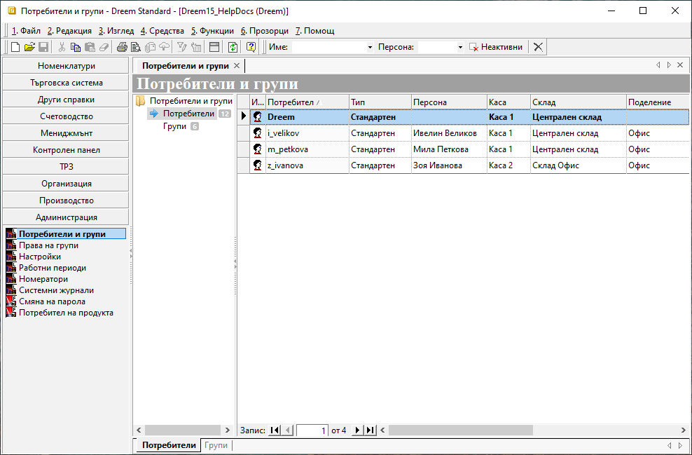
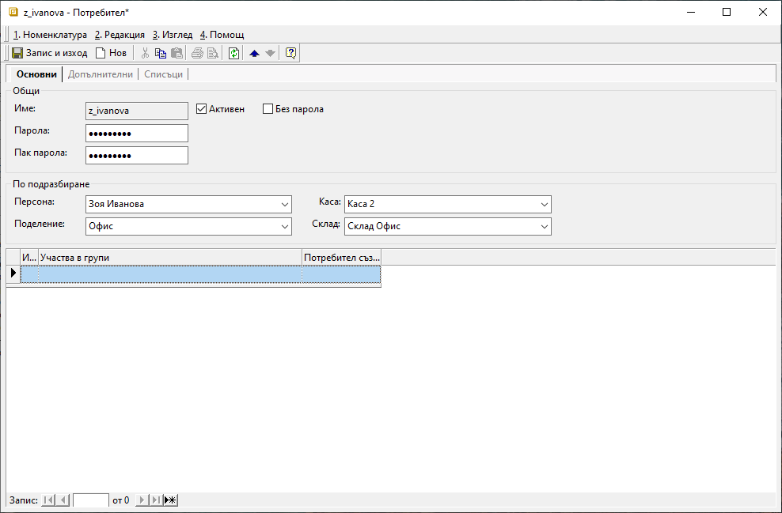
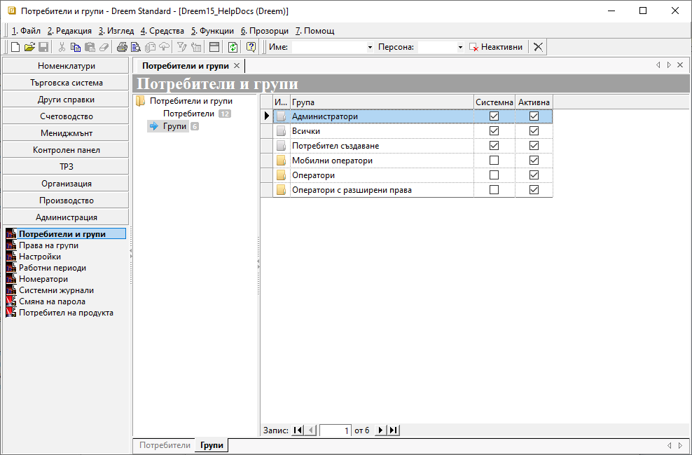
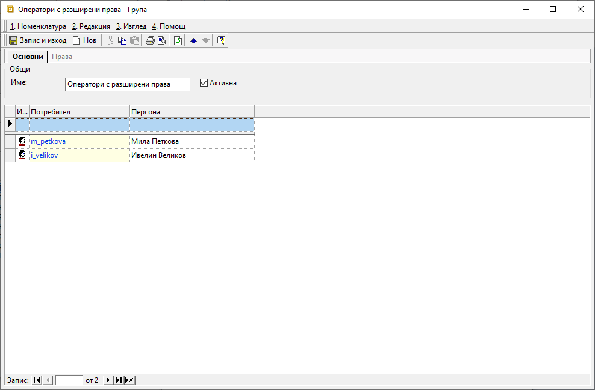
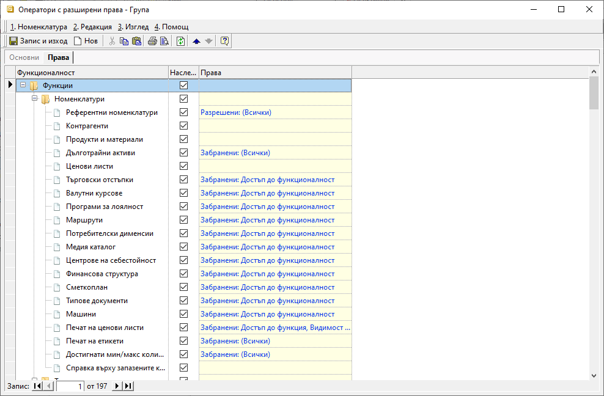

```{only} html
[Нагоре](000-index)
```

# Потребители и групи

- [Въведение](https://docs.unicontsoft.com/guide/erp/001-ref/004-settings/001-users.html#id2)  
- [Потребители](https://docs.unicontsoft.com/guide/erp/001-ref/004-settings/001-users.html#id3)  
- [Групи](https://docs.unicontsoft.com/guide/erp/001-ref/004-settings/001-users.html#id4)  

## **Въведение**

Достъпът до **Dreem ERP** се осъществява чрез потребители, които трябва да бъдат въведени предварително от меню **Администрация**.  

Според нуждите на дейността в организацията, могат да бъдат настроени права за достъп и работа с функционалности и данни. Правата се дефинират по групи, в които участват избрани потребители.  

## **Потребители**

1) Нови потребители се създават от **Администрация || Потребители и групи**. След маркиране на раздел **Потребители**, вдясно се отваря списък с въведени до момента потребители, който включва и системния потребител *Dreem*.  

{ class=align-center w=15cm }

2) С десен бутон върху списъка се избира **Нов потребител**, което отваря празна форма за въвеждане на данни.  

В секция **Основни** се попълват:  

 - **Име** - в полето се изписва на латиница потребителско име;  
 - **Активен** - чрез поставяне на отметка потребителят се  маркира като действащ, което му дава достъп до системата;  
 - **Без парола** - чрез поставяне на отметка, потребителят ще има достъп до системата без парола;  
 - **Парола / Пак парола** - попълвате паролата на потребителя. При първото му влизане системата ще има възможност да я смени. Тези полета са активни, когато поле **Без парола** не е маркирано.

{ class=align-center w=15cm }

> Данните, въведени в секция *По подразбиране*, ще бъдат прилагани автоматично от системата за документите, които генерира съответният потребител.

 - **Персона** - поле за избор на персона от предварително настроен списък със служители за контрагент **Потребител на продукта**;  
 Данните се използват при генерация на нов документ за автоматично обзавеждане на поле **Съставил**.  
 - **Каса** - поле за избор на каса по подразбиране, която системата ще предлага при генерация на касови документи;  
 - **Поделение** - поле за избор на поделение по подразбиране, за което избраният потребител работи;  
 Системата ще предлага данните при генерация на документи, като прилага настроения за поделението номератор.   
 - **Склад** - поле за избор на склад по подразбиране, който системата ще предлага при генерация на свързани със склад документи;  
 - **Участва в рупи** - списък с групи, към които е присъединен потребителят;  
 Участие в нова група се настройва от реда за добавяне на нов запис.  

В секция **Допълнителни** се настройват задължителните реквизити:  

 - **Достъп само за четене** - поле с настройка за вид на достъпа - само за четене или за въвеждане на данни;  
Настройката **Достъп само за четене: Да** може да се използва за одиторски профили.  
- **Търговски обект** - поле за избор на търговски обект по подразбиране;  
Системата прилага настройката за автоматично попълване на търговския обект при продажба.  
- **Тип** - поле за избор на режим на достъп до мобилната платформа на системата;  
При избран тип *0 - Стандартен* системата позволява пълен достъп.
За потребители от тип *1 - Интернет* е позволен достъп единствено до мобилната платформа.

## **Групи**

1) Нови групи с потребители се създават от **Администрация || Потребители и групи**.  
След маркиране на раздел **Групи**, вдясно се отваря списък с въведени до момента групи потребители. В него са включени и системните настройки *Администратори*, *Всички* и *Потребител създаване*.  

{ class=align-center w=15cm }

2) С десен бутон върху списъка се избира **Нова група**, което отваря празна форма за въвеждане на данни.  

В секция **Основни** се попълват:  

 - **Име** - в полето се попълва наименование на групата;  
 - **Активна** - чрез поставяне на отметка системата отчита настройките за групата и ги прилага за участниците в нея;   
 - **Потребител** - поле за избор на участници в текущата група;  
Потребителите трябва да са предварително настроени. Може да се добавят от списък чрез бутона с трите точки или директно изписване на името в полето.

{ class=align-center w=15cm }

Секция **Права** осигурява бърз достъп до настроените права за текущата група и тяхното управление.  

{ class=align-center w=15cm }

3) **Запис и изход** - бутон, който запазва модификациите и излиза от формата.

## **Реквизити**

**Реквизити на Потребители**  
1) В раздел **Основни**:  
   - **Име** – потребителското име е задължително поле;    
   - **Активен** - чрез поставяне/махане на отметка потребителят се настройва като активен/неактивен;  
   - **Без парола** - ;  
   - **Парола** - ;  
   - **Пак парола** - ;  
   - **Персона** - ;  
   - **Поделение** - ;  
   - **Каса** - ;  
   - **Склад** - ;  
   - **Участва в групи** - ;  
 2) В раздел **Допълнителни**:  
    **Реквизити: Основни**  
    - **Код** - Указва код на потребител в системата. Използва се при генериране на Уникален номер на продажба (УНП).  
    - **Достъп само за четене** - Указва достъп само за четене на данни. Може да се използва за одиторски профили.  
    - **Работно място с ФУ** - Указва работно място с фискално устройство по подразбиране за потребителя. Използва се при продажби за генериране на Уникален номер на продажба (УНП).  
    - **Търговски обект** - Указва търговски обект по подразбиране за потребителя. Използва се за автоматично попълване на търговския обект при продажба.  
    - **Тип** - Указва режима на достъп до мобилната платформа на системата. Тип '1 - Интернет' позволява достъпване само на мобилната платформа, а '0 - Стандартен' има пълен достъп.  
    - **Длъжност** - Указва длъжност заемана от лицето. Използва се за справки.  
    - **Начална страница (URL)** - Указва адрес в интернет (URL), който да се зареди в контейнера при първоначално стартиране на системата.  
    - **Контрол при генериране** - Указва XML структура за контрол при генериране на документи.  

    **Реквизити: POS терминал**  
    - **Каса персонално чекмедже** - Ако операторът се отчита със собствено чекмедже, тук се избира като коя каса се води в Dreem.  
    - **Достъп до склад** - Ако е празно, операторът има достъп до всички POS терминали. Иначе само до POS терминал, който е настроен да работи с този склад.  
    - **Име на оператор** - Име на оператор по док. за самоличност, което се отпечатва на фискални бонове.  
    - **Номер за ФУ** - Номер на оператор, който се отпечатва на фискални бонове.  

    **Реквизити: Dreem Mobile**  
    - **Мобилен склад** - Указва склад, от който се извършват продажбите на място. Ако е празно потребителят не може да извършва продажби през мобилните устройства.  
    - **Мобилна каса** - Указва каса, в която се събират пари от извършените продажби на място. Ако е празно потребителят не може да събира пари през мобилните устройства.  
    - **Подотчетна каса** - Указва каса на подотчетното лице, която служи за изчистване и зареждане на мобилната каса след Z-отчети.  
    - **Безналична каса** - Указва каса, в която се обработват картови плащания от извършените продажби на място. Ако е празно потребителят не може да извършва картови плащания през мобилните устройства.  
    - **Транспортно средство** - Указва транспортното средство за потребителя, което се предлага по подразбиране.  
    - **Достъп до данни** - Указва дали дилърът има достъп до всички документи на контрагентите от пула или само до тези, които са издадени от него. Ако не е указано, дилърът има достъп само до собствените си документи.  
    - **Пул контрагенти** - Указва дименсиите, които служат за филтри при експорт на номенклатурата на контрагентите и поделенията за потребителя.  
    - **Пул контрагенти по подразбиране** - Указва дименсия, която ще се вземе по подразбиране при добавяне на нов контрагент през мобилното приложение.  
    - **Пул продукти** - Указва дименсиите, които служат за филтри при експорт на номенклатурата на продуктите за потребителя.  
    - **Конфигурация мобилно устройство** - Указва конфигурация за мобилно устройство като XML структура.  

3) В раздел **Списъци**:  
   - **Достъп до контрагенти** - ;  
   - **Шаблон на документи** - ;  
   - **Ефективни права** - ;  

**Реквизити на Групи**  
1) В раздел **Основни**:  
   - **Име** – наименованието на групата е задължително поле;    
   - **Активна** - чрез поставяне/махане на отметка групата се настройва като активна/неактивна;  
   - **Потребител** - ;  
   - **Персона** - ;  

2) В раздел **Права**:  
   - **Функционалност** - ;  
   - **Наследяване** - ;  
   - **Права** - ;  


