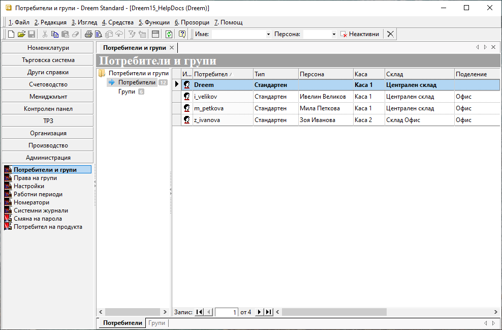
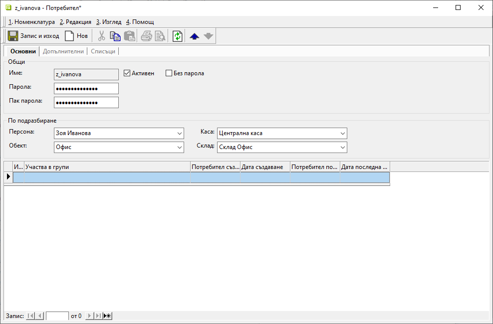
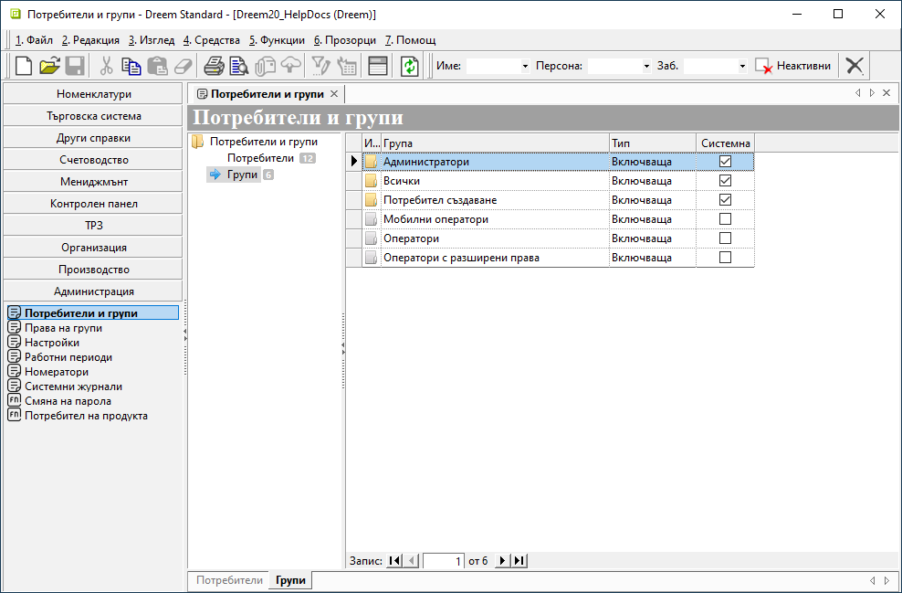
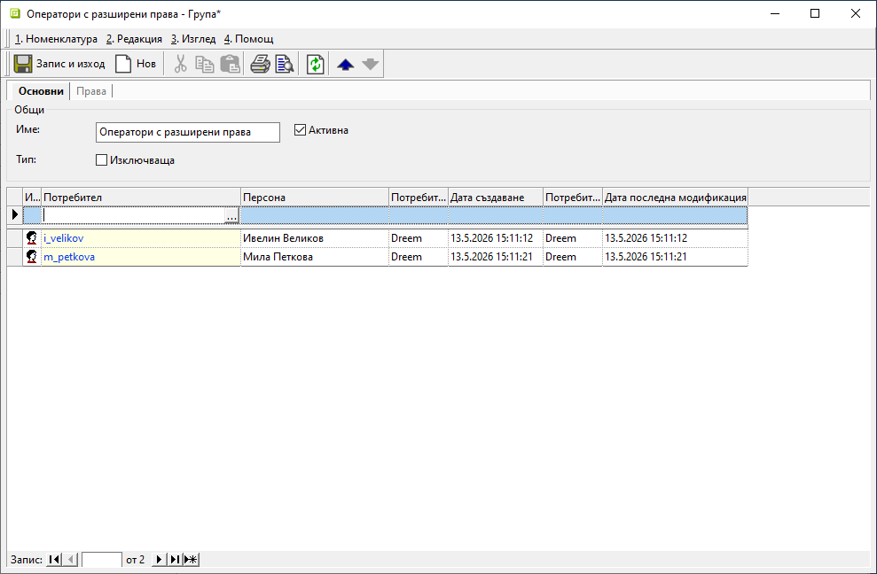
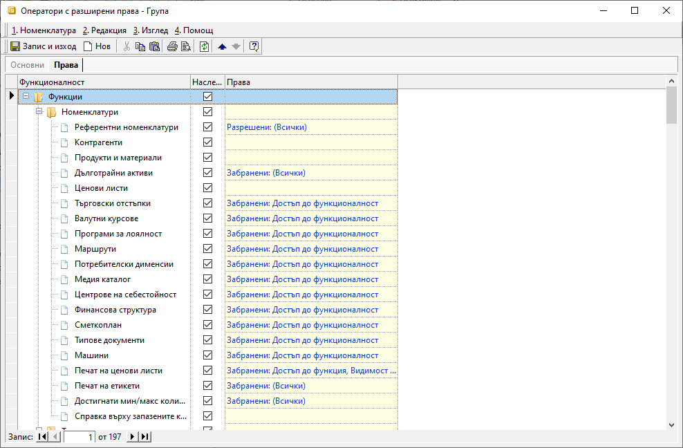

```{only} html
[Нагоре](000-index)
```

# **Потребители и групи**

- [Въведение](#въведение)  
- [Потребители](#потребители)  
- [Групи](#групи)  
- [Реквизити](#реквизити)  

## **Въведение**

Достъпът до **Dreem ERP** се осъществява чрез потребители, които са предварително настроени.  

Според нуждите на дейността в организацията за служителите се определят роли. На тази база се дефинират групите, в които участват отделните потребители. За всички тях се настройват права за достъп и работа с определени функционалности и данни.  

## **Потребители**

1) **Създаване**   

Нови потребители се създават от **Администрация » Потребители и групи**. С маркиране на раздел **Потребители** се отваря списък с въведени до момента потребители.  

> В списъка е включен и системният потребител **Dreem**.  
Препоръчително е да не се редактира и използва.  

{ class=align-center w=15cm }

2) **Настройка**  

С десен бутон върху списъка вдясно се избира **Нов потребител**, което отваря празна форма за въвеждане на данни.  

В секция **Основни** се попълват:  

 - **Име** - В полето се изписва на латиница потребителско име.  
 - **Активен** - Чрез поставяне/махане на отметка потребителят се маркира като действащ или не, което му дава/отказва достъп до системата.  
 - **Без парола** - Чрез поставяне на отметка потребителят ще има достъп до системата без парола.  
 - **Парола / Пак парола** - В полетата се попълва паролата на потребителя. При първото му влизане системата ще има възможност да я смени.  
 Тези полета са активни, когато поле **Без парола** не е маркирано.  

{ class=align-center w=15cm }

> Данните от секция *По подразбиране* ще бъдат прилагани автоматично от системата за документите, които потребителят генерира.  

 - **Персона** - В полето се избира персона от предварително настроен списък със служители за **Потребител на продукта**.  
 Данните се използват при генерация на нов документ за автоматично обзавеждане на поле **Съставил**.  
 - **Каса** - Избира се каса по подразбиране, която системата ще предлага при генерация на касови документи.  
 - **Обект** - Избира се обект по подразбиране, с който работи избраният потребител.  
 Системата ще предлага данните при генерация на документи, като прилага настроения за обекта номератор.   
 - **Склад** - В полето се посочва склад по подразбиране. Системата го предлага при генерация на свързани със склад документи.  
 - **Участва в рупи** - Указва списък с групите, към които е присъединен потребителят.  
 Участие в нова група се настройва от реда за добавяне на нов запис.  

В секция **Допълнителни** се настройват задължителните реквизити:  

- **Достъп само за четене** - С настройката се указва вид на достъпа - само за преглед на данни или за въвеждане на данни.  
Настройката **Достъп само за четене: Да** може да се използва за одиторски профили.  
- **Търговски обект** - От полето може да се избере търговски обект по подразбиране.  
Системата прилага настройката за автоматично попълване на търговския обект при продажба.  
- **Тип** - Указва се режим на достъп до мобилната платформа на системата.  
При избран тип *0 - Стандартен* системата позволява пълен достъп.  
За потребители от тип *1 - Интернет* е позволен достъп единствено до мобилната платформа.  

3) **Запис**  

Направените настройки могат да бъдат запаметени с бутон [**Запис и изход**] от лентата с инструменти. С това формата за редакция на потребител се затваря.  

## **Групи**

1) **Създаване**  

Нови групи с потребители се създават от **Администрация » Потребители и групи**.  
С маркиране на раздел **Групи** се отваря списък с въведени до момента групи потребители. В него са включени и системните настройки *Администратори*, *Всички* и *Потребител създаване*.  

{ class=align-center w=15cm }

2) **Настройка**  

С десен бутон върху списъка вдясно се избира **Нова група**. Това отваря празна форма за въвеждане на данни.  

В раздел **Основни** се попълват:  

- **Име** - В полето се попълва наименование на групата.  
- **Активна** - Чрез поставяне/махане на отметка групата се маркира като активна/неактивна.
Системата прилага настройките за участниците, когато групата е активна.   
- **Изключваща** - Чрез опцията се указва тип на групата потребители.  
При тип *Включваща* избраните в списъка потребители са участници в групата.  
При тип *Изключваща* цитираните потребители са извадени от състава на групата.  
- **Потребител** - В полето се избират участници в текущата група.  
Може да се добавят от списък чрез бутона с трите точки или директно изписване на името в полето.  
Потребителите трябва да са създадени предварително.  

{ class=align-center w=15cm }

Раздел **Права** осигурява бърз достъп до настроените права за текущата група и тяхното управление.  

{ class=align-center w=15cm }

3) **Запис**  

Модификациите се запазват с бутон [**Запис и изход**]. Формата за редакция на група се затваря автоматично.  

## **Реквизити**

### Реквизити на Потребители  

1) В раздел **Основни**:  
   - **Име** – потребителското име е задължително поле;    
   - **Активен** - чрез поставяне/махане на отметка потребителят се настройва като активен/неактивен;  
   - **Без парола** - с поставяне/махане на отметка потребителят се настройва за вход в системата с/без парола;  
   - **Парола** - в полето се изписва парола за текущия потребител;  
   - **Пак парола** - в полето се въвежда отново паролата за текущия потребител;  
   - **Персона** - падащ списък за избор на персона, свързана с текущия потребител;  
   - **Обект** - отваря списък за избор на обект от предварително настроените за контрагент **Потребител на продукта**;  
   - **Каса** - отваря списък за избор на каса, с която работи текущият потребител;  
   - **Склад** - падащ списък за избор на склад, с който работи текущият потребител;  
   - **Участва в групи** - поле за избор на групи, в които текущият потребител участва;  
   - **Потребител създаване** - информация за потребител, добавил текущия ред;  
   - **Дата създаване** - дата и час на добавяне на текущия ред;  
   - **Потребител последна модификация** - потребителско име на направилия последните корекции в данните на реда;  
   - **Дата последна модификация** - информация за дата и час, когато са направени последните изменения в данните на текущия ред;  

 2) В раздел **Допълнителни**:  
    **Реквизити: Основни**  
    - **Код** - указва код на потребител в системата;  
    Използва се при генериране на Уникален номер на продажба (УНП).  
    - **Достъп само за четене** - указва достъп само за четене на данни;  
    Може да се използва за одиторски профили.  
    - **Работно място с ФУ** - указва работно място с фискално устройство по подразбиране за потребителя;  
    Използва се при продажби за генериране на Уникален номер на продажба (УНП).  
    - **Търговски обект** - указва търговски обект по подразбиране за потребителя;  
    Използва се за автоматично попълване на търговския обект при продажба.  
    - **Тип** - указва режим на достъп до мобилната платформа на системата;  
    Тип *1 - Интернет* позволява достъп единствено до мобилната платформа, а *0 - Стандартен* - пълен достъп.  
    - **Длъжност** - указва длъжност на лицето;  
    Използва се за справки.  
    - **Начална страница (URL)** - указва адрес в интернет (URL), който се зарежда в контейнера при първоначално стартиране на системата;  
    - **Контрол при генериране** - указва XML структура за контрол при генериране на документи;  

    **Реквизити: POS терминал**  
    - **Каса персонално чекмедже** - указва каса, чрез която потребителят се отчита със собствено чекмедже;    
    - **Достъп до склад** - указва склад, до който потребителят има достъп;  
    Ако е указан склад, операторът има достъп само до POS терминала, настроен да работи с този склад. Ако полето е празно, операторът има достъп до всички POS терминали.   
    - **Име на оператор** - име на оператор, което се отпечатва на фискални бонове;  
    - **Номер за ФУ** - номер на оператор, който се отпечатва на фискални бонове;  

    **Реквизити: Dreem Mobile**  
    - **Мобилен склад** - указва склад, от който се извършват продажбите на място;  
    Ако полето е празно, потребителят не може да извършва продажби през мобилните устройства.  
    - **Мобилна каса** - указва каса, която се използва за продажби на място;  
    Ако полето е празно, потребителят не може да регистрира плащания през мобилните устройства.  
    - **Подотчетна каса** - указва каса на подотчетното лице, която се използва за отчитане на потребителя след *Z-отчет*;  
    - **Безналична каса** - указва каса, в която се обработват картови плащания от извършените продажби на място;  
    Ако полето е празно, потребителят не може да извършва картови плащания през мобилните устройства.  
    - **Транспортно средство** - указва транспортно средство по подразбиране за потребителя;  
    - **Достъп до данни** - указва достъп до всички документи на контрагентите от *Пул контрагенти* или само до издадени от потребителя;   
    Ако полето остане празно, потребителят има достъп само до издадените от него документи.  
    - **Пул контрагенти** - указва групите контрагенти, до които потребителят има достъп;  
    Тези дименсии служат за филтри при експорт на номенклатура **Контрагенти** и **Обекти** за потребителя.  
    - **Пул контрагенти по подразбиране** - указва дименсия по подразбиране при добавяне на нов контрагент през мобилното приложение;  
    - **Пул продукти** - указва групите продукти, до които потребителят има достъп;  
    Тези дименсиите се включват в експорта на номенклатура **Продукти и материали** от **Dreem ERP** за потребителя.  
    - **Конфигурация мобилно устройство** - указва конфигурация за мобилно устройство като XML структура;  

3) В раздел **Списъци**:  
   - **Достъп до контрагенти** - Чрез полета *Контрагент* и *Обект* на текущия потребител се дава достъп до избрани контрагенти и обекти.  
   - **Шаблон на документи** - Възможност за настройка на готов шаблон за документи за заявка.  
   - **Ефективни права** - Показва обобщен списък с настроените за потребителя права от всички групи, в които попада.  

### Реквизити на Групи  

1) В раздел **Основни**:  
   - **Име** – наименованието на групата е задължително поле;    
   - **Активна** - чрез поставяне/махане на отметка групата се настройва като активна/неактивна;  
   - **Потребител** - отваря форма за избор на потребител, който да участва в текущата група;   
   - **Персона** - системата обзавежда полето с настроените имена на потребител;  
   - **Потребител създаване** - информация за потребител, добавил текущия ред;  
   - **Дата създаване** - дата и час на добавяне на текущия ред;  
   - **Потребител последна модификация** - потребителско име на направилия последните корекции в данните на реда;  
   - **Дата последна модификация** - информация за дата и час, когато са направени последните изменения в данните на текущия ред;  

2) В раздел **Права**:  
   - **Функционалност** - визуализация на списък с всички функционалности на системата;  
   - **Наследяване** - с *Да/Не* показва дали дефинираните права позволяват наследяване на настройките от родителски обекти;  
   - **Права** - отваря форма за редакция **Права на групи**;  
   От тези полета могат да бъдат настроени права върху функционалности за текущата група.  
   - **Потребител създаване** - информация за потребител, добавил текущия ред;  
   - **Дата създаване** - дата и час на добавяне на текущия ред;  
   - **Потребител последна модификация** - потребителско име на направилия последните корекции в данните на реда;  
   - **Дата последна модификация** - информация за дата и час, когато са направени последните изменения в данните на текущия ред;  