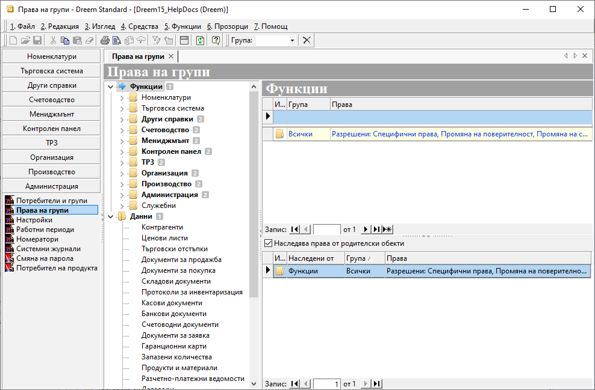
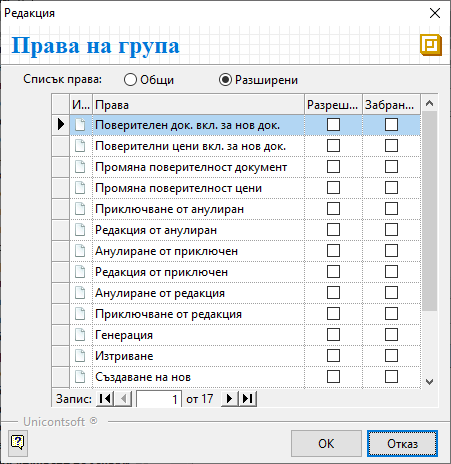
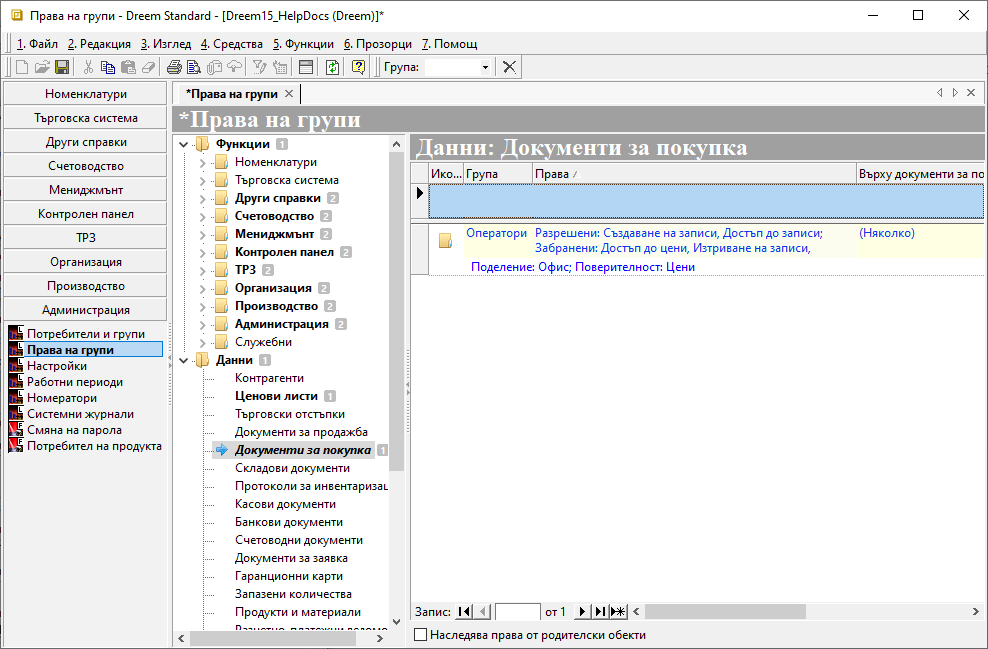
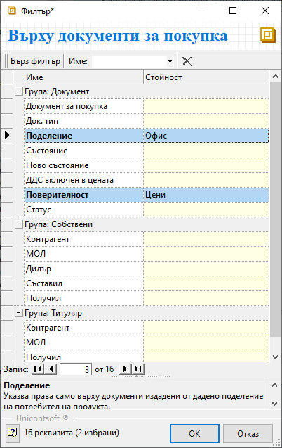

```{only} html
[Нагоре](000-index)
```

# **Права на групи**

- [Въведение](#въведение)  
- [Настройка на ефективни права](#настройка-на-права)  
- [Свързани статии](#свързани-статии)  

## **Въведение**

Правата в **Dreem ERP** се управляват от меню **Администрация » Права на групи**. Настройките се организират по групи **Функции** (видове документи) и **Данни** (съдържание на документи). Дефинират се разрешителни и рестриктивни права общо за избраната група потребители.  

> Всеки потребител автоматично попада в системно настроената група *Всички*.  

Важно е да се посочи при какви условия системата ще прилага дефинираните права. Ограниченията влизат в сила спрямо избраното ниво в **Администрация » Настройки » Системни: Ниво за сигурност**.  
Възможните варианти са:  

- *0 - Няма* - При това ниво на сигурност системата не прилага никакви ограничения в правата на потребителите.  
- *1 - Само Функции* - Системата прилага настройки за права върху функционалностите и различните генерации на документи.  
- *2 - Само Данни*- При това ниво на сигурност се прилагат настроените ограничения за съдържание (данни).  
- *3 – Функции и данни* - Най-високо ниво на сигурност, при което ограниченията се прилагат едновременно върху достъпа до функции и съдържащите се данни.  

## **Настройка на права**

Реквизитите с настройки са организирани в дървовидна структура. Те са отделени в секции с обекти на системата за сигурност и списъци с права за всеки от тях.  

1. Раздел **Функции**  

В раздела са включени всички модули на системата. Чрез него се управляват общите операции и достъпът до отделните функционалности.  

{ class=align-center w=15cm }

При избор на обект на системата за сигурност се визуализира списък с права за тази функционалност.  

- **Група** - поле за избор на група потребители, за която се дефинират права за достъп;  
Системата предлага падащо меню за избор от списък предварително въведените групи.    
- **Права** - поле за конфигуриране на разрешителни и/или забранителни права на група;  
От бутон [**...**] в края на полето се отваря форма за редакция **Права на група**.  
След избор на изглед *Общи* или *Разширени* системата визуализира списък с различни опции за настройка. Чрез поставяне на отметка в *Разрешени* или *Забранени* се дефинира достъпът по видове операции.  
С бутон [**ОК**] промените се потвърждават и формата се затваря автоматично.  

{ class=align-center }

- **Наследява права от родителски обекти** - настройката позволява за текущата функция да се активира/деактивира наследяването на ефективни права от родителски функционалности;  
Списък с наследени разрешителни и забранителни права се визуализира след активиране на настройката. Той съдържа информация за име на родителски обект, име на група и кратко описание на ефективните права.  

> Достъп без ограничения на данни, валиден за всички потребители, може да се настрои чрез маркиране на раздел **Функции**. От списъка вдясно се обзавежда поле **Група** с *Всички*. От поле **Права** се отваря форма за редакция **Права на група**, от която се разрешава достъп до всичко.  

2. Раздел **Данни**  

В **Данни** се дефинират специфични настройки за избрани детайли.  
Списък с права върху съдържание се визуализира вдясно, след като е избран обект на системата за сигурност.  

{ class=align-center w=15cm }

- **Група** - От падащия списък в полето се избира група, за която се дефинират права за достъп. Групите трябва да бъдат въведени предварително.  
- **Права** - В полето се настройват ефективни права върху данни.  
За целта се отваря форма за редакция **Права на група**. Чрез поставяне на отметки се разрешава или забранява достъп по видове операции.  
- **Върху ...** - От това поле се дефинират допълнителни критерии, отнасящи се до ефективните права.  
Бутон [**...**] в края на полето отваря форма за избор на детайли на правата върху данните. В колона **Стойност** се посочват желаните ограничения, като системата предлага за избор единствено от предварително въведени настройки.   
С бутон [**ОК**] промените се потвърждават и формата се затваря автоматично.  

{ class=align-center } 

- **Наследява права от родителски обекти** - Настройката позволява за текущата функция да се активира/деактивира наследяването на ефективни права от родителски функционалности.  
Когато наследяването е изключено, системата сигнализира чрез промяна в шрифта на функционалността в списък *Данни*.    

> Правата влизат в сила след потвърждаване на промените с бутон [**Запис**] / **Ctrl+S**.    

## **Свързани статии**

- [Потребители и групи](001-users.md)  
- [Поверителност в документи](../../004-tips/018-doc-privacy.md)