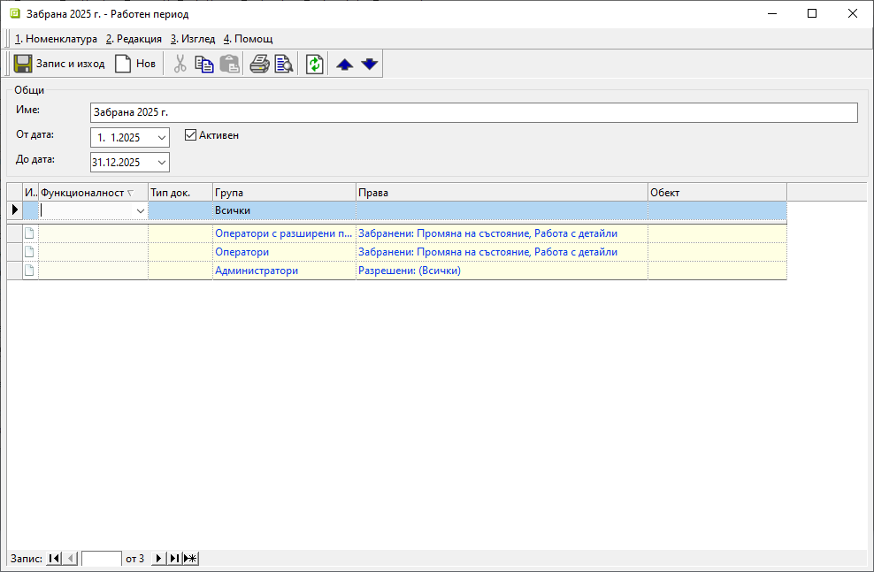
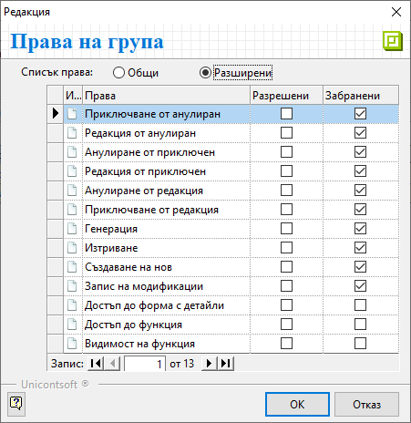

```{only} html
[Нагоре](000-index)
```

# **Работни периоди**

- [Въведение](#въведение)  
- [Нов работен период](#нов-работен-период)  
- [Реквизити](#реквизити)  
- [Свързани статии](#свързани-статии)  

## **Въведение**

Чрез **Работни периоди** се дефинират и управляват времеви ограничения за определени права, свързани с видимост и достъп до функция или форма с детайли. Настройките са по групи потребители и могат да бъдат разрешителни, забранителни или комбинация от двете.  

> Системата изисква винаги да има активен разрешителен период, валиден за всички потребители.  
Последващото настройване на забранителни периоди е по избор. Те имат по-голяма тежест.   

## **Нов работен период**  

1) **Създаване** 

Работен период се създава от **Администрация » Работни периоди**.  
С десен клик върху списъка вдясно се избира **Нов**. Това отваря празна форма за въвеждане на данни.  

{ class=align-center w=15cm }

2) **Настройка**  

В поле **Име** се попълва наименование на работния период.  
Чрез реквизити **От дата** и **До дата** се дефинира период на валидност. Ако полетата бъдат оставени празни, настройките за работния период се считат за безсрочни.   
Чрез отметка за **Активен** работният период може да се активира и деактивира по всяко време.  

От реда за нов запис се въвежда списък с правата, които системата прилага за периода.  
В поле **Функционалност** може да бъде избрана група функции, за която се дефинират разрешителни и забранителни права. Ако полето остане празно, настройките на реда се прилагат едновременно за всички функционалности.  

Чрез попълване на **Тип док.** може да се реализира детайлна настройка по типове документи. Ако в полето няма избрани документи, системата прилага настройките за всички.  

В поле **Група** се определят потребителите, за които важат настройките на текущия ред. Конкретните разрешителни и/или забранителни права се настройват от поле **Права**. В него бутон [**...**] отваря форма за редакция **Права на група**. След избор на изглед *Общи* или *Разширени* системата визуализира списък с различни опции за настройка. Правата се определят чрез поставяне на отметка в *Разрешени* или *Забранени*.  

Поле **Обект** дава възможност за ограничаване на настройките по обект. 

{ class=align-center }

Дефинираните настройки се потвърждават или отхвърлят съответно с [**OK**] или [**Отказ**]. Формата се затваря автоматично.   

3) **Запис**

От бутон [**Запис и изход**] модификациите за работния период се запазват и формата се затваря.  

## **Реквизити**  

Общи:  
- **Име** - поле с наименование на работния период;  
- **От дата** - поле за избор на начална дата за валидност на работния период;  
- **До дата** - иполе с крайна дата за валидност на работния период;  
- **Активен** - чрез отметка указва текущия работен период като активен/неактивен;  

От реда за добавяне на нов запис:  
- **Функционалност** - падащ списък за избор от настроените групи документи в системата;  
- **Тип док.** - отваря падащ списък с типове документи;  
Съдържанието на списъка варира според избраната на реда функционалност (група документи).  
- **Група** - отваря падащ списък за избор на група потребители;  
Системата предлага списък с групите, които са предварително въведени.  
- **Права** - поле за дефиниране на разрешителни и/или забранителни права по групи потребители;  
Системата визуализира списъка с *Общи* или *Разширени* опции за настройка.  
- **Обект** - избор на обект, за който важат настройките на реда;  
Обектите трябва да бъдат въведени предварително.  
- **Потребител създаване** - информация за потребител, добавил текущия ред;  
- **Дата създаване** - дата и час на добавяне на текущия ред;  
- **Потребител последна модификация** - потребителско име на направилия последните корекции в данните на реда;  
- **Дата последна модификация** - информация за дата и час, когато са направени последните изменения в данните на текущия ред;  

## **Свързани статии**

[Работа с Работни периоди ](../../005-how-to/006-working-periods.md)  