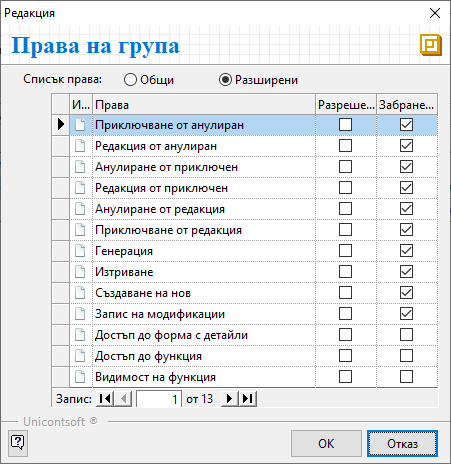

```{only} html
[Нагоре](000-index)
```

# Работни периоди

- [Въведение](https://docs.unicontsoft.com/guide/erp/001-ref/004-settings/003-working-periods.html#id2)  
- [Нов работен период](https://docs.unicontsoft.com/guide/erp/001-ref/004-settings/003-working-periods.html#id3)  
- [Реквизити](https://docs.unicontsoft.com/guide/erp/001-ref/004-settings/003-working-periods.html#id4)  
- [Свързани статии](https://docs.unicontsoft.com/guide/erp/001-ref/004-settings/003-working-periods.html#id5)  

## **Въведение**

**Работни периоди** е функционалност на системата, чрез която се определя период на валидност за определени права на групи. Настройката може да бъде разрешителна, забранителна или комбинация от двете.  

> Системата изисква да има активен разрешителен период, валиден за всички потребители.  
Дефинирането на забранителни периоди е по избор.  

## **Нов работен период**  

1) Нов работен период се създава от **Администрация || Работни периоди**. С десен бутон върху списъка вдясно се избира **Нов**, което отваря празна форма за въвеждане на данни.  

{ class=align-center w=15cm }

2) Във форма **Работен период** се попълва полето **Име**, като се изписва наименование на работния период.  
Чрез реквизити **От дата** и **До дата** се дефинира период на валидност. Ако полетата бъдат оставени празни, настройките за работния период се считат за безсрочни.   
С поставянето или премахването на отметка за **Активен** работният период се активира или деактивира.  

    От реда за добавяне на нов запис се дефинира списък с разрешителни или забранителни настройки, които системата прилага за избрания работен период.  
    Видимостта и достъпа до функция или форма с детайли се дефинират по групи документи. Това става чрез попълване на поле **Функционалност**. Ако бъде оставено празно, настройките на реда се прилагат едновременно за всички групи документи.  
    По-детайлна настройка за избрани типове документи може да се реализира чрез попълване на **Тип док.**. Ако полето остане празно, системата прилага настройките за всички документи.  

    Чрез попълване на поле **Група** се определят потребителите, за които важат настройките на текущия ред. 
    За избраната група могат да се настройват разрешителни и/или забранителни права от поле **Права**.   
    С бутон [**...**] се отваря форма *Редакция: Права на група*. След избор на изглед *Общи* или *Разширени* системата визуализира списък с различни опции за настройка. Правата по видове операции се определят чрез поставяне на отметка в *Разрешени* или *Забранени*.  

    { class=align-center }

    Чрез бутони [**OK**] или [**Отказ**] избраните настройки с права се потвърждават или отхвърлят и формата се затваря.   

5) **Запис и изход** - бутон, който запазва модификациите за работния период и излиза от формата.

## **Реквизити**  

- **Име** - поле с наименование на работния период;  
- **От дата** - избор на начална дата за валидност на работния период;  
- **До дата** - избор на крайна дата за валидност на работния период;  
- **Активен** - чрез поставяне/премахване на отметка текущият работен период се активира/деактивира;  
- **Функционалност** - падащ списък с групи документи в системата;  
- **Тип док.** - списък с типове документи, принадлежащи към избраната на реда функционалност (група документи);  
- **Обект** - избор на обект, за който важат настройките на реда;  
Обектите трябва да бъдат въведени предварително.  
- **Група** - поле за избор на група от потребители, за които важат настройките на текущия ред;  
Системата предлага списък с групите, които са предварително въведени.  
- **Права** - поле за дефиниране на разрешителни и/или забранителни права по групи потребители;  
Системата визуализира списъка с *Общи* или *Разширени* опции за настройка.  

## **Свързани статии**

- [Работа с Работни периоди ](https://docs.unicontsoft.com/guide/erp/005-how-to/006-working-periods.html)  