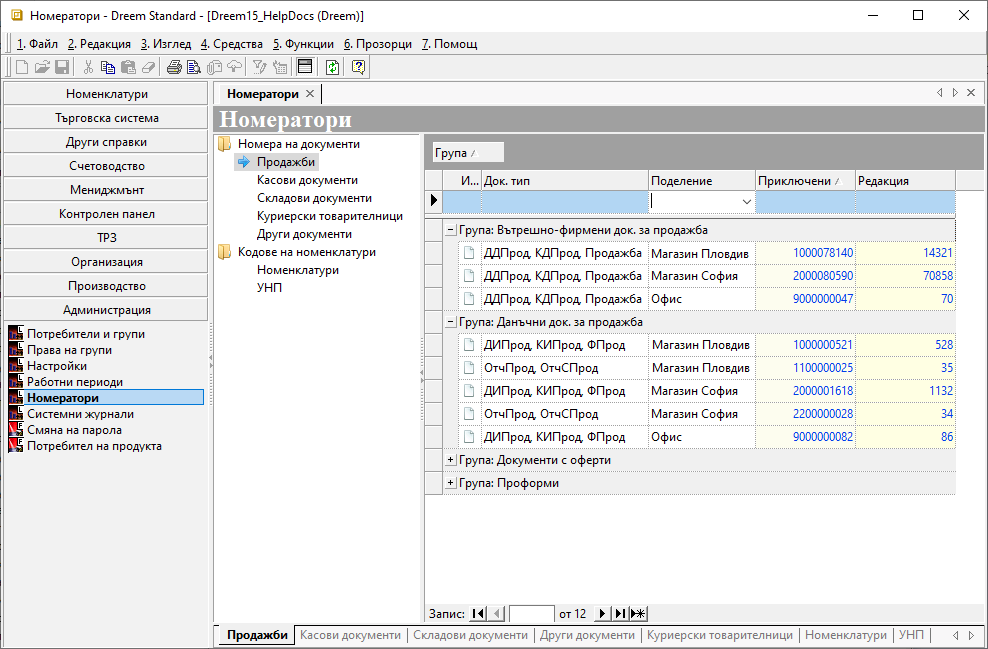

```{only} html
[Нагоре](000-index)
```

# Номератори

Чрез функционалност **Номератори** системата позволява настройка на автоматични броячи на номерата по избрани типове документи и номенклатури.  
Това осигурява и възможност да бъдат продължени номератори от външни системи.  

> Препоръчително е да се дефинира отделен брояч за всяко поделение.  
Когато липсва настроен номератор, системата стартира такъв автоматично с номер *0000000001*.    

1) Нова настройка за номера на документи се създава от **Администрация || Номератори**. 

{ class=align-center }

2) В раздел *Номера на документи* или *Кодове на номеклатури* с ляв бутон на мишката се избира желаният тип документ/номенклатура. От списъка вдясно на реда за нов запис може да се обзавеждат полета:   

- **Док. тип** - в това поле се избира 
- **Поделение** - поле за избор на поделение на **Потребител на продукта** от списък с предварително въведените.  
Колоната е достъпна при настройка на брояч за **Продажби**.
- **Каса** - поле за избор на каса, за която да се настрои отделен номератор;  
Колона **Каса** се извежда при настройка на **Касови документи**.  
- **Склад** - поле за избор на склад, за който се настройва отделен номератор;  
Колоната се извежда при избор на **Складови документи**.  
- **Куриер** - в полето се посочва куриер;  
Колоната се визуализира единствено при **Куриерски товарителници. 
- **Приключени** - в това поле се вижда номер на последния валидиран (приключен) документ;  
Когато се продължава номератор от външна система, в това поле се изписва номер на последния издаден документ.    

3) **Запис** - бутон в лентата с инструменти, който запазва модификациите.

___
Свързани статии:  

[Как да въведем Номератори на документи?](https://www.unicontsoft.com/cms/node/156)  