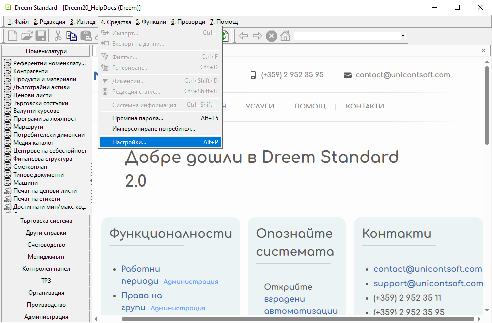
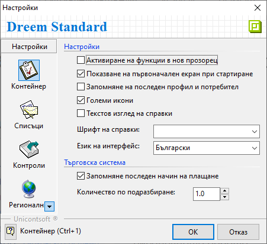
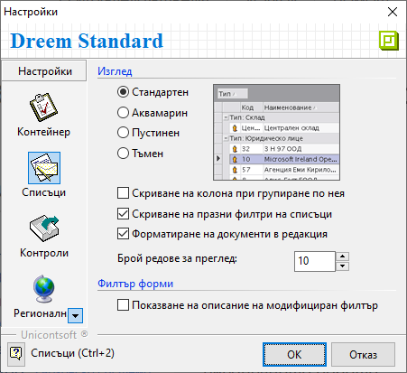
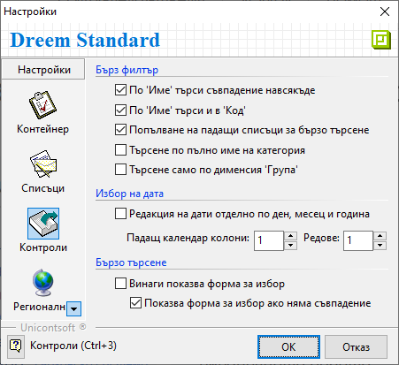
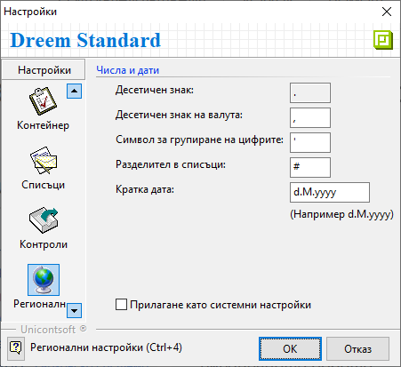

```{only} html
[Нагоре](000-index)
```

# **Настройки**

Настройките за текущо валидиран потребител в **Dreem ERP** се персонализират чрез меню **Средства » Настройки** в лентата с инструменти.  

{ class=align-center w=15cm }

1) **Контейнер**  

В секция **Контейнер** са достъпни следните опции за настройка:  

 - **Активиране на функции в нов прозорец** – С поставяне/махане на отметка се активира/деактивира автоматичното отваряне на нова функция в отделен прозорец. Активирането на тази опция позволява едновременно ползване на множество функции и по-бърза навигация между тях.  

 - **Показване на първоначален екран при стартиране** – Чрез отметка се показва или скрива началният екран при стартиране на системата.  

 -  **Запомняне на последен профил и потребител** – Опцията автоматично предлага последно влезлия потребител във форма **Установяване на самоличност** при следващо влизане в системата.  

 - **Текстов изглед на справки** – По подразбиране справките в системата имат два изгледа: *Графичен изглед* и *Списък с данни*. Чрез отметка в това поле *Текстов изглед* може да бъде избран по подразбиране за всички справки.  

 - **Шрифт на справки** - В полето се избира шрифт, който да се използва при преглед/печат на справк.  

 - **Език на интерфейс** - От полето може да бъде избран различен език за интерфейса.  

 - **Запомняне на последен начин на плащане** – При активиране на тази опция системата запомня и предлага последно използван начин на плащане във всеки следващ документ.  

 - **Количество по подразбиране** - В полето се избира стойност, която системата предлага автоматично в колона **Количество** при добавяне на нов ред в документ.  

{ class=align-center }

2) **Списъци**  

В секция **Списъци** достъпни за настройка са:  

 - **Изглед** - Настройката променя визуалния облик на интерфейса.  
 Опциите за избор са между следните видове: Стандартен, Аквамарин, Пустинен и Тъмен.  
 Системата предлага преглед с частична визуализация за всеки вид.  

 - **Скриване на колона при групиране по нея** - Чрез отметка се указва дали при групиране на списък колоната/ите от групировката се скрива/т автоматично.  

 - **Скриване на празни филтри на списъци** - С поставяне/махане на отметка системата ще скрива/показва жълтата лента с основен филтър в списъки(*Продукти и материали*, *Контрагенти*, *Дълготрайни активи* и др.).    

 - **Форматиране на документи в редакция** - При активиране на настройката документите в състояние на редакция се визуализират с удебелен шрифт.      

{ class=align-center }

3) **Контроли**  

Секция **Контроли** предлага възможности за конфигуриране на филтрите при обработката на данни в системата.  

 - **По *Име* търси съвпадение навсякъде** - Настройката се активира/деактивира с поставяне/махане на отметка.  
 При активна настройка системата търси съвпадения по **Име** във всички части на наименованието.  
 Когато е неактивна, системата търси съвпадение само на думи, започващи с въведената буква, сричка, дума или друго.  

 - **По *Име* търси и в *Код*** – При активиране на настройката системата ще търси съвпадения едновременно в наименованието и в кода на номенклатурата.  

 - **Попълване на падащи списъци за бързо търсене** - С поставяне/махане на отметка системата показва/скрива падащите списъци в бързите филтри.  

 - **Търсене по пълно име на категория** - Когато опцията е активирана с отметка, системата изисква изписване на пълното име на категория при търсене в *Дименсии*.  

 - **Търсене само по дименсия *Група*** - Когато настройката е активирана, системата предлага само списък с основната група продукти във филтрите.    
 Основна дименсия за групи продукти се настройва в **Администрация » Настройки » Продукти и материали: Дименсия за групи**.  

- **Редакция на дати отделно по ден, месец и година** - При активиране на настройката системата предлага автоматично маркиране на датата, разделяйки я на отделни части - ден, месец и година.  

 - **Винаги показва форма за избор** - При активиране на настройката системата ще отваря формата със списък номенклатури (*Продукти и материали*, *Контрагенти* и др.) при всяко търсене.  

 - **Показва форма за избор ако няма съвпадение** - При активиране системата ще отваря формата със списък номенклатури (*Продукти и материали*, *Контрагенти* и др.), когато няма съвпадение при търсенето.  
 Настройката е достъпна, когато в предходната опция няма отметка.   

{ class=align-center }

4) **Регионални настройки**  

В секция **Регионални настройки** могат да се дефинират формати на числа и дати.  

- **Десетеичен знак**, **Десетичен знак за валута** и **Символ за групиране на цифрите** - В полетата може да се избере различен символ, определящ съответния числов формат.  
- **Разделител в списъци** - 
- **Кратка дата** - От полето се указва формат, по който датите се визуализират навсякъде в системата.  
- **Прилагане като системни настройки** - Чрез отметка в полето гореизбраните числови формати се прилагат към текущите регионални настройки на Windows.    

{ class=align-center }

