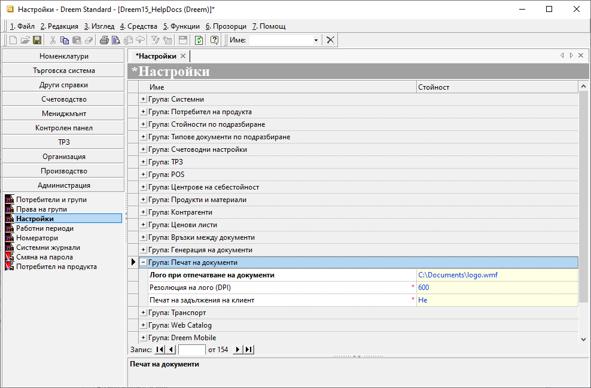

```{only} html
[Нагоре](000-index)
```

# **Фирмено лого**

Системата осигурява възможност за включване на фирмено лого при отпечатването на документи. 

1) Фирмено лого при печат на документ се добавя в **Администрация » Настройки » Група: Печат на документи**. 

{ class=align-center w=15cm }

2) Попълват се следните полета:  
- **Лого при отпечатване на документ** - в това поле се посочва път до файла с графично лого при печат на документи;  
За най-добър резултат използвайте векторни файлове - WMF, EMF, EPS.  
- **Резолюция на лого (DPI)** - поле за дефиниране на резолюция на графичния файл за лого;  
Чрез промяна в стойността на това поле се управлява размерът на логото.  

3) **Запис** - бутон в лентата с инструменти, запаметяващ въведените настройки.  
