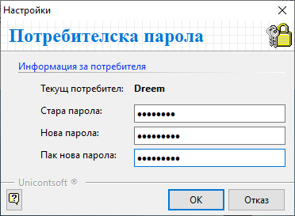
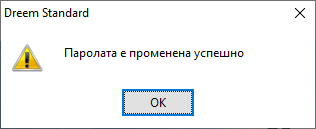

```{only} html
[Нагоре](000-index)
```

# Смяна на парола

Промяна на парола за текущия потребител може да бъде направена от група функции **Администрация || Смяна на парола**.  
1) **Настройки** - Системата отваря форма за настройки **Потребителска парола**.  
    - **Стара парола** - В полето се попълва текуща парола.  
    Полето остава празно, ако до момента потребителят е бил без парола.  
    - **Нова парола** - В полето се въвежда избраната парола.  
    Ако полето бъде оставено празно, потребителят остава без парола.   
    - **Пак нова парола** - В полето трябва да се повтори новата парола.  

{ class=align-center }

2) **Ок** / **Отказ** — Бутони, чрез които се приема или отказва смяната на парола.  
За потвърждаване и запазване на направените промени се избира бутон [Ок].  

При успешна смяна на парола системата извежда следното съобщение:  

{ class=align-center }

3) **Ок** — Бутонът затваря информативното съобщение.  

При следващо влизане в системата е валидна нововъведената парола.
