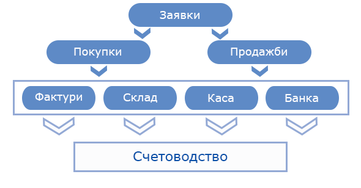

```{only} html
[Нагоре](../000-index)
```
# Документи и процеси

Документооборотът в системата е организиран според логиката на бизнес процесите. Автоматично се изграждат и поддържат стриктни взаимовръзки между документите. По този начин системата гарантира последователност и проследимост на операциите. Това осигурява информация за етапа, на който се намира всяка сделка в даден момент - от заявка и реализиране на покупка/продажба до управление на складови потоци и плащания.  


{ class=align-center w=15cm }

## Заявки

Документите за заявка в системата са разделени на **Заявки от клиенти**, **Вътрешни заявки** и **Заявки към доставчици**. Чрез тях се регистрират поръчки с определени параметри за изпълнение. Според това към кого са насочени, различните видове заявки генерират различни типове свързани документи.  

Чрез **Заявки от клиенти** може да бъде въведена цялата необходима информация, която да послужи за генериране на вътрешнофирмените и данъчните документи. Нивото на изпълнение на заявките се следи в детайли. Системата сигнализира при закъснение или неизпълнение в срок.   

**Вътрешни заявки** дават възможност за автоматично създаване на вътрешнофирмени документи за приемо-предаване на стоката между складове.  

**Заявки към доставчици** играят роля за доброто прогнозиране и планиране на наличностите и доставките. От тях бързо и лесно се генерират последващите документи за покупка.  

> Документите за заявка не създават вземания от клиенти и задължения към доставчици.  

## Покупки и продажби

**Покупки** дефинират параметрите на сделките с доставчици и автоматично формират съответните задължения. При тях **Потребител на продукта** е в позицията на клиент.  

**Продажби** дефинират параметрите на сделките с клиенти и автоматично формират съответните вземания. При тях **Потребител на продукта** е в позицията на доставчик.  

> Продажбите и покупките съдържат цялата информация, необходима за автоматично създаване на останалите документи по реализиране и отчитане на сделката - данъчни, складови, платежни.  

## Данъчни документи

**Данъчни документи за покупки** най-общо включват фактури, кредитни и дебитни известия, митнически декларации за внос и др. Тези типове документи се осчетоводяват автоматично от системата.  

**Данъчни документи за продажби** най-общо включват фактури, кредитни и дебитни известия, митнически декларации за износ, протоколи и отчети за извършени продажби. Тези типове документи се осчетоводяват автоматично от системата.    

## Склад

Чрез **Складови документи** се управляват и отчитат количествено и стойностно движенията на стоки и материали.  
Системата може да преизчислява средната цена в склада автоматично на избран интервал или ръчно по избор на потребителя.  

Складовите документи могат да бъдат осчетоводявани автоматично.  

## Каса

**Касови документи** служат за управление на разплащанията в брой. Чрез тях в системата могат да бъдат отчетени приходни и разходни операции, както и прихващания - между фактури за покупка и продажба или между фактури и кредитни известия.  
Този тип документи могат да бъдат осчетоводявани автоматично.  

## Банка

**Банковите документи** служат за управление на разплащанията по банков път. Банковите извлечения могат да бъдат въведени ръчно или чрез използване на вграден инструмент на системата за импорт.  
Тези документи могат да бъдат осчетоводявани автоматично.  

## Счетоводство


Темите в този раздел разглеждат основни процеси и функционалности, свързани с документите в системата.  
Структурирани са в следната последователност:  

 - [Работа със списъци и връзки между документи](001-documents/000-index.md)  
В раздела са разгледани теми, представящи основни понятия и терминологията в системата.
 - [Търговска система](002-trade-system/000-index.md)  
Разделът включва насоки за работа с различните видове документи в системата.  
 - [Счетоводство](003-accounting/000-index.md)  
Разделът представя инструкции за експорти и обработка на документи, свързани с организация на финансово-счетоводната отчетност
 - [ТРЗ](004-payroll-documents/000-index.md)  
В този раздел са разгледани теми, свързани с управление на трудовите отношения.  

 ```{toctree}
:maxdepth: 1
:hidden:

001-documents/000-index.md
002-trade-system/000-index.md
003-accounting/000-index.md
004-payroll-documents/000-index.md
```
