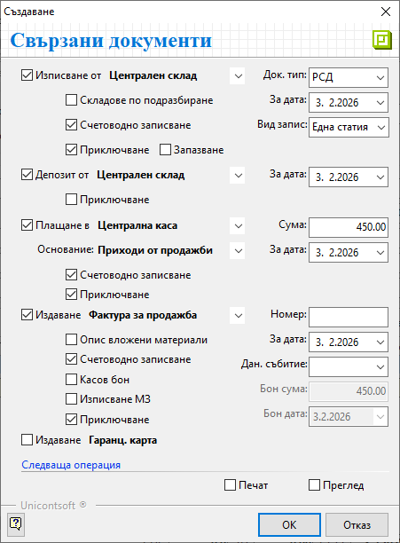
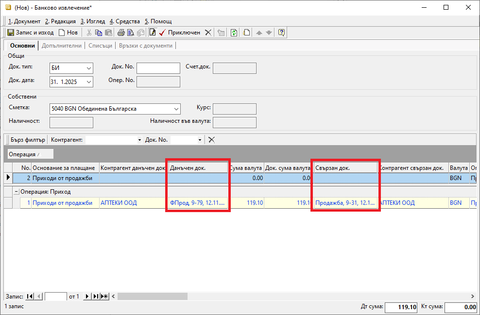
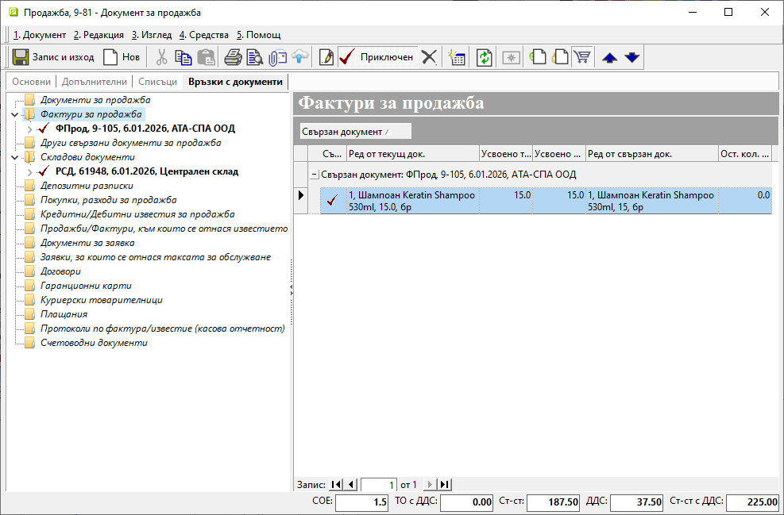

```{only} html
[Нагоре](../000-index)
```

# **Връзки между документи**

Системата създава връзки между различни типове вторични документи на база първичен запис. Тази обвързаност осигурява ефективен анализ при справки и контрол на процесите.   

> Чрез връзките между документи се гарантира последователност и точност в отчетността.  

## Автоматична генерация на връзки между документи   

Системата разполага с механизъм, който дава възможност за автоматично генериране на свързаните документи от първичен документ. Тази опция е достъпна и за вече валидирани документи чрез бутони **Приключен** и **Генериране** в лентата с инструменти.  

> Форма **Свързани документи** съдържа елементи, които варират за различните типове документи.  

{ class=align-center }

## Ръчно създаване на връзки между документи  

Обвързаност между документи може да бъде създадена и ръчно.  
Това е възможно от форма за редакция на избрани типове документи при наличие на колони **Свързан док.** и **Данъчен док.**. В тях се отварят списъци за избор от съответния тип документи.  

{ class=align-center w=15cm }

Всички релации на текущия документ с други са видими от раздел **Връзки с документи** във формата за редакция.  

> Системата поддържа връзките между документи по продукт.  
За проверка служат колони **Ред от текущ док.** и **Ред от свързан док.**.  
В общия случай количествата в колони **Усвоено текущ док.** и **Усвоено свързан док.** трябва да съвпадат.  

{ class=align-center w=15cm }
