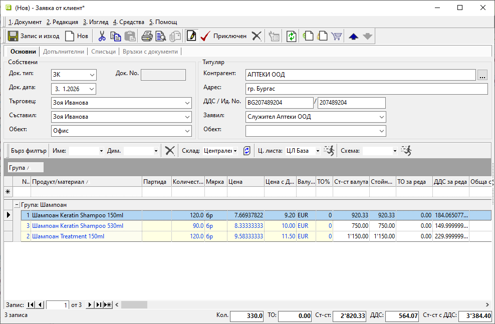
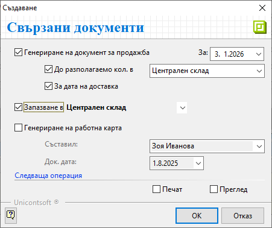
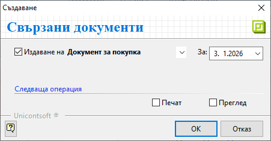
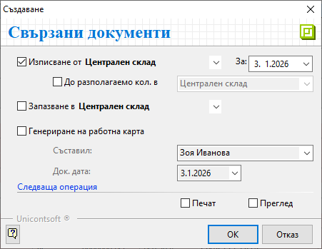

```{only} html
[Нагоре](000-index)
```

# **Документи за заявка**

- [Въведение](#въведение)  
- [Как се създава заявка](#нов-документ-за-заявка)  
- [Реквизити](#реквизити)  
- [Свързани статии](#свързани-статии)

## **Въведение**

Документите за заявка осигуряват контрол на логистиката и етапите на изпълнение на поръчките. Регистрират се в системата с различни по вид заявки.  

При вид **ЗК**-*Заявка към доставчик* системата предлага генериране на свързана покупка, докато при **ЗК**-*Заявка от клиент* има опция за генериране на продажба.  

Заявките също могат да се използват при искане за трансфер на продукти и материали между собствени складове. За целта е предвиден документ тип **ВЗ**-*Вътрешна заявка*. Към нея автоматично се генерира предавателен протокол за прехвърляне на стоки между складове.  

## **Нов документ за заявка**

**1. Създаване**  

В системата заявките се въвеждат от меню **Търговска система » Документи за заявка**.  
С десен клик върху списъка с документи се избира **Нов документ**. Отваря се празна форма за въвеждане на данни.  

**2. Попълване на реквизити**  

В раздел **Основни** на формата за редакция се попълват:  

- **Док. Тип** - От падащия списък в полето се избира тип на документа.  

> Спрямо указания тип на заявката системата ще предложи различни опции за генериране на свързани документи.  

- **Док. дата** - В полето се указва дата на документа. По подразбиране системата предлага текуща дата.  
- **Търговец** - От списъка с персони в полето може да се избере служител, отговорен за сделката. Полето може да се обзавежда автоматично при настроен отговорен търговец за контрагента.  
- **Съставил** - Реквизитът се обзавежда с имената на служителя, създал документа.  
- **Обект** - В полето може да бъде указан обект на **Потребител на продукта**. Спрямо обекта и настроения му номератор ще се генерира различен пореден номер на документа.    

> Полетата за избор на персона и обект се обзавеждат автоматично, когато за потребителя в системата предварително са направени необходимите настройки.  
   
- **Контрагент** - Реквизитът се попълва според типа на въвежданата заявка.  
В полето се отваря форма **Контрагенти**  за избор на клиент, доставчик или **Потребител на продукта** (при вътрешни заявки).  
Ако търсеният контрагент не фигурира в списъка, системата позволява въвеждането му на момента с десен клик и **Нов контрагент**.  
Останалите полета в секция *Титуляр* ще се обзаведат спрямо настройките на избрания контрагент.  

{ class=align-center w=15cm }

От реда за нов запис през поле **Продукт/материал** се въвежда списък със заявени продукти.  

> Ако продуктите не фигурират в системата като номенклатури, могат да бъдат въведени на момента. За целта в списък **Продукти и материали** с десен клик се избира **Нов продукт**.   

Заявените количества по продукти се добавят от поле **Количество**.  
Системата обзавежда **Мярка** с настроената за продукта мерна единица по подразбиране. Списъкът в полето се обзавежда с мерни единици според настройките на **Фасети на мерки**.  

**Цена** и **Цена с ДДС** ще се попълнят автоматично, когато за избрания контрагент е дефинирана индивидуална ценова листа. Това е от значение в най-голяма степен при заявките към доставчик.   
Системата позволява прилагане на различна ценова листа от бутона в лентата с *Бърз филтър*.  

В раздел **Допълнителни** са достъпни реквизити за детайлни настройки, свързани с доставка (дати на доставка, експедиция ), транспорт, плащане, складови документи, външни системи и други. Част от тях са задължителни и са отбелязани с червен символ. Системата обзавежда тези полета с данни по подразбиране, които могат да бъдат променени.  

**3. Приключване**  

Чрез бутон [**Приключен**] от лентата с инструменти се отваря форма за генерация на свързани документи. Системата дава възможност за автоматично създаване на различни свързани документи спрямо типа на заявката.   

При въвеждане на **ЗК**-*Заявка от клиент*:  
- **Генериране на документ за продажба** - С поставянето на отметка системата ще генерира свързан документ за продажба.     
    - **За** (дата) - Избира се дата, която системата да попълни като **Док. дата** в продажбата.  
    - **До разполагаемо кол. в** (склад) - При активиране на опцията системата сравнява заявените количества с наличностите в указания склад. В документа за продажба ще се попълни списък с продукти с разполагаеми количества.  
    - **За дата на доставка** - Чрез тази опция системата копира **Дата на доставка** от заявката в **Док. дата** на продажбата;  

- **Запазване в** (склад) - В полето се избира склад, в който количествата от заявката да бъдат резервирани.  
Списък складове трябва да се настрои предварително от **Номенклатури » Контрагенти**.     

> В последствие резервиране на количества може да бъде отменено от **Търговска  система » Запазени количества**. Редът с документа, по който са запазени, се изтрива или количеството на продукта се редактира.  

- **Печат** или **Преглед** - Отваря се форма за избор на шаблон.  
При избрана опция **Печат** документът се разпечатва директно с избрания шаблон. При опция **Преглед** документът се отваря на екран преди отпечатване.     

{ class=align-center }

При въвеждане на **ЗД**-*Заявка към доставчик*:  
- **Издаване на** (тип документ) - От падащия списък се избира тип **Документ за покупка** и системата генерира свързана покупка.  
    - **За** (дата) - В полето се указва датата, която системата да попълни като **Док. дата** в покупката.  

- **Печат** или **Преглед** - Отваря се форма за избор на шаблон.  
При избрана опция **Печат** документът се разпечатва директно с избрания шаблон. При опция **Преглед** документът се отваря на екран преди отпечатване.     

{ class=align-center }

При въвеждане на **ВЗ**-*Вътрешна заявка*:  
- **Изписване от** (склад) - От списъка се маркира склад, за който да се генерира предавателен протокол със заявените количества.     
    - **За** (дата) - Избира се дата, която системата да попълни като **Док. дата** в предавателния протокол.  
    - **До разполагаемо кол. в** (склад) - При активиране на опцията системата сравнява заявените с наличните количества в указания склад. В предавателния протокол ще бъдат включени само продуктите с разполагаеми количества.  

- **Запазване в** (склад) - От списъка се избира склад, в който да бъдат резервирани количествата от заявката.     

- **Печат** или **Преглед** - Отваря се форма за избор на шаблон.  
При избрана опция **Печат** документът се разпечатва директно с избрания шаблон. При опция **Преглед** документът се отваря на екран преди отпечатване.   

- **ОК** - Бутонът потвърждава маркираните опции.  
Системата генерира избраните свързани документи и валидира покупката.    

{ class=align-center }

**4. Запис и изход**  

Чрез бутон [**Запис и изход**] в лентата с инструменти документът се записва и формата се затваря.  

При приключване документът се записва автоматично. В този случай бутонът единствено затваря формата.  

## **Реквизити**

1) В раздел **Основни**:  
   - **Док. Тип** – отваря падащ списък за избор на тип документ - **ЗК**-*Заявка от клиент*, **ЗД**-*Заявка към доставчик*, **ВЗ**-*Вътрешна заявка* и др.;    
   - **Док. No** - полето се попълва с номер на документа;  
   Системата автоматично попълва пореден номер за текущия тип заявка при приключване на документа.  
   - **Док. дата** - указва дата, за която се отнася текущата заявка;  
   - **Търговец** - отваря списък с персони за избор на служител, който отговаря пряко за взаимоотношенията с текущия контрагент;  
   Данните в полето се попълват автоматично, когато контрагента е настроен търговец по подразбиране.  
   - **Съставил** - отваря списък за избор от предварително настроените служители;  
   Данните в полето се попълват автоматично с настройките на текущия потребител.  
   - **Обект** - поле с падащ списък за избор на обект от предварително настроените в **Потребител на продукта**;  
   Данните в полето се попълват автоматично с настройките на текущия потребител.  
   - **Контрагент** – в полето се отваря форма за избор **Контрагенти**;  
   Ако търсеният контрагент не фигурира в съществуващия списък, системата позволява въвеждането му в момента.  
   - **Адрес** - указва адрес по регистрация на избрания контрагент;  
   - **ДДС / Ид. No.** - указва ДДС номер, Булстат или друг идентификатор за избрания контрагент;  
   - **Заявил** - падащ списък за избор на лице, заявило количествата в документа за заявка;  
   - **Обект** - отваря списък с обекти на контрагента;  

   От реда за нов запис се обзавежда списък с продукти. Колоните, които съдържа, са:  
   - **Поверителност** - дава информация за активирани *Поверителност на цени* и/или *Поверителност на документ*;  
   - **No.** - пореден номер на запис на реда;  
   - **Миниатюра на продукт/материал** - показва настроеното изображение по подразбиране за продукта;  
   - **Код продукт/материал** - полето се обзавежда с настроения основен код за избрания продукт;  
   - **Баркод на продукт/материал** - показва баркод на продукта в избраната мярка;  
   - **Вендор код на продукт/материал** - показва външен код на продукта, ако има указан такъв за текущия контрагент;  
   - **Вендор име на продукт/материал** - показва настройка за име на продукта, предоставено от клиента/доставчика;    
   - **Продукт/материал** - отваря форма за избор **Продукти и материали**;  
   - **Допълнителен текст** - поле за въвеждане на описание за продукта, което може да се показва при печат;  
   - **Забележка** - полето позволява въвеждане на свободен текст с уточнение за продукта;  
   - **Партида** - указва партида за продукта;  
   Бутонът в края на полето отваря форма за избор от налични партиди за продукта.  
   - **Дата на годност на партида** - поле с дата на годност за избраната на реда партида;  
   - **Страна на произход на партида** - указва страна на произход за избраната партида;  
   - **Доставна партида** - в полето може да се въведе допълнителна партида за продукта на реда;  
   - **Количество** - в полето се попълва количесто за продукта на реда;  
   - **Предишно кол.** - показва предишно количество на реда преди последна промяна;  
   - **Валидирано кол.** - показва успешно валидираното количество за продукта на реда;  
   - **Отказано кол.** - в полето може да се попълни отказано количество за продукта на реда;  
   - **Свързано количество през склад** - показва количество на продукта в свързани складови документи (при вътрешни заявки);  
   - **Мярка** - отваря падащ списък за избор на мерна единица от настроените за продукта;  
   - **Цена** - поле за попълване на единична цена без ДДС;  
   - **Данъчна група** - показва данъчна група, настроена за продукта;  
   - **ДДС ставка** - показва ДДС ставка, настроена за продукта;  
   - **ДДС вкл. в цената** - указва включване на ДДС в цената на продукта;  
   - **Цена с ДДС** - поле за попълване на единична цена с ДДС;  
   - **Валута** - отваря падащ списък за избор на валута; 
   - **Курс** - указва валутен курс за избраната валута;  
   - **ТО %** - указва процент на търговска отстъпка за текущия ред;  
   - **Крайна цена с ТО%** - показва цена без ДДС в национална валута след приспадната търговска отстъпка;  
   - **Крайна цена с ДДС** - показва крайна цена в национална валута с включен ДДС;  
   - **Крайна цена с ТО% и ДДС** - показва цена с ДДС в национална валута след приспадната търговска отстъпка;  
   - **Продуктов мениджър** - отваря падащ списък със служители за избор на продуктов мениджър;  
   - **Бруто тегло** - показва бруто тегло за количеството от продукта на реда;  
   - **Нето тегло кг** - показва нето тегло в килограми за количеството от продукта на реда;  
   - **Бруто обем** - показва бруто обем за количеството от продукта на реда;   
   - **Ст-ст валута** - показва обща сума без ДДС във валута от текущия ред;  
   - **Стойност** - показва обща сума без ДДС в национална валута;  
   - **ТО за реда** - показва обща сума на търговска отстъпка в национална валута;  
   - **ДДС за реда** - показва обща сума на ДДС за цялото количество от продукта на реда;  
   - **Обща стойност с ДДС** - показва обща стойност с ДДС за цялото количество от продукта на ред;  
   - **Обща ТО с ДДС** - показва обща сума на отстъпка с ДДС за цялото количество от продукта на ред;  
   - **Разполагаемо кол.** - поле с информация за свободни количества за продажба и изписване от склад;  
   - **Наличност** - показва информация за налично количество - общо или за избран склад, включващо резервираните количества;  
   - **Запазени** - показва резервираните количества за продукта на реда;  
   - **Минимално кол. за заявка** - полето се обзавежда при настроено минимално количество за заявка на продукт;  
   - **Цена по ц. листа** - показва настроената цена от приложената в документа ценова листа;  
   - **Промоционална ц. листа** - показва настроената цена при наличие на промоция към приложената в документа ценова листа;  
   - **ТО% по схема с отстъпки** - показва процент на търговската отстъпка от приложената в документа схема ТО%;  
   - **Продукт за трансформация** - отваря форма за избор на събирателен продукт за трансформация при фактуриране на продажби;  
   - **Група за трансформация** - полето позволява попълване на събирателна група за трансформация при фактуриране на продажби;  
   - **Прикачен файл за визуализация** - отваря падащ списък за избор от настроени за продукта прикачени файлове;  
   - **Заключване на реда** - позволява заключване на реда за корекции;  
   - **Група** - показва група, към която е настроен продуктът на реда;  
   - **Потребител създаване** - информация за потребител, добавил текущия ред в документа;  
   - **Дата създаване** - дата и час на добавяне на текущия ред;  
   - **Потребител последна модификация** - потребителско име на направилия последните корекции в данните на реда;  
   - **Дата последна модификация** - информация за дата и час, когато са направени последните изменения в данните на текущия ред;  

   > Като отделни колони се визуализират също настроените дименсии, фасети и вендор кодове за продукти и дълготрайни активи.  

2) В раздел **Допълнителни**:  

   **Реквизити: Дименсии** - Тази секция се визуализира, ако за документи за заявка има дефинирани дименсии от меню **Номенклатури » Потребителски дименсии**.  

   **Реквизити: Доставка**  
   - **Дата на доставка** - поле с уговорена дата на доставка;  
   - **Час на доставка** - указва час за доставка;  
   Полето може да се обзаведе автоматично с настроен за контрагента/обекта предпочитан час на доставка.  
   - **Предефиниран адрес** - предварително дефиниран адрес, от който се попълват елементите на адреса на доставка;  
   - **Държава** - указва държавата, в която се извършва доставката;  
   - **Град/населено място** - указва населено място за доставка;  
   - **Пощенски код** - указва пощенския код на населеното място за доставка;  
   - **Улица / Квартал** - указва улица или квартал на мястото за доставка;  
   - **Номер (Улица)** - указва номер на улица от адреса на място на доставка;  
   Полето остава празно, ако е избран квартал.  
   - **Блок (Квартал)** - указва номер на блок от адреса на място на доставка;  
   Полето остава празно, ако е избрана улица. 
   - **Вход (Квартал)** - указва вход на блок от адреса на доставка;  
   Полето остава празно, ако е избрана улица.  
   - **Етаж (Квартал)** - указва етаж от адреса на доставка;  
   Полето остава празно, ако е избрана улица.  
   - **Апартамент (Квартал)** - указва номер на апартамент от адреса на доставка;  
   Полето остава празно, ако е избрана улица.  
   - **Пояснение** - допълнителна информация от адреса на доставка (например разположение на звънеца за входа, портиер, охрана и т.н.);  
   - **GPS координати на адрес на доставка** - указва GPS координати на адреса на доставка;  
   - **Телефон** - попълва се телефонен номер за контакт;  
   Използва се при генериране на куриерска товарителница.  
   - **Ел. поща** - имейл на контрагента;  
   Използва се при изпращане на документа по ел. поща. Ако не е указан, се използва имейлът, настроен в номенклатура контрагент, обекти или персони на титуляр на заявка.  
   - **Условия на доставка** - указва условията на доставка, съгласно кодовете на Incoterms;  
   Използва се при печат на пакетажен лист, валутна проформа и валутна фактура, ако са избрани бланки с концентрация.  
   
   **Реквизити: Транспорт**  
   - **Дата на експедиция** - избор на очаквана дата на експедиция с куриер или собствено транспортно средство;  
   - **Вид транспорт** - падащ списък за избор на вид транспорт за доставка;  
   Различните видове транспорт трябва да се настроят предварително от **Референтни номенклатури**.  
   - **Транспортна фирма** - отваря форма **Контрагенти**  за избор на транспортна фирма, която ще извърши доставката;  
   - **Шофьор** - указва шофьор от транспортна фирма, който ще извърши доставката;  
   - **Втори шофьор** - указва втори шофьор от транспортната фирма, който ще извърши доставката съвместно с първия;  
   - **Транспортно средство** - указва вид на транспортното средство за доставка;  
   - **Регистрационен No.** - попълва се регистрационен номер на превозното средство за доставка;  
   - **Номера на контейнери** - полета за въвеждане на идентификационни номера на транспортните контейнери;  
   Използва се единствено за документация в заявката. Не се ползва никъде от системата.  
   - **Товарителница** - поле с номер на товарителница към доставката;  
   Използва се при генериране на счетоводни документи по сметки за наложен платеж.  
   
   **Реквизити: Плащане**  
   - **Дата на падеж** - указва дата за падеж на плащане при създаване на свързан документ за продажба;  
   - **Начин на плащане** - указва начин на плащане при създаване на свързан документ за продажба;  
   - **Код на транзакция** - полето се попълва при плащане с карта или онлайн плащане;  
   Указва код на транзакция от банков терминал или от система за онлайн плащания, както ще се отчете плащането по продажбата в извлечението от банката оператор.  
   - **Банкова сметка** - указва банкова сметка при печат на данъчен документ;  
   - **Система за online плащания** - полето се попълва при онлайн плащане;  
   Указва оператор, през който е извършено плащането (online payment gateway), като **ePay.bg**, **EasyPay**, **PayPal** и др.  
   - **Промо ваучер** - поле с промо ваучер за допълнителна отстъпка от програми за лоялност;  
   
   **Реквизити: Складов документ**  
   - **Дата на събиране** - избор на очаквана дата за събиране на стоки при издължаване от склад;  
   - **Склад за изпълнение** - избор на склад, от който ще се издължат или в който ще се заприходят количествата;  
   - **Премахване на запазени количества** - указва начина на отписване на запазените количества по заявка;  
   При опция *Да* с приключването на складов документ се премахват запазените количества за цялата заявка.  
   
   **Реквизити: Данъчен документ**  
   - **Вид документ** - указва тип данъчен документ, който се предлага при фактуриране на свързана продажба;  
   - **Контрагент** - избор на контрагент, който ще е титуляр на фактурата;  
   Използва се единствено при настроен тип данъчен документ *1 - Фактура*.  
   - **Адрес** - указва адрес на контрагент при печат на фактура;  
   Използва се единствено при избран тип данъчен документ *1 - Фактура*.  
   - **ДДС номер** - указва ДДС номер (ИН по ДДС) за печат на фактура;  
   Използва се единствено при избран тип данъчен документ *1 - Фактура*.  
   - **Идент. номер** - указва идентификационен номер (ИН), както ще се отпечата на фактура;  
   Използва се единствено при избран тип данъчен документ *1 - Фактура*.   
   - **Обект** - указва обект на контрагент, за който ще се издаде фактура;  
   Използва се единствено при избран тип данъчен документ *1 - Фактура*.  
   - **Получател** - отваря списък за избор на персона - получател на фактура;    
   Използва се единствено при избран тип данъчен документ *1 - Фактура*.  

   **Реквизити: Допълнителни**  
   - **Допълнителен ДДС** - указва стойност на допълнителен ДДС за изравняване на *Обща стойност с ДДС* на документа;  
   - **Канал за продажби** - указва канала за продажби, чрез който се реализира сделката;  
   Използва се в справка **Проследяване на заявки**.  

   **Реквизити: СУПТО**  
   - **Търговски обект** - падащ списък за избор на търговски обект, в който се извършва продажбата;  
   - **Работно място с ФУ** - указва фискално устройства за генериране на Уникален номер на продажба (УНП);  
   - **Генериран УНП** - полето се обзавежда с генерирания УНП;  
   - **Продажба с унаследен УНП** - указва документ за продажба, който унаследява генерирания УНП на документа за заявка;  

   **Реквизити: Външни системи**  
   - **Поръчка номер** - полето се обзавежда с номер на поръчка за обмяна на документи по *EDI* система;  
   - **Поръчка дата** - указва дата на поръчка за обмяна на документи по *EDI* система;  
   - **Интернет заявка** - оригинална дата на интернет заявка от *EcoPanda* система;  
   - **Клиентски код** - указва клиентски код на титуляра на документа във външни системи, *getti* карта;  
   - **Собствен код** - указва код на контрагента-издател на документа във външни системи, *Доставчик номер в търговска верига* по *EDI* система;  

   **Реквизити: Други**  
   - **Машина** - указва машина, за която се отнасят дейностите и материалите в заявката;  
   - **Дейност заявка** - поле с допълнителна информация за извършените дейности по машината;  
   - **Подизпълнител** - избор на контрагент, който е подизпълнител в сделката;  
   Не се използва никъде от системата.  

   - **Забележка при печат** - поле за въвеждане на свободен текст за отпечатване на документа;  
   - **Забележка** - поле за добавяне на коментар, свързан с текущия документ, който не се отпечатва;  

3) В раздел **Списъци**:  
   **Списъци**  
   - **Прикачени файлове** - Системата дава възможност чрез реда за нов запис вдясно да се добавят прикачени файлове. Това става от поле **Файл**, в което се отваря форма за избор **Медия каталог**. Каталогът включва предварително настроени от **Номенклатури » Медия каталог** папки.   

4) В раздел **Връзки с документи**:  
Този раздел не съдържа реквизити за настройка. В него системата осигурява пряк път до свързани документи. От тук те могат да бъдат отворени и редактирани.  
Ако заявката е валидирана и към нея има генерирани документи, те се визуализират по тип в съответната папка.  

## **Свързани статии**

[Номенклатури](../../../001-ref/001-nomenclatures/000-index.md)  
[Попълване на списъци](../../../../../start/009-lists.md)  
[Връзки между документи](../../../../../start/010-row-crosses.md)  
[Вграден калкулатор](../../../004-tips/001-calc.md)  
[Състояния на документите](../../../004-tips/004-doc-states.md)  
[Знаци в документите](../../../004-tips/009-issue-flags.md)  