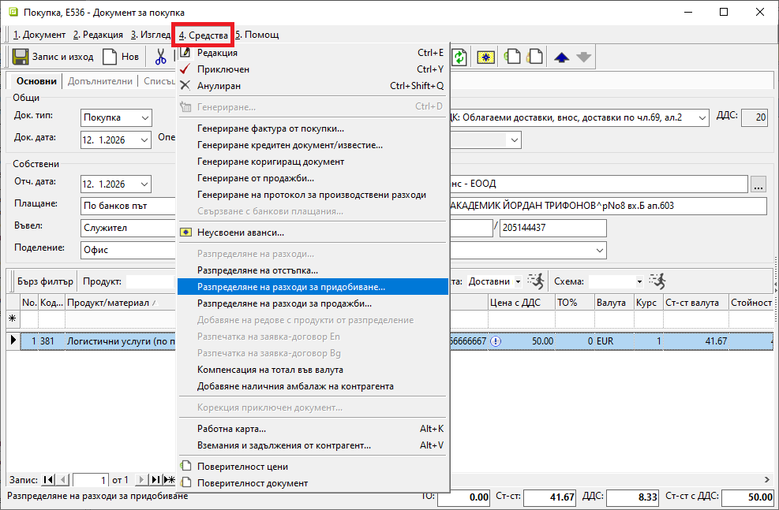
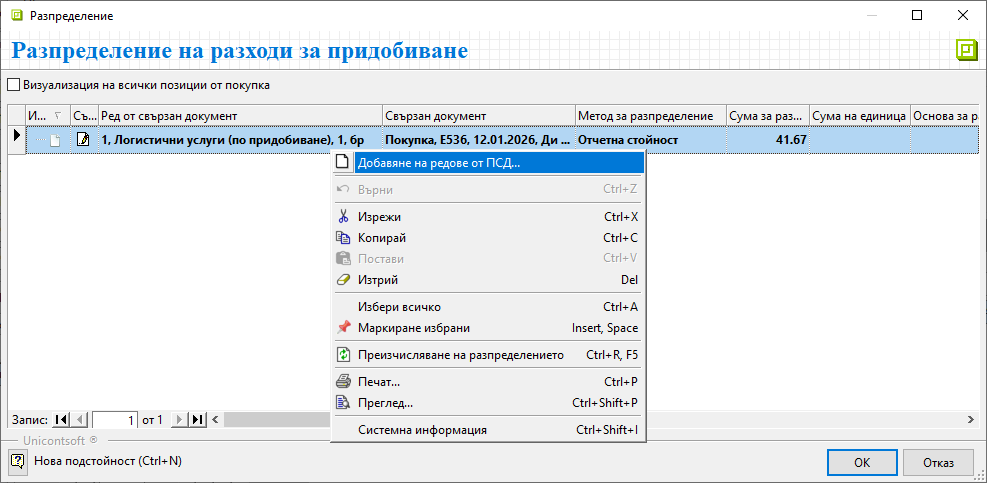
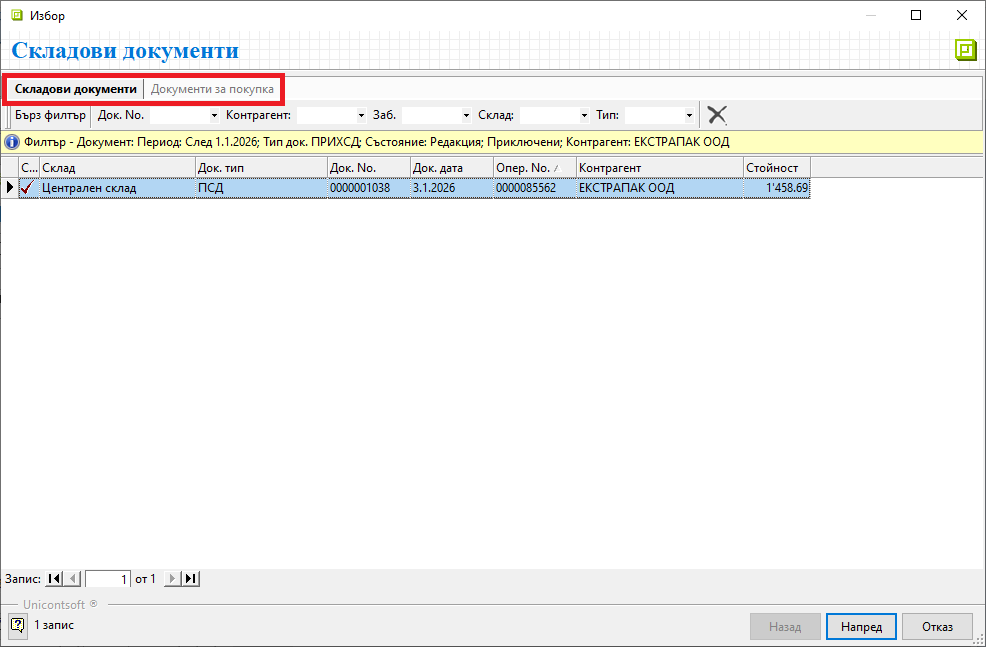
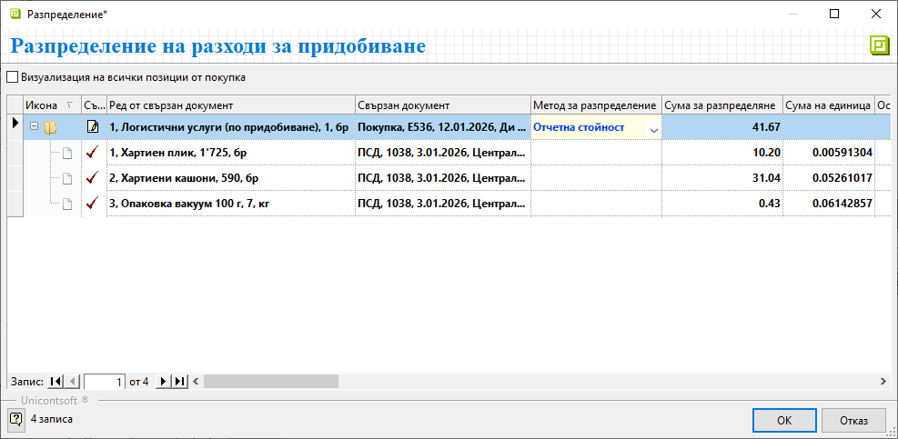
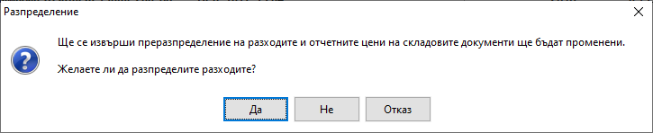

```{only} html
[Нагоре](000-index)
```

# **Разходи за придобиване**

- [Въведение](#въведение)  
- [Как се разпределят разходи](#разпределяне-на-разходи)  
- [Свързани статии](#свързани-статии)  

## **Въведение**

Системата разполага с инструмент за разпределяне на разходите по придобиване - транспорт, опаковка и други. Това осигурява точна информация за фактическата себестойност на закупените продукти и материали.  

> Сумата на разходите за разпределяне е винаги без ДДС.  

Препоръчително е за различните разходи да се [създадат отделни продукти](../../../001-ref/001-nomenclatures/004-items.md) от тип, настроен като услуга.  

## **Разпределяне на разходи**

Процесът по разпределяне на разходи по покупка е следният:  

1) **Покупка със стоки** - Предварително документите за придобиване на стоките трябва да се валидират в системата. Това са документите от тип [**Покупка**-*Документ за покупка*](../001-orders-sales-purchase-documents/002-create-purchase-documents.md) и тип **ПСД**-*Приходен складов документ*.  

2) **Покупка с разходи по придобиване** - В отделен нов документ за покупка се въвеждат направените разходи по придобиване. Полетата с реквизити от секции *Общи*, *Собствени* и *Доставчик* се попълват без особености.  
В редовете на документа се използват създадените за целите на разпределението продукти - напр. *Логистични услуги по придобиване*, *Опаковане* и т.н.  

3) **Разпределение** - От меню **Средства** се избира опция **Разпределение на разходи за придобиване**. Това отваря форма за избор на свързани документи.   

{ class=align-center w=15cm }

На този етап формата съдържа единствено ред с разходите за разпределяне. Трябва да се добавят документите, към които се отнасят тези разходи. Чрез десен клик върху реда се използва опция **Добавяне на редове от ПСД**.  

{ class=align-center w=15cm }

Системата отваря форма за избор **Складови документи**. Тя съдържа списъци **Складови документи** и **Документи за покупка**. Работи се по избор в един от двата списъка. Могат да бъдат маркирани един или няколко документа **ПСД** / **Покупка**.  
С бутон [**Напред**] се продължава към следваща стъпка.  

{ class=align-center w=15cm }

Системата показва съдържанието на избраните документи. От списъка с продукти се маркират тези, върху които да се разпределят разходите.  
Бутон [**Избор**] ги добавя в списъка на форма **Разпределение на разходи за придобиване**.    

4) **Преизчисляване на разходи** - Разходите за разпределение се изчисляват по продукти след избиране на [метод за разпределение](../../../005-how-to/004-allocate-acquisition-costs.md#методи-за-разпределение).  
Чрез оформения списък системата дава детайлна информация в следните колини:  
   - **Ред от свързан документ** - По редовете в тази колона се виждат всички разходи по придобиване и избраните продукти, върху които те ще се разпределят.  
   - **Свързан документ** - Тези полета се обзавеждат автоматично с тип, номер и дата на документа, в който участва продуктът на текущия ред.  
   - **Метод за разпределение** - Полето се обзавежда автоматично с метод **Отчетна стойност**. При него системата автоматично разпределя общата сума на разхода спрямо единичната цена на продуктите.  
   Методът за разпределение може да бъде променен чрез падащия списък в полето.  
   - **Сума за разпределяне** - Данните в тези полета се обзавеждат автоматично спрямо избрания метод за разпределение.  

   > Единствено при избран метод **Ръчно** в колона **Сума за разпределяне** се допуска редакция на стойностите.  

   - **Сума на единица** - Тези полета показват сумите на разпределените разходи за единица продукт.  

{ class=align-center w=15cm }

5) **Прилагане на промяна в отчетни цени** - Към последна стъпка в разпределението на разходи се преминава с бутон **OK**. Това отваря форма за потвърждаване на разпределението със следните опции:  
     - **Да** - Избраното разпределение се потвърждава. Формата с редове от свързани документи се затваря автоматично.  
     С това цените на придобиване в складовите документи са актуализирани.    
     - **Не** - Разпределението се отхвърля. Формата с редове от свързани документи се затваря.  
     - **Отказ** - Разпределението се прекъсва. Формата с редове от свързани документи остава на екран.   

{ class=align-center w=15cm }
  
## **Свързани статии**

[Продукти и материали](../../../001-ref/001-nomenclatures/004-items.md)  
[Документи за покупка](../001-orders-sales-purchase-documents/002-create-purchase-documents.md)  
[Разпределение на разходи за придобиване](../../../005-how-to/004-allocate-acquisition-costs.md)  