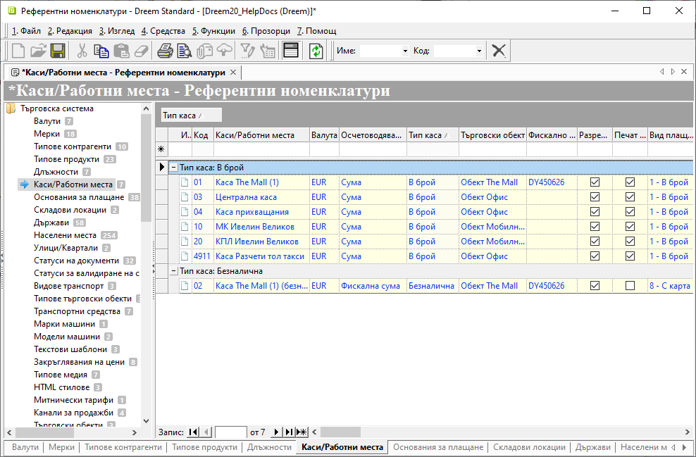
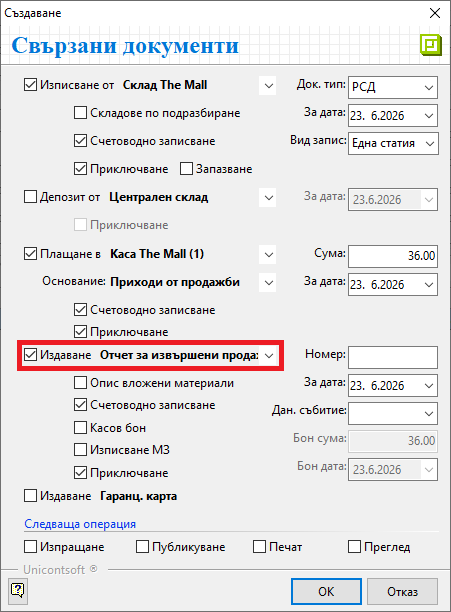
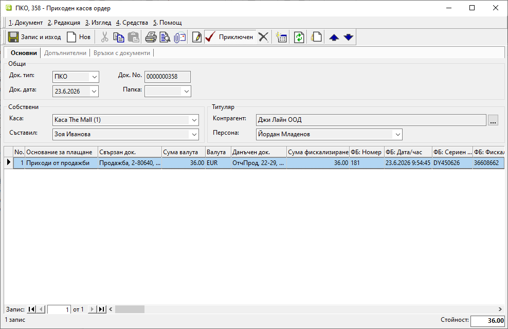
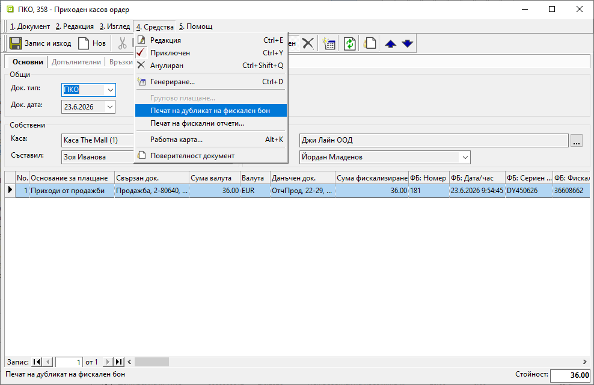
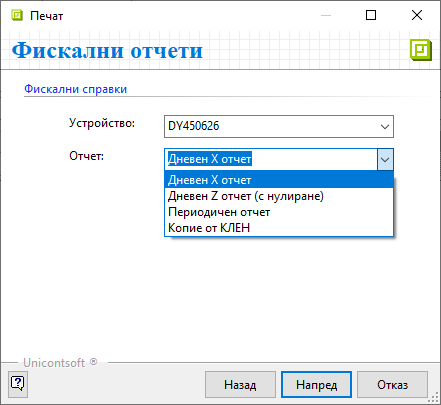

```{only} html
[Нагоре](000-index)
```

# **Фискални операции**

- [Въведение](#въведение)  
- [Настройки на каси](#настройки-на-каси)  
- [Издаване на касов бон](#касов-бон)   
- [Дубликат на ФБ](#дубликат-на-фб)  
- [Фискални отчети](#фискални-отчети)  
- [Свързани статии](#свързани-статии)  

## **Въведение**

Фискалните операции могат да бъдат автоматизирани в **Dreem ERP**.  
Това включва издаване на фискални бонове (вкл. [сторно бонове](008-refund.md)) с различни видове плащания и печат на фискални отчети.  

> Необходимо е да има активно фискално устройство и касите предварително да бъдат конфигурирани спрямо него.  

## **Настройки на каси**

Касите се конфигурират от [**Номенклатури » Референтни номенклатури**](../001-ref/001-nomenclatures/001-ref-nomenclatures.md).  
Задължителни за настройка са колоните:  
 - **Валута** - Избира се валута за касата от списъка с предварително въведените.  
 - **Осчетоводяване** - *Сума* - за касите с разплащане в брой; *Фискална сума* - за безналични каси (картови плащания).  
 - **Тип каса** - Според вида на плащанията, които ще се регистрират в касата, се указва *В брой* или *Безналична*.  
 - **Търговски обект** - Указва обект, към който принадлежи касата.  
 - **Фискално устройство** - Визуализира се списък по сериен номер с всички налични фискални устройства.  
 Чрез това поле касата се свързва с ФУ и операциите в нея се регистрират във фискалната му памет (КЛЕН).  
 - **Разрешен печат на ФУ** - Настройката разрешава печат на фискални бонове на избраното ФУ.  
 - **Печат на служебно извеждане/въвеждане** - Чрез настройката се разрешава регистриране на служебно въвеждане и извеждане на суми за ФУ.  
 - **Вид плащане** - От падащия списък се избира вид на плащането, с което ще се регистрират ФБ от тази каса.  

> В системата има развита [схема за обработване на картови плащания](../../../005-how-to/018-card-payments.md), за която са необходими допълнителни настройки.  

{ class=align-center w=15cm }

> След като настройките бъдат записани, всеки нов касов документ в системата ще се регистрира и във фискалната памет на ФУ.  

## **Касов бон**  

Издаването на фискален бон е свързано с реализиране на [продажба](../001-orders-sales-purchase-documents/003-create-sales-document.md).  
За получено плащане към нея трябва да бъдат издадени касов документ и данъчен документ.   

Видът на плащане може да бъде указан в реквизитите на документа за продажба. С това системата автоматично маркира опциите за свързани документи **Плащане в** *(Каса)* и **Основание** *(за плащане)* спрямо предварителните настройки.  
При плащане в брой избраната каса трябва да бъде с настройка *В брой*.  
При картово плащане се попълва каса с настройка *Безналична*.    

> Опция **Приключване** потвърждава издаването на фискален бон с печат на ФУ.  

Задължително се генерира данъчен документ - фактура или отчет за извършени продажби. За да бъде валидиран документът с пореден номер, се маркира опцията **Приключване**.  

{ class=align-center }

В касовия документ детайлите за фискалния бон и ФУ се обзавеждат автоматично в полета:  
 - *Сума фискализиране*  
 - *Фискален бон*   
 - *Номер на вид плащане*  
 - *ФБ: Номер*  
 - *ФБ: Дата/час*  
 - *ФБ: Фискална памет на ФУ*  
 - *ФБ: Сериен номер на ФУ*  
 - *ФБ: Обща стойност*  
 - *ФБ: Вид плащане*    

{ class=align-center w=15cm }

## **Дубликат на ФБ**

Системата позволява да бъде отпечатан дубликат на последно издадения ФБ.  
Опцията е достъпна от форма за редакция на касов документ в меню **Средства » Печат на дубликат на фискален бон**.  

> Някои фискални принтери позволяват само един дубликат на последната бележка.  
При невъзможност за издаване на дубликат системата може да издаде служебен бон. Той ще включва същото съдържание, взето като справка от КЛЕН.  

{ class=align-center w=15cm }

## **Фискални отчети** 

От форма за редакция на касов документ в меню **Средства » Печат на фискални отчети** могат да бъдат отпечатани:  

- **Дневен Х отчет (без нулиране)**  
- **Дневен Z отчет (с нулиране)**  
- **Периодичен отчет (месечен отчет)**  
- **Копие от КЛЕН**  

{ class=align-center }

## **Свързани статии**

[Референтни номенклатури](../../../001-ref/001-nomenclatures/001-ref-nomenclatures.md)  
[Касов документ](001-cashdesk.md)  
[Сметкоплан](../../../001-ref/002-accounting/002-chart-of-acc.md)  
[Автоматичен осчетоводител](../../../001-ref/002-accounting/003-acc-wizard.md)  