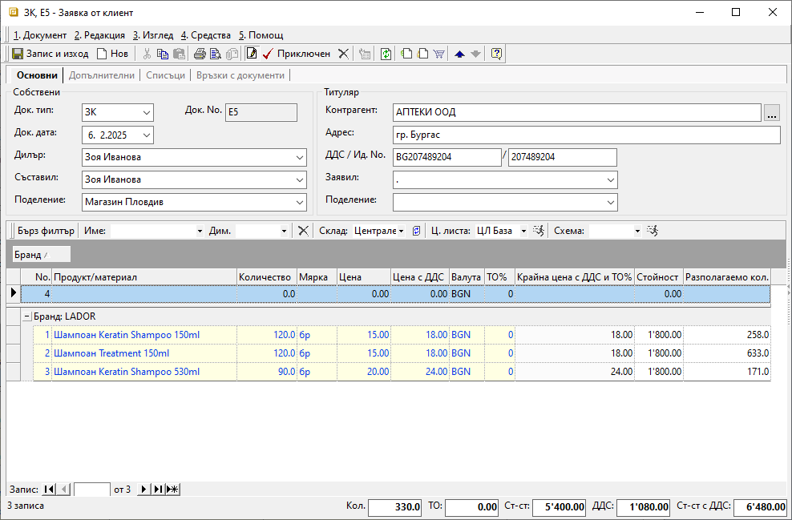
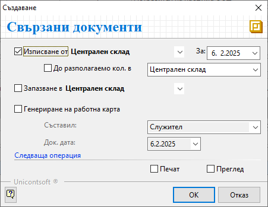

```{only} html
[Нагоре](000-index)
```

# **Документи за заявка**

- [Въведение](#въведение)  
- [Създаване на документ за заявка](#създаване-на-документ-за-заявка)  
- [Реквизити](#реквизити)  
- [Свързани статии](#свързани-статии)  

## **Въведение**

Документите за заявка осигуряват контрол на логистиката и на етапите с изпълнение на поръчките.  
В системата тези документи се въвеждат от меню **Търговска система || Документи за заявка**.  

Поръчките към доставчик и от клиент се регистрират с различни типове заявки - **Заявки към доставчик** и **Заявки от клиент**. Към тях системата дава възможност за генериране на необходимите свързани документи за реализиране на сделката - покупки, продажби, складови, платежни документи и др.  

Заявките могат да се използват и за вътрешнофирмено искане за трансфер на стоки и материали. За целта е предвиден документ с тип **Вътрешна заявка**. Към нея автоматично се създава предавателен протокол за прехвърляне на стоки между складове.  

## **Създаване на документ за заявка**

1) От списъка с **Документи за заявка** чрез десен бутон на мишката се избира **Нов документ**. Отваря се празна форма за въвеждане на нов документ.  

2) В раздел **Основни** на формата от поле **Док. Тип** се отваря падащ списък за избор на тип документ. Типът на документ определя какви свързани документи системата ще предложи за генериране при приключване на заявката.  
   От **Док. дата** се избира дата за документа, като това може да бъде текуща дата. В допълнителните реквизити има отделни полета с дати на доставка, експедиция и други. 
   
   Останалите полета от секция *Собствени* се обзавеждат автоматично, когато в системата предварително са направени необходимите настройки. Това са реквизити **Дилър**, **Съставил** и **Поделение**, в които се отварят падащи списъци за избор от персони и поделения.  
   
   Реквизит **Контрагент** се попълва според типа на въвежданата заявка. в полето се отваря форма **Контрагенти**  за избор на клиент, доставчик или **Потребител на продукта** (при вътрешни заявки).  
   Ако търсеният контрагент не фигурира в списъка, системата позволява въвеждането му в момента чрез десен бутон и **Нов контрагент**.  
   Останалите полета в секция *Титуляр* ще се обзаведат спрямо настройките на избрания контрагент.  

{ class=align-center w=15cm }

   От реда за нов запис се въвежда списък с всички заявени продукти и техните количества. Системата дава възможност чрез поле **Мярка** да се променя мерната единица с различна от настройките по подразбиране.  Ако продуктите не са предварително въведени, системата позволява това да се направи в момента от списък **Продукт/материал**.   
 
   Полета **Цена** и **Цена с ДДС** се попълват автоматично според ценовата листа, настроена за текущо избрания контрагент. Това е от значение в най-голяма степен при заявките към доставчик.   
    Системата позволява прилагане на различна ценова лист от бутона в лентата над списъка с продукти.  

   В раздел **Допълнителни** са достъпни реквизити за детайлни настройки, свързани с доставка, транспорт, плащане, складови документи, външни системи и други. Част от тях са задължителни и са отбелязани с червен символ. Системата обзавежда тези полета с данни по подразбиране, които могат да бъдат променени.  

3) Чрез бутон [**Приключен**] от лентата с инструменти се отваря форма за генерация на свързани документи. Системата дава възможност за автоматично създаване на различни свързани документи спрямо типа на заявката.   

При въвеждане на **ЗК**-*Заявка от клиент*:  
- **Генериране на документ за продажба** - при поставянето на отметка системата ще генерира свързан документ за продажба;     
    - **За** (дата) - избира се дата, която системата да попълни като **Док. дата** в продажбата;  
    - **До разполагаемо кол. в** - при активиране на опцията системата сравнява заявените количества с наличностите в избран склад;   
    От падащия списък се избира склад, който системата да използва при проверка на наличностите.  
    В документа за продажба ще се обзаведе списък с продукти, за които има разполагаеми количества.  
    - **За дата на доставка** - чрез тази опция системата копира **Дата на доставка** от заявката в **Док. дата** на продажбата;  

- **Запазване в** - поле за избор на склад, в който да бъдат резервирани количествата от заявката;  
Списък складове трябва да се настрои предварително от **Номенклатури || Контрагенти**.     

- **Печат** и **Преглед** - опциите се активират чрез поставяне на отметка и позволяват преглед на документа на екран или директното му отпечатване (след избор на шаблон);   

{ class=align-center }

При въвеждане на **ЗД**-*Заявка към доставчик*:  
- **Издаване на** - от падащия списък се избира тип **Документ за покупка**;  
При активиране на опцията чрез отметка системата генерира свързан документ за покупка. 
    - **За** (дата) - поле за избор на дата, която системата да попълни като **Док. дата** в покупката;  

- **Печат** и **Преглед** - опциите се активират чрез поставяне на отметка и позволяват преглед на документа на екран или директното му отпечатване (след избор на шаблон);  

{ class=align-center }

При въвеждане на **ВЗ**-*Вътрешна заявка*:  
- **Изписване от** - от падащия списък се избира склад, за който да се генерира предавателен протокол със заявените количества;     
    - **За** (дата) - избира се дата, която системата да попълни като **Док. дата** в предавателния протокол;  
    - **До разполагаемо кол. в** - при активиране на опцията системата сравнява заявените количества с наличностите в избран склад;  
    В предавателния протокол ще бъдат включени само продукти, за които има разполагаеми количества.  

- **Запазване в** - поле за избор на склад, в който да бъдат резервирани количествата от заявката;     

- **Печат** и **Преглед** - опциите се активират чрез поставяне на отметка и позволяват преглед на документа на екран или директното му отпечатване (след избор на шаблон);  

{ class=align-center }

4) Чрез бутон [**Запис и изход**] в лентата с инструменти документът се записва и се излиза от формата.  

## **Реквизити**

1) В раздел **Основни**:  
   - **Док. Тип** – поле за избор на тип документ - **ЗК**-*Заявка от клиент*, **ЗД**-*Заявка към доставчик*, **ВЗ**-*Вътрешна заявка* и др.;    
   - **Док. No** - полето се попълва с номер на документа;  
   Системата автоматично попълва пореден номер за текущия тип заявка при приключване на документа.  
   - **Док. дата** - в полето се избира дата, за която се отнася текущата заявка;  
   - **Дилър** - в това поле може да се избере служител, който пряко отговаря за взаимоотношенията с текущия контрагент;  
   Данните в полето се попълват автоматично, когато за избрания контрагент е настроен дилър по подразбиране.  
   - **Съставил** - полето с падащ списък за избор от предварително настроен списък служители;  
   Данните в полето се попълват автоматично с настройките на текущия потребител.  
   - **Поделение** - поле с падащ списък за избор на поделение от предварително настроените в контрагент **Потребител на продукта**;  
   Данните в полето се попълват автоматично с настройките на текущия потребител.  
   - **Контрагент** – в полето се отваря форма за избор **Контрагенти**;  
   Ако търсеният контрагент не фигурира в съществуващия списък, системата позволява въвеждането му в момента.  
   - **Адрес** - поле с адрес по регистрация на избрания контрагент;  
   - **ДДС / Ид. No.** - поле с ДДС номер, Булстат или друг идентификатор за избрания контрагент;  
   - **Заявил** - падащ списък за избор на лице,, заявило количествата по заявка;  
   - **Поделение** - списък с настроените за контрагента поделения;  

   От реда за нов запис се обзавежда списък с продукти. Колоните, които съдържа, са:  
   - **Поверителност** - дава информация за активирани *Поверителност на цени* и/или *Поверителност на документ*;  
   - **No.** - пореден номер на запис на реда;  
   - **Миниатюра на продукт/материал** - показва настроеното за продукта изображение по подразбиране;  
   - **Код продукт/материал** - полето се обзавежда с настроения основен код за избрания продукт;  
   - **Баркод на продукт/материал** - полето се обзавежда с баркод за продукта в избраната мярка;  
   - **Вендор код на продукт/материал** - полето се обзавежда при наличие на настройка с външен код на избрания продукт, предоставен от клиента/доставчика;  
   - **Вендор име на продукт/материал** - полето се обзавежда при наличие на настройка с име на избрания продукт, предоставено от клиента/доставчика;    
   - **Продукт/материал** - отваря форма за избор **Продукти и материали**;  
   - **Допълнителен текст** - въвеждане на описание за продукта на реда, което може да се показва при печат;  
   - **Забележка** - полето позволява въвеждане на свободен текст с уточнение за продукта на ред;  
   - **Партида** - поле за партида на избрания продукт;  
   От бутона в края на полето системата отваря форма с налични партиди от продукта.  
   - **Дата на годност на партида** - поле с дата на годност за текущата партида на реда;  
   - **Страна на произход на партида** - избор на страна на произход за текущата партида на реда;  
   - **Доставна партида** - в полето може да се въведе допълнителна партида за продукта на реда;  
   - **Количество** - в полето се попълва количесто за продукта на реда;  
   - **Предишно кол.** - показва предишно количество на реда преди последна промяна;  
   - **Валидирано кол.** - показва успешно валидираното количество за продукта на реда;  
   - **Отказано кол.** - в полето може да се попълни отказано количество за продукта на реда;  
   - **Свързано количество през склад** - показва количество за продукта на реда в свързани складови документи (при вътрешни заявки);  
   - **Мярка** - отваря падащ списък за избор на мерна единица от настроените за продукта на реда;  
   - **Цена** - поле за попълване на единична цена без ДДС;  
   - **Данъчна група** - показва данъчна група, настроена за продукта на реда;  
   - **ДДС ставка** - показва ДДС ставка, настроена за продукта на реда;  
   - **ДДС вкл. в цената** - указва включване на ДДС в цената на продукта от реда;  
   - **Цена с ДДС** - поле за попълване на единична цена с ДДС;  
   - **Валута** - в полето се отваря падащ списък за избор на валута; 
   - **Курс** - указва валутен курс за избраната валута;  
   - **ТО %** - полето позволява попълване на търговска отстъпка в проценти;  
   - **Крайна цена с ТО%** - показва цена без ДДС в национална валута след приспадната търговска отстъпка;  
   - **Крайна цена с ДДС** - показва крайна цена в национална валута с включен ДДС;  
   - **Крайна цена с ТО% и ДДС** - показва цена с ДДС в национална валута след приспадната търговска отстъпка;  
   - **Продуктов мениджър** - отваря падащ списък със служители за избор на продуктов мениджър;  
   - **Бруто тегло** - показва бруто тегло за количеството от продукта на реда;  
   - **Нето тегло кг** - показва нето тегло в килограми за количеството от продукта на реда;  
   - **Бруто обем** - показва бруто обем за количеството от продукта на реда;   
   - **Ст-ст валута** - показва обща сума без ДДС във валута от текущия ред;  
   - **Стойност** - показва обща сума без ДДС в национална валута;  
   - **ТО за реда** - показва обща сума на търговска отстъпка в национална валута;  
   - **ДДС за реда** - показва обща сума на ДДС за цялото количество от продукта на реда;  
   - **Обща стойност с ДДС** - показва обща стойност с ДДС за цялото количество от продукта на ред;  
   - **Обща ТО с ДДС** -показва обща сума на отстъпка с ДДС за цялото количество от продукта на ред;  
   - **Разполагаемо кол.** - поле с информация за свободни количества за продажба и изписване от склад;  
   - **Наличност** - поле с информация за налично количество - общо или за избран склад, включващо резервираните количества;  
   - **Запазени** - поле с резервираните количества за продукта на реда;  
   - **Минимално кол. за заявка** - полето се обзавежда при настроено минимално количество за заявка на продукт;  
   - **Цена по ц. листа** - показва настроената цена от приложената в документа ценова листа;  
   - **Промоционална ц. листа** - показва настроената цена при наличие на промоция към приложената в документа ценова листа;  
   - **ТО% по схема с отстъпки** - показва процент на търговската отстъпка от приложената в документа схема ТО%;  
   - **Продукт за трансформация** - отваря форма за избор на събирателен продукт за трансформация при фактуриране на продажби;  
   - **Група за трансформация** - полето позволява попълване на събирателна група за трансформация при фактуриране на продажби;  
   - **Прикачен файл за визуализация** - отваря падащ списък за избор от настроени за продукта прикачени файлове;  
   - **Заключване на реда** - позволява заключване на реда за корекции;  
   - **Група** - показва група, към която е настроен продуктът на реда;  
   - **Потребител създаване** - информация за потребител, добавил текущия ред в документа;  
   - **Дата създаване** - дата и час на добавяне на текущия ред;  
   - **Потребител последна модификация** - потребителско име на направилия последните корекции в данните на реда;  
   - **Дата последна модификация** - информация за дата и час, когато са направени последните изменения в данните на текущия ред;  

   > Като отделни колони се визуализират текущо настроените фасети и дименсии за Продукти и дълготрайни активи.  

2) В раздел **Допълнителни**:  

   **Реквизити: Дименсии** - Тази секция се визуализира, ако за документи за заявка има дефинирани дименсии от меню **Номенклатури || Потребителски дименсии**.  

   **Реквизити: Доставка**  
   - **Дата на доставка** - поле с уговорена дата на доставка;  
   - **Час на доставка** - указва час за доставка;  
   - **Предефиниран адрес** - предварително дефиниран адрес, от който се попълват елементите на адреса на доставка;  
   - **Държава** - указва държава, към която се доставя заявката;  
   - **Град/населено място** - указва населено място за доставяне на заявката;  
   - **Пощенски код** - указва пощенския код на населеното място за доставяне на заявката;  
   - **Улица / Квартал** - указва улица или квартал на място на доставяне на заявката;  
   - **Номер (Улица)** - указва номер на улица от адреса на  място на доставяне на заявката.  
   Полето остава празно, ако е избран квартал.  
   - **Блок (Квартал)** - указва номер на блок от адреса на място на доставка;  
   Полето остава празно, ако е избрана улица. 
   - **Вход (Квартал)** - указва вход на блок от адреса на доставка;  
   Полето остава празно, ако е избрана улица.  
   - **Етаж (Квартал)** - указва етаж от адреса на доставка;  
   Полето осъава празно, ако е избрана улица.  
   - **Апартамент (Квартал)** - указва номер на апартамент от адреса на доставка;  
   Полето остава празно, ако е избрана улица.  
   - **Пояснение** - допълнителна информация от адреса на доставка (например разположение на звънеца за входа, портиер, охрана и т.н.);  
   - **GPS координати на адрес на доставка** - указва GPS координати на адреса на доставка;  
   - **Телефон** - попълва се телефонен номер за контакт;  
   Използва се при генериране на куриерска товарителница.  
   - **Ел. поща** - имейл на контрагента;  
   Използва се при изпращане на документа по ел. поща. Ако не е указан, се използва имейлът, настроен в номенклатура контрагент, поделения или персони на титуляр на заявка.  
   - **Условия на доставка** - указва условията на доставка, съгласно кодовете на Incoterms;  
   Използва се при печат на пакетажен лист, валутна проформа и валутна фактура, ако са избрани бланки с концентрация.  
   
   **Реквизити: Транспорт**  
   - **Дата на експедиция** - избор на очаквана дата на експедиция с куриер или собствено транспортно средство;  
   - **Вид транспорт** - падащ списък за избор на вид транспорт за доставка;  
   Различните видове транспорт трябва да се настроят предварително от **Референтни номенклатури**.  
   - **Транспортна фирма** - отваря форма **Контрагенти**  за избор на транспортна фирма, която ще извърши доставката;  
   - **Шофьор** - указва шофьор от транспортна фирма, който ще извърши доставката;  
   - **Втори шофьор** - указва втори шофьор от транспортната фирма, който ще извърши доставката съвместно с първия;  
   - **Транспортно средство** - указва вид на транспортното средство за доставка;  
   - **Регистрационен No.** - попълва се регистрационен номер на превозното средство за доставка;  
   - **Номера на контейнери** - полета за въвеждане на идентификационните номера на транспортните контейнери;  
   Използва се само за документация на заявката. Не се ползва никъде от системата.  
   - **Товарителница** - поле с номер на товарителница към доставката;  
   Използва се при генериране на счетоводни документи по сметки за наложен платеж.  
   
   **Реквизити: Плащане**  
   - **Дата на падеж** - избор на дата с падеж на плащане при създаване на свързан документ за продажба;  
   - **Начин на плащане** - указва начин на плащане при създаване на свързан документ за продажба;  
   - **Код на транзакция** - полето се попълва при плащане с карта или online плащане;  
   Указва код на транзакция от банков POS терминал или от система за online плащания, както ще се отчете плащането по продажбата в извлечението от банката оператор.  
   - **Банкова сметка** - избор на банкова сметка при печат на данъчен документ;  
   - **Система за online плащания** - полето се попълва при online плащане;  
   Указва оператор, през който е извършено плащането (online payment gateway), като **ePay.bg**, **EasyPay**, **PayPal** и др.  
   - **Промо ваучер** - поле с промо ваучер за допълнителна отстъпка от програми за лоялност;  
   
   **Реквизити: Складов документ**  
   - **Дата на събиране** - избор на очаквана дата за събиране на стоки при издължаване от склад;  
   - **Склад за изпълнение** - избор на склад, от който ще се издължат или в който ще се заприходят количествата;  
   - **Премахване на запазени количества** - указва начина на отписване на запазените количества;  
   При приключване на складов документ и избрана опция *Да* в свързана заявка, запазените количества се премахват за цялата заявка.  
   
   **Реквизити: Данъчен документ**  
   - **Вид документ** - избор на тип данъчен документ, който се предлага при фактуриране на свързана продажба;  
   - **Контрагент** - избор на контрагент, който ще е титуляр на фактурата;  
   Използва се единствено при настроен тип данъчен документ *1 - Фактура*.  
   - **Адрес** - поле с адрес на контрагент при печат на фактура;  
   Използва се единствено при избран тип данъчен документ *1 - Фактура*.  
   - **ДДС номер** - попълва се ДДС номер (ИН по ДДС) за печат на фактура;  
   Използва се единствено при избран тип данъчен документ *1 - Фактура*.  
   - **Идент. номер** - поле за идентификационен номер (ИН), както ще се отпечата на фактура;  
   Използва се единствено при избран тип данъчен документ *1 - Фактура*.   
   - **Поделение** - избор на поделение на контрагент, за което ще се издаде фактура;  
   Използва се единствено при избран тип данъчен документ *1 - Фактура*.  
   - **Получател** - избор на лице, което ще е получател на фактура;    
   Използва се единствено при избран тип данъчен документ *1 - Фактура*.  

   **Реквизити: Допълнителни**  
   - **Допълнителен ДДС** - указва стойност на допълнителен ДДС за изравняване на *Обща стойност с ДДС* на документа;  
   - **Канал за продажби** - указва канала за продажби, по който се реализира сделката;  
   Използва се в справка **Проследяване на заявки**.  

   **Реквизити: СУПТО**  
   - **Търговски обект** - падащ списък за избор на търговски обект, в който се извършва продажбата;  
   - **Работно място с ФУ** - указва фискално устройства за генериране на Уникален номер на продажба (УНП);  
   - **Генериран УНП** - полето се обзавежда с генерирания Уникален номер на продажба (УНП);  
   - **Продажба с унаследен УНП** - указва документ за продажба, който унаследява генерирания Уникален номер на продажба (УНП) на документа за заявка;  

   **Реквизити: Външни системи**  
   - **Поръчка номер** - полето се обзавежда с номер на поръчка за обмяна на документи по EDI система;  
   - **Поръчка дата** - указва дата на поръчка за обмяна на документи по **EDI** система;  
   - **Интернет заявка** - оригинална дата на интернет заявка от **EcoPanda** система;  
   - **Клиентски код** - указва клиентски код на титуляра на документа във външни системи, **getti** карта;  
   - **Собствен код** - указва код на контрагента-издател на документа във външни системи, *Доставчик номер в търговска верига* по **EDI** система;  

   **Реквизити: Други**  
   - **Машина** - указва машина, за която се отнасят дейностите и материалите в заявката;  
   - **Дейност заявка** - поле с допълнителна информация за извършените дейности по машината;  
   - **Подизпълнител** - избор на контрагент, който е подизпълнител в сделката;  
   Не се използва никъде от системата.  

   - **Забележка при печат** - поле вдясно на формата, в което може да бъде въведен свободен текст, който се отпечатва на документа;  
   - **Забележка** - поле за добавяне на коментар, свързан с текущия документ, който не се отпечатва;  

3) В раздел **Списъци**:  
   **Списъци**  
   - **Прикачени файлове** - Системата дава възможност от реда за нов запис вдясно да се добавят прикачени файлове. Това става от поле **Файл**, в което се отваря форма за избор **Медия каталог**. Каталогът включва предварително настроени от **Номенклатури || Медия каталог** папки.   

4) В раздел **Връзки с документи**:  
Този раздел не съдържа реквизити за настройка. В него системата осигурява пряк път до свързани документи. Ако заявката е валидирана и към нея има генерирани свързани документи, те се визуализират по тип в съответната папка.  
От тук свързаните документи могат да бъдат отворени и редактирани.   

## **Свързани статии**

[Как да въведем Заявка от клиент](https://www.unicontsoft.com/cms/node/41)  
[Как да създадем Заявка към доставчик](https://www.unicontsoft.com/cms/node/56)  
[Как да създадем Заявка към доставчик за дозареждане](https://www.unicontsoft.com/cms/node/107)  
[Как автоматично да запазим количества](https://www.unicontsoft.com/cms/node/72)  
[Как да валидираме количества с баркод скенер в документи за заявка](https://www.unicontsoft.com/cms/node/182)