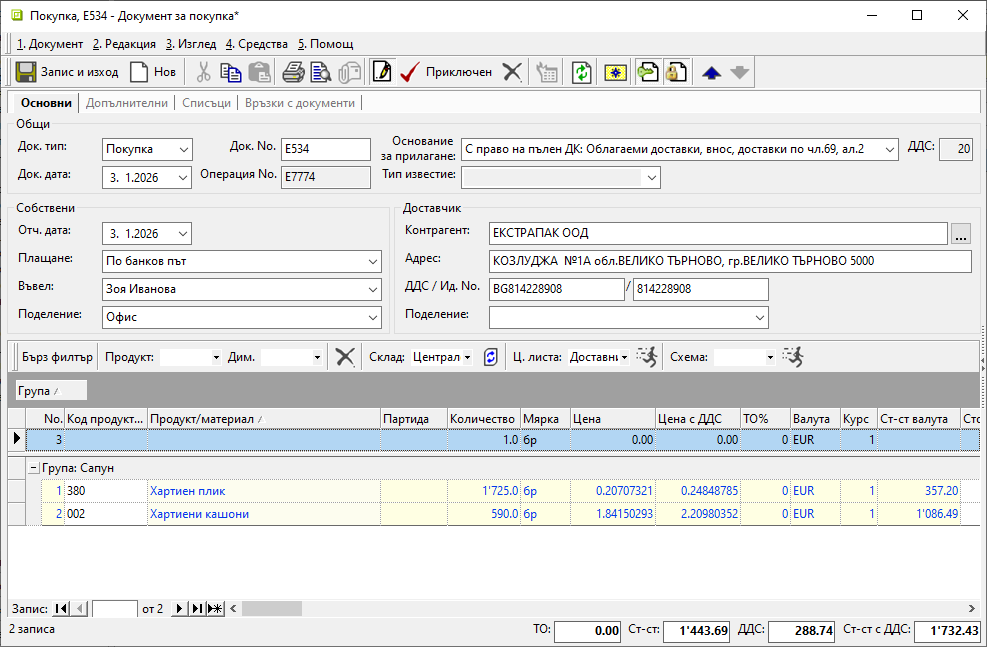
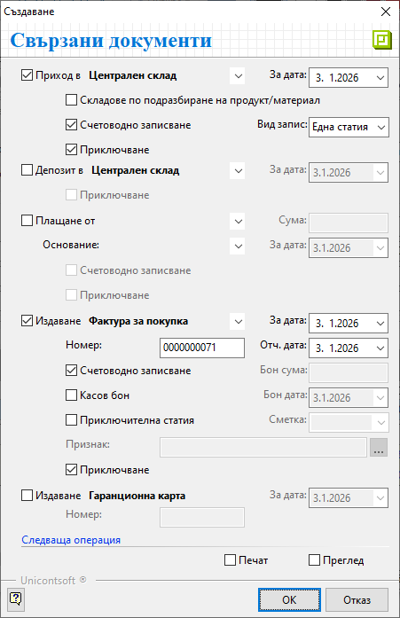

```{only} html
[Нагоре](000-index)
```

# **Документи за покупка**

- [Въведение](#въведение)  
- [Създаване на нов документ за покупка](#нов-документ-за-покупка)  
- [Реквизити](#реквизити)  
- [Свързани статии](#свързани-статии)  

## **Въведение**

Търговската операция по покупка на стоки и услуги от страна на контрагент **Потребител на продукта** се регистрира в системата чрез вътрешнофирмен документ **Покупка**. В него се описват всички продукти и договорените с доставчика условия на сделката.  

> С валидирането на документа за покупка възниква задължение към доставчика.  

Системата дава възможност за генерирация и на останалите документи по сделката - складови, касови, данъчни и други. Това може да стане в момента на приключване или в последствие.  
Тези операции могат да бъдат извършени от един потребител или от различни отдели в организацията.  

## **Нов документ за покупка**

1) **Създаване**  

Покупките се регистрират в системата от **Търговска система » Документи за покупка**.  
С десен клик върху списъка с документи се избира **Нов документ** (**Ctrl+N**). Отваря се празна форма за въвеждане на данни.  

2) **Попълване на реквизити**  

В раздел **Основни** се попълват реквизитите в секции *Общи*, *Собствени* и *Доставчик*:  

- **Док. Тип** - Полето отваря падащ списък за избор на тип документ. Системата автоматично попълва реквизита с тип **Покупка**.  
Настройката по подразбиране може да бъде променена в **Номенклатури » Типове документи**.  
- **Док. No** - В полето се въвежда номер на документа.  

> Полето може да се попълнии с номер на данъчен документ, ако има издаден такъв. В последствие системата автоматично ще го попълни и в свързаната фактура.   

- **Док. дата** - Избира се датата, за която се отнася текущата покупка.   
- **Основание за прилагане** - Чрез реквизита се определя видът на сделката.   
Системата обзавежда полето с основанието, настроено по подразбиране. То може да бъде променено от падащия списък. Основанията за прилагане се настройват предварително от **Номенклатури » Референтни номенклатури**.  

> Поле **ДДС** показва процент ДДС, който съответства на избраното основание аз прилагане.  

- **Плащане** - В полето се посочва начинът на плащане, договорен с доставчика.  
Системата обзавежда полето с настройката по подразбиране. Тя може да се дефинира [отделно за всеки контрагент](../../../004-tips/006-payment-terms.md#начин-на-плащане-по-контрагент). Освен това за системата може да се настрои [запомняне последен начин на плащане](../../../004-tips/006-payment-terms.md#последен-начин-на-плащане).  
- **Въвел** - От полето се отваря списък със служители за избор на персона.    
- **Обект** - Чрез реквизита може да бъде указан обект от настроените в **Потребител на продукта**.   

> Полетата за избор на персона и обект се обзавеждат автоматично, когато за потребителя в системата предварително са направени необходимите настройки.  

- **Контрагент** - В полето се отваря форма **Контрагенти**  за избор на доставчик.  
С избора на контрагент останалите данни в секция *Доставчик* се попълват автоматично.  
Ако търсеният контрагент не фигурира в съществуващия списък, системата позволява въвеждането му в момента.  

> Данните в секция **Доставчик** могат да бъдат коригирани чрез промяна в настройките на контрагента.  

{ class=align-center w=15cm }

От реда за нов запис през поле **Продукт/материал** се въвежда списък със закупените продукти.  
При работа с партиди, те се указват чрез поле **Партида** като отделни редове.  

> Ако продуктите не фигурират в системата като номенклатури, могат да бъдат въведени на момента. За целта в списък **Продукти и материали** с десен клик се избира **Нов продукт**.   

Закупените количества по продукти се добавят от поле **Количество**.  
Системата обзавежда **Мярка** с настроената за продукта мерна единица по подразбиране. Списъкът в полето показва мерни единици според настройките на **Фасети на мерки**.  

В **Цена** или **Цена с ДДС** се посочва единичната цена от получения документ.  
В поле **Цена** се въвежда цената без ДДС, а в поле **Цена с ДДС** - тази с ДДС. Достатъчно е да се попълни една от цените, при което системата автоматично изчислява другата.   
Системата позволява прилагане на последна доставна ценова листа от бутона в лентата с *Бърз филтър*.  

В раздел **Допълнителни** са достъпни реквизити за детайлни настройки, свързани с доставка (дати на доставка, експедиция ), транспорт, плащане, складови документи, външни системи и други. Част от тях са задължителни и са отбелязани с червен символ. Системата обзавежда тези полета с данни по подразбиране, които могат да бъдат променени.  

3) **Приключване**  

За валидиране на покупката се избира бутон [**Приключен**] от лентата с инструменти. Това извежда форма **Свързани документи**. Чрез нея могат да се извършат останалите операции:  

- **Приход в** (склад) — Полето се маркира, ако стоката е пристигнала и трябва бъде отразена в складовите наличности.  
    - *За дата* - Избира се дата, която системата да попълни като **Док. дата** в складовия документ.  
    - *Складове по подразбиране на продукт/материал* - При избране на тази опция се вземат предвид настройките за склад по подразбиране на всеки продукт. Системата ще групира продуктите по складове и за всеки ще генерира отделен складов документ.  
    - *Счетоводно записване* - При маркиране на опцията складовият документ ще се осчетоводи автоматично.  
    За да се обзаведе коректно счетоводната статия, **Автоматичен счетоводител** трябва да бъде настроен предварително.  
    - *Вид запис* - В полето се указва формат на счетоводния документ.  
    При вариант *Една статия* системата създава счетоводен документ с една статия, включваща продуктите (признаците) в общ списък.  
    При *Ред-статия* се генерира счетоводен документ с множество статии - за всеки продукт се създава отделна счетоводна статия.  
    - *Приключване* - Опцията указва генериране на складов документ с автоматично приключване.  
    Ако не бъде поставена отметка, системата генерира свързания документ в състояние на редакция.  

- **Депозит в** (склад) - Избира се склад, в който се създава депозитна разписка. Тя съдържа настроения амбалаж за продуктите в покупката.  
    - *За дата* - Избира се дата, която системата да попълни като **Док. дата** в депозитната разписка.  
    - *Приключване* - Чрез опцията се потвърждава генериране на депозитна разписка с автоматично приключване.  
    Ако не бъде поставена отметка, системата генерира свързания документ в състояние на редакция.  

- **Плащане от** (каса) — Чрез опцията се указва каса, в която се създава разходен касов ордер. Използва се за регистриране на плащане в брой.  
    - *Сума* - В полето се записва фактически изплатената сума по документа за покупка.  
    - *Основание* - От списъка се посочва основанието за плащане, което системата да обзаведе в касовия документ.  
    - *За дата* - Избира се дата, с която системата попълва **Док. дата** в касовия документ.  
    - *Счетоводно записване* - С поставяне на отметка се указва касовият документ да бъде осчетоводен автоматично.  
    За да се обзаведе коректно счетоводната статия, **Автоматичен счетоводител** трябва да бъде настроен предварително.  
    - *Приключване* - При поставена отметка системата ще генерира касов документ с автоматично приключване.    
    В обратния случай системата генерира касовия документ в редакция.  

- **Издаване** (данъчен документ) — Опцията се маркира при получен данъчен документ към покупката. Тип на данъчния документ се избира от падащия списък.  
    - *За дата* - Избира се дата, с която системата да попълни **Док. дата** в данъчния документ.  
    - *Номер* - В полето се вписва номер на получения данъчен документ.  
    Ако полето бъде оставено празно, системата ще копира **Док. No** на покупката като номер и в данъчния документ.  
    - *Счетоводно записване* - С поставянето на отметка се потвърждава генериране на счетоводна статия за данъчния документ.  
    - *Касов бон* - Опцията указва генерация на счетоводен запис за касовия документ.  

    > Опцията *Касов бон* не трябва да се маркира, ако има генериран вътрешнофирмен касов документ със счетоводно записване чрез опцията **Плащане от** *(каса)*.  

    - *Бон сума* - Попълва се сума от касовия бон.  
    - *Бон дата* - Попълва се датата на касовия бон.  
    - *Приключване* - При поставена отметка избраният данъчен документ автоматично се създава с приключване.  
    Ако полето остане празно, системата генерира свързания документ в състояние на редакция.  

- **Издаване Гаранционна карта** – Тази опция се избира, когато към текущата покупка има издаден гаранционен документ.    
    - *За дата* - Указва се дата, с която системата да попълни поле **Док. дата** в гаранционния документ.  
    - *Номер* - В полето се вписва номер на гаранционния документ.   

- **Печат** или **Преглед** - Отваря се форма за избор на шаблон.  
При избрана опция **Печат** документът се разпечатва директно с избрания шаблон. При опция **Преглед** документът се отваря на екран преди отпечатване.     

- **Ок** - Бутонът потвърждава маркираните опции.  
Системата генерира избраните свързани документи и валидира покупката.    

{ class=align-center }

4) **Запис**  

Чрез бутон [**Запис и изход**] от лентата с инструменти документът се записва. Формата се затваря автоматично.  

## **Реквизити**

1) В раздел **Основни**:  
   - **Док. Тип** – поле за избор на тип документ;  
   По подразбиране системата предлага **Покупка**-*Документ за покупка*.   
   - **Док. No** - в полето се попълва номер на документа;  
   Ако полето остане празно, системата автоматично попълва пореден номер при приключване на документа спрямо настройките в **Номератори**.  
   - **Док. дата** - в полето се избира дата за текущата покупка;  
   - **Операция No.** - системата попълва полето автоматично с пореден номер на операцията;  
   - **Основание за прилагане** - падащ списък за избор на вида на сделката;  
   Основанията са предварително дефинирани от **Номенклатури » Референтни номенклатури**.  
   - **Тип известие** - този реквизит се активира и използва единствено в коригиращи документи;  
   - **ДДС** - показва процент ДДС, настроен за избраното основание за прилагане;  
   - **Плащане** - поле с падащ списък за избор на начин на плащане;  
   - **Въвел** - избор на лице, въвело документа, от предварително настроен списък със служители;  
   Данните в полето се попълват автоматично с настройките на текущия потребител.  
   - **Обект** - поле с падащ списък за избор на обект;  
   Списъкът трябва да е предварително настроени в контрагент **Потребител на продукта**.  
   - **Контрагент** – в полето се отваря форма за избор на доставчик от списък **Контрагенти**;  
   Ако търсеният контрагент не фигурира в съществуващия списък, системата позволява въвеждането му в момента.  
   - **Адрес** - поле с адрес по регистрация на избрания контрагент;  
   - **ДДС / Ид. No.** - поле с ДДС номер, Булстат или друг идентификатор за избрания контрагент;  
   - **Обект** - списък с настроените за контрагента обекти;  

   От реда за нов запис се обзавежда списък с продукти. Колоните, които съдържа, са:  
   - **Поверителност** - дава информация за активирани *Поверителност на цени* и/или *Поверителност на документ*;   
   - **No.** - пореден номер на запис на реда;  
   - **Миниатюра на продукт/материал** - показва настроеното за продукта изображение по подразбиране;  
   - **Код продукт/материал** - полето се обзавежда с настроения основен код за избрания продукт;  
   - **Баркод на продукт/материал** - полето се обзавежда с баркод за продукта в избраната мярка;  
   - **Вендор код на продукт/материал** - полето се обзавежда при наличие на настройка с външен код на избрания продукт, предоставен от доставчика;  
   - **Вендор име на продукт/материал** - полето се обзавежда при наличие на настройка с име на избрания продукт, предоставено от доставчика;  
   - **Тип на продукт/материал** - полето се обзавежда с настроения реквизит *Тип* за продукт на реда;  
   - **Продукт/материал** - отваря форма за избор **Продукти и материали**;  
   - **Допълнителен текст** - въвеждане на описание за продукта на реда, което може да се показва при печат;  
   - **Забележка** - полето позволява въвеждане на свободен текст с уточнение за продукта на ред;  
   - **Партида** - попълва се партида за избрания на реда продукт;  
   От бутона в края на полето системата отваря форма с налични партиди от продукта.  
   - **Дата на годност на партида** - указва дата на годност за партида на реда;  
   - **Страна на произход на партида** - указва страна на произход за текущата партида на реда;  
   - **Доставна партида** - в полето може да се въведе допълнителна партида за продукт на реда;  
   - **Акциз за осн. мярка** - показва настройките на реквизита от раздел **Допълнителни** във форма за редакция на продукта;  
   - **АДД на партида** - в полето има възможност за попълване на свободен текст с акцизен данъчен документ;  
   - **Сериен номер на партида** - в полето може да се въведе общ сериен номер за партида на реда;  
   - **Серийни номера** - указва сериен номер за продукт на реда;  
   - **Количество** - указва количесто за продукта на реда;   
   - **Мярка** - падащ списък за избор на мерна единица от настроените за продукта на реда;  
   - **Цена** - поле за попълване на единична цена без ДДС;  
   - **Основание за прилагане** - отваря падащ списък за избор на основание за прилагане;  
   Всички основания трябва да бъдат настроени предварително в **Номенклатури » Референтни номенклатури**.  
   - **Данъчна група** - показва данъчна група, настроена за продукта на реда;  
   - **ДДС ставка** - показва ДДС ставка, настроена за продукта на реда;  
   - **ДДС вкл. в цената** - указва включване на ДДС в цената на продукта от реда;  
   - **Цена с ДДС** - поле за попълване на единична цена с ДДС;  
   - **Количество в основна мярка** - показва количество за продукта на реда в основна мерна единица;  
   - **Осн. мярка** - показва мерна единица, настроена за основна;  
   - **Отношение на мерки** - показва фасети на мерки за допълнителната мерна единица;  
   - **Цена осн. мярка** - показва единична цена без ДДС за продукта в основна мерна единица;  
   - **ТО%** - поле за въвеждане на търговска отстъпка в проценти;  
   - **Валута** - отваря списък за избор на валута от предварително настроените;  
   Валута на документа се променя от раздел **Допълнителни**, след което системата обзавежда валута и по редовете.  
   - **Курс** - указва валутен курс за избраната валута;  
   - **Бруто тегло** - показва бруто тегло за количеството от продукта на реда;  
   - **Бруто обем** - показва бруто обем за количеството от продукта на реда;  
   - **Ст-ст валута** - обща стойност без ДДС за количеството продукти на реда;  
   - **Стойност** - показва обща стойност на реда в национална валута;  
   - **ДДС за реда** - показва обща сума на ДДС за цялото количество от продукта на реда;  
   - **Обща стойност с ДДС** - показва обща стойност с ДДС за цялото количество от продукта на ред;  
   - **Включен акциз** - показва сума на акциза за избраното количество от продукт на реда;  
   - **Разполагаемо кол.** - поле с информация за свободни количества на склад;  
   - **Наличност на склад** - поле с информация за налично количество - общо или за избран склад, включващо резервираните количества;  
   - **Запазени в склад** - показва резервираните количества за продукт на реда;  
   - **Разпределено %** - показва какъв процент от стойността на текущия ред е разпределен като разход;  
   - **Цена по ц. листа** - показва настроената цена без ДДС от приложената в документа ценова листа;  
   - **Цена с ДДС по ц. листа** - показва настроената цена с ДДС от приложената в документа ценова листа;  
   - **Марж % между ц. листи** - показва процент на маржа, като сравнява доставна цена и цената от приложената ценова листа в текущия документ;  
   - **ТО% по схема с отстъпки** - показва процент на търговската отстъпка от приложената в документа схема ТО%;  
   - **Направление** - отваря списък за избор от настроените в **Номенклатури » Референтни номенклатури » Счетоводство: Направления**;  
   - **Заключване на реда** - указва забрана за корекции на реда;  
   - **Група** - показва група, към която е настроен продуктът на реда;  
   - **Начална дата на разхода** - избор на дата, от която стартира разходът;  
   - **Крайна дата на разхода** - избор на дата, към която разходът приключва;  
   - **Период на разхода** - отваря списък за избор от различни типове периоди за разхода;  
   - **Разлика с количества от ПСД** - полето се попълва автоматично с разликата между количествата в покупката и в свързания ПСД;  
   - **Заявено количество** - полето се обзавежда със заявените количества от свързан документ за заявка;  
   - **Потребител създаване** - информация за потребител, добавил текущия ред в документа;  
   - **Дата създаване** - дата и час на добавяне на текущия ред;  
   - **Потребител последна модификация** - потребителско име на направилия последните корекции в данните на реда;  
   - **Дата последна модификация** - информация за дата и час, когато са направени последните изменения в данните на текущия ред;  

   > Като отделни колони се визуализират също настроените дименсии, фасети и вендор кодове за продукти и дълготрайни активи.  

   2) В раздел **Допълнителни**:  

   **Реквизити: Дименсии** - Тази секция се визуализира, ако за документи за покупка има дефинирани дименсии в меню **Номенклатури » Потребителски дименсии**.    

   **Реквизити: Доставка**  
   - **Дата на доставка** - указва дата на изпълнение от страна на доставчика;  
   - **Място на доставка** - указва място за доставка на покупката;  
   - **Условия на доставка** - указва условията на доставката, съгласно кодовете на *Incoterms*;  
   Използва се само за документация на сделката. Не се ползва никъде от системата.  
   
    **Реквизити: Транспорт**  
    - **Дата на експедиция** - избор на очаквана дата на експедиция с куриер или собствено транспортно средство;  
    - **Вид транспорт** - отваря падащ списък за избор на вид транспорт за доставка;  
    Различните видове транспорт трябва да се настроят предварително от **Референтни номенклатури**.  
    - **Транспортна фирма** - отваря форма **Контрагенти** за избор на транспортна фирма, която ще извърши доставката;  
    - **Шофьор** - указва шофьор от транспортната фирма, който ще извърши доставката;  
    - **Втори шофьор** - указва втори шофьор от транспортната фирма, който ще извърши доставката съвместно с първия;  
    - **Транспортно средство** - указва вид на транспортното средство за доставка;  

    **Реквизити: Плащане**  
    - **Начин на плащане** - указва начин на плащане за остатъчна сума по покупката;  
    - **Дата на падеж** - избор на дата с падеж на остатъчно плащане по покупката;  
    - **Отложено плащане (дни)** - автоматично попълва реквизит *Дата падеж на плащане* спрямо датата на документа;  
    - **Валута** - избор на валута, в която е уговорено задължението към доставчика;  
    - **Курс** - указва текущия курс на валутата, в която възниква задължението към доставчика;  

    **Реквизити: Подотчетни лица**  
    - **Авансов отчет No.** - указва номер на авансовия отчет на подотчетно лице;  
    - **Получил (купувач)** - указва подотчетното лице при генерация на счетоводни документи;  
    - **Отговорен (купувач)** - указва отговорно лице за проверка при приемане на покупката;  

    **Реквизити: Допълнителни**  
    - **Дата на ДДС** - указва дата на ползване на данъчен кредит, ако е отложен спрямо *Отч. дата* на документа;  
    - **Допълнителен ДДС** - указва стойност на допълнителен ДДС за изравняване на *Обща стойност с ДДС* на документа;  
    - **Папка** - избор на папка за документа при групиране в **Счетоводство**;  

    **Реквизити: Други**  
    - **МОЛ купувач** - отпаднал реквизит, който не се използва никъде в системата;  
    - **МОЛ доставчик** - отпаднал реквизит, който не се използва никъде в системата;  
    - **ЛООСО доставчик** - отпаднал реквизит, който не се използва никъде в системата;  

3) В раздел **Списъци**:  
   **Списъци**  
   - **Направления** - В тази секция системата показва списък с всички продукти от покупката. Те могат да бъдат разпределени като разход към структурни центрове на себестойност, обект/проект и/или финансова структура.  
   - **Прикачени файлове** - Системата дава възможност от реда за нов запис вдясно да се добавят прикачени файлове. Това става от поле **Файл**, в което се отваря форма за избор **Медия каталог**. Списъкът включва предварително настроени от **Номенклатури » Медия каталог** папки.  
   - **Счетоводни записвания** - В тази секция системата показва всички счетоводни записвания, генерирани за свързаните документи към текущата покупка.  

4) В раздел **Връзки с документи**:  
Този раздел не съдържа реквизити за настройка. В него системата осигурява пряк път до свързани документи. Ако покупката е валидирана и към нея има генерирани свързани документи, те се визуализират по тип в съответната папка.  
От тук свързаните документи могат да бъдат отворени и редактирани.   

## **Свързани статии**

[Номенклатури](../../../001-ref/001-nomenclatures/000-index.md)  
[Работа със списъци](../../001-documents/001-lists.md)  
[Връзки между документи](../../001-documents/002-row-crosses.md)  
[Състояния на документите](../../../004-tips/004-doc-states.md)  
[Автоматично калкулиране на единична цена](../../../004-tips/011-price-calc.md)  