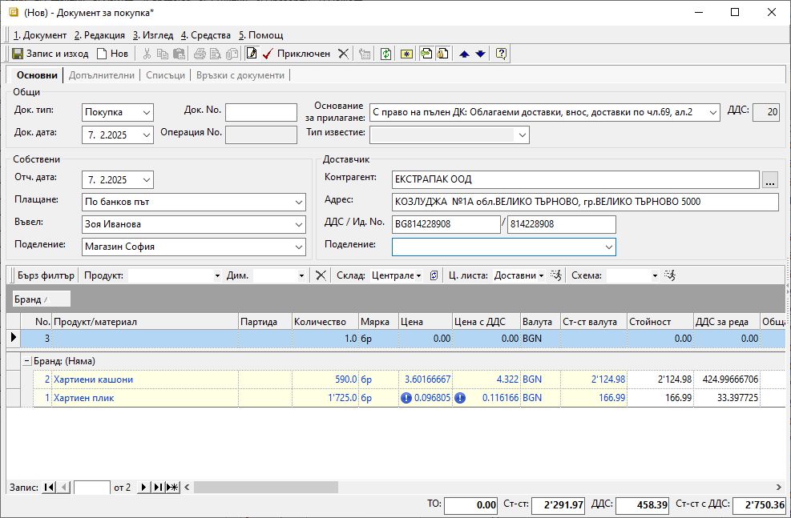

```{only} html
[Нагоре](000-index)
```

# **Документи за покупка**

- [Въведение](#въведение)  
- [Създаване на покупка](#създаване-на-покупка)  
- [Реквизити](#реквизити)  
- [Свързани статии](#свързани-статии)
## **Въведение**

Търговската операция по покупка на стоки и услуги от страна на контрагент **Потребител на продукта** се регистрира в системата чрез вътрешнофирмен документ **Покупка**. В него се описват всички продукти и договорените с доставчика условия на сделката. 
С валидирането на документа за покупка възниква задължение към доставчика.  

Системата дава възможност за генерирация и на останалите документи по сделката - складови, касови, данъчни и други. Това може да стане в момента на приключване или допълнително.  
Тези операции могат да бъдат извършени от един потребител или от различни отдели в организацията. 

## **Създаване на покупка**

Процесът по създаване на **Покупка** е следният:

1) От **Търговска система » Документи за покупка** чрез десен бутон на мишката върху списъка с документи се избира **Нов документ**. Отваря се празна форма за въвеждане на данни.  

2)  В раздел **Основни** трябва да се въведат данни за покупката в секции *Общи*, *Собствени* и *Доставчик*.  

От поле **Док. Тип** се отваря падащ списък за избор на тип документ. Системата предлага по подразбиране тип **Покупка**, освен когато настройката е изрично променена в **Номенклатури » Типове документи**.  

В реквизит **Док. No** се въвежда номер на документа. По желание системата може да копира този номер при генерацията на свързана фактура за покупка.     

В полето **Док. дата** се избира датата, за която се отнася текущата покупка.   

> **Основание за прилагане** е реквизитът, определящ вида на сделката.  
    
Системата обзавежда полето с настроеното по подразбиране основание. То може да бъде променено от падащия списък с предварително настроените основания за прилагане от **Номенклатури » Референтни номенклатури**.  

В поле **ДДС** се показва процент ДДС, който съответства на избраното основание аз прилагане.  

От падащия списък за реквизит **Плащане** се избира начинът на плащане, договорен с доставчика. Системата обзавежда полето с настройките по подразбиране. Такива могат да бъдат дефинирани отделно за всеки контрагент и общо за системата.  
 
Реквизити **Въвел** и **Поделение** се обзавеждат автоматично според настройките на текущия потребител. Ако такива липсват или данните в полетата трябва да бъдат променени, се използват падащите списъци с предварителни настройки.   

Данни в секция *Доставчик* се попълват автоматично с избора на **Контрагент**.  
Ако търсеният контрагент не фигурира в съществуващия списък, системата позволява въвеждането му в момента.  
Всички полета в секция **Доставчик** могат да бъдат коригирани, като се променят настройките на контрагента чрез формата за редакция. 

{ class=align-center w=15cm }

Списък със закупените продукти се добавя от реда за нов запис.  
Най-често използваните полета са:  
- **Продукт/материал** — Отваря се форма за избор на продукт. Ако продуктите не са предварително въведени, системата позволява това да се направи в момента чрез десен бутон и **Нов продукт**.  
- **Партида** - В това поле могат да се попълват партидите на получените продукти.  
- **Количество** — Въвеждат се получените по документ количества.  
- **Мярка** - В това поле системата дава възможност за избор на различни мерни единици.  
Падащият списък в полето се обзавежда с настройките за продукта на текущия ред. Списъкът съдържа основна мерна единица за продукта и настроените му фасети на мерки.   
- **Цена** и **Цена с ДДС** — В тези полета се посочва единичната цена от получения документ.  
В поле **Цена** се въвежда цената без ДДС, а в поле **Цена с ДДС** - тази с ДДС. Достатъчно е да се попълни една от цените, при което системата автоматично изчислява другата.   

3) За валидиране на покупката се избира бутон [**Приключен**] от лентата с инструменти.  
Това извежда форма **Свързани документи**, чрез която могат да се извършат останалите операции:  

- **Приход в** (склад) — в полето се поставя отметка, ако стоката е пристигнала в склада и трябва бъде отразена в складовите наличности;  
    - *За дата* - избира се дата, която системата да попълни като **Док. дата** в складовия документ;  
    - *Складове по подразбиране на продукт/материал* - чрез избор на тази опция се вземат предвид настройките на всеки продукт за склад по подразбиране;  
    Системата ще генерира отделни складови документи, като групира продуктите по складове.  
    - *Счетоводно записване* - при поставянето на отметка системата автоматично  ще осчетоводи складовия документ;  
    За да се обзаведе коректно счетоводната статия, **Автоматичен счетоводител** трябва да е предварително настроен.  
    - *Вид запис* - поле за избор на формат на счетоводния документ;  
    При избор на вариант *Една статия* системата създава счетоводен документ с една статия, включваща продуктите (признаците) в общ списък;  
    При *Ред-статия* системата генерира счетоводен документ с множество статии - за всеки продукт се създава отделна счетоводна статия;
    - *Приключване* - при поставена отметка системата генерира складов документ и автоматично го приключва;  
    Ако не бъде поставена отметка, системата генерира свързания документ, който остава в състояние на редакция. 

- **Депозит в** (склад) - опция за избор на склад и създаване на депозитна разписка, съдържаща настроен амбалаж към продукти;  
    - *За дата* - избира се дата, която системата да попълни като **Док. дата** в депозитната разписка;  
    - *Приключване* - при поставена отметка системата генерира депозитна разписка и автоматично я приключва;  
    Ако не бъде поставена отметка, системата генерира свързания документ, който остава в състояние на редакция.

- **Плащане от** (каса) — чрез тази опцията се създава разходен касов ордер в избраната каса;  
Използва се, когато има плащане в брой.  
    - *Сума* - в това поле се записва фактически изплатената сума по документа за покупка;  
    - *Основание:* - от падащия списък се посочва основанието за плащане, което системата да обзаведе в касовия документ;  
    - *За дата* - избира се дата, с която системата попълва **Док. дата** в касовия документ;  
    - *Счетоводно записване* - при поставянето на отметка системата автоматично ще осчетоводи касовия документ;  
    За да се обзаведе коректно счетоводната статия, **Автоматичен счетоводител** трябва да е предварително настроен.  
    - *Приключване* - при поставена отметка системата генерира касов документ и автоматично го приключва;  
    Ако не бъде поставена отметка, системата генерира свързания документ, който остава в състояние на редакция. 

- **Издаване** (данъчен документ) — опцията се маркира при наличие на данъчен документ към покупката;  
От падащия списък се избира тип на данъчния документ. 
 
    - *За дата* - избира се дата, с която системата попълва **Док. дата** в данъчния документ;  
    - *Номер* - в полето се вписва номер на получения данъчен документ;  
    Ако полето бъде оставено празно, системата ще копира **Док. No** на покупката като номер и в данъчния документ.  
    - *Счетоводно записване* - при поставянето на отметка системата автоматично ще осчетоводи данъчния документ;  
    - *Касов бон* - опция за генерация на счетоводен запис за плащане в брой;  

    > Ако е генериран вътрешнофирмен касов документ чрез опцията **Плащане от** *(каса)* със счетоводно записване, тук опцията *Касов бон* не трябва да се маркира.  

    - *Бон сума* - сума от касовия бон;  
    - *Бон дата* - дата на касовия бон;  
    - *Приключване* - при поставена отметка системата създава данъчния документ и автоматично го приключва;  
    Ако не бъде поставена отметка, системата генерира свързания документ, но той остава в състояние на редакция.  

- **Издаване Гаранционна карта** – тази опция се избира, когато към текущата покупка има издаден гаранционен документ;    
    - *За дата* - избира се дата, с която системата да попълни поле **Док. дата** в гаранционния документ;  
    - *Номер* - в полето се вписва номер на гаранционната карта;   

- **Печат** и **Преглед** - опциите се активират чрез поставяне на отметка и позволяват преглед на документа на екран или директното му отпечатване (след избор на шаблон);  

- **Ок** - бутонът потвърждава маркираните опции;  
Системата генерира избраните свързани документи и валидира покупката.    

{ class=align-center }

4) Чрез бутон [**Запис и изход**] от лентата с инструменти документът се записва и формата се затваря.  

## **Реквизити**

1) В раздел **Основни**:  
   - **Док. Тип** – поле за избор на тип документ;  
   По подразбиране системата предлага **Покупка**-*Документ за покупка*.   
   - **Док. No** - в полето се попълва номер на документа;  
   Ако полето остане празно, системата автоматично попълва пореден номер при приключване на документа спрямо настройките в **Номератори**.  
   - **Док. дата** - в полето се избира дата за текущата покупка;  
   - **Операция No.** - системата попълва полето автоматично с пореден номер на операцията;  
   - **Основание за прилагане** - падащ списък за избор на вида на сделката;  
   Основанията са предварително дефинирани от **Номенклатури » Референтни номенклатури**.  
   - **Тип известие** - този реквизит се активира и използва единствено в коригиращи документи;  
   - **ДДС** - показва процент ДДС, настроен за избраното основание за прилагане;  
   - **Плащане** - поле с падащ списък за избор на начин на плащане;  
   - **Въвел** - избор на лице, въвело документа, от предварително настроен списък със служители;  
   Данните в полето се попълват автоматично с настройките на текущия потребител.  
   - **Поделение** - поле с падащ списък за избор на поделение;  
   Списъкът трябва да е предварително настроени в контрагент **Потребител на продукта**.  
   - **Контрагент** – в полето се отваря форма за избор на доставчик от списък **Контрагенти**;  
   Ако търсеният контрагент не фигурира в съществуващия списък, системата позволява въвеждането му в момента.  
   - **Адрес** - поле с адрес по регистрация на избрания контрагент;  
   - **ДДС / Ид. No.** - поле с ДДС номер, Булстат или друг идентификатор за избрания контрагент;  
   - **Поделение** - списък с настроените за контрагента обекти;  

   От реда за нов запис се обзавежда списък с продукти. Колоните, които съдържа, са:  
   - **Поверителност** - дава информация за активирани *Поверителност на цени* и/или *Поверителност на документ*;   
   - **No.** - пореден номер на запис на реда;  
   - **Миниатюра на продукт/материал** - показва настроеното за продукта изображение по подразбиране;  
   - **Код продукт/материал** - полето се обзавежда с настроения основен код за избрания продукт;  
   - **Баркод на продукт/материал** - полето се обзавежда с баркод за продукта в избраната мярка;  
   - **Вендор код на продукт/материал** - полето се обзавежда при наличие на настройка с външен код на избрания продукт, предоставен от доставчика;  
   - **Вендор име на продукт/материал** - полето се обзавежда при наличие на настройка с име на избрания продукт, предоставено от доставчика;  
   - **Тип на продукт/материал** - полето се обзавежда с настроения реквизит *Тип* за продукт на реда;  
   - **Продукт/материал** - отваря форма за избор **Продукти и материали**;  
   - **Допълнителен текст** - въвеждане на описание за продукта на реда, което може да се показва при печат;  
   - **Забележка** - полето позволява въвеждане на свободен текст с уточнение за продукта на ред;  
   - **Партида** - попълва се партида за избрания на реда продукт;  
   От бутона в края на полето системата отваря форма с налични партиди от продукта.  
   - **Дата на годност на партида** - поле с дата на годност за текущата партида на реда;  
   - **Страна на произход на партида** - избор на страна на произход за текущата партида на реда;  
   - **Доставна партида** - в полето може да се въведе допълнителна партида за продукт на реда;  
   - **Акциз за осн. мярка** - показва настройките на реквизита от раздел **Допълнителни** във форма за редакция на продукта;  
   - **АДД на партида** - в полето има възможност за попълване на свободен текст с акцизен данъчен документ;  
   - **Сериен номер на партида** - в полето може да се въведе общ сериен номер за партида на реда;  
   - **Серийни номера** - указва сериен номер за продукт на реда;  
   - **Количество** - в полето се попълва количесто за продукта на реда;   
   - **Мярка** - падащ списък за избор на мерна единица от настроените за продукта на реда;  
   - **Цена** - поле за попълване на единична цена без ДДС;  
   - **Основание за прилагане** - отваря падащ списък за избор на основание за прилагане;  
   Всички основания трябва да бъдат настроени предварително в **Номенклатури » Референтни номенклатури**.  
   - **Данъчна група** - показва данъчна група, настроена за продукта на реда;  
   - **ДДС ставка** - показва ДДС ставка, настроена за продукта на реда;  
   - **ДДС вкл. в цената** - указва включване на ДДС в цената на продукта от реда;  
   - **Цена с ДДС** - поле за попълване на единична цена с ДДС;  
   - **Количество в основна мярка** - показва количество за продукта на реда в основна мерна единица;  
   - **Осн. мярка** - показва мерна единица, настроена за основна;  
   - **Отношение на мерки** - показва фасети на мерки за допълнителната мерна единица;  
   - **Цена осн. мярка** - показва единична цена без ДДС за продукта в основна мерна единица;  
   - **ТО%** - поле за въвеждане на търговска отстъпка в проценти;  
   - **Валута** - полето показва валута по редове на документа;  
   Валута на документа се променя от раздел *Допълнителни*, след което системата обзавежда валута и по редовете.  
   - **Курс** - поле с валутен курс за избраната валута;  
   - **Бруто тегло** - показва бруто тегло за количеството от продукта на реда;  
   - **Бруто обем** - показва бруто обем за количеството от продукта на реда;  
   - **Ст-ст валута** - обща стойност без ДДС за количеството продукти на реда;  
   - **Стойност** - показва обща стойност на реда в национална валута;  
   - **ДДС за реда** - показва обща сума на ДДС за цялото количество от продукта на реда;  
   - **Обща стойност с ДДС** - показва обща стойност с ДДС за цялото количество от продукта на ред;  
   - **Включен акциз** - показва сума на акциза за избраното количество от продукт на реда;  
   - **Разполагаемо кол.** - поле с информация за свободни количества на склад;  
   - **Наличност на склад** - поле с информация за налично количество - общо или за избран склад, включващо резервираните количества;  
   - **Запазени в склад** - показва резервираните количества за продукт на реда;  
   - **Разпределено %** - показва какъв процент от стойността на текущия ред е разпределен като разход;  
   - **Цена по ц. листа** - показва настроената цена без ДДС от приложената в документа ценова листа;  
   - **Цена с ДДС по ц. листа** - показва настроената цена с ДДС от приложената в документа ценова листа;  
   - **Марж % между ц. листи** - показва процент на маржа, като сравнява доставна цена и цената от приложената ценова листа в текущия документ;  
   - **ТО% по схема с отстъпки** - показва процент на търговската отстъпка от приложената в документа схема ТО%;  
   - **Направление** - отваря списък за избор от настроените в **Номенклатури » Референтни номенклатури » Счетоводство: Направления**;  
   - **Заключване на реда** - позволява заключване на реда за корекции;  
   - **Група** - показва група, към която е настроен продуктът на реда;  
   - **Начална дата на разхода** - избор на дата, от която стартира разходът;  
   - **Крайна дата на разхода** - избор на дата, към която разходът приключва;  
   - **Период на разхода** - отваря списък за избор от различни типове периоди за разхода;  
   - **Разлика с количества от ПСД** - полето се попълва автоматично с разликата между количествата в покупката и в свързания ПСД;  
   - **Заявено количество** - полето се обзавежда със заявените количества от свързан документ за заявка;  
   - **Потребител създаване** - информация за потребител, добавил текущия ред в документа;  
   - **Дата създаване** - дата и час на добавяне на текущия ред;  
   - **Потребител последна модификация** - потребителско име на направилия последните корекции в данните на реда;  
   - **Дата последна модификация** - информация за дата и час, когато са направени последните изменения в данните на текущия ред;  

   > Като отделни колони се визуализират текущо настроените фасети и дименсии за Продукти и дълготрайни активи.  

   2) В раздел **Допълнителни**:  

   **Реквизити: Дименсии** - Тази секция се визуализира, ако за документи за покупка има дефинирани дименсии от меню **Номенклатури » Потребителски дименсии**.    

   **Реквизити: Доставка**  
   - **Дата на доставка** - избор на дата на изпълнение от страна на доставчика;  
   - **Място на доставка** - в полето може да се попълни място на доставка на покупката;  
   - **Условия на доставка** - указва условията на доставката, съгласно кодовете на **Incoterms**.  
   Използва се само за документация на сделката. Не се ползва никъде от системата.  
   
    **Реквизити: Транспорт**  
    - **Дата на експедиция** - избор на очаквана дата на експедиция с куриер или собствено транспортно средство;  
    - **Вид транспорт** - падащ списък за избор на вид транспорт за доставка;  
    Различните видове транспорт трябва да се настроят предварително от **Референтни номенклатури**.  
    - **Транспортна фирма** - отваря форма **Контрагенти**  за избор на транспортна фирма, която ще извърши доставката;  
    - **Шофьор** - указва шофьор от транспортна фирма, който ще извърши доставката;  
    - **Втори шофьор** - указва втори шофьор от транспортната фирма, който ще извърши доставката съвместно с първия;  
    - **Транспортно средство** - указва вид на транспортното средство за доставка;  

    **Реквизити: Плащане**  
    - **Начин на плащане** - указва начин на плащане на остатъчна сума по покупката;  
    - **Дата на падеж** - избор на дата с падеж на остатъчно плащане по покупката;  
    - **Отложено плащане (дни)** - автоматично попълва реквизит *Дата падеж на плащане* спрямо датата на документа;  
    - **Валута** - избор на валута, в която е уговорено задължението към доставчика;  
    - **Курс** - указва текущия курс на валутата, в която възниква задължението към доставчика;  

    **Реквизити: Подотчетни лица**  
    - **Авансов отчет No.** - указва номер на авансовия отчет на подотчетно лице;  
    - **Получил (купувач)** - указва подотчетното лице при генерация на счетоводни документи;  
    - **Отговорен (купувач)** - указва отговорно лице за проверка при приемане на покупката;  

    **Реквизити: Допълнителни**  
    - **Дата на ДДС** - указва дата на ползване на данъчен кредит, ако е отложен спрямо *Отч. дата* на документа;  
    - **Допълнителен ДДС** - указва стойност на допълнителен ДДС за изравняване на *Обща стойност с ДДС* на документа;  
    - **Папка** - избор на папката на документа за групиране в **Счетоводство**;  

    **Реквизити: Други**  
    - **МОЛ купувач** - отпаднал реквизит, който не се използва никъде в системата;  
    - **МОЛ доставчик** - отпаднал реквизит, който не се използва никъде в системата;  
    - **ЛООСО доставчик** - отпаднал реквизит, който не се използва никъде в системата;  

3) В раздел **Списъци**:  
   **Списъци**  
   - **Направления** - В тази секция системата показва списък с всички продукти, въведени в текущата покупка. Всички или само избрани продукти могат да бъдат разпределени като разход към структурни центрове на себестойност, обект/проект и/или финансова структура.  
   - **Прикачени файлове** - Системата дава възможност от реда за нов запис вдясно да се добавят прикачени файлове. Това става от поле **Файл**, в което се отваря форма за избор **Медия каталог**. Каталогът включва предварително настроени от **Номенклатури » Медия каталог** папки.  
   - **Счетоводни записвания** - В тази секция системата показва всички счетоводни записвания, генерирани за свързаните документи към текущата покупка.  

4) В раздел **Връзки с документи**:  
Този раздел не съдържа реквизити за настройка. В него системата осигурява пряк път до свързани документи. Ако покупката е валидирана и към нея има генерирани свързани документи, те се визуализират по тип в съответната папка.  
От тук свързаните документи могат да бъдат отворени и редактирани.   

## **Свързани статии**

[Как да въведем Документ/Фактура за Покупка](https://www.unicontsoft.com/cms/node/23)  
[Как да отпечатаме Документ за покупка](https://www.unicontsoft.com/cms/node/25)  
[Как да въведем Покупка със серийни номера на партиди](https://www.unicontsoft.com/cms/node/234)  
[Как да генерираме Документ за покупка от Продажби](https://www.unicontsoft.com/cms/node/184)  
