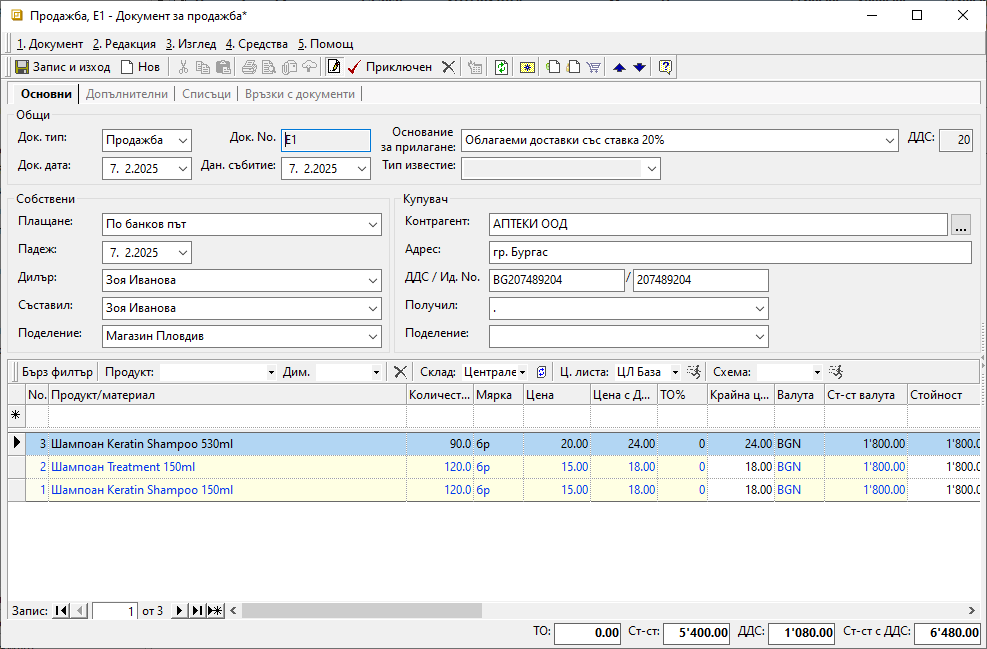
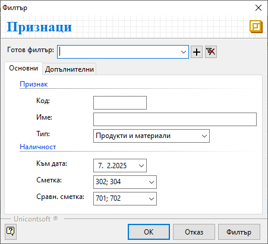
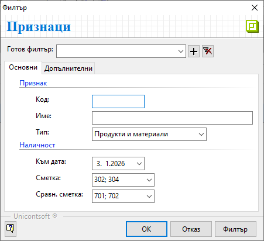
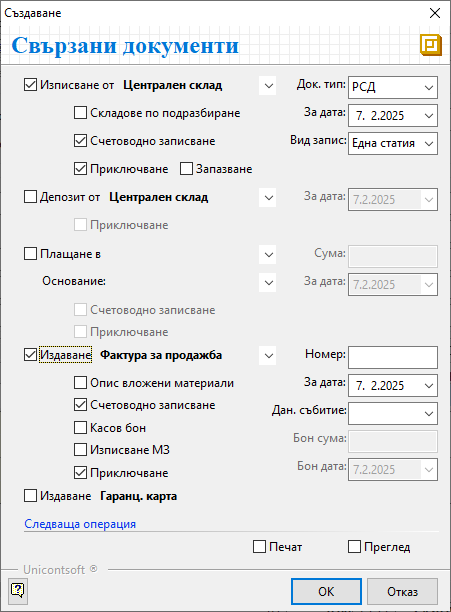
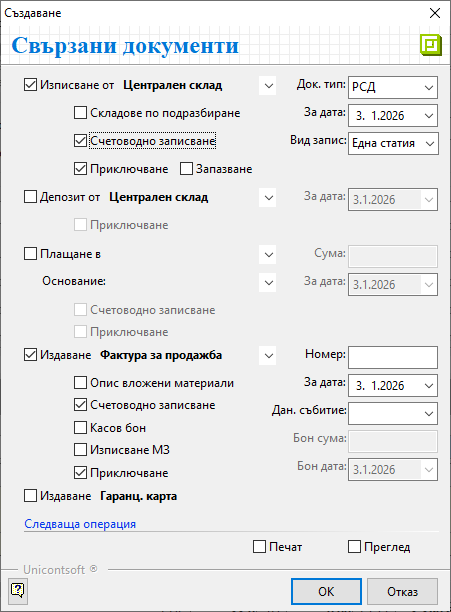

```{only} html
[Нагоре](000-index)
```

# **Документи за продажба**

- [Въведение](#въведение)  
- [Създаване на нов документ за продажба](#нов-документ-за-продажба)  
- [Реквизити](#реквизити)  
- [Свързани статии](#свързани-статии)  

## **Въведение**

Търговската операция по продажба на стоки и услуги от страна на контрагент **Потребител на продукта** се регистрира в системата чрез вътрешнофирмен документ **Продажба**. В него се описват всички продукти и договорените с клиента условия на сделката.  

> С приключването на документ за продажба възниква вземане от клиента.  

Системата дава възможност за генерирация и на останалите свързани документи по сделката - складови, касови, данъчни и други. Това може да стане в момента на валидиране на продажбата или допълнително.  
Тези операции могат да бъдат извършени от един потребител или от различни отдели в организацията.  

## **Нов документ за продажба**

1) **Създаване**  

Продажбите се регистрират в системата от **Търговска система » Документи за продажба**. Това може да стане с десен клик върху списъка с документи и **Нов документ**, с клавишна комбинация **Ctrl+N** или от бутона в лентата с инструменти. Всеки от предложените варианти отваря празна форма за въвеждане на данни за продажба.  

2) **Попълване на реквизити**  

В раздел **Основни** се попълват реквизитите в секции *Общи*, *Собствени* и *Купувач*.   

- **Док. Тип** - Полето отваря падащ списък за избор на тип документ.  
По подразбиране системата попълва тип **Продажба**-*Документ за продажба*. Настройката по подразбиране може да бъде променена в **Номенклатури » Типове документи**.    
- **Док. No** - Полето съдържа номер на документа.  
То остава празно и с приключване на продажбата системата ще обзаведе пореден номер според настройките в **Номератори**.   
- **Док. дата** - Системата предлага текуща дата за документа. При необходимост може да бъде коригирана.  
- **Дан. събитие** - Мое да бъде указана различна дата на данъчното събитие.  
- **Основание за прилагане** - Чрез реквизита се определя видът на сделката.   
Системата обзавежда полето с основанието, настроено по подразбиране. То може да бъде променено от падащия списък. Основанията за прилагане се настройват предварително от **Номенклатури » Референтни номенклатури**.    

> Поле **ДДС** показва процент ДДС, който съответства на избраното основание аз прилагане.  

- **Плащане** - В полето се посочва начинът на плащане, договорен с клиента.  
Системата обзавежда полето с настройката по подразбиране. Тя може да се дефинира [отделно за всеки контрагент](../../../004-tips/006-payment-terms.md#начин-на-плащане-по-контрагент). Освен това за системата може да се настрои [запомняне последен начин на плащане](../../../004-tips/006-payment-terms.md#последен-начин-на-плащане)..  
- **Падеж** - Показва договорения с клиента падеж на плащане.  

> Системата обзавежда тези полета автоматично, когато за клиента има дефинирани настройки за отложено плащане и за начин на плащане.   

- **Търговец** - Полето показва персона, която отговаря за бизнес отношенията с избрания клиент. Може да се обзавежда автоматично при настроен отговорен търговец за контрагента.  
- **Съставил** - Реквизитът се обзавежда с имената на служителя, създал документа.    
- **Обект** - В полето може да бъде указан обект на **Потребител на продукта**. Реквизитът е водещ при номериране на документите за продажба. Настройката се дефинира в **Администрация » Номератори** и е различна за всеки обект.       

> Полетата за избор на персона и обект се обзавеждат автоматично, когато за потребителя в системата предварително са направени необходимите настройки.  

- **Контрагент** - В полето се отваря форма **Контрагенти**  за избор на клиент.  
Останалите полета в секция *Купувач* ще се обзаведат спрямо настройките на избрания контрагент.   
Ако търсеният контрагент не фигурира в списъка, може да бъде въведен на момента с десен клик и **Нов контрагент**.  

{ class=align-center w=15cm }

От поле **Продукт/материал** на реда за нов запис се въвежда списък с продукти за продажба. Това може да стане чрез попълване на код, баркод (вкл. сканиране) или наименование. Друг вариант е чрез форма за избор **Продукти и материали**. Тя се отваря с бутона в края на полето.  
Формата има няколко раздела за избор на продукти. Всеки от тях дава различна алтернатива за добавянето на продукти.   

Раздел **Продукти и материали** представя пълен списък с въведените номенклатури с продукти. В колона **Разполагаемо кол.** могат да се проследят свободните за продажба количества, а в **Наличност в осн. мярка** - физическите наличностите в склад.  

> Данните в двете полета се обзавеждат спрямо избрания **Склад** в лента *Бърз филтър*.  

{ class=align-center w=15cm }

Раздел **Признаци** представя всички въведени като счетоводни признаци номенклатури.  
В колона **Салдо** се вижда разполагаемото количество за продуктите в счетоводния склад. В колона **Разполагаемо** се вижда разликата между наличното количество и фактурираното, но неизписано количество.  
Данните се визуализират след филтриране на списъка по следния начин:  

{ class=align-center }

Раздел **Редове на документи** показва всички продажби на избрания клиент с детайли за продукти, количествата, цени и други.  

{ class=align-center w=15cm }

Продуктите се маркират от избрания раздел. С бутон **Избор** се добавят в продажбата.  

Количествата по продукти се въвеждат в поле **Количество**.  
При работа с партиди, те се попълват чрез поле **Партида** като отделни редове.  
В полето **Мярка** системата дава възможност за указване на мерна единица.  

> Падащият списък с мерки може да варира. Той съдържа настроените за продукта основна мерна единица и фасети на мерки.   

Ценовите условия се дефинират чрез реквизити **Цена**, **Цена с ДДС** и **ТО%**.   

**Цена** и **Цена с ДДС** съдържат единичната цена съответно без ДДС и с ДДС. Достатъчно е да се попълни едно от тези полета. Системата ще изчисли и попълни автоматично другото.  
Цените в документа могат да се променят ръчно или с прилагане на ЦЛ. Текущо прилагане е достъпно от поле **Ц. листа** (в лентата *Бърз филтър*) и бутона вдясно *Прилагане ценова листа*.   

**ТО%** е полето, в което може да се попълни търговска отстъпка за избран продукт.  
Отстъпката в документа може да се променя ръчно или чрез прилагане на схема с ТО. Това става от поле **Схема** и бутона вдясно *Прилагане схема отстъпки*.   

> Цените и отстъпките се попълват автоматично, когато за текущия клиент предварително се дефинират ЦЛ и схеми ТО% по подразбиране. 

3) **Приключване**  

За валидиране на продажбата се избира бутон **Приключен** от лентата с инструменти. Това извежда форма **Свързани документи**. Чрез нея могат да се извършат останалите операции:  
  
   { class=align-center }

- **Изписване от** (склад) — Полето се маркира, ако стоката е изпратена от склада и трябва бъде извадена от складовите наличности.  
    - *Док. тип* - В полето се избира тип складов документ.  
    По подразбиране системата предлага **РСД**-*Разходен складов документ*.    
    - *Складове по подразбиране* - Опцията указва да се вземат предвид настройките за склад по подразбиране на всеки продукт.  
    Системата ще генерира отделни документи, в които продуктите се разпределят по склад.  
    - *За дата* - Избира се дата, която системата да попълни като **Док. дата** в складовия документ.  
    - *Счетоводно записване* - Чрез опцията се указва генерация на счетоводен запис към складовия документ.  
    За да се обзаведе коректно счетоводната статия, **Автоматичен осчетоводител** трябва да бъде настроен предварително.  
    - *Вид запис* - От полето се избира формата на счетоводния документ.  
    При избран вариант *Една статия* системата създава счетоводен документ с една статия. В него продуктите (признаците) са обединени в един списък.  
    При *Ред-статия* се генерира счетоводен документ с множество статии. За всеки продукт се създава отделна счетоводна статия.  
    - *Приключване* - С поставена отметка указва генериране на складовия документ с автоматично приключване.  
    Когато липсва отметка, документът се генерира в състояние на редакция.  
    - *Запазване* - Опцията указва генериране на складов документ в редакция с резервиране на продуктите в избрания склад.  

- **Депозит от** (склад) - опция за избор на склад и създаване на депозитна разписка, съдържаща настроен амбалаж за продукти;  
    - *За дата* - Избира се дата, която ще се попълни като **Док. дата** в депозитната разписка.  
    - *Приключване* - При поставена отметка депозитната разписка се генерира и приключва автоматично.  
    Когато няма отметка, свързаният документ се генерира в състояние на редакция.  

- **Плащане в** (каса) — Чрез тази опцията се избира каса и се създава приходен касов ордер. Използва се, когато има плащане в брой, с карта или подобно (при определени [настройки](../../../005-how-to/018-card-payments.md)). Опцията е автоматично изключена при плащане по договор или банков път.   
    - *Сума* - В полето се записва фактически получената сума от клиента.  
    - *Основание* - От падащия списък се избира основание за плащане, което се попълва в касовия документ.  
    - *За дата* - Въвежда се дата, с която се попълва **Док. дата** в касовия документ.  
    - *Счетоводно записване* - С поставена отметка указва генериране на счетоводна статия към касовия документ.  
    За да се обзаведе коректно статията, **Автоматичен осчетоводител** трябва да бъде настроен предварително.  
    - *Приключване* - С поставена отметка се указва генериране на касов документ с автоматично приключване.   
    Когато няма отметка, свързаният документ се генерира в състояние на редакция.  

- **Издаване** (данъчен документ) — Опцията се маркира за издаване на данъчен документ към продажбата.  
От падащия списък се избира тип на данъчния документ.  
Системата обзавежда полето автоматично при дефинирани настройки за клиента.  
    - *Номер* - Полето остава празно и системата дава пореден номер на данъчния документ. Настройките за автоматична номерация се дефинират предварително в **Администрация » Номератори**.  

    > При издаване на нов данъчен документ датата не трябва да се променя с по-ранна от тази на последно валидирания. Това е от съществено значение за хронологията на данъчните документи.  

    - *Счетоводно записване* - Чрез отметка се потвърждава генерация на счетоводен запис към данъчния документ.  
    - *Касов бон* - Указва генерация на счетоводен запис за касовия бон.    

    > Ако за **Плащане в** *(каса)* вече е избрано *Счетоводно записване*, тук опцията *Касов бон* не се маркира.  

    - *Бон сума* - Полето се обзавежда със сума на касовия бон.  
    - *Бон дата* - В полето се попълва дата на касовия бон.  
    - *Приключване* - С поставена отметка се потвърждава генерацията на данъчен документ с автоматично приключване.    
    Когато няма отметка, свързаният документ се генерира в състояние на редакция.  

- **Печат** или **Преглед** - Отваря се форма за избор на шаблон.  
При избрана опция **Печат** документът се разпечатва директно с избрания шаблон. При опция **Преглед** документът се отваря на екран преди отпечатване.     

- **Ок** - Бутонът потвърждава всички маркирани опции. Системата генерира избраните свързани документи и валидира продажбата.    

4) **Запис**  

Чрез бутон [**Запис и изход**] от лентата с инструменти документът се записва. Формата се затваря автоматично.  

## **Реквизити**

1) В раздел **Основни**:  
   - **Док. Тип** – полето отваря списък за избор от типове документи;  
   По подразбиране системата предлага **Продажба**-*Документ за продажба*.   
   - **Док. No** - указва номер на документа;  
   Ако остане празно, системата автоматично попълва пореден номер при приключване на документа спрямо настройките в **Номератори**.  
   - **Док. дата** - указва дата на текущата продажба;  
   По подразбиране в нов документ системата предлага текуща дата.   
   - **Дан. събитие** - указва дата на данъчното събитие;  
   - **Основание за прилагане** - отваря падащ списък за избор на вида на сделката;  
   Основанията са предварително дефинирани от **Номенклатури » Референтни номенклатури**.  
   - **ДДС** - показва процент ДДС, настроен за избраното основание за прилагане;  
   - **Тип известие** - този реквизит се активира и използва единствено за коригиращи документи;  
   - **Плащане** - отваря списък за избор на начин на плащане;  
   - **Падеж** - указва дата за падеж на плащане по продажбата;  
   Дата на падеж може да се обзавежда автоматично при дефинирани настройки за контрагента.  
   - **Търговец** - отваря списък за избор на служител, който пряко отговаря за взаимоотношенията с текущия контрагент;  
   - **Съставил** - отваря списък със служители за избор на перосна, съставила документа;  
   Полето се попълва автоматично с настройките на текущия потребител.  
   - **Обект** - отваря падащ списък за избор на обект;  
   Полето се попълва автоматично с настройките на текущия потребител.  
   - **Контрагент** – в полето се отваря форма за избор на клиент от списък **Контрагенти**;  
   Ако търсеният контрагент не фигурира в съществуващия списък, системата позволява въвеждането му в момента.  
   - **Адрес** - указва адрес по регистрация на избрания контрагент;  
   - **ДДС / Ид. No.** - указва ДДС номер, Булстат или друг идентификатор за избрания контрагент;  
   - **Получил** - отваря списък за избор на лице, което ще получи документа;  
   - **Обект** - отваря за избор от списък с настроените за контрагента обекти;  

   От реда за нов запис се обзавежда списък с продукти. Колоните, които съдържа, са:  
   - **Поверителност** - дава информация за активирани *Поверителност на цени* и/или *Поверителност на документ*;  
   - **No.** - пореден номер на запис на реда;  
   - **Миниатюра на продукт/материал** - показва настроеното за продукта изображение по подразбиране;  
   - **Код продукт/материал** - полето се обзавежда с настроения основен код за избрания продукт;  
   - **Баркод на продукт/материал** - полето се обзавежда с баркод за продукта в избраната мярка;  
   - **Вендор код на продукт/материал** - полето се обзавежда при настроен външен код на продукт, предоставен от контрагента;  
   - **Вендор име на продукт/материал** - полето се обзавежда с настройка за име на продукт, предоставено от контрагента;   
   - **Тип на продукт/материал** - полето се обзавежда с настроения реквизит *Тип* за продукт на реда;   
   - **Продукт/материал** - отваря форма за избор **Продукти и материали**;  
   - **Допълнителен текст** - поле за въвеждане на свободен текст с уточнение, описание или др., който може да се показва при печат;  
   - **Забележка** - поле за въвеждане на свободен текст с уточнение за продукта на ред;  
   - **Партида** - указва партида за избрания на реда продукт;  
   От бутона в края на полето се отваря форма с наличните партиди от продукта.  
   - **Дата на годност на партида** - указва дата на годност за партида на реда;  
   - **Страна на произход на партида** - указва страна на произход за партида на реда;  
   - **Доставна партида** - в полето може да се въведе допълнителна партида за продукт на реда;  
   - **Акциз за осн. мярка** - показва акциза, въведен за партидата на продукта;  
   - **АДД на партида** - показва въведената **АДД на партида**, с която е наличен продуктът на реда;  
   - **Сериен номер на партида** - указва общ сериен номер за партида на реда;  
   - **Серийни номера** - указва сериен номер за продукт на реда;  
   - **Количество** - в полето се попълва количесто за продукта на реда;   
   - **Заявено кол** - обзавежда се със стойностите от колона **Количество** в свързан документ за заявка;  
   - **Доставено кол.** - указва доставеното количество, което се визуализира при печат с шаблон *Пикадили стокова разписка*;  
   - **Мярка** - отваря списък за избор на мерна единица от настроените за продукта;  
   - **Цена** - поле за попълване на единична цена без ДДС;  
   - **Основание за прилагане** - отваря падащ списък за избор на основание за прилагане;  
   Всички основания трябва да бъдат настроени предварително в **Номенклатури » Референтни номенклатури**.  
   - **Данъчна група** - показва данъчна група, настроена за продукта на реда;  
   - **ДДС ставка** - показва ДДС ставка, настроена за продукта на реда;  
   - **ДДС вкл. в цената** - указва включване на ДДС в цената на продукта от реда;  
   Продукти с включен в цената ДДС не могат да участват във фактури.  
   - **Цена с ДДС** - указва единична цена с ДДС;  
   - **ТО%** - указва търговска отстъпка в проценти;  
   - **МД%** - показва отстъпката, изчислена по формулата: МД% = 100 * Discount / (100 - Discount);  
   - **Крайна цена с ТО%** - показва цена без ДДС в национална валута след приспадната търговска отстъпка;  
   - **Крайна цена с ДДС** - показва крайна цена в национална валута с включен ДДС;  
   - **Крайна цена с ТО% и ДДС** - показва цена с ДДС в национална валута след приспадната търговска отстъпка;  
   - **Осн. мярка** - показва мерна единица, настроена за основна;  
   - **Отношение на мерки** - показва фасети на мерки за допълнителната мерна единица;  
   - **Количество в основна мярка** - показва количество за продукта на реда в основна мерна единица;  
   - **Крайна цена в осн. мярка с ТО%** - показва единична цена без ДДС с включена отстъпка за продукта в основна мерна единица;  
   - **Валута** - указва валута по редове на документа;  
   Валута на документа се променя от раздел **Допълнителни**. С това системата обзавежда валута и по редовете в **Основни**.  
   - **Курс** - указва валутен курс за избраната валута;  
   - **Бруто тегло** - показва бруто тегло за количеството от продукта на реда;  
   - **Нето тегло кг** - показва нето тегло в килограми за количеството от продукта на реда;  
   - **Бруто обем** - показва бруто обем за количеството от продукта на реда;   
   - **Ст-ст валута** - показва обща стойност без ДДС за количеството продукти на реда;  
   - **Разполагаемо кол.** - поле с информация за свободни количества на склад;  
   - **Стойност** - показва обща стойност на реда в национална валута;  
   - **Обща стойност с ДДС** - показва обща стойност с ДДС за цялото количество от продукта на ред;  
   - **ТО за реда** - показва обща сума на търговска отстъпка в национална валута;  
   - **ДДС за реда** - показва обща сума на ДДС за цялото количество от продукта на реда;  
   - **Обща ТО с ДДС** - показва обща сума на отстъпка с ДДС за цялото количество от продукта на ред;  
   - **Включен акциз** - показва сума на акциза за избраното количество от продукта;  
   - **Наличност** - показва информация за налично количество - общо или за избран склад (вкл. резервирани количества);  
   - **Запазени** - показва резервираните количества за продукт на реда;  
   - **Издължено кол.** - показва изписаното от склад количество за продукт на реда;  
   - **Цена складов док.** - показва среднопретеглена цена на продукта от свързаните складови документи;  
   - **Кол. от свързани скл. документи** - показва изписаното от склад количество за продукта;  
   - **Цена по ц. листа** - показва настроената цена от приложената в документа ценова листа;  
   - **Промоционална ц. листа** - показва цена при наличие на промоция към приложената в документа ценова листа;  
   - **ТО% по схема отстъпки** - показва процент на търговската отстъпка от приложената в документа схема ТО%;  
   - **Производител** - отваря форма за избор на производител от списък **Контрагенти**;  
   - **Продукт за трансформация** - отваря форма за избор на събирателен продукт за трансформация при фактуриране на продажби;  
   - **Група за трансформация** - полето позволява попълване на събирателна група за трансформация при фактуриране на продажби;  
   - **Начална дата на прихода** - избор на дата, от която стартира приходът;  
   - **Крайна дата на прихода** - избор на дата, към която приходът приключва;  
   - **Период на прихода** - отваря списък за избор от различни типове периоди за прихода;  
   - **Заключване на реда** - позволява заключване на реда за корекции;  
   - **Група** - показва група, към която е настроен продуктът на реда;  
   - **Разлика с количества от РСД** - попълва се автоматично с разликата между количествата в продажбата и в свързания РСД;  
   - **Стандартна опаковъчна единица** - показва дефинираната *Мярка за Стандартна опаковъчна единица* в **Администрация » Настройки**;  
   - **Потребител създаване** - информация за потребител, добавил текущия ред в документа;  
   - **Дата създаване** - дата и час на добавяне на текущия ред;  
   - **Потребител последна модификация** - потребителско име на направилия последните корекции в данните на реда;  
   - **Дата последна модификация** - информация за дата и час, когато са направени последните изменения в данните на текущия ред;  

   > Като отделни колони се визуализират също настроените дименсии, фасети и вендор кодове за продукти и дълготрайни активи.  

   2) В раздел **Допълнителни**:  

   **Реквизити: Дименсии** - Тази секция се обзавежда, ако за документи за продажба има дефинирани дименсии от меню **Номенклатури » Потребителски дименсии**.  

   **Реквизити: Доставка**  
   - **Дата на доставка** - поле с уговорена дата на доставка;  
   - **Час на доставка** - указва час за доставка;  
   - **Предефиниран адрес** - предварително настроен адрес, от който се попълват елементите на адреса на доставка;  
   - **Държава** - указва държава, към която се доставя продажбата;  
   - **Град/населено място** - указва населено място за доставяне на продажбата;  
   - **Пощенски код** - указва пощенския код на населеното място за доставка;  
   - **Улица / Квартал** - указва улица или квартал на място на доставка;  
   - **Номер (Улица)** - указва номер на улица от адреса на място на доставка.  
   Полето остава празно, ако е избран квартал.  
   - **Блок (Квартал)** - указва номер на блок от адреса на място на доставка;  
   Полето остава празно, ако е избрана улица. 
   - **Вход (Квартал)** - указва вход на блок от адреса на доставка;  
   Полето остава празно, ако е избрана улица.  
   - **Етаж (Квартал)** - указва етаж от адреса на доставка;  
   Полето остава празно, ако е избрана улица.  
   - **Апартамент (Квартал)** - указва номер на апартамент от адреса на доставка;  
   Полето остава празно, ако е избрана улица.  
   - **Пояснение** - допълнителна информация към адреса на доставка (разположение на входа, звънец, портиер и т.н.);  
   - **GPS координати на адрес на доставка** - указва GPS координати на адреса на доставка;  
   - **Телефон** - попълва се телефонен номер за контакт;  
   Използва се при генериране на куриерска товарителница.  
   - **Ел. поща** - поле с имейл на контрагента;  
   Използва се при изпращане на документа по ел. поща.  
   Ако полето остане празно, се използва имейл от настройките в титуляра на документа (контрагент, обекти или персони).  
   - **Условия на доставка** - указва условията на доставка, съгласно кодовете на *Incoterms*;  
   Използва се при печат на пакетажен лист, валутна проформа и валутна фактура в бланки с концентрация.  
   - **Статус на доставка** - указва статус на процеса по доставка;  
   
   **Реквизити: Транспорт - общи**  
   - **Дата на експедиция** - указва очаквана дата на експедиция;  
   - **Вид транспорт** - отваря списък за избор на вид транспорт за доставка;  
   Различните видове транспорт трябва да се настроят предварително от **Референтни номенклатури**.  
   - **Транспортна фирма** - отваря форма **Контрагенти** за избор на транспортна фирма, която ще извърши доставката;  
   - **Товарителница** - поле с номер на товарителница към доставката;  
   Използва се при генериране на осчетоводяване по сметки за наложен платеж.  
   - **Транспортно средство** - указва вид на транспортното средство за доставка;  
   - **Дата на предаване** - указва дата на фактическото предаване на стоката;  

   **Реквизити: Транспорт - дестинация**  
   - **GPS координати на товарене** - указва GPS координати на мястото, където стоката е натоварена;  
   - **GPS координати на приемо-предаване** - указва GPS координати на мястото, където е извършено приемо-предаване на стоката;  

   **Реквизити: Транспорт - данни за автомобила и шофьора**  
   - **Шофьор** - указва шофьор от транспортна фирма, който ще извърши доставката;  
   - **Втори шофьор** - указва втори шофьор от транспортната фирма, който ще извърши доставката съвместно с първия;  

   **Реквизити: Плащане**  
   - **Дата на падеж** - указва дата за падеж на остатъчно плащане по продажбата;  
   - **Начин на плащане** - указва начин на плащане на остатъчна сума по продажбата;  
   - **Сума** - указва сума на уговорено остатъчно плащане по продажбата;  
   - **Валута** - указва валута на сделката;  
   - **Курс** - указва курса на избраната валута; 
   - **Банкова сметка** - указва банкова сметка, която ще се отпечата на данъчния документ за продажба;  
   - **Код на транзакция** - полето се попълва при плащане с карта или онлайн плащане;  
   Указва код на транзакция от банков терминал или от система за онлайн плащания, както ще се отчете плащането в извлечението от банката оператор.  
   - **Система за online плащания** - указва оператор, през който е извършено онлайн плащането (online payment gateway) като **ePay.bg**, **EasyPay**, **PayPal** и др.;  
   - **Промо ваучер** - указва промо ваучер за допълнителна отстъпка по програма за лоялност;  

   **Реквизити: Складов документ**  
   - **Дата на събиране** - указва очаквана дата за събиране на стоки при издължаване от склад;  
   - **Склад за изпълнение** - избор на склад, от който ще се издължат количествата;  
   - **Премахване на запазени количества** - указва начина на отписване на запазените количества;  
   При приключване на складов документ и избрана опция *Да* в свързана продажба, запазените количества се премахват за цялата продажба.  

   **Реквизити: Данъчен документ**  
   - **Данъчен документ** - указва тип данъчен документ, с който е желателно да се отчете продажбата; 
   - **Контрагент** - указва контрагент, който ще е титуляр във фактурата.  
   Използва се единствено при настроен тип данъчен документ *1 - Фактура*.  
   - **Адрес** - поле с адрес на контрагент при печат на фактура;  
   Използва се единствено при избран тип данъчен документ *1 - Фактура*.  
   - **ДДС номер** - указва ДДС номер (ИН по ДДС) за печат на фактура;  
   Използва се единствено при избран тип данъчен документ *1 - Фактура*.  
   - **Идент. номер** - указва идентификационен номер (ИН), както ще се отпечата на фактура;  
   Използва се единствено при избран тип данъчен документ *1 - Фактура*.   
   - **Обект** - указва обект на контрагента, за който ще се издаде фактура;  
   Използва се единствено при избран тип данъчен документ *1 - Фактура*.  
   - **Получател** - указва лицето, което ще получи фактурата;    
   Използва се единствено при избран тип данъчен документ *1 - Фактура*.  

   **Реквизити: Допълнителни**  
   - **Основание за известие** - указва основание за дебитното/кредитното известие, както ще се отпечатва на оригинала;  
   - **Място на сделката** - указва място на сделката, както ще се отпечатва на оригинала;  
   От меню **Администрация » Настройки** може да се дефинира стойност по подразбиране.  
   - **Допълнителен ДДС** - указва стойност на допълнителен ДДС за изравняване на *Обща стойност с ДДС* в документа;  
   - **Папка** - избор на папка за групиране в счетоводството;  
   - **Канал за продажби** - указва канала за продажби, по който се реализира сделката;  
   Използва се в справки **Марж и рентабилност на приходите от продажби** и **Продажби (реализация)**.  

   **Реквизити: СУПТО**  
   - **Търговски обект** - отваря списък за избор на търговски обект, в който се извършва продажбата;  
   - **Работно място с ФУ** - указва фискално устройства за генериране на Уникален номер на продажба (УНП);  
   - **Генериран УНП** - полето се обзавежда с генерирания УНП;  

   **Реквизити: POS система**  
   - **Фискален бон** - полето съдържа номер и дата/час на фискален бон, издаден от ФУ на POS терминала;  
   - **POS терминал** - указва каса на POS терминала, от който е направена продажбата;  

   **Реквизити: Външни системи**  
   - **Входящ стоков номер** - указва входящ стоков номер за обмяна на документи по *EDI* система;  
   - **Поръчка номер** - полето с номер на поръчка за обмяна на документи по *EDI* система;  
   - **Поръчка дата** - указва дата на поръчка за обмяна на документи по *EDI* система;  
   - **Приемателен протокол номер** - указва номер на приемателен протокол за обмяна на документи по *EDI* система;  
   - **Приемателен протокол дата** - указва дата на приемателен протокол за обмяна на документи по *EDI* система;  
   - **Клиентски код** - указва клиентски код на титуляра на документа във външни системи, *getti* карта;  
   - **Собствен код** - указва код на контрагента-издател на документа във външни системи, *Доставчик номер в търговска верига* по *EDI* система;  

   **Реквизити: Други**  
   - **МОЛ доставчик** - отпаднал реквизит, който не се използва никъде в системата;  
   - **МОЛ купувач** - отпаднал реквизит, който не се използва никъде в системата;  
   - **ЛООСО купувач** - отпаднал реквизит, който не се използва никъде в системата;  
   - **ДДС сметка** - отпаднал реквизит, който не се използва никъде в системата;  
   - **Машина** - указва машина, за която се отнасят дейностите и материалите в продажбата;  

3) В раздел **Списъци**:  
   **Списъци**  
   - **Направления** - В тази секция се показва списък с всички продукти, въведени в текущата продажба. Те могат да бъдат разпределени като приход към структурни центрове на себестойност, обект/проект и/или финансова структура.  
   - **Прикачени файлове** - Системата дава възможност от реда за нов запис вдясно да се добавят прикачени файлове. Това става от поле **Файл**, в което се отваря форма за избор **Медия каталог**. Той включва предварително настроените папки през **Номенклатури » Медия каталог**.  
   - **Счетоводни записвания** - В тази секция системата показва всички счетоводни записвания, генерирани за свързаните документи към текущата продажба.  

4) В раздел **Връзки с документи**:  
Този раздел не съдържа реквизити за настройка. В него системата осигурява пряк път до свързаните документи. Ако продажбата е валидирана и към нея има генерирани свързани документи, те се визуализират отделно по тип в съответната папка.  
От тук документите могат да бъдат отворени за преглед и редакция.   

## **Свързани статии**

[Номенклатури](../../../001-ref/001-nomenclatures/000-index.md)  
[Номератори](../../../001-ref/004-settings/004-counters.md)  
[Работа със списъци](../../001-documents/001-lists.md)  
[Връзки между документи](../../001-documents/002-row-crosses.md)  
[Вграден калкулатор](../../../004-tips/001-calc.md)  
[Състояния на документите](../../../004-tips/004-doc-states.md)  
[Знаци в документите](../../../004-tips/009-issue-flags.md)  

